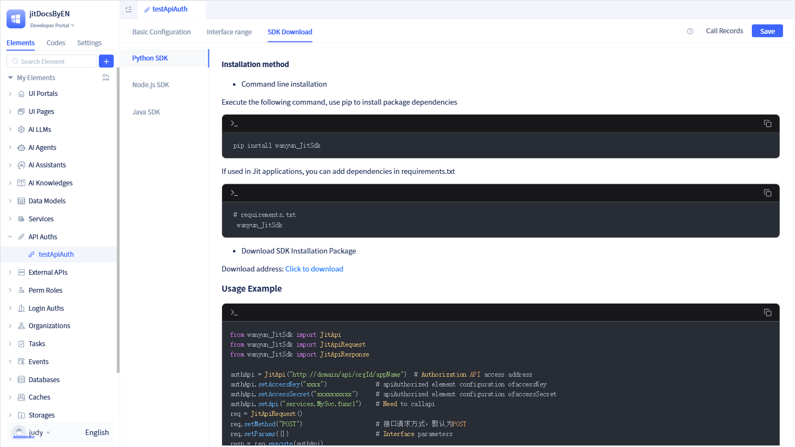
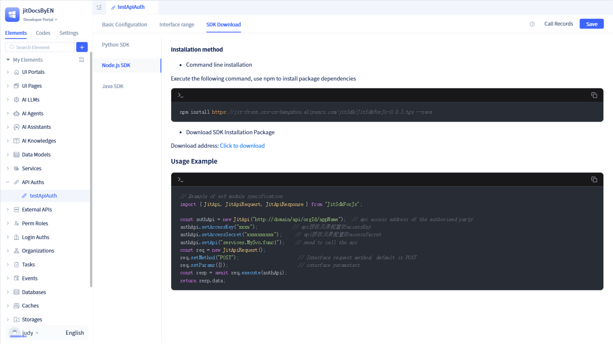

# Using SDK to Call Authorized Element APIs

Once authorization information and authorized interfaces are configured, callers can invoke authorized APIs using the SDKs provided by JitAi.

On the authorization details page, click `Download SDK` to view the SDK usage guide and download links.



JitAi provides SDKs for three languages: Python, Node.js, and Java.

## Using Python SDK {#using-python-sdk}

As a Python developer, you can use the Python SDK to invoke authorized APIs.


Install the Python SDK via command line, or click the `Download Address` under the `Python` tab in the `Download SDK` dialog.

```typescript
pip install wanyun_JitSdk 
```
Once installed, import the SDK into your project and configure the authorization credentials to invoke authorized APIs.

```typescript
from wanyun_JitSdk import JitApi 
from wanyun_JitSdk import JitApiRequest 
from wanyun_JitSdk import JitApiResponse 
 
authApi = JitApi("http://domain/api/orgId/appName")  # API endpoint 
authApi.setAccessKey("xxxx")              # accessKey from authorization element 
authApi.setAccessSecret("xxxxxxxxxx")     # accessSecret from authorization element 
authApi.setApi("services.MySvc.func1")    # API endpoint to invoke 
req = JitApiRequest() 
req.setMethod("POST")                     # HTTP method, defaults to POST 
req.setParams({})                         # Request parameters 
resp = req.execute(authApi) 
print(resp.data) 
```

## Using Node.js SDK {#using-nodejs-sdk}

As a Node.js developer, you can use the Node.js SDK to invoke authorized APIs.



Install the Node.js SDK via command line, or click the `Download Address` under the `Node.js` tab in the `Download SDK` dialog.

```typescript
 npm install https://jit-front.oss-cn-hangzhou.aliyuncs.com/jitSdk/JitSdkForJs-0.0.3.tgz --save 
```
Once installed, import the SDK into your project and configure the authorization credentials to invoke authorized APIs.

```typescript
 // Example using ES6 module specification 
 import { JitApi, JitApiRequest, JitApiResponse } from "JitSdkForJs"; 

 const authApi = new JitApi("http://domain/api/orgId/appName");  // API endpoint 
 authApi.setAccessKey("xxxx");             // accessKey from authorization element 
 authApi.setAccessSecret("xxxxxxxxxx");     // accessSecret from authorization element 
 authApi.setApi("services.MySvc.func1");    // API endpoint to invoke 
 const req = new JitApiRequest(); 
 req.setMethod("POST");                      // HTTP method, defaults to POST 
 req.setParams({});                          // Request parameters 
 const resp = await req.execute(authApi); 
 return resp.data; 

```

## Using Java SDK {#using-java-sdk}

As a Java developer, you can use the Java SDK to invoke authorized APIs.


Install the Java SDK via Maven, or click the `Download Address` under the `Java` tab in the `Download SDK` dialog.

```typescript
<dependency>
  <groupId>pro.jit</groupId>
  <artifactId>jit-api-sdk</artifactId>
  <version>1.0.5</version>
</dependency>
```
Once installed, import the SDK into your project and configure the authorization credentials to invoke authorized APIs.

```typescript
import pro.jit.api.ApiRequest;
import pro.jit.api.ApiResponse;
import pro.jit.api.JitApi;
import pro.jit.api.JitApiException;

public class App {
  public static void main(String[] args) {
    try {
      String key = "apitest";
      String secret = "9731fbdf081445ccad03848b6339082dd589fd";

      JitApi jitApi = new JitApi(key, secret);

      ApiRequest request = new ApiRequest("http://127.0.0.1:8080/api/whwy/mytestapi");
      request.setApiName("services.hi.sayhello");
      request.addParam("word", "world");
      ApiResponse result = jitApi.execute(request);
      System.out.println(result);
    } catch (JitApiException e) {
      throw new RuntimeException(e);
    }
  }
}
```

:::warning Warning
These SDKs are designed for server-side use only. Calling these APIs directly from browser-based or frontend code will fail due to Cross-Origin Resource Sharing (CORS) restrictions.
:::