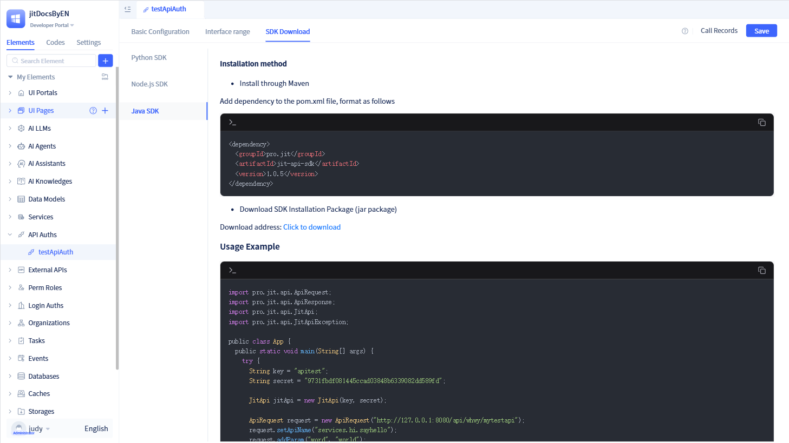

# Using SDK to Call Authorized Element APIs

After developers configure authorization information and authorized interfaces, callers can invoke interfaces exposed by the authorization party through the SDK provided by JitAi.

In the authorization details page, click `Download SDK` to view the SDK usage guide and download address.


JitAi provides SDKs for three languages: Python, Node.js, and Java.

## Using Python SDK
As a Python developer, you can use the Python SDK to call interfaces exposed by the authorization party.


Callers can install the Python SDK using the command line or click the `Download Address` under the `Python` tab in the `Download SDK` popup to download the SDK.

```typescript
pip install wanyun_JitSdk 
```
After successful SDK installation, you can import the SDK in the corresponding project and configure the corresponding authorization information to call interfaces exposed by the authorization party.

```typescript
from wanyun_JitSdk import JitApi 
from wanyun_JitSdk import JitApiRequest 
from wanyun_JitSdk import JitApiResponse 
 
authApi = JitApi("http://domain/api/orgId/appName")  # Authorization party's API access address 
authApi.setAccessKey("xxxx")              # accessKey configured in API authorization element 
authApi.setAccessSecret("xxxxxxxxxx")     # accessSecret configured in API authorization element 
authApi.setApi("services.MySvc.func1")    # API to be called 
req = JitApiRequest() 
req.setMethod("POST")                     # Interface request method, default is POST 
req.setParams({})                         # Interface parameters 
resp = req.execute(authApi) 
print(resp.data) 
```

## Using Node.js SDK
As a Node.js developer, you can use the Node.js SDK to call interfaces exposed by the authorization party.


Callers can install the Node.js SDK using the command line or click the `Download Address` under the `Node.js` tab in the `Download SDK` popup to download the SDK.

```typescript
 npm install https://jit-front.oss-cn-hangzhou.aliyuncs.com/jitSdk/JitSdkForJs-0.0.3.tgz --save 
```
After successful SDK installation, you can import the SDK in the corresponding project and configure the corresponding authorization information to call interfaces exposed by the authorization party.

```typescript
 // Example using ES6 module specification 
 import { JitApi, JitApiRequest, JitApiResponse } from "JitSdkForJs"; 

 const authApi = new JitApi("http://domain/api/orgId/appName");  // Authorization party's API access address 
 authApi.setAccessKey("xxxx");             // accessKey configured in API authorization element 
 authApi.setAccessSecret("xxxxxxxxxx");     // accessSecret configured in API authorization element 
 authApi.setApi("services.MySvc.func1");    // API to be called 
 const req = new JitApiRequest(); 
 req.setMethod("POST");                      // Interface request method, default is POST 
 req.setParams({});                          // Interface parameters 
 const resp = await req.execute(authApi); 
 return resp.data; 

```

## Using Java SDK
As a Java developer, you can use the Java SDK to call interfaces exposed by the authorization party.



Callers can install the Java SDK through Maven or click the `Download Address` under the `Java` tab in the `Download SDK` popup to download the SDK.

```typescript
<dependency>
  <groupId>pro.jit</groupId>
  <artifactId>jit-api-sdk</artifactId>
  <version>1.0.5</version>
</dependency>
```
After successful SDK installation, you can import the SDK in the corresponding project and configure the corresponding authorization information to call interfaces exposed by the authorization party.

```typescript
import pro.jit.api.ApiRequest;
import pro.jit.api.ApiResponse;
import pro.jit.api.JitApi;
import pro.jit.api.JitApiException;

public class App {
  public static void main(String[] args) {
    try {
      String key = "apitest";
      String secret = "9731fbdf081445ccad03848b6339082dd589fd";

      JitApi jitApi = new JitApi(key, secret);

      ApiRequest request = new ApiRequest("http://127.0.0.1:8080/api/whwy/mytestapi");
      request.setApiName("services.hi.sayhello");
      request.addParam("word", "world");
      ApiResponse result = jitApi.execute(request);
      System.out.println(result);
    } catch (JitApiException e) {
      throw new RuntimeException(e);
    }
  }
}
```

