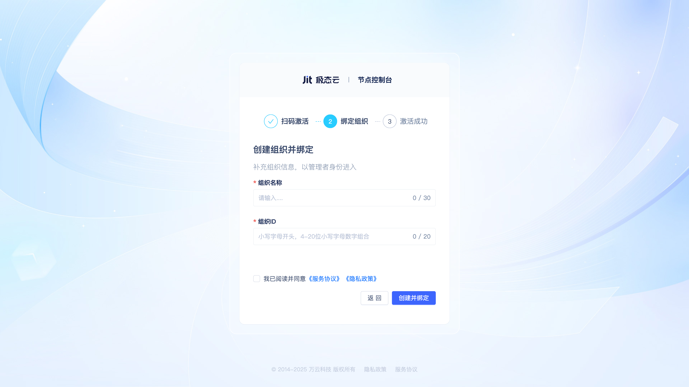
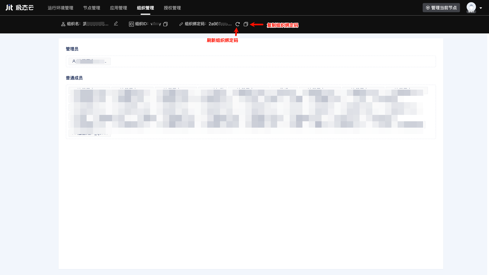

# 开发者组织管理
## 什么是开发者组织 {#what-is-developer-organization}
开发者组织是管理开发团队和项目的基本单位，团队成员在同一个组织下能够协作开发应用，共享资源。不同组织在软硬件资源、数据、应用等方面是隔离的。每个开发者组织可以绑定多个Jit节点，每个节点只能绑定到一个组织，每个开发者可以加入多个开发者组织。

## 在激活节点时创建新的开发组织 {#create-new-development-organization-when-activating-node}
用户完成节点安装后，首次访问会进入节点激活页面。

用户使用微信扫码后进入到绑定组织界面

用户点击"创建新的组织并绑定"按钮，进入到创建组织页面。

输入组织名称、组织ID，勾选"我已阅读并同意"后点击"创建并绑定"按钮，即可创建新组织。当前节点自动激活并绑定到该组织，当前用户会自动作为管理员加入组织。

## 在激活节点时将节点绑定到自己已加入的组织 {#bind-node-to-joined-organization-when-activating}
如果用户已经加入过组织，绑定组织界面会显示已加入的组织列表。

用户可直接点击选择，当前节点会完成激活并绑定到选择的组织。

## 在激活节点时使用组织绑定码加入组织并绑定 {#use-organization-bind-code-to-join-and-bind-when-activating-node}

用户在绑定组织界面点击”加入一个组织并绑定“按钮后，进入到组织绑定码输入界面。

用户输入组织绑定码后点击”立即加入“按钮即可完成节点的激活绑定，用户自动成为该组织普通成员。

## 在登录已有节点时通过组织绑定码加入组织 {#join-organization-via-bind-code-when-logging-into-existing-node}
当用户首次登录一个已激活绑定的节点时，需要输入组织绑定码加入组织。

用户输入组织绑定码后点击”立即加入“按钮即可，用户自动成为该组织普通成员。

## 查看和刷新组织绑定码 {#view-and-refresh-organization-bind-code}
任意组织成员都可以在组织管理页面中查看和刷新组织绑定码。

用户点击”刷新绑定码“按钮后，会生成一个新的组织绑定码，并显示在页面中，原有绑定码立即失效。

:::warning 注意

为防止组织绑定码泄露，每次邀请成员加入组织后应立即刷新组织绑定码。

:::

## 移除组织成员 {#remove-organization-member}
仅管理员可以在组织管理页面移除其他成员。