# 审批节点配置
审批节点是最常用的节点类型，用于指定审批人员对当前审批流程进行审阅。它的节点配置主要包括审批人设置、审批流转规则、审批流程处理规则、审批扩展功能配置、页面与权限控制等。

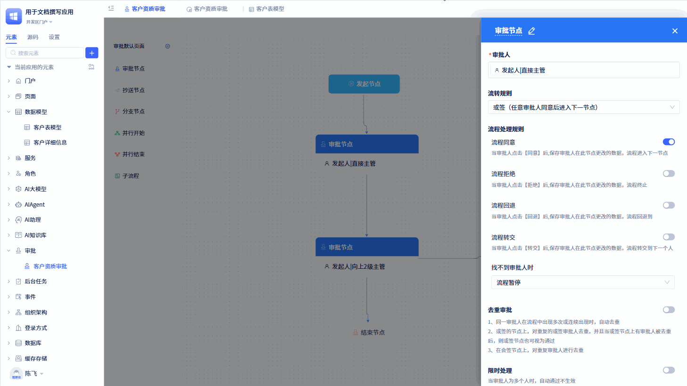

从“审批配置面板”点击对应的审批节点，就会打开该节点的配置面板。

## 审批人设置
每个审批流程都必须指定一个或多个审批人进行审批，可以在选人面板进行设置。

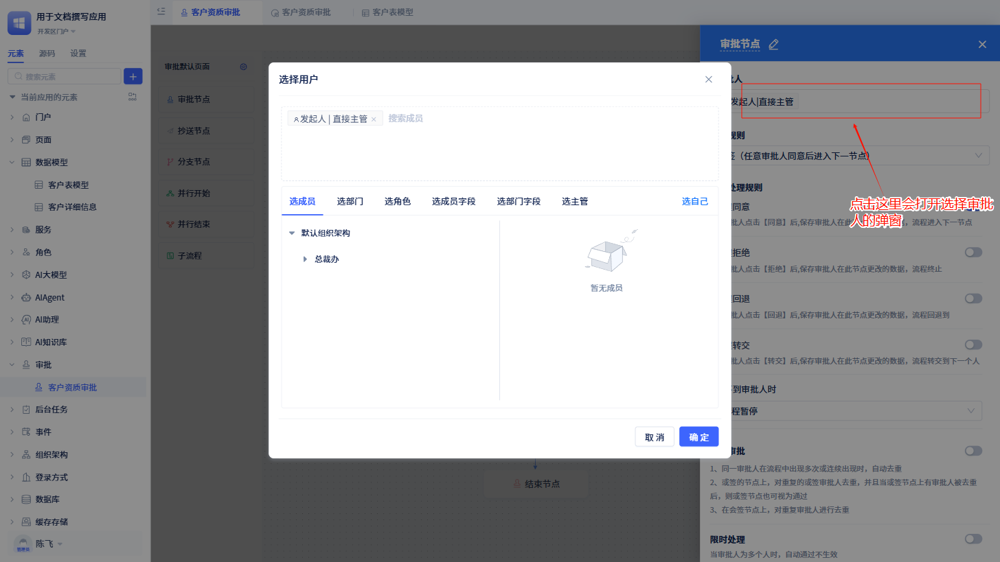

在审批节点的配置面板，打开“选择审批人”弹窗面板。选人面板支持多种选择方式，如：选成员、选部门、选角色、选成员字段、选部门字段、选主管、选自己。

**选成员：** 可以选择一个或多个指定的位于组织架构中的成员。

**选部门：** 可以选择一个或多个指定的隶属于组织架构中的部门。

**选角色：** 可以选择一个或多个指定的角色。注意：这里的角色是在组织架构中定义的角色（即在通讯里展示的角色），而不是应用角色

**选成员字段：** 从审批表单中选择成员单选或成员多选字段。注意：如果该审批节点的审批人是发起人，那么可以在这里选择“发起人”字段。

**选部门字段：** 从审批表单中选择部门单选或部门多选字段。

**选主管：** 这里会列出审批表单中所有成员单选、成员单选、部门单选、部门多选字段以及发起人的向上一到五级主管。

**选自己：** 指的是当前设置审批流程的用户。注意：这里不是指发起审批的用户。

## 审批流转规则
审批流转规则是指当前审批节点如果存在多个审批人处理，审批单在这些人之间应该如何流转。

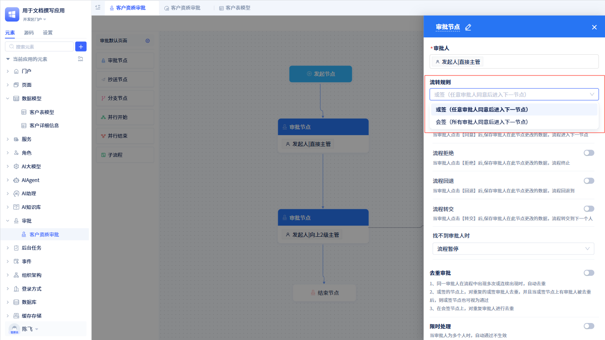

有两种流转规则：或签（只要有一个人审批了就会流转到下个审批节点）和会签（所有审批人必须都审批了才会流转到下个审批节点），默认是或签。

## 审批流程处理规则
审批人在处理审批单时，会选择是流程同意、拒绝、回退还是转交。这些操作都会触发流程处理规则。

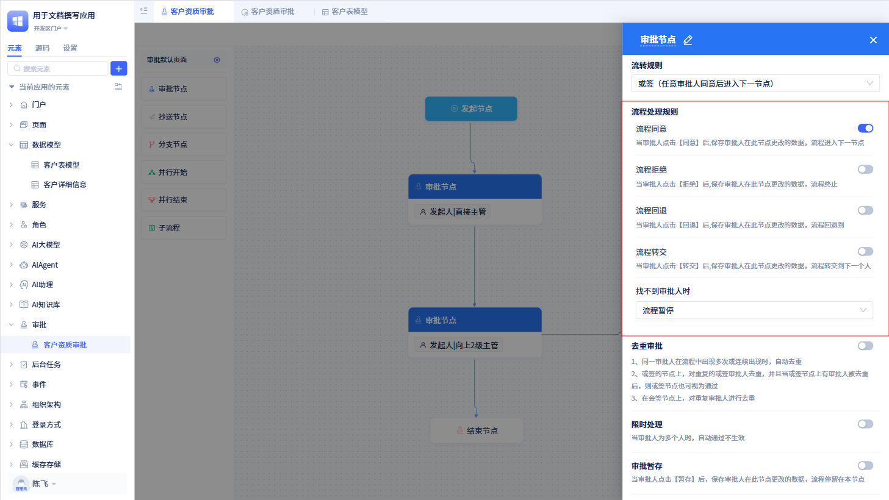

默认情况下只有“审批同意”，即在页面上只展示`同意`按钮。开发者可以根据实际情况配置流程`拒绝`、`回退`、`转交`按钮。

当配置`流程同意`后，审批人点击`同意`按钮，流程会自动进入下一个审批节点。

当配置`流程拒绝`后，审批人点击`拒绝`按钮，流程会自动终止。

当配置`流程回退`后，审批人点击`回退`按钮，流程会自动回退到指定节点。

当配置`流程转交`后，审批人点击`转交`按钮，流程会自动转交给指定审批人。

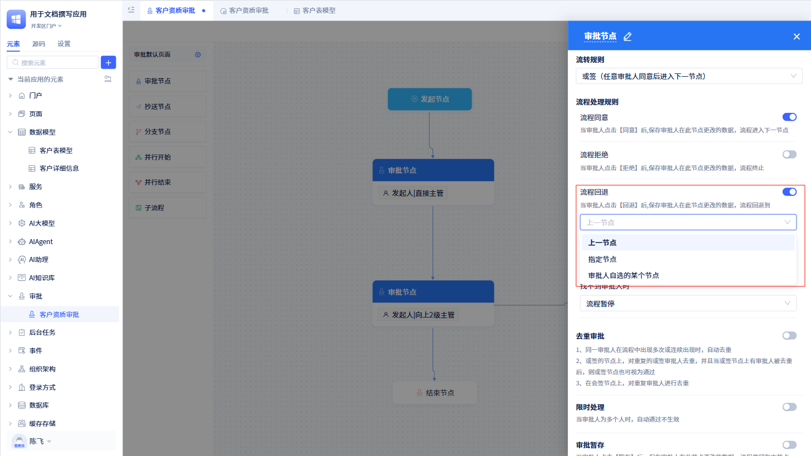

在配置流程回退时，需要提前配置好是回退到上一个节点，还是回退到指定节点。如果需要在审批过程中才确定回退到哪个节点，可以配置“审批人自选某个节点”。

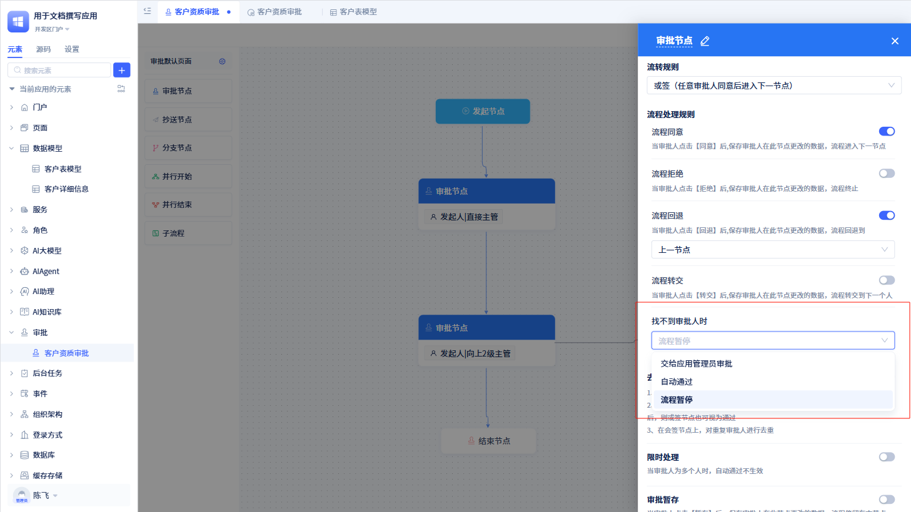

如果当前审批人已经被踢出当前组织，找不到审批人的时候，开发者也可以选择是流程暂停、流程自动通过还是转交给管理员进行审批。

## 审批扩展功能配置
审批节点的扩展功能包括去重审批、限时处理、审批暂存、意见反馈、手写签名、是否允许批量审批、消息通知、短信通知等，为审批节点提供丰富的功能。

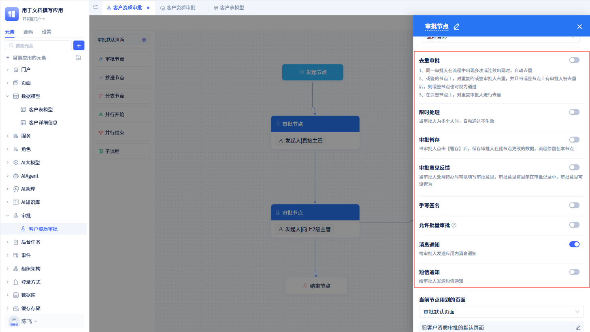

### 去重审批
如果在一个审批流程中，出现同一人需要在多个节点进行审批。那么可以开启去重审批功能，会进行自动去重，只进行一次审批即可。

如果当前节点流转规则是“或签”，那么节点会被视为自动通过；如果是“会签”，那么会对重复审批人进行去重。

### 限时处理
对审批单进行限时设置，比如设置审批单到达该节点后，该节点审批人超过 5 天未处理，则进行通知提醒等。

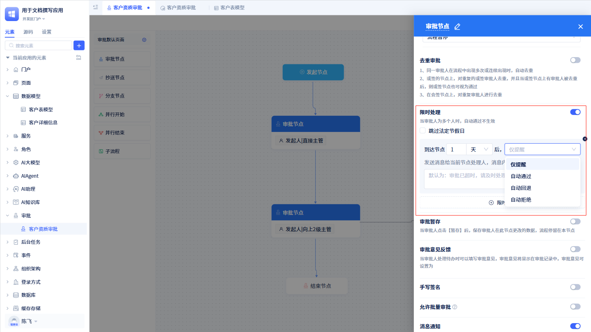

“限时处理”功能开启后，开发者可以根据具体情况开启多个限时处理规则。注意：如果当前审批单有多个审批人审批，仅有限时处理设置的提醒功能才会生效。

### 审批暂存
当审批人在审批过程中，需要暂离，可以通过`暂存`功能保存审批人的填写内容，待填写完成后，再进行审批流程的处理。

当审批人开启“审批暂存”功能后，在对应的审批页面中会出现`暂存`按钮。点击`暂存`后，审批数据存为草稿，整个审批流程暂留在本节点。审批人再次打开该审批单，数据会自动填充。

### 审批意见反馈
当审批人对审批单进行审批时，需要对审批单进行反馈，此时可以使用审批意见反馈功能。

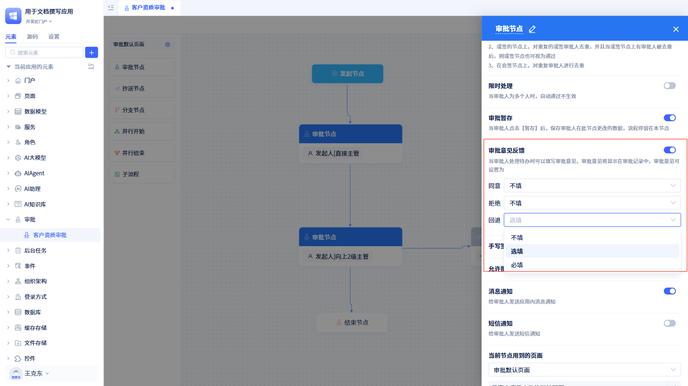

开发者可以对同意、拒绝、回退情况下选择是否需要填写审批意见。每一种都可以选择“不填”、“必填”还是“选填”。

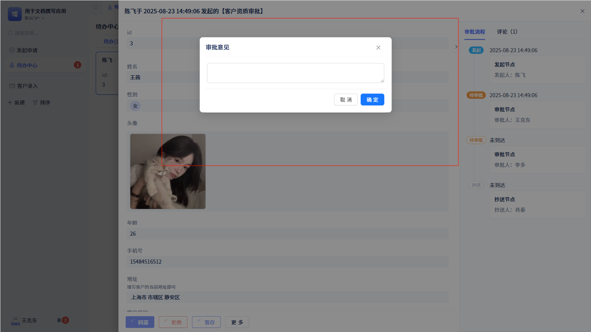

当开发者设定为选填或者必填时，每当用户流程处理后，会出现一个填写审批意见的弹窗。

:::tip 提示

开发者必须在“流程处理规则”那里开启同意，这里才会出现“同意”的意见反馈设置；拒绝、回退同理。

如果意见反馈设为必填，在审批处理的时候未填写意见将不允许提交。
:::

### 手写签名
当用户处理某个审批单时如果需要手写签名，那么就可以在节点设置中进行配置。

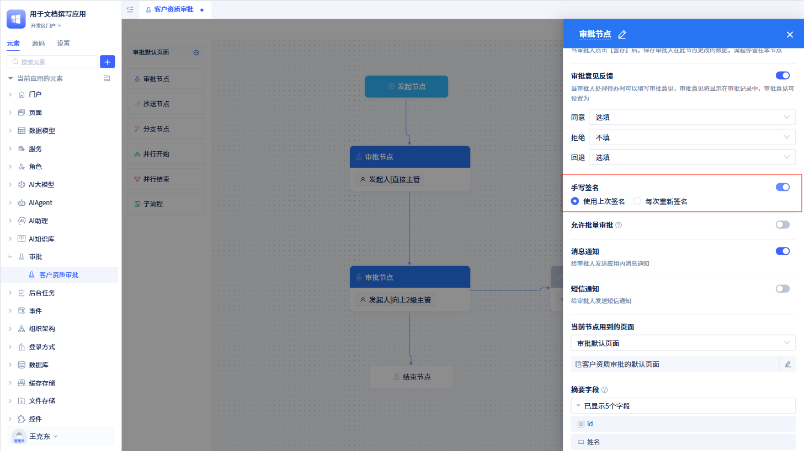

开发者可以选择“使用上次签名”还是“每次重新签名”。

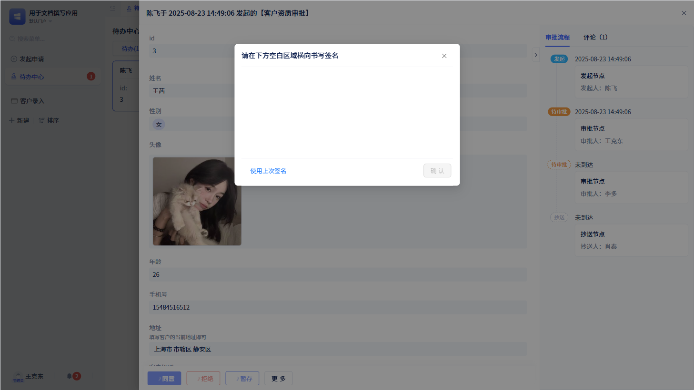

当选择“使用上次签名”时，点击`同意`按钮后会出现签名弹窗，在签名弹窗左下角会出现“使用上次签名”按钮。

:::warning 注意
如果点击“使用上次签名”按钮，签名面板没有变化，应该是系统内没有对应的签名数据（也就是说用户之前没有进行过签名）。
:::

### 允许批量审批
当用户想对某一批审批单进行批量审批时，可以在审批节点配置“允许批量审批”。

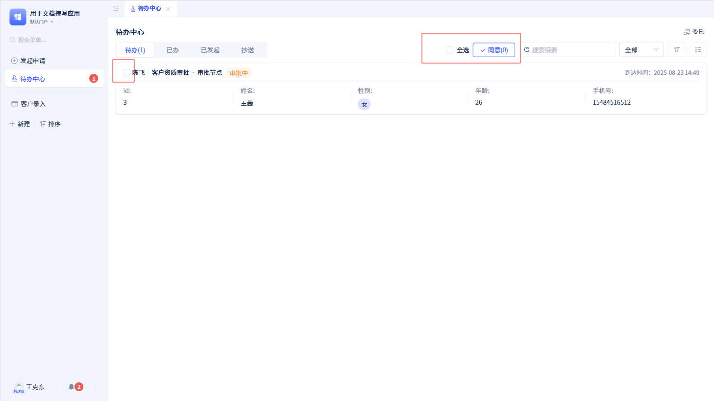

开启批量审批功能后，在“待办中心”页面可以看到每个审批单前面有个复选框，在顶部还有个“批量审批”按钮。

:::warning 注意

只有“批量审批”功能，没有“批量拒绝”等功能。即，对于多个审批单，只能选择全部同意操作。

使用“批量审批”功能时，会忽略表单中的校验规则、必填规则，关于手写签名、审批意见反馈的配置也不会生效
:::

### 消息通知
当审批人开启“消息通知”功能后，系统会向审批人发送消息提醒。

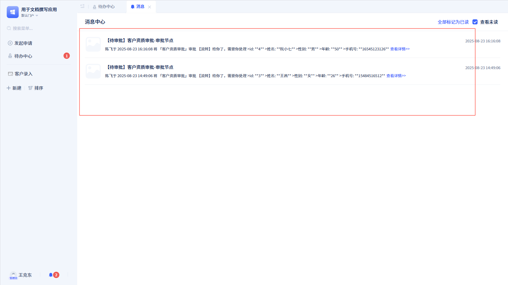

每当有相应的审批单需要处理时，系统会向审批人发送消息提醒。

### 短信通知
当用户开启“短信通知”功能时，每当有相应的审批单需要处理时，系统会向用户发送短信提醒。

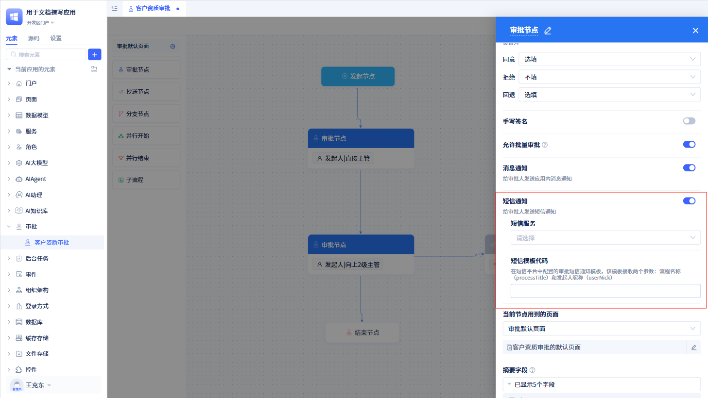

注意：在配置短信通知功能前，需要配置短信服务以及短信模板代码（如何配置短信服务？，请参照[短信服务](../third-party-integration/sms-service#审批流程中使用短信服务)）。

## 审批页面与权限控制
每个审批节点都可以对展现的页面进行权限控制，比如给某个审批节点进行定制页面，配置字段的查看编辑等。

### 当前节点用到的页面
默认情况下，所有的审批节点都使用审批流程的默认页面，如果需要自定义页面，可以在节点配置中设置节点的页面。如何创建自定义页面，请参考[审批页面定制](./approval-page-customization)。

### 摘要信息显示
摘要字段主要是用于“待办中心”的“待办”和“已办”审批列表展示。

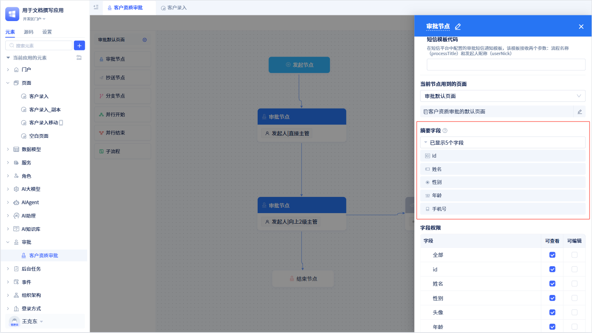

审批节点与发起节点一样，只能配置五个。在“待办中心”的展示情况也和发起节点一样。

### 字段权限
开发者可通过字段权限控制“待办”页面和“已办”页面上的审批表单字段的查看和编辑权限。默认情况下，所有字段仅处于可查看状态。

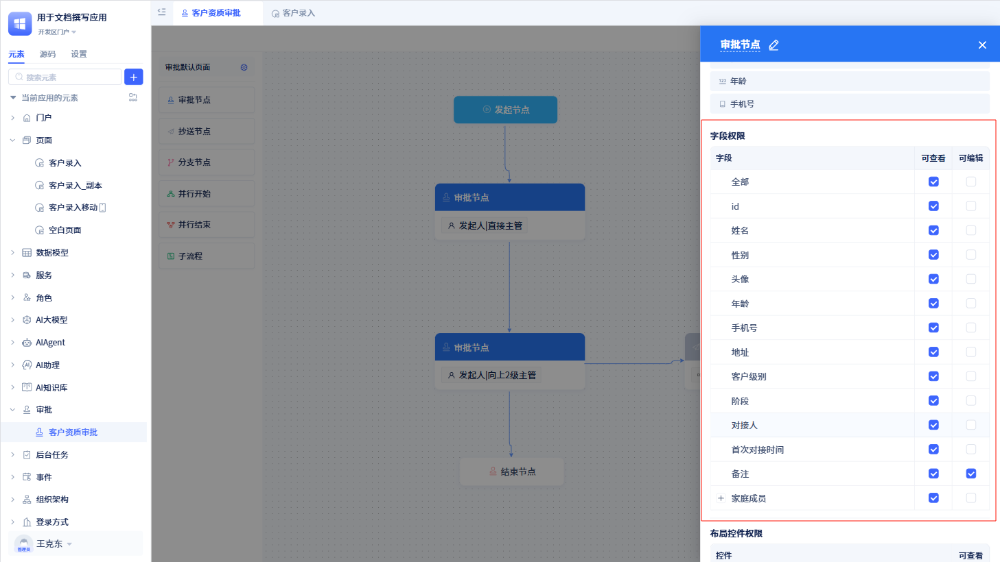

:::warning 注意

字段权限仅针对于当前节点下的“待办”和“已办”页面有效。

“已办”页面下所有的字段都处于可查看状态，就算这里配置了编辑权限也不会生效。

审批表单字段最终展示是同时受审批节点上字段权限控制和表单本身权限的影响。表单权限如何配置，参照[表单权限](../using-functional-components-in-pages/form-components#字段操作权限)。

当数据表新增某个字段后，需要先为其添加权限，再去对应的页面进行配置。
:::

### 布局控件权限
有些情况下，对于不同的节点，所展示的页面中某些布局控件可能不需要展示，此时可以使用布局控件权限进行权限控制。

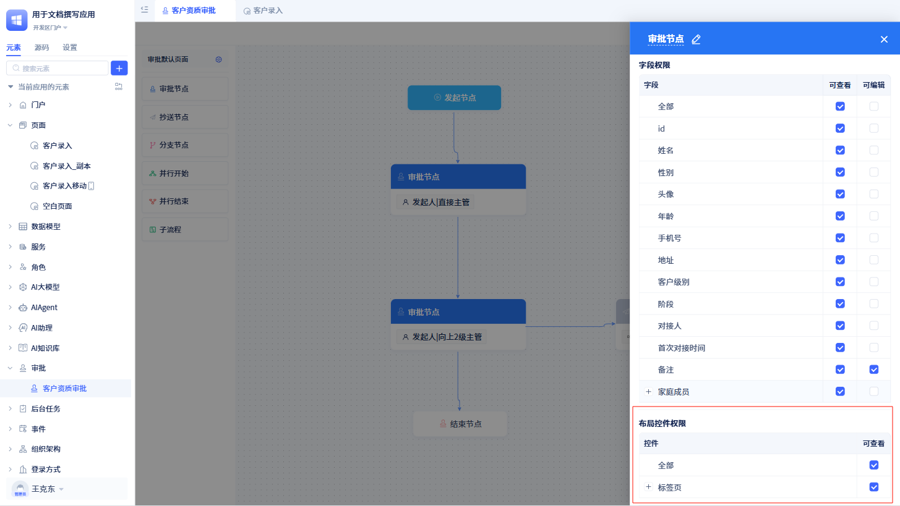

用户可以控制当前节点下页面展示时的布局控件是否显示。默认情况下，对应的页面没有添加布局控件，需要先到对应的页面添加布局控件后才能进行权限控制。
