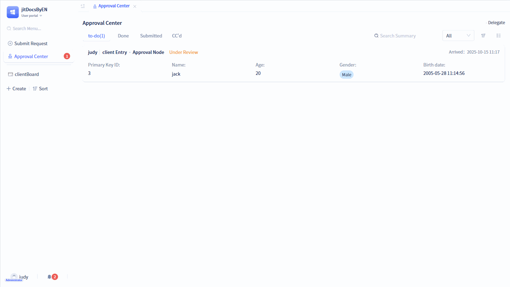
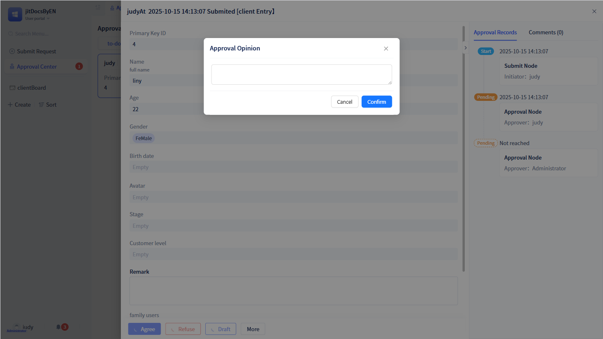

# Approval Node Configuration
Approval nodes are the most commonly used node type, used to designate approvers to review the current approval workflow. Their node configuration mainly includes approver settings, approval flow rules, approval workflow processing rules, approval extended function configuration, page and permission control, etc.

Click the corresponding approval node from the "Approval Configuration Panel" to open the configuration panel for that node.

## Approver Settings {#approver-settings}
Every approval workflow must specify one or more approvers for approval, which can be set in the people selection panel.

In the approval node configuration panel, open the "Select Approvers" popup panel. The people selection panel supports multiple selection methods, such as: select members, select departments, select roles, select member fields, select department fields, select supervisors, select yourself.

**Select Members:** You can select one or more specified members located in the organizational structure.

**Select Departments:** You can select one or more specified departments belonging to the organizational structure.

**Select Roles:** You can select one or more specified roles. Note: The roles here are roles defined in the organizational structure (i.e., roles displayed in communications), not application roles.

**Select Member Fields:** Select member single-select or member multi-select fields from the approval form. Note: If the approver of this approval node is the initiator, you can select the "Initiator" field here.

**Select Department Fields:** Select department single-select or department multi-select fields from the approval form.

**Select Supervisors:** This will list all member single-select, member single-select, department single-select, department multi-select fields in the approval form, as well as the first to fifth level supervisors of the initiator.

**Select Yourself:** This refers to the user currently setting up the approval workflow. Note: This does not refer to the user initiating the approval.

## Approval Flow Rules {#approval-flow-rules}
Approval flow rules refer to how approval documents should flow among multiple approvers when the current approval node has multiple approvers for processing.

There are two flow rules: OR signing (the approval will flow to the next approval node as long as one person approves) and AND signing (all approvers must approve before flowing to the next approval node). The default is OR signing.

## Approval Workflow Processing Rules {#approval-workflow-rules}
When approvers process approval documents, they will choose whether to approve, reject, return, or transfer the workflow. These operations will all trigger workflow processing rules.

By default, there is only "Approval Consent", meaning only the `Approve` button is displayed on the page. Developers can configure workflow `Reject`, `Return`, and `Transfer` buttons according to actual situations.

When `Workflow Consent` is configured, after the approver clicks the `Approve` button, the workflow will automatically proceed to the next approval node.

When `Workflow Rejection` is configured, after the approver clicks the `Reject` button, the workflow will automatically terminate.

When `Workflow Return` is configured, after the approver clicks the `Return` button, the workflow will automatically return to the specified node.

When `Workflow Transfer` is configured, after the approver clicks the `Transfer` button, the workflow will automatically transfer to the specified approver.

When configuring workflow return, you need to configure in advance whether to return to the previous node or return to a specified node. If you need to determine which node to return to during the approval process, you can configure "Approver selects a specific node".

If the current approver has been removed from the current organization and the approver cannot be found, developers can also choose whether to pause the workflow, automatically pass the workflow, or transfer it to an administrator for approval.

## Approval Extended Function Configuration {#approval-extended-function-configuration}
The extended functions of approval nodes include deduplication approval, time-limited processing, approval draft, feedback, handwritten signature, whether to allow batch approval, message notification, SMS notification, etc., providing rich functionality for approval nodes.

### Deduplication Approval {#deduplication-approval}
If the same person needs to approve at multiple nodes in an approval workflow, you can enable the deduplication approval function, which will automatically deduplicate and only require one approval.

If the current node flow rule is "OR signing", the node will be considered automatically passed; if it is "AND signing", duplicate approvers will be deduplicated.

### Time-Limited Processing {#time-limited-processing}
Set time limits for approval documents, for example, setting that if the approver at this node does not process the approval document for more than 5 days after it arrives at this node, notification reminders will be sent.

After the "Time-Limited Processing" function is enabled, developers can enable multiple time-limited processing rules according to specific situations. Note: If the current approval document has multiple approvers, only the reminder function set by time-limited processing will take effect.

### Approval Draft {#approval-draft}
When approvers need to temporarily leave during the approval process, they can use the `Draft` function to save the approver's filled content, and then process the approval workflow after completing the filling.

After the approver enables the "Approval Draft" function, a `Draft` button will appear on the corresponding approval page. After clicking `Draft`, the approval data is saved as a draft, and the entire approval workflow remains at this node. When the approver opens the approval document again, the data will be automatically filled.

### Approval Feedback {#approval-feedback}
When approvers need to provide feedback on approval documents during the approval process, they can use the approval feedback function.

Developers can choose whether to fill in approval comments for approval, rejection, and return situations. Each can choose "No Fill", "Required", or "Optional".

When developers set it as optional or required, a popup for filling in approval comments will appear after each user workflow processing.

:::tip Tip

Developers must enable approval in "Workflow Processing Rules" for the "Approval" feedback setting to appear here; the same applies to rejection and return.

If feedback is set as required, approval processing will not be allowed to submit without filling in comments.
:::

### Handwritten Signature {#handwritten-signature}
When users need handwritten signatures when processing certain approval documents, this can be configured in the node settings.

Developers can choose "Use Last Signature" or "Re-sign Each Time".

When "Use Last Signature" is selected, a signature popup will appear after clicking the `Approve` button, and a "Use Last Signature" button will appear in the lower left corner of the signature popup.

:::warning Note
If clicking the "Use Last Signature" button does not change the signature panel, it should be because there is no corresponding signature data in the system (meaning the user has not signed before).
:::

### Allow Batch Approval {#allow-batch-approval}
When users want to batch approve a group of approval documents, they can configure "Allow Batch Approval" in the approval node.

After enabling the batch approval function, you can see a checkbox in front of each approval document on the "To-Do Center" page, and there is also a "Batch Approval" button at the top.

:::warning Note

There is only a "Batch Approval" function, no "Batch Rejection" and other functions. That is, for multiple approval documents, you can only choose to approve all operations.

When using the "Batch Approval" function, validation rules and required rules in the form will be ignored, and configurations for handwritten signatures and approval feedback will not take effect.
:::

### Message Notification {#message-notification}
After approvers enable the "Message Notification" function, the system will send message reminders to approvers.

Whenever there are corresponding approval documents that need to be processed, the system will send message reminders to approvers.

### SMS Notification {#sms-notification}
When users enable the "SMS Notification" function, whenever there are corresponding approval documents that need to be processed, the system will send SMS reminders to users.

Note: Before configuring the SMS notification function, you need to configure SMS service and SMS template code (How to configure SMS service? Please refer to [SMS Service](../third-party-integration/sms-service#using-sms-service-in-approval-workflow)).

## Approval Page and Permission Control {#approval-page-permission-control}
Each approval node can control permissions for the displayed pages, such as customizing pages for specific approval nodes, configuring field viewing and editing permissions, etc.

### Pages Used by Current Node {#pages-used-by-current-node}
By default, all approval nodes use the default page of the approval workflow. If you need to customize pages, you can set the node's page in the node configuration. For how to create custom pages, please refer to [Approval Page Customization](./approval-page-customization).

### Summary Information Display {#summary-display}
Summary fields are mainly used for displaying "To-Do" and "Done" approval lists in the "To-Do Center".

Like the initiation node, approval nodes can only configure five fields. The display in the "To-Do Center" is also the same as the initiation node.

### Field Permissions {#fieldpermission}
Developers can control the viewing and editing permissions of approval form fields on "To-Do" and "Done" pages through field permissions. By default, all fields are only in a viewable state.

:::warning Note

Field permissions are only effective for "To-Do" and "Done" pages under the current node.

All fields on the "Done" page are in a viewable state, even if editing permissions are configured here, they will not take effect.

The final display of approval form fields is affected by both the field permission control on the approval node and the form's own permissions. For how to configure form permissions, refer to [Form Permissions](../using-functional-components-in-pages/form-components#field-operation-permissions).

When a new field is added to a data table, you need to add permissions for it first, then configure it on the corresponding page.
:::

### Layout Control Permissions {#layout-control-permissions}
In some cases, for different nodes, certain layout controls in the displayed pages may not need to be shown. In this case, layout control permissions can be used for permission control.

Users can control whether layout controls are displayed when pages are shown under the current node. By default, the corresponding pages do not have layout controls added, so you need to add layout controls to the corresponding pages first before you can perform permission control.
