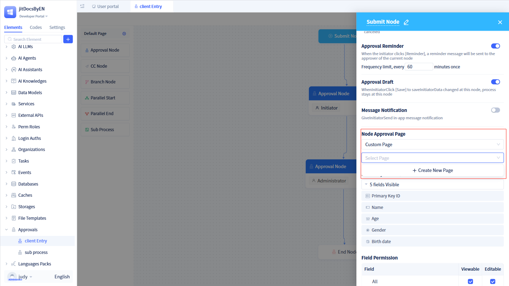
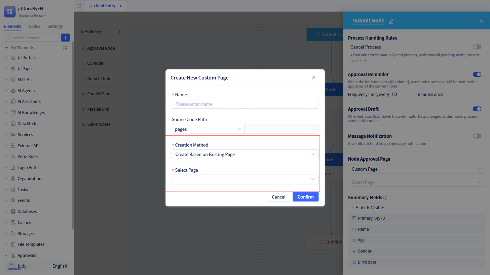

# Approval Page Customization

When creating approval workflows, the system generates a default approval page automatically. However, certain scenarios require displaying different pages for specific approval nodes, necessitating page customization for individual approval nodes.

## Advanced approval page customization {#approval-page-advanced-customization}
By default, approval workflows utilize a single default approval page. Users can customize pages for different approval nodes to achieve distinct approval interfaces.

### Approval page types {#approval-page-types}
Approval pages are categorized into default approval pages and custom approval pages.

In the node configuration panel, developers can click the dropdown menu in the "Pages Used by Current Node" section to select between "Default Approval Page" or "Custom Page".

After selecting "Custom Page", the system defaults to the first page among all custom pages in the current approval workflow, with developers having the option to create new pages.

### Custom page creation methods {#custom-page-creation-method}
When creating custom pages, the system offers two creation approaches: creating new pages and creating based on existing pages.

After clicking `+ New Page`, the new page creation dialog opens. In the "Creation Method" section, you can choose between "Create New Page" or "Create Based on Existing Page".

If you select "Create Based on Existing Page", a "Select Page" option appears. After completing all information fields, click the `Confirm` button to create a new page containing an approval form.

For previously created pages, you can click the "Edit" button on the right side of the dropdown menu to access the page for editing.

:::warning Note

Pages created within approval workflows are exclusive to that specific approval workflow.

Pages created by each approval workflow can only be utilized within the current approval workflow and cannot be used by other approval workflows.

Only start nodes, approval nodes, and CC nodes support page customization.

Pages created by any node can be referenced by other nodes within the same workflow.

When using the "Create Based on Existing Page" functionality, you can only select pages related to the current approval workflow.

The form generated during page creation cannot be deleted, as this would render the page unusable.

For form configuration within pages, refer to [form-components](../using-functional-components-in-pages/form-components).

:::
