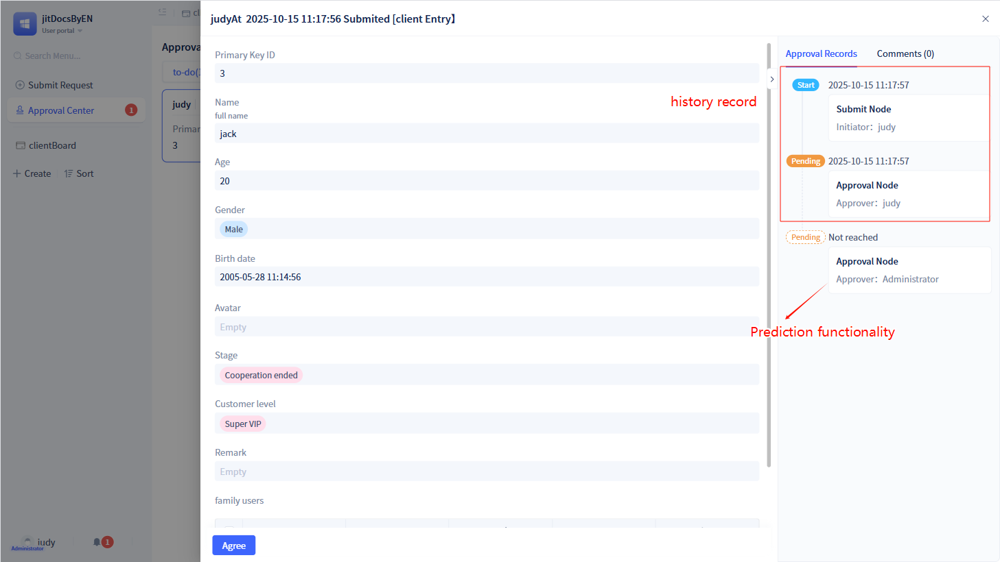
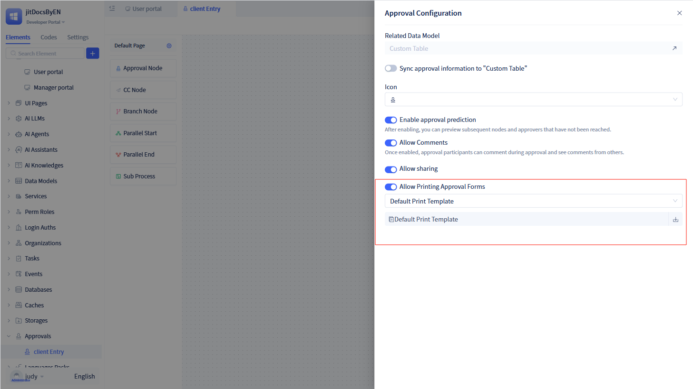

# Approval Workflow Basic Configuration

An approval workflow typically refers to a series of steps within an organization for reviewing and making decisions on specific requests. The approval engine processes various approval requests such as financial reimbursements, leave applications, purchase requests, etc., through predefined rules, workflows, and conditions.

JitAi implements visual construction of enterprise approval workflows based on extensive enterprise universal patterns. It integrates rich customization options for functionality, covering advanced features such as rule engines, conditional branches, parallel branches, and subprocess approval flow design.

## Create Process {#create-process}
Approval workflows are generally created based on specific business scenarios, such as leave processes, reimbursement processes, purchase processes, etc., which require storing corresponding business data in a data table model. Therefore, when creating an approval workflow, you need to select an associated data model.

Click the `+` button next to "Approval" in the left element tree to open the new approval workflow popup, fill in the approval workflow name and associated data model, then click `Save` to create an approval workflow.

## Drag Process Nodes {#drag-process-node}
JitAi provides developers with a visual process configuration interface where processes can be quickly created by dragging nodes.

Approval workflows have many approval nodes, each with different functions, such as:

**Start Node**: Represents the beginning of an approval workflow. Each approval workflow has one and only one start node. You can configure some configuration information for users to "initiate requests".

**End Node**: Represents the end of an approval workflow. Each approval workflow has one and only one end node. It indicates that the entire process has been completed.

**Approval Node**: Used to designate approvers to review the current approval workflow. In approval nodes, you need to configure approvers and related configuration information for approval nodes.

**CC Node**: Used to designate CC recipients for the current approval workflow. In CC nodes, you need to configure CC recipients and related configuration information for CC nodes.

**Branch Node**: Used for branch judgment. The approval workflow will flow to specified branch routes based on condition return results.

**Parallel Start/Parallel End**: Used for parallel processing of workflows. After the approval workflow reaches the parallel start node, it will flow to all parallel nodes simultaneously.

**Subprocess**: After the approval workflow enters a subprocess, it will run according to the subprocess logic and return to the parent process after completion.

:::tip Tip

A complete approval workflow must have at least one approval node in addition to the start and end nodes.

Parallel start and parallel end nodes must come in pairs.
:::

## Prediction Feature {#prediction-feature}
AI prediction and intelligent recommendation features provide process optimization suggestions based on historical approval data.

## Approval Workflow Default Page {#approval-workflow-default-page}
Each approval workflow has a default page. When users perform operations such as initiating requests or viewing approvals, they will enter this page.

In the process configuration panel, click `Approval Default Page` in the upper left corner to open the default page configuration panel.

In the default page configuration panel, you can set up the approval form.

:::tip Tip

For the process default page, by default, all nodes use this page. Therefore, if you modify the process default page, the page seen at all nodes will change.

Start nodes, approval nodes, and CC nodes can customize pages.

The form generated by the approval workflow default page cannot be deleted. For how to operate forms, refer to [form-components](../using-functional-components-in-pages/form-components)

:::

## Other Process Configuration {#other-process-configuration}
In addition to configuring nodes and page adjustments on the page, approval workflows have other configurations.

In the process configuration panel, click `Approval Configuration` in the upper right corner to open the approval configuration popup.

In the configuration popup, we can view associated data models, synchronize approval information to corresponding data models, set approval icons, enable approval prediction features, enable comment features, allow sharing, allow printing approval forms, and other functions.

### Sync Approval Information to Data Table Model {#sync-approval-info-to-data-table-model}
To facilitate users in combining approval-related information (such as initiator, initiation time, approval status, etc.) with business data for use, statistics, and analysis, JitAi allows synchronizing approval process information to data table models specified by developers.

By default, `Sync Approval Information to Data Table Model` is in a closed state. At this time, the generated approval information will be saved to the system's built-in "Approval Workflow Instance" data table. If users want to use this function, they must prepare corresponding fields in the data table model in advance to store approval-related information. The field types are as follows:

|   Approval Information   |          Data Table Model Accepted Data Types          | Timing of Storage in Model |
| :----------: | :----------------------------------------: | :----------------: |
|    Initiator    |                  Member Single Select                  |     When Initiating Approval     |
|   Initiation Time   |                  Date Time                  |     When Initiating Approval     |
|   End Time   |                  Date Time                  |     When Approval Ends     |
| Approval Workflow Title | Single-line Text, Multi-line Text, Single Choice, Dropdown Single Select |     When Initiating Approval     |
| Approval Workflow ID  |                  Single-line Text                  |     When Initiating Approval     |
| Approval Instance ID  |                    Number                    |     When Initiating Approval     |
| Current Node Title | Single-line Text, Multi-line Text, Single Choice, Dropdown Single Select |     After Approval Processing     |
| Current Node ID  |                  Single-line Text                  |     After Approval Processing     |
|  Current Approver  |             Member Single Select, Member Multi-select             |     After Approval Processing     |
|   Approval Status   | Single-line Text, Multi-line Text, Single Choice, Dropdown Single Select |   After Approval Status Change   |

### Sync to Third-Party Approval To-Do {#sync-to-third-party-approval-todo}
When a user-created application has integrated with DingTalk organizational structure and wants to synchronize to-do messages in the system to DingTalk's to-do items, they can enable the `Sync to Third-Party Approval To-Do` function in approval settings.

When users check this option, initiated approvals will be synchronized to corresponding approvers through DingTalk's to-do items.

:::tip Note
This function is only applicable to approval applications that have integrated with DingTalk organizational structure. If DingTalk organizational structure is not integrated, this option will not be visible.
:::

### Prediction Function {#prediction-function} 
When users want to know the approvers of subsequent workflow nodes when initiating or processing approvals, they can enable the prediction function.

After the prediction function is enabled, users will see the approvers of subsequent nodes when initiating or processing approvals.

:::warning Note
The system enables the prediction function by default.

Approval prediction data is also displayed in the approval records on the right side. Among them, nodes that have already been processed have solid borders and contain specific times. Nodes that have not been processed have dashed borders and no specific times.

If the prediction function is disabled, the application node will not display approval records, and approval processing nodes will only display approval records that have been processed.
:::

### Comment Function {#comment-function}
After users initiate approvals, approval participants can comment during approval and can see comments from others. Comments support uploading images and support image preview.

:::tip Note
The comment function is not for each approval node, but for the entire approval workflow. That is, as long as it is in the same approval workflow, users can comment regardless of which approval node they are at.
:::

### Share {#share}
When users need to share approval workflows, this can be achieved through the sharing function.

Enable the "Allow Sharing" function in the "Approval Configuration" popup, and "Share" buttons will appear in the detail interfaces of to-do, done, initiated, and CC items related to this approval workflow.

### Print Approval Form {#print-approval-form}
Some users need to print approval forms in certain scenarios, which can be achieved through the printing function.

Each approval workflow has a default approval form print template, and users can download the default template for viewing. Additionally, users can also customize print templates and save them as templates.

:::warning Note
"Print Approval Form" is also for the entire approval workflow, meaning all approval nodes' approval forms use the same set of print templates. However, different approval nodes display different data, such as node names, node processors, node processing results, node processing comments, node processing times, etc.

When using custom print templates, there are some required parameters, and the designed template must include these parameters.
:::

After users enable "Allow Print Approval Form", the approval workflow will display a print button at each approval node. Click the `Print` button to print the current approval form.

## Reuse Other Approval Workflows {#reuse-other-approval-workflowes}
If you want to create a new approval workflow based on an existing approval workflow, where the new approval workflow will update with the original approval workflow updates, you can use the approval workflow reuse function.

When using the reuse function, you must ensure that the data model of the current approval workflow is consistent with the data model of the reused approval workflow.

For flow paths, by default, they follow changes in the reused approval workflow. If the current workflow changes the path (adding/deleting workflow nodes or adjusting node connections), it will no longer change with the reused workflow.

For workflow node configurations, by default, they also follow the configuration of the reused approval workflow. If the current workflow node configuration changes, the changed configuration will be stored again, while unmodified configurations will change with the reused approval workflow.

For approval pages, the current approval workflow will automatically create an approval page, but this page inherits the approval page of the reused approval workflow, supports partial modifications, and unmodified parts will automatically update with the inherited page.

:::warning Note

If you want to create a new approval workflow based on an existing approval workflow but don't want to inherit the original approval workflow, you can use the approval workflow copy function.

Click the "Generate Copy" button in the left element tree to implement the approval workflow copy function.
:::
