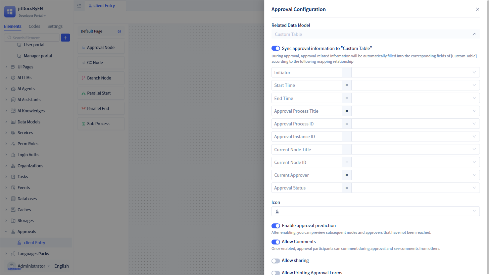

# Approval Workflow Basic Configuration

Approval workflows represent structured organizational processes for reviewing and authorizing specific requests. The approval engine manages diverse approval scenarios—including expense reimbursements, leave requests, and purchase orders—through predefined business rules, workflow logic, and conditional criteria.

JitAi enables visual construction of enterprise approval workflows based on comprehensive organizational patterns. The platform integrates extensive customization capabilities, encompassing advanced features such as rule engines, conditional branching, parallel processing, and subprocess approval flow design.

## Creating processes {#create-process}
Approval workflows are typically designed around specific business scenarios such as leave management, expense processing, or procurement workflows, requiring corresponding business data storage in data table models. Therefore, creating an approval workflow necessitates selecting an associated data model.

Click the `+` button adjacent to "Approval" in the left element tree to open the new approval workflow dialog. Enter the approval workflow name and select the associated data model, then click `Save` to create the workflow.

## Configuring process nodes {#drag-process-node}
JitAi provides developers with an intuitive visual process configuration interface enabling rapid workflow creation through node-based design.

Approval workflows comprise various node types, each serving distinct functions:

**Start Node**: Represents the workflow initiation point. Each approval workflow contains exactly one start node where you can configure initialization settings for users to "initiate requests".

**End Node**: Represents the workflow termination point. Each approval workflow contains exactly one end node, indicating complete process execution.

**Approval Node**: Designates approvers for workflow review. Approval nodes require configuration of approvers and related approval settings.

**CC Node**: Designates carbon copy recipients for workflow notifications. CC nodes require configuration of recipients and related notification settings.

**Branch Node**: Implements conditional logic routing. The workflow proceeds to specified branch paths based on condition evaluation results.

**Parallel Start/Parallel End**: Enables concurrent workflow processing. Upon reaching the parallel start node, the workflow simultaneously proceeds to all parallel branches.

**Subprocess**: Executes embedded workflow logic. When entering a subprocess, execution follows subprocess logic before returning to the parent workflow.

:::tip Tip

A complete approval workflow must include at least one approval node in addition to the mandatory start and end nodes.

Parallel start and parallel end nodes must be configured in pairs.
:::

## Prediction capabilities {#prediction-feature}
AI-powered prediction and intelligent recommendation features deliver process optimization insights based on historical approval data analysis.

## Approval workflow default pages {#approval-workflow-default-page}
Each approval workflow includes a default page interface. Users access this page when performing operations such as initiating requests or reviewing approvals.

In the process configuration panel, click `Approval Default Page` in the upper left corner to access the default page configuration interface.

The default page configuration panel enables approval form setup and customization.

:::tip Tip

The process default page serves as the template for all nodes by default. Modifications to the process default page affect the interface displayed across all workflow nodes.

Start nodes, approval nodes, and CC nodes support custom page configurations.

The approval workflow default page generates a form that cannot be deleted. For form operation guidance, refer to [form-components](../using-functional-components-in-pages/form-components).

:::

## Additional process configuration {#other-process-configuration}
Beyond node configuration and page customization, approval workflows support additional configuration options.

In the process configuration panel, click `Approval Configuration` in the upper right corner to access the approval configuration dialog.

The configuration dialog provides access to associated data models, approval information synchronization to corresponding data models, approval icon settings, approval prediction feature enablement, comment functionality, sharing permissions, approval form printing capabilities, and other advanced functions.

### Synchronizing approval information to data table models {#sync-approval-info-to-data-table-model}
To facilitate integration of approval-related information (such as initiator details, initiation timestamps, approval status, etc.) with business data for analysis, reporting, and statistical purposes, JitAi enables synchronization of approval process information to developer-specified data table models.

By default, `Sync Approval Information to Data Table Model` remains disabled. In this state, generated approval information is stored in the system's built-in "Approval Workflow Instance" data table. To utilize this functionality, users must prepare corresponding fields in the data table model to store approval-related information. Required field types are specified below:

|   Approval Information   |          Data Table Model Accepted Data Types          | Storage Timing |
| :----------: | :----------------------------------------: | :----------------: |
|    Initiator    |                  Member Single Select                  |     Upon Approval Initiation     |
|   Initiation Time   |                  Date Time                  |     Upon Approval Initiation     |
|   End Time   |                  Date Time                  |     Upon Approval Completion     |
| Approval Workflow Title | Single Line Text, Multi-line Text, Option Group Single Select, Dropdown Single Select |     Upon Approval Initiation     |
| Approval Workflow ID  |                  Single Line Text                  |     Upon Approval Initiation     |
| Approval Instance ID  |                    Number                    |     Upon Approval Initiation     |
| Current Node Title | Single Line Text, Multi-line Text, Option Group Single Select, Dropdown Single Select |     After Approval Processing     |
| Current Node ID  |                  Single Line Text                  |     After Approval Processing     |
|  Current Approver  |             Member Single Select, Member Multi-select             |     After Approval Processing     |
|   Approval Status   | Single Line Text, Multi-line Text, Option Group Single Select, Dropdown Single Select |   Upon Approval Status Change   |

### Synchronizing to third-party approval to-do systems {#sync-to-third-party-approval-todo}
When user-created applications integrate with DingTalk organizational structures and require synchronization of system to-do messages to DingTalk's task management, users can enable the `Sync to Third-Party Approval To-Do` function in approval settings.

When enabled, initiated approvals synchronize to corresponding approvers through DingTalk's to-do item system.

:::tip Note
This functionality applies exclusively to approval applications integrated with DingTalk organizational structures. Without DingTalk integration, this option remains hidden.
:::

### Prediction functionality {#prediction-function} 
When users require visibility into subsequent workflow node approvers during approval initiation or processing, they can enable the prediction functionality.

With prediction functionality enabled, users can preview subsequent node approvers during approval initiation or processing.

:::warning Note
The system enables prediction functionality by default.

Approval prediction data also appears in approval records on the right panel. Processed nodes display solid borders with specific timestamps, while unprocessed nodes show dashed borders without timestamps.

When prediction functionality is disabled, application nodes will not display approval records, and approval processing nodes will only show completed approval records.
:::

### Comment functionality {#comment-function}
After users initiate approvals, approval participants can add comments during the approval process and view comments from other participants. The comment system supports image uploads and image preview capabilities.

:::tip Note
The comment functionality operates at the workflow level rather than individual approval nodes. Participants can comment from any approval node within the same approval workflow.
:::

### Sharing capabilities {#share}
When users need to share approval workflows, this functionality can be accessed through the sharing feature.

Enable "Allow Sharing" in the "Approval Configuration" dialog to display "Share" buttons in the detail interfaces of to-do, completed, initiated, and CC items related to the approval workflow.

### Printing approval forms {#print-approval-form}
Certain scenarios require printed approval forms, which can be accomplished through the printing functionality.

Each approval workflow includes a default approval form print template. Users can download the default template for review and create custom print templates for storage as reusable templates.

:::warning Note
"Print Approval Form" operates at the workflow level, meaning all approval nodes utilize the same print template set. However, different approval nodes display varying data including node names, node processors, node processing results, node processing comments, node processing timestamps, etc.

When implementing custom print templates, certain parameters are mandatory, and designed templates must incorporate these required parameters.
:::

After enabling "Allow Print Approval Form", the approval workflow displays a print button at each approval node. Click the `Print` button to generate the current approval form printout.

## Reusing existing approval workflows {#reuse-other-approval-workflowes}
To create new approval workflows based on existing workflows where the new workflow inherits updates from the original workflow, utilize the approval workflow reuse functionality.

When implementing the reuse functionality, ensure the current approval workflow's data model matches the reused approval workflow's data model.

For flow paths, they inherit changes from the reused approval workflow by default. If the current workflow modifies paths (adding/removing workflow nodes or adjusting node connections), it will no longer inherit changes from the reused workflow.

For workflow node configurations, they also inherit settings from the reused approval workflow by default. When current workflow node configurations change, modified configurations are stored independently while unmodified configurations continue inheriting from the reused approval workflow.

For approval pages, the current approval workflow automatically creates an approval page that inherits from the reused approval workflow's page, supports partial modifications, and automatically updates unmodified sections with the inherited page.

:::warning Note

To create new approval workflows based on existing workflows without inheritance relationships, utilize the approval workflow copy functionality.

Click the "Generate Copy" button in the left element tree to implement the approval workflow copy functionality.
:::
