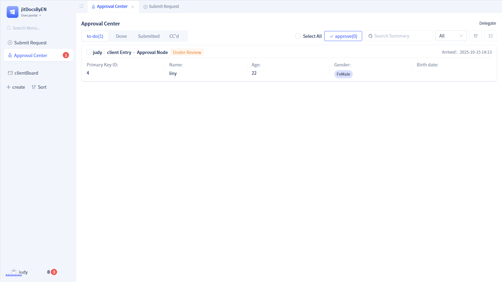
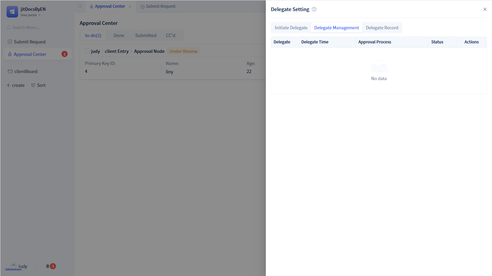

# Approval Initiation and To-Do in Portal
In the portal, users can initiate applications and view processing operations through two functional modules: "Initiate Application" and "To-Do Center".

## Initiate Application {#initiate-application}
All approval workflows created in the development area will be displayed here.

When the initiator selects one of the approval workflows, they will enter the corresponding application initiation page.

The application initiation page consists of an approval form and process data. The approval workflow on the right side of the page is prediction data, so it all displays "Not Reached" status. After filling out the form on the application initiation page, click the submit button to enter the approval workflow.

:::tip Note
Approval workflow prediction data is generated based on the current approval workflow configuration. Therefore, if the configuration does not change, the prediction data will not change.

If the current approval workflow has branch nodes, the prediction data will determine which branch to display based on the data filled in the form.
:::

## To-Do Center {#todo-center}
The To-Do Center is the entry point for processing approval workflows, where users can view approval tasks related to themselves.

The To-Do Center includes four tabs: To-Do, Done, Initiated, and CC. Each tab displays approval tasks in the current status in summary form. Click on the corresponding approval task to enter the approval details page.

The To-Do Center has two display modes: list mode and card mode, with list mode displayed by default. In list mode, each approval task displays a maximum of 5 summary information items.

After clicking the switch icon to switch to card mode, each approval task displays a maximum of only 3 summary information items.

### Detail Page {#detail-page}
The approval tasks seen under the To-Do tab are all to-do tasks. Click on each to-do task to open the corresponding to-do details; similarly, under the Done tab opens done details, under the Initiated tab opens initiated details, and under the CC tab opens CC details.

All detail pages are divided into left and right structures, with the approval form page on the left and the approval workflow displayed on the right.

:::tip Tip

Done detail pages and CC detail pages will not have action buttons at the bottom.

If the initiation node enables the "Revoke Workflow" function, a `Revoke Workflow` button will be displayed in the initiated detail page.

If "Reject", "Return" and other functions are enabled in approval nodes, `Reject` and `Return` buttons will be displayed in the to-do detail page.

If "Share", "Print" and other functions are enabled in "Approval Configuration", `Share`, `Print` and other buttons will be displayed in all detail pages of this approval.

If the "Comment" function is enabled, a "Comment" tab will be displayed on the right side of all detail pages of this approval.

:::

### Delegate to Others Processing {#delegate-to-others-processing}
Users may be unable to process approvals for an extended period due to various reasons. In this case, they can use the delegation function to delegate approvals to other users for processing.

Click `Delegate` in the upper right corner of the To-Do Center to enter the delegation page for settings.

The delegation page includes three parts: Initiate Delegation, Delegation Management, and Proxy Records.

On the initiate delegation page, you need to fill in the proxy person, proxy start time, proxy end time, delegation approval scope, and the approval workflows that need to be delegated. After completing the information, click `Initiate Delegation` to activate the delegation function.

In delegation management, you can view the list of currently initiated delegations, view information such as proxy persons, time, processes, and can end early or delete completed delegations.

In proxy records, you can also view all proxy information handled and operated by the proxy person during the delegation period.

:::warning Note
After the delegator initiates delegation, for data that has not completed approval during the delegation period, even if it exceeds the delegation end time, it will not be returned to the delegator and will still be processed by the proxy person.
:::

## Approval Workflow Management Page {#approval-workflow-management-page}

When administrators enter the administrator portal, they can see the approval workflow management page.

In the approval workflow management page, you can create new groups and then move approval workflows into groups.

Additionally, for each approval workflow, administrators can reconfigure the parameters of each node.

:::warning Note

The approval workflow management area can only group approval workflows and configure nodes, but cannot delete approval workflows.

If a group is deleted, the system will move all approval workflows under the group to "Ungrouped".

If an approval workflow configuration is modified, it will override the configuration in the development area.

:::
