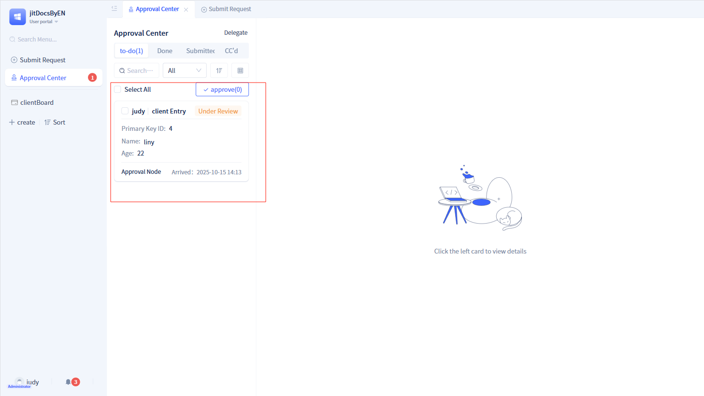
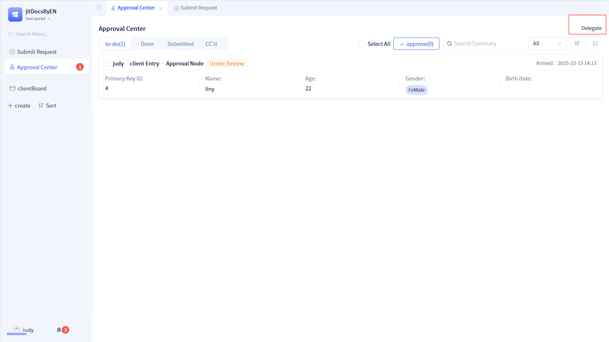

# Approval Initiation and To-Do in Portal

Within the portal, users can initiate applications and manage processing operations through two primary functional modules: "Initiate Application" and "To-Do Center".

## Initiating applications {#initiate-application}
All approval workflows created in the development area are displayed in this module.

When initiators select an approval workflow, they navigate to the corresponding application initiation page.

The application initiation page comprises an approval form and process data. The approval workflow displayed on the right side of the page represents prediction data, showing all statuses as "Not Reached". After completing the form on the application initiation page, click the submit button to enter the approval workflow.

:::tip Note
Approval workflow prediction data is generated based on current approval workflow configuration. Therefore, prediction data remains unchanged unless the configuration is modified.

If the current approval workflow contains branch nodes, prediction data determines which branch to display based on the data entered in the form.
:::

## To-Do Center {#todo-center}
The To-Do Center serves as the primary entry point for processing approval workflows, enabling users to view approval tasks related to themselves.

The To-Do Center includes four tabs: To-Do, Done, Initiated, and CC. Each tab displays approval tasks in their current status using summary format. Click on any approval task to access the approval details page.

The To-Do Center offers two display modes: list mode and card mode, with list mode as the default. In list mode, each approval task displays a maximum of 5 summary information items.

After clicking the switch icon to toggle to card mode, each approval task displays a maximum of only 3 summary information items.

### Detail pages {#detail-page}
Approval tasks displayed under the To-Do tab represent pending tasks. Clicking any to-do task opens the corresponding to-do details; similarly, clicking tasks under the Done tab opens done details, under the Initiated tab opens initiated details, and under the CC tab opens CC details.

All detail pages follow a left-right structure, with the approval form page on the left and the approval workflow displayed on the right.

:::tip Tip

Done detail pages and CC detail pages do not display action buttons at the bottom.

If the initiation node enables the "Revoke Workflow" function, a `Revoke Workflow` button appears in the initiated detail page.

If "Reject", "Return" and other functions are enabled in approval nodes, `Reject` and `Return` buttons appear in the to-do detail page.

If "Share", "Print" and other functions are enabled in "Approval Configuration", `Share`, `Print` and other buttons appear in all detail pages for this approval.

If the "Comment" function is enabled, a "Comment" tab appears on the right side of all detail pages for this approval.

:::

### Delegating to others for processing {#delegate-to-others-processing}
Users may be unable to process approvals for extended periods due to various circumstances. In such cases, they can utilize the delegation function to delegate approvals to other users for processing.

Click `Delegate` in the upper right corner of the To-Do Center to access the delegation page for configuration.

The delegation page comprises three sections: Initiate Delegation, Delegation Management, and Proxy Records.

On the initiate delegation page, you must specify the proxy person, proxy start time, proxy end time, delegation approval scope, and the approval workflows requiring delegation. After completing the information, click `Initiate Delegation` to activate the delegation function.

In delegation management, you can view the list of currently active delegations, review information such as proxy persons, timeframes, and processes, and can terminate early or delete completed delegations.

In proxy records, you can also view all proxy information handled and operated by the proxy person during the delegation period.

:::warning Note
After the delegator initiates delegation, for data that has not completed approval during the delegation period, even if it exceeds the delegation end time, it will not be returned to the delegator and will continue to be processed by the proxy person.
:::

## Approval workflow management pages {#approval-workflow-management-page}

When administrators access the administrator portal, they can view the approval workflow management page.

In the approval workflow management page, you can create new groups and then organize approval workflows into groups.

Additionally, for each approval workflow, administrators can reconfigure the parameters of individual nodes.

:::warning Note

The approval workflow management area can only group approval workflows and configure nodes, but cannot delete approval workflows.

If a group is deleted, the system automatically moves all approval workflows under the group to "Ungrouped".

If an approval workflow configuration is modified, it overrides the configuration in the development area.

:::
