# Special Node Configuration

In addition to commonly used nodes, JitAi's approval workflows support specialized nodes including CC nodes, branch nodes, parallel nodes, and subprocess nodes.

## CC nodes {#cc-node}
When users need to carbon copy other users during application initiation or approval document processing, CC nodes provide this functionality.

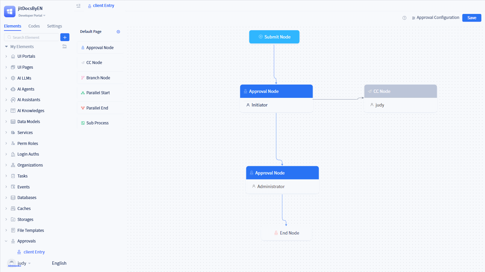

Click the corresponding "CC Node" in the configuration panel to access the CC configuration interface.

CC nodes enable configuration of CC recipients, SMS notifications, CC page settings, summary field settings, CC page field display settings, and page control display settings.

### CC recipients {#cc-recipients}
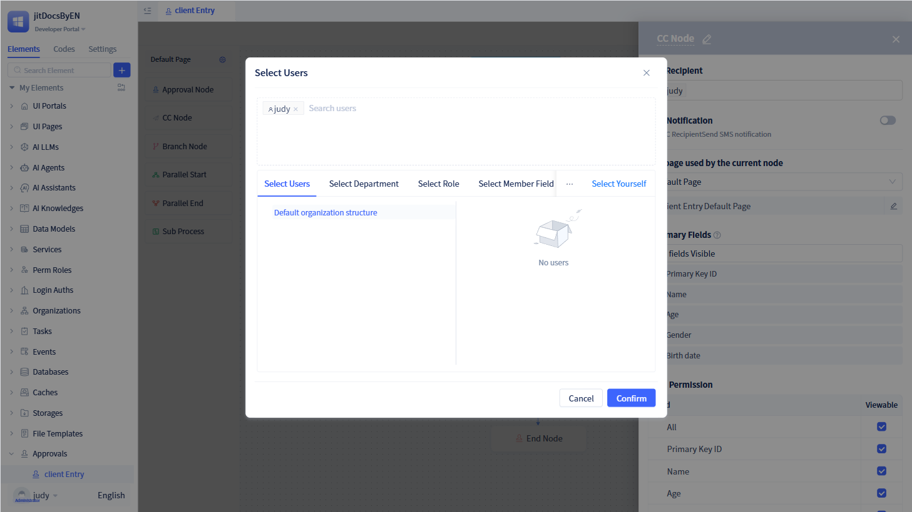

CC recipient configuration follows the same process as approval node configuration, supporting users, departments, roles, member fields, department fields, and other options. For detailed guidance, refer to [User Selection](./approval-node-configuration#approver-settings).

### SMS notifications {#sms-notification}
When CC information is transmitted to corresponding CC recipients, they receive SMS notifications. Configuration follows the same process as approval node SMS notification settings. For detailed guidance, refer to [SMS Notification](./approval-node-configuration#sms-notification).

### Pages used by current node {#pages-used-by-current-node}
By default, all CC nodes utilize the approval workflow's default page. To customize pages, configure the node's page in the node settings. For custom page creation guidance, refer to [Approval Page Customization](./approval-page-customization).

### Field permissions {#fieldpermission}
Users can control viewing permissions for approval form fields on the "CC" page through field permissions. By default, all fields are in view-only mode.

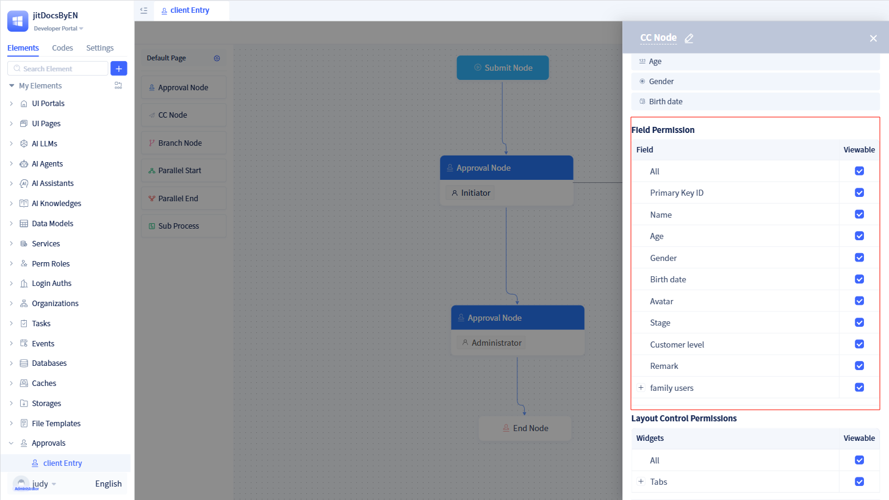

:::warning Note

Field permissions only affect the "CC" page under the current node.

The final display of approval form fields is influenced by both CC node permission control and the form's inherent permissions. For form permission configuration guidance, refer to [Form Permissions](../using-functional-components-in-pages/form-components#field-operation-permissions).

When adding new fields to a data table, you must first add permissions, then configure them on the corresponding page.
:::

### Layout control permissions {#layout-control-permissions}
In certain scenarios, specific layout controls in displayed pages may not need to be shown for different nodes. Layout control permissions provide this permission management capability.

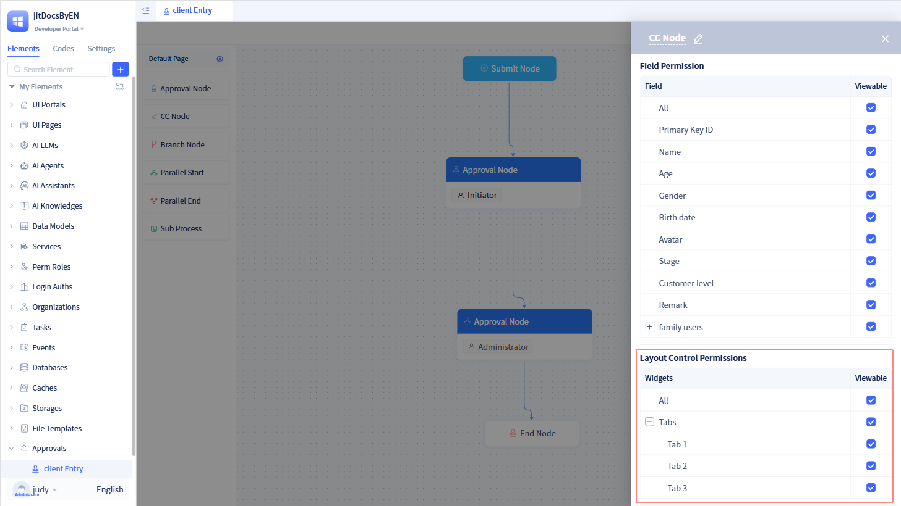

Users can control whether layout controls are displayed when pages are shown under the current node. By default, corresponding pages do not include layout controls, so you must first add layout controls to the relevant pages before implementing permission control.

## Branch nodes {#branch-node}
When approval workflows need to determine the next approval node based on specific form field values, branch nodes provide this conditional routing capability.

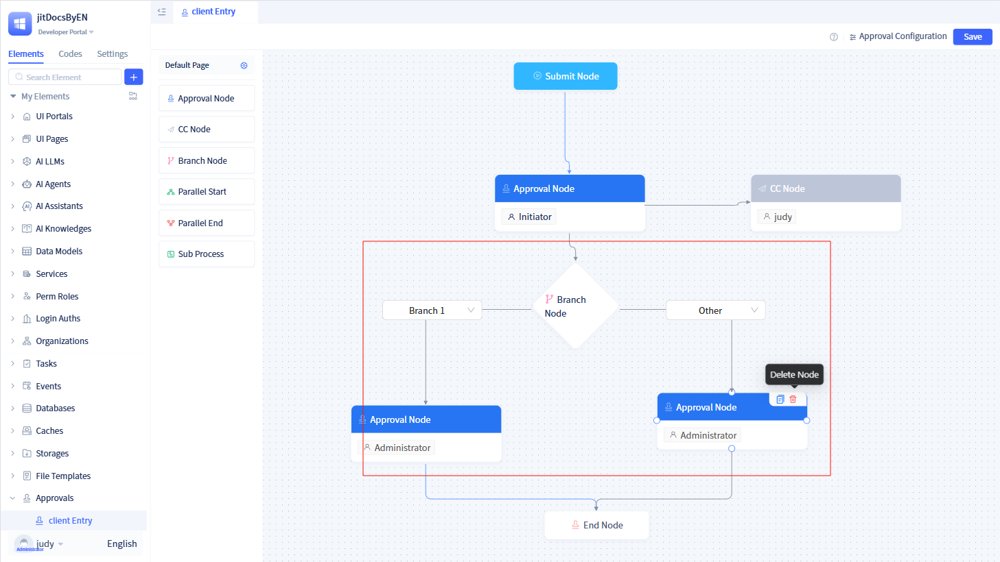

For example, when applying for office supplies, if remaining office supply quantity is less than 5, the procurement department requires notification to make purchases.

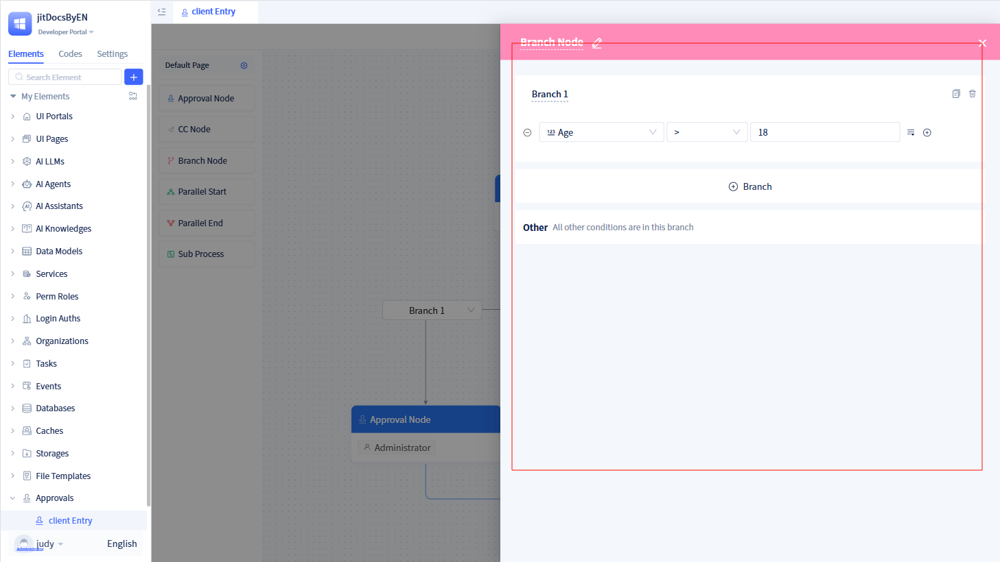

Click the corresponding branch node from the "Approval Configuration Panel" to access the node's configuration interface, where branch conditions can be configured.

:::tip Tip

Each branch condition of a branch node functions as a filtering condition for the approval-associated model.

Each branch of a branch node maintains its own independent flow route, branching according to conditions set on the branch node.

Branch nodes include an "Other" branch by default. When none of the above branch conditions are satisfied, approval flows to the "Other" branch.
:::

## Parallel nodes {#parallel-node}
When users require multiple approval paths to flow simultaneously, parallel nodes enable this concurrent processing.

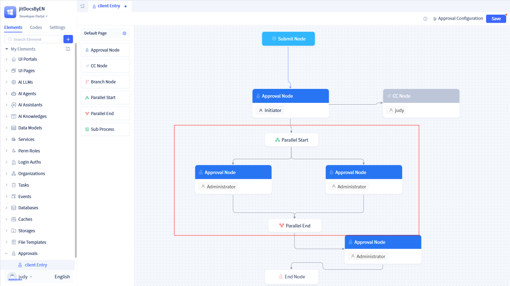

An approval workflow can contain multiple groups of parallel nodes.

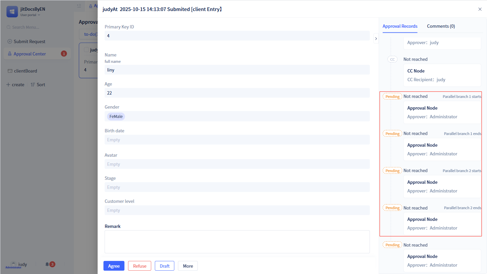

When workflows enter parallel nodes, all node statuses and flow situations are presented in approval records.

:::warning Note

Parallel start and parallel end must appear in pairs.

All parallel nodes must originate from the parallel start node and terminate at the parallel end node.

All parallel branches are independent and do not affect each other.

:::

## Subprocess nodes {#sub-process-node}
Subprocesses as nodes represent extracted approval workflows, where flowcharts with consistent functions/routes exist as independent approval workflows, enabling multiple main processes to invoke them without repetitive configuration.

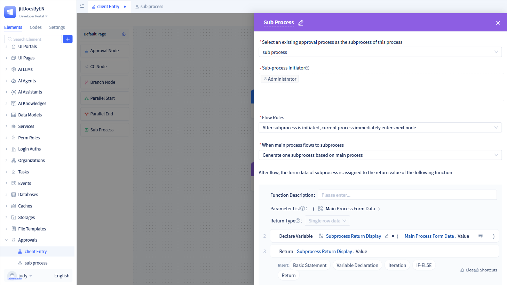

Click the corresponding subprocess node in the approval configuration panel to access the subprocess configuration interface. The subprocess configuration interface provides numerous configuration options:

### Subprocess name {#sub-process-name}
Dropdown selection requiring selection of an approval workflow other than the current approval as the subprocess for the current approval workflow.

### Subprocess initiator {#sub-process-initiator}
Select members as subprocess initiators. The user selection interface follows the same process as [Approver Selection](./approval-node-configuration#approver-settings).

:::warning Note
If multiple members are configured as subprocess initiators, each initiator will initiate subprocesses sequentially.
:::

### Subprocess flow rules {#sub-process-flow-rules}
After subprocess initiation, subprocess flow can be specified through subprocess flow rules.

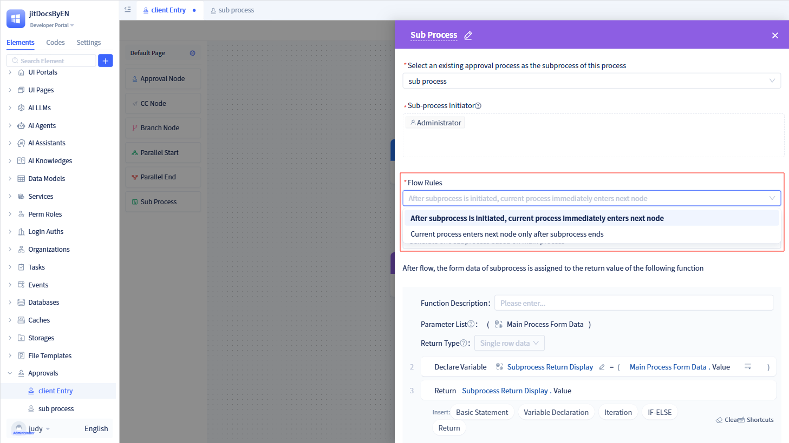

Developers can choose whether the current process proceeds to the next node after subprocess initiation, or whether the current process only proceeds to the next node after subprocess completion.

When developers select "The current process will proceed to the next node after the subprocess is initiated", the subprocess and current process execute simultaneously. The two processes are independent, and subprocess completion has no impact on the current process.

When developers select "The current process will only proceed to the next node after the subprocess ends", the current process pauses its flow and waits for subprocess completion before proceeding to the next node.

### When main process flows to subprocess {#when-main-process-flows-to-sub-process}
When main processes flow to subprocesses, developers generate different numbers of subprocesses based on actual requirements and configuration.

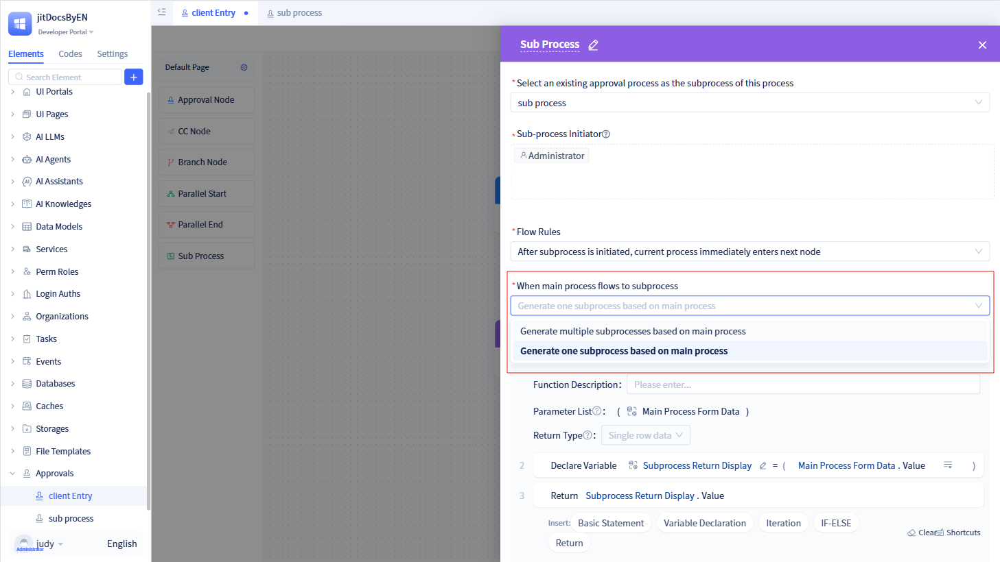

**Generate One Subprocess per Main Process:** This represents the most common scenario, where the current process and subprocess maintain a 1-to-1 relationship.

**Generate Multiple Subprocesses per Main Process:** Generally applicable in cases where main processes contain multiple sub-tables, generating multiple subprocesses for the sub-tables.

### Subprocess post-flow function design {#sub-process-post-flow-function-design}
When current processes flow to subprocesses, data from current processes must be passed to subprocesses. Configure functions here to implement this data transfer.

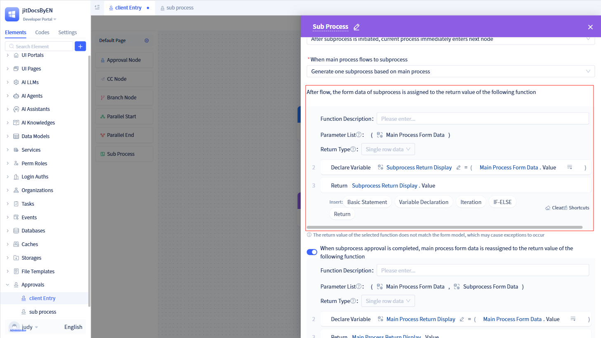

Function design is performed through visual configuration.

:::warning Note
Input args are fixed as the main process form data, and the return value type is single-row data. If the selected function's return value does not match the form model, it will cause function execution exceptions.
:::

### Updating main process data when single subprocess ends {#update-main-process-data-single-sub-process-end}
After subprocess completion, determine whether subprocess form data needs to be passed to the main process based on specific requirements. If needed, enable this functionality.

Function design is also performed through visual configuration here.

:::warning Note
Input args are fixed as the main process form data and subprocess form data, and the return value type is single-row data. If the selected function's return value does not match the form model, it will cause function execution exceptions.
:::

### Updating main process data when all subprocesses end {#update-main-process-data-all-sub-processes-end}
When main processes flow to subprocesses and generate multiple subprocesses per main process, determine whether the main process requires subprocess form data for operations when all subprocesses are approved.

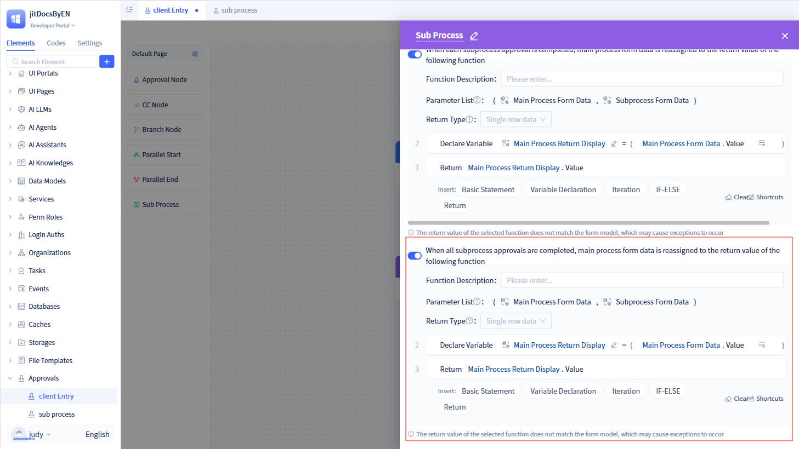

:::warning Note
This functionality only applies to scenarios that generate multiple subprocesses.

Input args are fixed as the main process form data and subprocess form data, and the return value type is single-row data. If the selected function's return value does not match the form model, it will cause function execution exceptions.
:::
