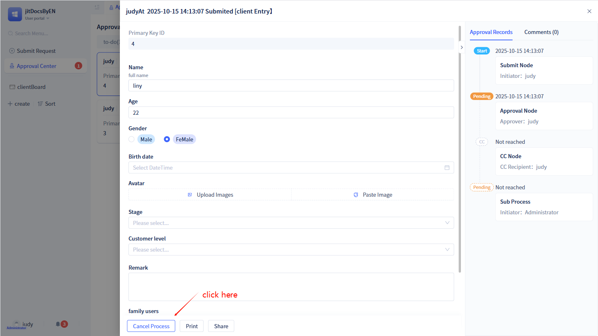
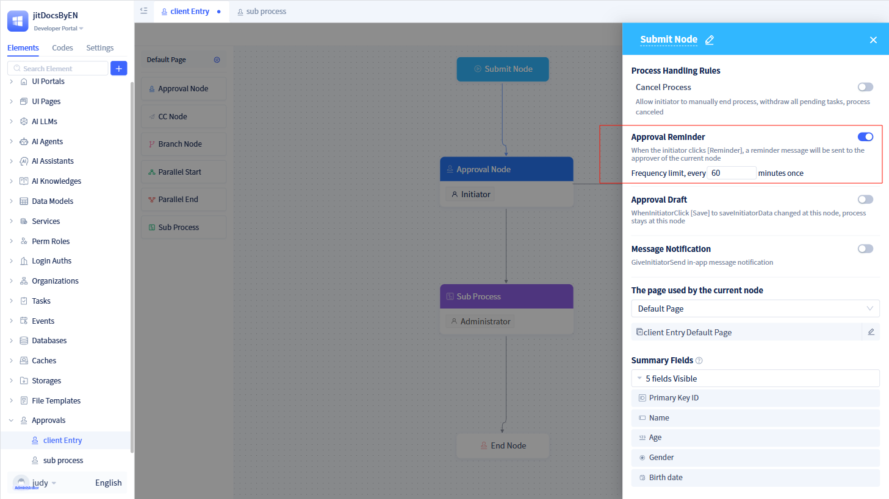
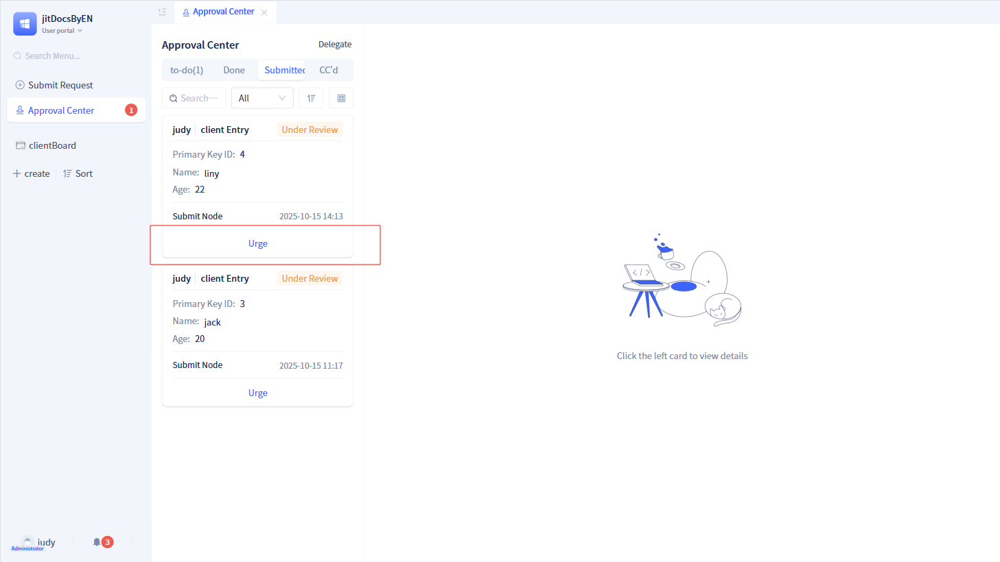
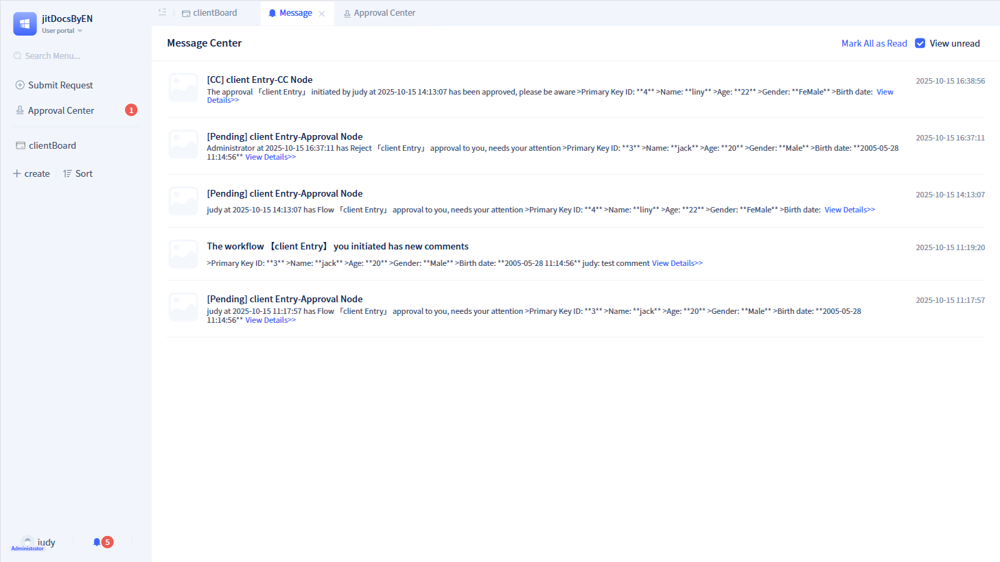
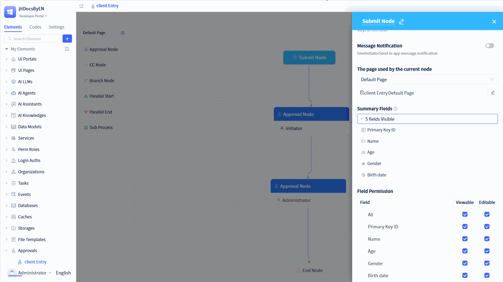
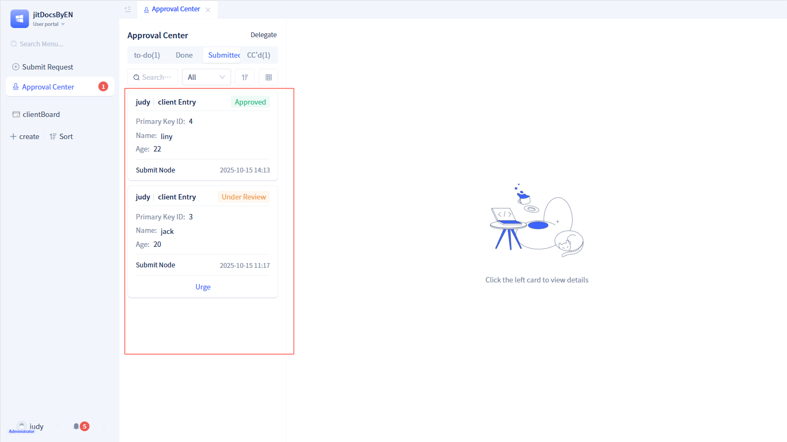
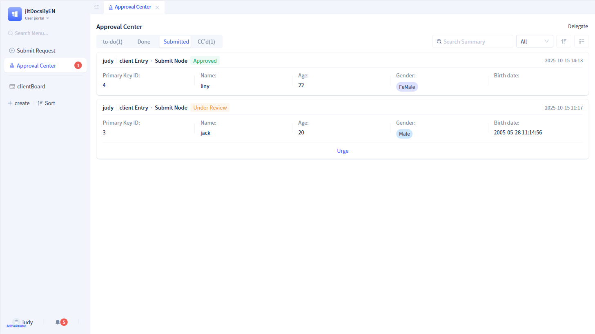
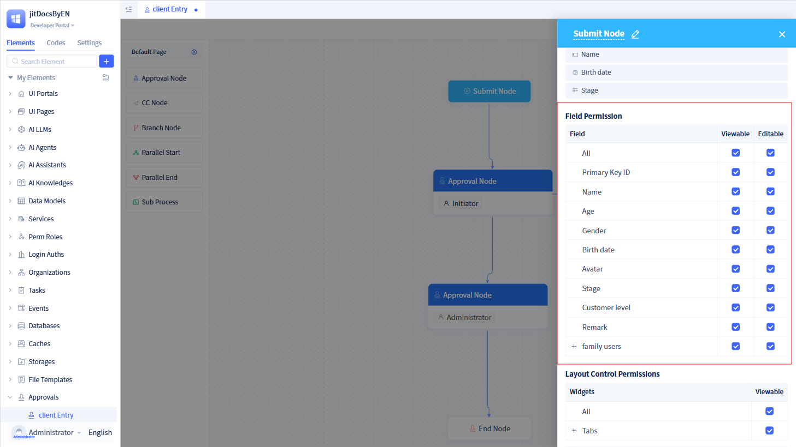
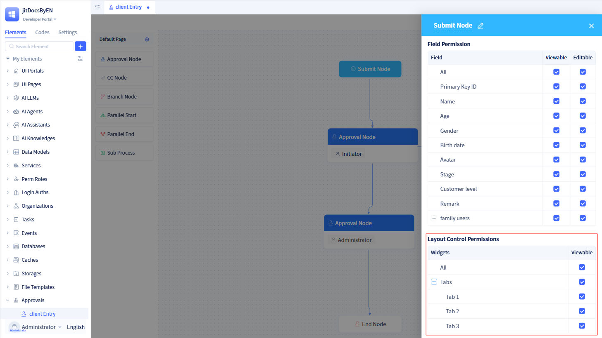

# Start Node Configuration

The start node is a default generated node, with one and only one, which represents the node that the initiator must handle—the node loaded when the workflow is initiated.

### Process cancellation functionality {#process-cancellation-function}
After approval workflow initiation, initiators are permitted to manually terminate the process. When initiators click `Cancel Process`, all to-do items are withdrawn and the workflow is cancelled.

By default, workflows can only be cancelled when the first approval node remains in "Pending Approval" status, but this can be adjusted to allow cancellation under any "In Approval" status.

After developers enable the "Cancel Process" functionality, initiators can locate the corresponding workflow under the "Initiated" tab in the "To-Do Center" and click the `Cancel Process` button to cancel the entire workflow.

### Approval reminders {#approval-reminder}
After initiators submit approval documents, they may want to urge approvers to process them. The reminder functionality addresses this need.

After developers enable the "Approval Reminder" functionality, a `Reminder` button appears on workflow cards under the "Initiated" tab in the "To-Do Center".

Simultaneously, reminder frequency can be limited, with a default of 60 minutes, meaning if the interval between two reminders is less than 60 minutes, no reminder message will be sent to the current approver.

After initiators click the `Reminder` button, the system sends a reminder message to the current approver and records the reminder time.

### Approval drafts {#approval-draft}
When initiators need to temporarily pause while completing an application, they can save filled content through the "Draft" functionality, then submit the application through the "Submit" functionality after completion.

After initiators enable the "Approval Draft" functionality, a `Draft` button appears on the "Initiate Application" page. After clicking `Draft`, approval data is saved in draft status in the data table, and the entire approval workflow remains at this node. When initiators reopen the application page, a "Draft" tab appears at the top of the page, enabling viewing of draft data.

### Message notifications {#anchor-414}
After developers enable the "Message Notification" functionality, the system sends message reminders to initiators.

If the current approval workflow is approved or rejected, initiators receive corresponding messages on the message notification page.

### Pages used by current node {#pages-used-by-current-node}
After creating an approval workflow, a default approval page is generated, and all nodes in this approval workflow utilize this default approval page.

Developers can also create different approval pages for different nodes (start nodes, approval nodes, CC nodes). For custom page creation guidance, refer to [Approval Page Customization](./approval-page-customization).

### Summary information display {#summary-display}
Summary fields primarily display the "Initiated" approval list in the "To-Do Center".

By default, the system retrieves the first five fields of the data table model (excluding images, attachments, and sub-tables) as summary information. A maximum of 5 fields can be selected, and field cards can be dragged to adjust order.

The "To-Do Center" page offers two display modes: card mode and list mode. In list mode, a maximum of 5 summary information items are displayed. In card mode, a maximum of the first 3 summary information items are displayed.

### Field view and edit permissions {#field-view-edit-permissions}
Developers can control viewing and editing permissions for approval form fields on the "Initiate Application" page through field permissions. By default, all fields are in viewable and editable status.

:::warning Note

The field permissions of the start node only affect approval forms under the "Initiate Application" and "Initiated" pages.

The final display of approval form fields is influenced by both start node field permissions and the form's inherent field permissions. For form permission configuration guidance, refer to [Form Permissions](../using-functional-components-in-pages/form-components#field-operation-permissions).

When adding new fields to a data table, you must first add permissions, then configure them on the corresponding page.

:::

### Layout control permissions {#layout-control-permissions}
In certain scenarios, specific layout controls in displayed pages may not need to be shown for different nodes. Layout control permissions provide this permission management capability.

Developers can control whether layout controls are displayed when pages are shown under the current node. By default, corresponding pages do not include layout controls, so you must first add layout controls to the relevant pages before implementing permission control.
