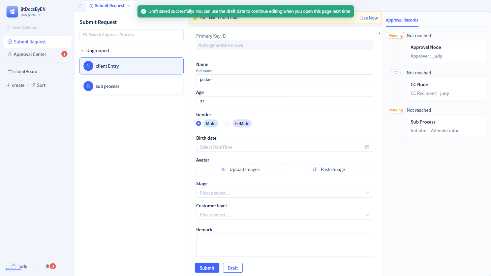

# Start Node Configuration
The start node is a default generated node, with one and only one, which is the node that the initiator needs to handle, i.e., the node loaded when the workflow is initiated is the start node.

### Process Cancellation Function {#process-cancellation-function}
After an approval workflow is initiated, the initiator is allowed to manually end it. When the initiator clicks "Cancel Workflow", all to-do items will be withdrawn and the workflow will be cancelled.

By default, the workflow can only be cancelled when the first approval node is still in "Pending Approval" status, but it can be adjusted so that it can be cancelled under any "In Approval" status.

After developers enable the "Cancel Workflow" function, the initiator can find the corresponding workflow under the "Initiated" tab in the "To-Do Center", click the `Cancel Workflow` button to cancel the entire workflow.

### Approval Reminder {#approval-reminder}
After an initiator initiates an approval document, they want to urge approvers to approve it. At this time, the reminder function can be configured.

After developers enable the "Approval Reminder" function, a `Reminder` button will appear on the workflow cards under the "Initiated" tab in the "To-Do Center".

At the same time, the frequency of reminders can be limited, with a default of 60 minutes, meaning if the interval between two reminders is less than 60 minutes, no reminder message will be sent to the recent approver.

After the initiator clicks the `Reminder` button, the system will send a reminder message to the current approver and record the reminder time.

### Approval Draft {#approval-draft}
When the initiator needs to temporarily leave while filling out an application, they can save the filled content through the "Draft" function, and then submit the application through the "Submit" function after completing the filling.

After the initiator enables the "Approval Draft" function, a `Draft` button will appear on the "Initiate Application" page. After clicking `Draft`, the approval data is saved as draft status in the data table, and the entire approval workflow remains at this node. When the initiator opens the application page again, there is a "Draft" tab at the top of the page, clicking this tab allows viewing the draft data.

### Message Notification {#anchor-414}
After developers enable the "Message Notification" function, the system will send message reminders to the initiator.

If the current approval workflow is approved or rejected, the initiator will receive corresponding messages on the message notification page.

### Pages Used by Current Node {#pages-used-by-current-node}
After creating an approval workflow, a default approval page will be generated, and all nodes in this approval workflow will use this default approval page.

Developers can also create different approval pages for different nodes (start nodes, approval nodes, CC nodes). For how to create custom pages, please refer to [Approval Page Customization](./approval-page-customization).

### Summary Information Display {#summary-display}
Summary fields are mainly used for displaying the "Initiated" approval list in the "To-Do Center".

By default, the system will obtain the first five fields of the data table model (excluding images, attachments, and sub-tables) as summary information. At the same time, a maximum of 5 fields can be selected, and field cards can be dragged to adjust the order.

The "To-Do Center" page has two display modes: card mode and list mode. In list mode, a maximum of 5 summary information items are displayed. In card mode, a maximum of the first 3 summary information items are displayed.

### Field View and Edit Permissions {#field-view-edit-permissions}
Developers can control the viewing and editing permissions of approval form fields on the "Initiate Application" page through field permissions. By default, all fields are in viewable and editable status.

:::warning Note

The field permissions of the start node are only effective for approval forms under the "Initiate Application" and "Initiated" pages.

The final display of approval form fields is affected by both the start node field permissions and the form's own field permissions. For how to configure form permissions, refer to [Form Permissions](../using-functional-components-in-pages/form-components#field-operation-permissions).

When a new field is added to a data table, you need to add permissions for it first, then configure it on the corresponding page.

:::

### Layout Control Permissions {#layout-control-permissions}
In some cases, for different nodes, certain layout controls in the displayed pages may not need to be shown. In this case, layout control permissions can be used for permission control.

Developers can control whether layout controls are displayed when pages are shown under the current node. By default, the corresponding pages do not have layout controls added, so you need to add layout controls to the corresponding pages first before you can perform permission control. 
