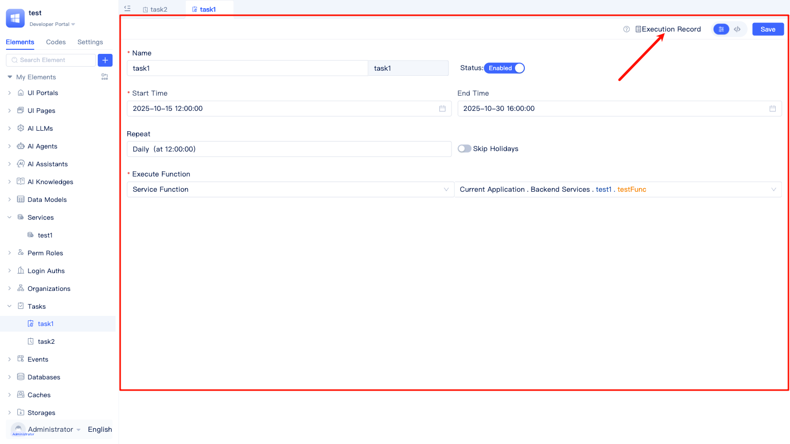

# Background Tasks {#background-tasks}
Background tasks are the core capability for implementing periodic and automated business processing in the JitTask framework. Through background tasks, developers can allow the system to automatically execute specific business logic on a scheduled or on-demand basis without manual intervention.

JitAi provides two types of background tasks: `Scheduled Tasks` that execute at fixed time intervals, and `Date Field Tasks` that trigger based on date fields in data tables.

## Creating Tasks {#creating-tasks}

In the development area element tree, click the `+` button next to the search box, select `Background Task`, then choose either `Scheduled Task` (executes at fixed intervals) or `Date Field Task` (triggers based on data) according to your requirements.

## Scheduled Tasks {#scheduled-tasks}
Scheduled tasks automatically execute at fixed time intervals and are the most commonly used type of background task.

### Application Scenarios {#scheduled-task-scenarios}
Scheduled tasks are widely used in various automation scenarios:

- **Data Synchronization**: Synchronize data from external systems hourly to ensure real-time data availability.
- **Report Generation**: Generate sales reports daily to support management decisions.
- **Data Cleanup**: Clean expired temporary files weekly to free up storage space.
- **System Maintenance**: Perform database optimization monthly to maintain system performance.
- **Message Push**: Send notification messages daily to enhance user experience.

### Configuration Steps {#scheduled-task-configuration}

In the "New Scheduled Task" dialog, enter the task name (the system will automatically generate an English name), set the start time (required) and end time (optional), select the task's repeat cycle and whether to skip holidays. After configuration is complete, you can create the scheduled task and enter the visual editor for subsequent operations.

### Setting Start and End Time {#setting-start-and-end-time}
Scheduled tasks use fixed time points to control the start and end of tasks:

- **Start Time**: The time point when the task will first execute, required field.
- **End Time**: The time point when the task will stop executing, optional field. If not filled, the task will continue executing.

## Date Field Tasks {#date-field-tasks}
Date field tasks trigger based on date or datetime field values in data tables, enabling automated processing that is tightly integrated with business data.

### Application Scenarios {#date-field-task-scenarios}
Date field tasks play an important role in business data management:

- **Expiration Reminders**: Automatically send reminders before contract expiration to avoid business interruption.
- **Member Management**: Automatically adjust permissions after member expiration to ensure service accuracy.
- **Order Processing**: Automatically cancel overdue orders to release inventory resources.
- **Bill Management**: Automatically send collection notices when bills are due to improve recovery efficiency.
- **Appointment Management**: Automatically remind before appointment times to reduce no-shows.

### Configuration Steps {#date-field-task-configuration}

Developers need to enter the task name (English name will be automatically generated), select the data model, set filter conditions, set start time (required) and end time (optional) in the `New Date Field Task` dialog. Choose the repeat cycle. Select whether to skip holidays. After configuration is complete, you can create the date field task and enter the visual editor.

### Selecting Models and Filtering Data {#selecting-models-and-filtering-data}
In the **Model Selection** stage, you need to select a data table model that contains date fields. In the **Field Selection** stage, specify the date/time field used to trigger the task. Through **Filter Conditions** settings, you can add additional data filtering conditions so that only data meeting the conditions will trigger the task, thereby improving the accuracy and efficiency of task execution.

### Triggering Tasks On-time/Early/Late {#triggering-tasks-on-time-early-late}
Supports flexibly setting automatic task triggering several days before or after the date, at specific time points, based on the value of the date field, meeting diverse business scenario requirements.

#### Start Time {#date-field-start-time}
When configuring the start time for date field tasks, you first need to select a date or datetime type field.

If you select a **date type field**, the system supports setting several days before or after that date, and specifying specific hours and minutes as the task trigger time.

If you select a **datetime type field**, you can set automatic task triggering several days before or after that time, precise to the specific time point.

#### End Time {#date-field-end-time}
There are two configuration methods for end time: one is to directly select a fixed date as the task deadline; the other is to select a date or datetime field, and you can set specific time points before, after, or at the current time of that field, flexibly meeting different business requirements.

Developers can choose the end time as a fixed value or field value in the visual editor of date field tasks.

## General Configuration Items {#general-configuration-items}
Regardless of which task type you choose, you need to configure the following basic settings:

### Repeat Cycle {#repeat-cycle}
The system provides 7 repeat cycles to meet different business needs:

- **No Repeat**: Execute only once. Suitable for one-time tasks, temporary processing, etc.
- **Hourly**: Execute once per hour. Suitable for real-time data synchronization, monitoring checks, etc.
- **Daily**: Execute once per day. Suitable for daily report generation, daily cleanup, etc.
- **Weekly**: Execute once per week. Suitable for weekly statistics, regular backups, etc.
- **Monthly**: Execute once per month. Suitable for monthly reports, bill generation, etc.
- **Yearly**: Execute once per year. Suitable for annual statistics, system maintenance, etc.
- **Custom**: Flexible configuration of execution cycles. Suitable for complex time rule scenarios.

### Processing Holidays {#processing-holidays}
After enabling the **Skip Holidays** feature, tasks will automatically skip on legal holidays and execute on the next working day. This feature is particularly suitable for office tasks, financial processing, business reports, and other scenarios that need to avoid holidays.

## Developing Task Execution Functions {#developing-task-execution-functions}
After task creation is complete, you need to write the specific execution logic. JitAi provides two function development approaches:

### Internal Task Functions {#internal-task-functions}
Internal task functions are functions written directly inside the task element, suitable for handling simple, non-reusable dedicated logic, and also suitable for rapid prototyping. After creating a task, the system will automatically enter the function editing interface, where developers can drag and drop components in the visual editor or switch to code mode to write code directly.

Developers can write internal task function logic directly below the task's visual editor. For scheduled tasks, internal task functions require no parameters; while internal task functions for date field tasks will automatically receive the current model row data as parameters, making it convenient to handle business logic related to that data.

### Service Functions {#service-functions}
Service functions refer to writing functions in independent service elements, suitable for handling complex or reusable business logic, and also facilitate team collaboration. During development, first create service elements and write functions, then directly call these service functions in tasks. You can also combine multiple service functions as needed to implement more complex processing.

Developers can switch the execution function to `Service Function` in the task's visual editor, then select the corresponding service function in the input box on the right.

:::tip Parameter Description
- For **Scheduled Tasks**, internal task functions **receive no parameters** during execution, so if you choose a service function as the execution function, you should also ensure that the service function requires no parameters.
- For **Date Field Tasks**, internal task functions will **automatically receive the current model row data as parameters**, so if you choose a service function as the execution function, you should also ensure that the service function's parameter signature is consistent with the internal task function, i.e., receiving the current model row data as parameters, with data type as [Single Row Data](../../reference/framework/JitORM/data-types).
:::

## Viewing Execution Records {#viewing-execution-records}
The task monitoring feature provides complete execution record viewing capabilities. Developers can view task execution history, monitor task execution status and results, and analyze task execution time and performance, helping to identify and resolve issues in a timely manner.

Developers can click `Execution Records` in the upper right of the task's visual editor to enter the execution records window.

In the execution records window, you can intuitively view various task statuses, including pending, executing, overdue, and completed tasks. It also supports flexible filtering of execution records by start and end time, making it convenient to quickly locate and analyze task execution situations.

## Source Code Mode {#source-code-mode}

Developers can adjust task configuration in the visual editor, or click the upper right to switch to source code mode. In source code mode, you can manually modify the configuration file `e.json` or modify the `inner.py` file to change function logic.

:::tip Performance Optimization Tips
- Set task execution frequency reasonably to avoid excessive triggering that causes system resource pressure.
- For large batch data processing tasks, it is recommended to use batch processing methods to improve efficiency and system stability.
:::