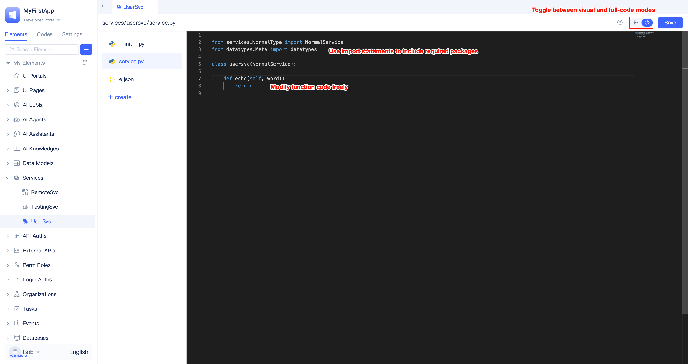
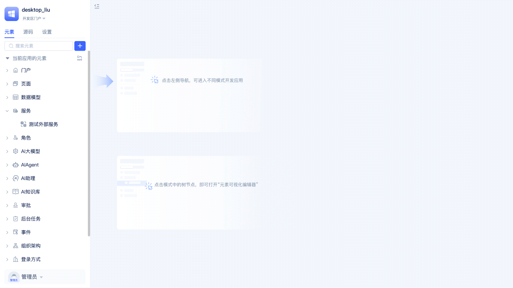
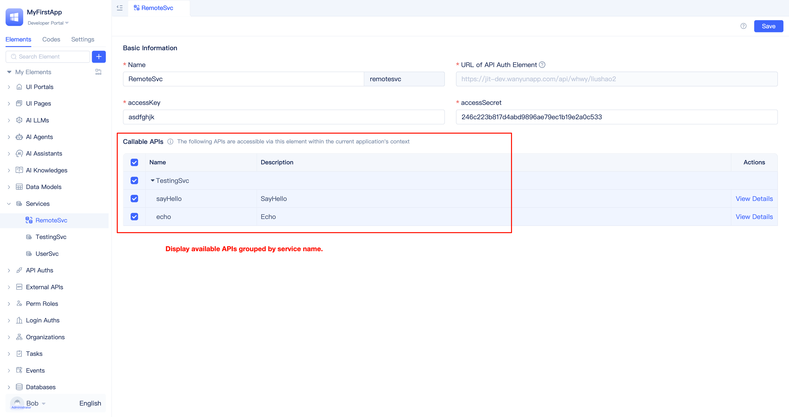
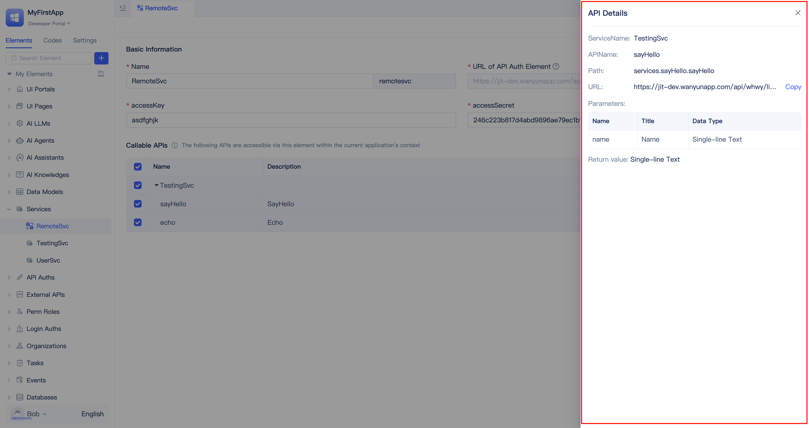

# Creating Service Elements
Whether in object-oriented or procedural development, encapsulating functions makes code reusable and maintainable. Through function encapsulation, commonly used or complex business logic can be isolated for convenient invocation and management. JitAI enables developers to define custom business service functions through service elements.

Service elements are Python-based backend elements. Within service elements, developers can flexibly declare multiple service functions and effectively organize and manage complex business logic code through proper categorization. Developers can create multiple service elements in applications following the principles of high cohesion and low coupling, managing different service functions by category, such as user services, order services, or payment services.

To create a service element, locate `Services` in the element directory tree, click the `+` button on the right side, select `Generic Service`, fill in the service name in the popup dialog, and click `Confirm` to complete creation and automatically enter the visual editor.

## Creating service functions {#create-service-functions}
JitAI enables developers to create multiple service functions within a single service element.

To create a service function, click the `+ Create Function` button on the left side of the service element editor, fill in the function name in the popup dialog, and click `Confirm` to complete function creation and automatically navigate to the function editor.

## Editing service functions in source code mode {#edit-service-functions-source-code-mode}
When the visual editor cannot meet the needs of complex business logic orchestration, developers can switch to source code mode. For example, when you need to import dependency libraries, encapsulate helper utility functions, or use syntax and features not yet supported by the visual editor, source code mode provides greater flexibility and extensibility.

Click the `</>` button in the upper right corner of the service element visual editor to switch to code mode for development. When writing service functions, you can not only use native import syntax to import required dependency packages, but also call [platform APIs](../../reference/runtime-platform/backend) to access other elements (such as model functions, other service functions, etc.) and resources within the application.

For detailed information about the internal structure of service elements, refer to the [Custom Business Services](../../reference/framework/JitService/custom-business-service) reference documentation.

## Adding new dependency libraries {#add-new-dependency-library}
Developers sometimes need to use mature third-party libraries to improve development efficiency and code quality. JitAI allows developers to modify the `requirements.txt` file to add new dependency libraries.

To add dependencies, switch the element directory tree to `Codes` view, locate the `requirements.txt` file and add new dependency libraries to the file, then click the `Save` button. After saving, you can directly import packages from these dependency libraries in service functions.

## Using cross-app service elements to call authorized APIs {#use-cross-app-service-elements-to-call-authorized-apis} 
When a JitAI application uses [API authorization elements](../api-exposure/api-authorization) to expose service functions externally, another JitAI application can use `Cross-App Service` elements to access those authorized functions, enabling cross-application service function calls. This calling method is limited to communication between JitAI applications; if the caller is not a JitAI application, it must use the [API authorization element SDK calling method](../api-exposure/using-sdk-to-call-authorized-element-apis.md).

### Creating cross-app service elements {#create-cross-app-service-elements}

To create a cross-app service element, locate `Services` in the element directory tree, click the `+` button on the right side, select `Cross-App Service`, fill in the service name, API authorization element's call URL, accessKey, and accessSecret in the popup dialog, then click `Confirm` to complete creation and navigate to the visual editor.

In the cross-app service element's visual editor, you can modify the element name, accessKey, and accessSecret, but the call URL is read-only and cannot be modified.

The editor displays the interface names and descriptions of each function under each service authorized by the service provider, organized in groups. Selected functions can be called in the current application. All functions are selected by default, and you can modify the selection as needed. In the operation column, click the `View Details` button to open the API details popup.

In the API details, you can view detailed function information, including service name, interface name, interface path, call URL, parameter list, and return value type. A `Copy` button is provided to the right of the `URL`, allowing you to copy the URL with one click.

### Using cross-app service elements in function logic {#use-cross-app-service-elements-in-functions}
You can call functions in cross-app service elements within function logic just like using regular service functions.

As shown in the figure above, a call to a function in a cross-app service element is initiated in the button click event logic, and the frontend global notification tool is used to display the content returned by the function. This is just an example using a button event function; you can call it in any function logic. Refer to [Where Service Functions Are Used](./service-elements-usage-scenarios#where-service-functions-are-used) for more information.

