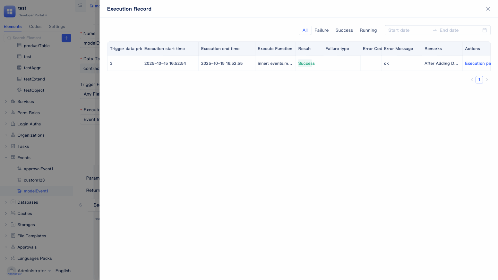

# 事件处理
事件处理是JitAi应用中的自动化机制，当特定情况发生时（如数据变化、审批状态变更等），系统会自动执行预设的业务逻辑。简单来说，就是"当...时，自动做..."的响应机制，帮助开发者构建事件驱动的应用系统。

JitAi支持`模型事件`、`审批事件`、`自定义事件`和`AI相关事件`等多种类型，可在函数逻辑、数据变化、审批流转、ai-assistant/Agent运行时触发，满足不同业务场景的自动化需求。

## 事件创建 {#event-create}
在JitAi开发环境中创建事件非常简单，系统提供了可视化的创建方式帮助开发者快速配置各种事件。

在开发区元素树中点击搜索框旁的 `+` 按钮，选择 `事件` 并根据业务需求选择具体事件类型（如模型事件、审批事件、自定义事件或AI相关事件），填写事件基本信息并完成相关配置即可创建事件。

## 模型事件 {#model-events}
模型事件是最常用的事件类型，当数据表中的数据发生变化（新增、修改、删除）时，系统会自动执行预设的业务逻辑。比如用户信息更新后自动发送通知、订单状态改变后更新库存等，让数据变化能够自动触发相关的业务处理。

### 7种触发时机
JitAi支持7种模型事件触发时机，开发者可根据业务需求选择最适合的时机。

- **新增数据之前**：在数据写入数据库前执行。常用于数据预处理、字段自动填充、数据验证等场景，确保数据合规后再入库。
- **新增数据之后**：在数据成功写入数据库后执行。适用于消息通知、统计更新、关联数据同步等场景，实现数据新增后的自动响应。
- **更新数据之前**：在数据更新操作执行前触发。可用于变更记录、数据备份、权限校验等，保障数据安全和合规。
- **更新数据之后**：在数据成功更新后执行。常见于状态通知、缓存刷新、触发后续流程等场景，确保数据变更后的业务处理及时到位。
- **删除数据之前**：在数据删除操作执行前触发。适用于关联数据清理、删除权限检查、数据备份等，防止误删和数据丢失。
- **删除数据之后**：在数据成功删除后执行。可用于清理缓存、通知相关用户、统计数据更新等，保证数据删除后的系统一致性。
- **任意写操作后**：在任何增、删、改操作完成后都会触发。适合用于通用的数据变更监控、审计日志等场景，实现对所有数据变动的统一追踪和记录。

### 任意/指定字段触发
JitAi提供两种触发字段配置方式，开发者可根据实际业务场景灵活选择：

- **所有字段**：只要模型中任意字段发生变更，事件都会被触发。适用于需要对所有数据变动进行响应的场景。
- **指定字段**：仅当所选字段发生变更时才会触发事件。适合只需关注特定字段变更的业务需求，能有效减少无关事件的触发，提高系统效率。

### 满足筛选条件时触发
支持为事件设置筛选条件。仅当变更数据满足设定的筛选条件时，事件才会被触发。若未设置筛选条件，则默认所有数据变更均会触发事件。通过合理配置筛选条件，可以精准控制事件的触发范围，提升系统性能和业务灵活性。

### 配置过程演示

在`新建模型事件`弹窗中，依次配置事件名称、目标数据模型、触发时机、触发字段、筛选条件、执行函数和异步设置等参数，完成配置后即可创建事件并进入可视化编辑器。

在可视化编辑器下方编辑事件内执行函数。例如当模型A新增数据后，希望可以推送消息通知，就可以参考下面配置。

添加一条基础语句，点击找到`服务`，在右侧列表中找到`消息服务`，在二级列表中选择`消息通知`，设置参数。

## 审批事件 {#approval-events}
审批事件专门用于审批流程的自动化处理，当审批状态发生变化时（如提交、通过、拒绝、转交等），系统会自动执行相应的业务逻辑。比如审批通过后自动发放权限、审批拒绝后通知申请人等，让审批流程更加智能和高效。

### 3种触发时机
JitAi为审批事件提供了3种触发时机，开发者可根据审批流程的业务需求选择适合的触发点：

- **审批状态变更**：当审批记录的整体状态发生改变时触发（如从"待审批"变为"已通过"或"已拒绝"）。适用于需要跟踪审批最终结果的业务场景，如状态同步、结果通知、后续流程启动等。

- **审批节点变更**：当审批流程在不同审批节点之间流转时触发（如从第一级审批人流转到第二级审批人）。适合需要监控审批进度的场景，如节点到达提醒、审批人变更通知、流程进度追踪等。

- **审批处理后触发**：在每次审批操作完成后立即触发（包括通过、拒绝、转交等任何审批动作）。适用于需要实时响应每个审批动作的场景，如操作日志记录、即时消息推送、数据同步等。

### 配置过程演示

在`新建审批事件`弹窗中，依次配置事件名称、目标审批流程、触发时机、执行函数和异步设置等参数，完成配置后即可创建事件并进入详细配置页面。

在可视化编辑器中，如果设置审批状态变更触发消息通知，可以参照上述配置。

## 自定义事件 {#custom-events}
自定义事件提供了最大的灵活性，允许开发者根据特定业务需求声明自己的事件。不像模型事件和审批事件有固定的触发条件，自定义事件可以在任何函数逻辑中触发，适用于复杂的业务场景编排和模块间的通信。

### 事件声明配置
自定义事件的使用流程如下：首先需要在服务元素中声明事件，随后通过事件元素进行订阅和执行。

开发者需先创建一个服务元素，并在其中编写相关的业务函数（例如在A表中新增一条数据）。
点击右上角的切换图标，进入代码编辑页面。

在服务的`e.json`配置文件中，添加事件声明列表`eventDescs`。每个事件需包含`name`（事件名称）、`title`（标题）、`desc`（描述）属性。

### 在函数逻辑中触发事件
在函数逻辑中需要添加语句触发自定义事件。

在服务的`service.py`函数逻辑中，使用`app.event.publish` 触发事件，其中参数`sender`表示事件的发送者，通常sender为函数路径，`args`用于传递参数。

### 订阅事件
需要创建一个自定义事件元素去订阅服务函数中声明的事件。

在`新建自定义事件`弹窗中，选择已声明的事件，配置执行函数和异步设置等参数，完成创建后进入详细配置页面。

## ai-assistant事件 {#ai-assistant-events}
ai-assistant的各节点运行时可触发一些事件，我们可以通过订阅该事件在助理运行过程的关键环节中插入一些业务处理逻辑。

### 触发时机
- **助理运行前**：助理开始运行前触发，携带的参数是用户输入。
- **助理运行后**：助理运行完成后触发，没有参数。
- **到达节点时**：AI Agent节点、函数调用节点、条件分支节点及多任务执行节点在到达节点时触发。前提是需要节点[开启触发后端事件](../ai-assitant/ai-assistant-event#backend-node-events)。携带的参数是节点上配置的`到达节点事件输出参数`。
- **节点执行后**：事件类型是：afterNodeRun；AI Agent节点、函数调用节点、条件分支节点及多任务执行节点执行后触发。前提是需要节点开启触发后端事件。携带的参数是节点上配置的`节点执行后输出参数`。

### 订阅事件
需要创建一个ai-assistant事件元素去订阅。

在IDE中点击 `+` -> `事件` -> `ai-assistant事件`，打开事件配置窗口，填写事件配置信息。

## Agent工具调用事件 {#agent-tool-call-events}
AI Agent在调用工具时，我们可以通过订阅该事件在Agent运行过程中插入一些业务处理逻辑。前提是工具需要开启<a href="../ai-agent#ai-agent-tool-configuration">触发事件</a>。

### 触发时机
- **工具调用前**：在工具调用前触发。
- **工具调用后**：在工具调用后触发。

事件携带的参数是字典(JitDict)类型，有以下属性：
- **toolName**：工具名称，如："services.ASvc.func1"。在事件处理逻辑中，开发者需要根据工具名称来做对应的处理。
- **args**：参数，如果是工具调用前事件，且开启了`事件消息中包含数据`，args的值就是调用工具的入参；如果是工具调用后事件，且开启了`事件消息中包含数据`，args的值就是工具的返回值。

### 订阅事件
需要创建一个Agent工具事件元素去订阅。

在IDE中点击 `+` -> `事件` -> `Agent工具事件`，打开事件配置窗口，填写事件配置信息。

## 服务函数替换事件内函数 {#service-function-replace-event-internal-function}
创建事件时默认执行函数是事件内函数，函数逻辑位于事件元素的代码中，JitAi也支持用服务函数封装事件的执行函数逻辑。

在事件的可视化编辑器中，切换执行函数为`服务函数`，可以选择自定义的服务函数，前提是函数的参数结构满足下面的参数说明。

## 事件启用 {#event-enable}
事件创建后需要手动开启才能正常工作，通过开关控制可以灵活管理事件的启用状态。

所有事件在创建后默认处于关闭状态，开发者需要在事件详情页面手动打开开关按钮，事件才能正常触发执行。当事件开关处于关闭状态时，即使满足触发条件，事件也不会被执行。

## 事件同步/异步执行 {#event-sync-async-execution}
JitAi支持同步和异步两种事件执行模式，开发者可根据业务场景和性能需求灵活选择。

**同步执行（默认）**：事件函数在触发操作的主流程中执行，如果事件执行失败会影响主业务流程。适用于必须确保完成的关键业务逻辑。

**异步执行**：事件函数在后台独立执行，不会阻塞主业务流程，即使事件执行失败也不会影响触发操作的正常完成。适用于消息通知、日志记录、统计更新等耗时或非关键性操作。

:::tip 性能优化建议
对于耗时较长的事件处理（如发送邮件、调用外部API、大数据量计算等），建议开启异步执行模式，以避免影响用户体验和系统响应速度。
:::

## 事件执行记录 {#event-execution-records}
JitAi提供完善的事件执行监控和调试功能，帮助开发者快速定位和解决事件执行过程中的问题。

在事件详情页面点击右上方的`执行记录`按钮，可以查看该事件的所有历史执行。

执行记录页面提供了丰富的筛选功能，支持按执行状态（成功、失败、执行中）和时间范围过滤记录，方便开发者快速定位特定的执行情况。

点击单条记录的`执行路径`按钮，可以查看详细的执行日志和调用链路，包括每个步骤的执行状态、耗时信息和错误详情，帮助开发者快速诊断和解决问题。

## 全代码查看/编辑 {#full-code-view-edit}
事件函数可以在全代码模式下查看和编辑，与可视化编辑实时同步。

在事件的可视化编辑器中，点击右上角的切换按钮，即可进入到代码区域查看，也可以编辑代码，完成后点击右上角`保存`即可生效。