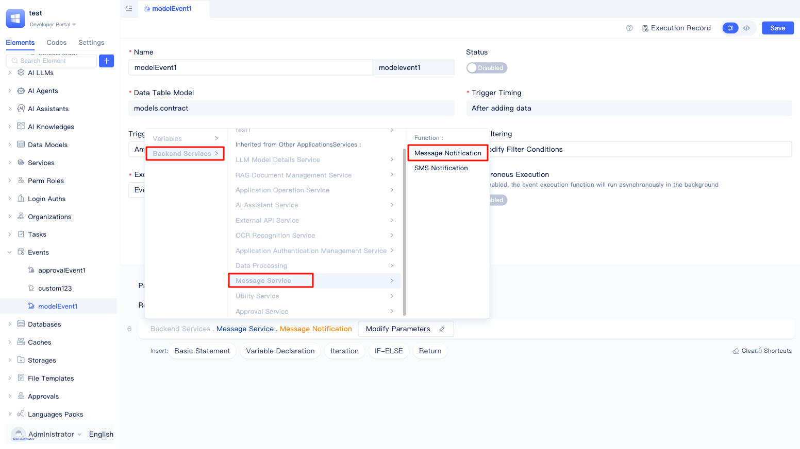
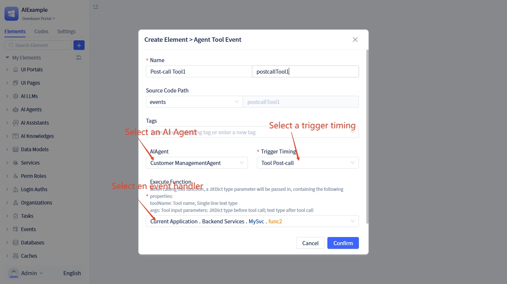

# Event Handling

Event handling is an automation mechanism within JitAI applications. When specific conditions occur—such as data changes or approval status updates—the system automatically executes predefined business logic. In essence, it's a "when...then automatically do..." response mechanism that enables developers to build event-driven application systems.

JitAI supports multiple event types, including `Model Events`, `Approval Events`, `Custom Events`, and `AI-related Events`. These can be triggered during function execution, data modifications, approval workflows, and AI Assistant/Agent runtime, addressing diverse business automation needs.

## Creating events {#creating-events}

Creating events in the JitAI development environment is straightforward. The system provides a visual interface that helps developers quickly configure various event types.

In the development area element tree, click the `+` button next to the search box, select `Event`, and choose the specific event type based on your business requirements (Model Events, Approval Events, Custom Events, or AI-related Events). Fill in the basic event information and complete the relevant configuration to create the event.

## Model events {#model-events}

Model events are the most commonly used event type. When data in a table changes—through creation, updates, or deletion—the system automatically executes predefined business logic. Examples include sending notifications after user information updates or adjusting inventory after order status changes, enabling data changes to automatically trigger related business processes.

### Seven trigger timings {#seven-trigger-timings}

JitAI supports seven model event trigger timings, allowing developers to select the most appropriate timing based on business requirements:

- **Before data creation**: Executed before data is written to the database. Commonly used for data preprocessing, automatic field population, and validation to ensure data compliance before database entry.
- **After data creation**: Executed after data is successfully written to the database. Suitable for message notifications, statistics updates, and associated data synchronization, implementing automatic responses following data creation.
- **Before data update**: Triggered before data update operations execute. Useful for change tracking, data backup, and permission verification, ensuring data security and compliance.
- **After data update**: Executed after data is successfully updated. Common in scenarios like status notifications, cache refreshing, and triggering subsequent processes, ensuring timely business processing after data changes.
- **Before data deletion**: Triggered before data deletion operations execute. Suitable for associated data cleanup, deletion permission checks, and data backup, preventing accidental deletion and data loss.
- **After data deletion**: Executed after data is successfully deleted. Used for cache cleanup, notifying related users, and updating statistics, ensuring system consistency after data deletion.
- **After any write operation**: Triggered after any create, delete, or update operation completes. Ideal for general data change monitoring and audit logging, implementing unified tracking and recording of all data modifications.

### Triggering on any or specific fields {#triggering-on-any-or-specific-fields}

JitAI provides two trigger field configuration methods, allowing developers to flexibly choose based on actual business scenarios:

- **All fields**: The event triggers whenever any field in the model changes. Suitable for scenarios requiring responses to all data modifications.
- **Specific fields**: The event triggers only when selected fields change. Ideal for business requirements focusing on specific field changes, effectively reducing irrelevant event triggers and improving system efficiency.

### Triggering when filter conditions are met {#triggering-when-filter-conditions-are-met}

Events support filter condition configuration. Events trigger only when changed data meets the specified filter conditions. If no filter conditions are set, all data changes trigger events by default. Through proper filter condition configuration, you can precisely control event trigger scope and improve system performance and business flexibility.

### Configuration process demonstration {#configuration-process-demonstration-model}

In the `New Model Event` dialog, configure parameters in sequence: event name, target data model, trigger timing, trigger fields, filter conditions, execution function, and async settings. After completing the configuration, create the event and enter the visual editor.

Edit the execution function within the event using the visual editor below. For example, to push message notifications after data is added to model A, refer to the configuration below.

Add a basic statement, click to find `Service`, locate `Message Service` in the right panel, select `Message Notification` from the secondary list, and configure the parameters.

## Approval events {#approval-events}

Approval events are specifically designed for automated approval workflow processing. When approval status changes—such as submission, approval, rejection, or transfer—the system automatically executes corresponding business logic. Examples include automatically granting permissions after approval or notifying applicants after rejection, making approval workflows more intelligent and efficient.

### Three trigger timings {#three-trigger-timings}

JitAI provides three trigger timings for approval events, allowing developers to select appropriate trigger points based on approval workflow requirements:

- **Approval status change**: Triggered when an approval record's overall status changes (e.g., from "Pending Approval" to "Approved" or "Rejected"). Suitable for scenarios tracking final approval results, such as status synchronization, result notifications, and subsequent process initiation.

- **Approval node change**: Triggered when the approval workflow transitions between different nodes (e.g., from first-level approver to second-level approver). Ideal for scenarios monitoring approval progress, such as node arrival reminders, approver change notifications, and workflow progress tracking.

- **After approval processing**: Triggered immediately after each approval operation completes (including any approval action such as approval, rejection, or transfer). Suitable for scenarios requiring real-time response to each approval action, such as operation log recording, instant message pushing, and data synchronization.

### Configuration process demonstration {#configuration-process-demonstration-approval}

In the `New Approval Event` dialog, configure parameters in sequence: event name, target approval workflow, trigger timing, execution function, and async settings. After completing the configuration, create the event and enter the detailed configuration page.

In the visual editor, to configure approval status changes to trigger message notifications, refer to the configuration above.

## Custom events {#custom-events}

Custom events provide maximum flexibility, enabling developers to declare their own events based on specific business requirements. Unlike model and approval events with fixed trigger conditions, custom events can be triggered within any function logic, making them suitable for complex business scenario orchestration and inter-module communication.

### Configuring event declarations {#configuring-event-declarations}

The workflow for custom events is as follows: first, declare events in service elements, then subscribe to and execute them through event elements.

Developers must first create a service element and write related business functions (e.g., adding a record to table A). Click the switch icon in the upper right corner to enter the code editing interface.

In the service's `e.json` configuration file, add the event declaration list `eventDescs`. Each event must include `name` (event name), `title` (title), and `desc` (description) attributes.

### Triggering events in function logic {#triggering-events-in-function-logic}

Add statements in function logic to trigger custom events.

In the `service.py` service function logic, import `from events.Meta import JitEvent` and use `JitEvent.publish` to trigger the event. The `sender` parameter represents the event sender (usually the function path), and `args` is used to pass parameters.

### Subscribing to custom events {#subscribing-to-custom-events}

Create a custom event element to subscribe to events declared in service functions.

In the `New Custom Event` dialog, select the declared event, configure the execution function and async settings, then enter the detailed configuration page after creation.

## AI Assistant events {#ai-assistant-events}

Various nodes in AI Assistant can trigger events during runtime. Subscribe to these events to insert business processing logic at key points during assistant execution.

### Trigger timings {#ai-assistant-trigger-timings}

- **Before assistant run**: Triggered before the assistant starts running, with user input as the parameter.
- **After assistant run**: Triggered after the assistant completes running, with no parameters.
- **Node arrival**: Triggered when AI Agent nodes, function call nodes, conditional branch nodes, and multi-task execution nodes are reached. The node must enable backend event triggering. For the enabling method, see: <a href="../ai-assistant/create-ai-assistant#node-runtime-events" target="_blank">Node Runtime Events</a>. The parameter is the `Node Arrival Event Output Parameter` configured on the node.
- **After node execution**: Triggered after AI Agent nodes, function call nodes, conditional branch nodes, and multi-task execution nodes complete execution. The node must enable backend event triggering. The parameter is the `After Node Execution Output Parameter` configured on the node.

### Subscribing to AI Assistant events {#subscribing-to-ai-assistant-events}

Create an AI Assistant event element to subscribe to these events.

In the IDE, click `+` → `Event` → `AI Assistant Event`, open the event configuration window, and complete the event configuration information.

## Agent tool call events {#agent-tool-call-events}

When AI Agent calls tools, subscribe to these events to insert business processing logic during Agent execution. The tool must enable <a href="../ai-agent#ai-agent-tool-configuration">event triggering</a>.

### Trigger timings {#agent-tool-trigger-timings}

- **Tool pre-call**: Triggered before the tool is called.
- **Tool post-call**: Triggered after the tool is called.

The event parameters are of dictionary (JitDict) type with the following attributes:
- **toolName**: Tool name, such as "services.ASvc.func1". In event processing logic, developers must perform corresponding processing based on the tool name.
- **args**: Parameters. For pre-call events with `Include data in event message` enabled, args contains the input arguments for calling the tool. For post-call events with this option enabled, args contains the tool's return value.

### Subscribing to Agent tool events {#subscribing-to-agent-tool-events}

Create an Agent tool event element to subscribe to these events.

In the IDE, click `+` → `Event` → `Agent Tool Event`, open the event configuration window, and complete the event configuration information.

## Replacing event internal functions with service functions {#replacing-event-internal-functions-with-service-functions}

When creating events, the default execution function is the event internal function, with logic located in the event element's code. JitAI also supports using service functions to encapsulate event execution logic.

In the event's visual editor, switch the execution function to `Service Function` and select custom service functions, provided the function's parameter structure meets the specifications below.

## Enabling events {#enabling-events}

Events must be manually enabled after creation to function properly. The enable status can be flexibly managed through switch controls.

All events are disabled by default after creation. Developers must manually turn on the switch button on the event details page for the event to trigger and execute normally. When the event switch is off, the event will not execute even if trigger conditions are met.

## Executing events synchronously or asynchronously {#executing-events-synchronously-or-asynchronously}

JitAI supports both synchronous and asynchronous event execution modes. Developers can flexibly choose based on business scenarios and performance requirements.

**Synchronous execution (default)**: Event functions execute within the main flow of the triggering operation. If event execution fails, it affects the main business flow. Suitable for critical business logic that must be ensured to complete.

**Asynchronous execution**: Event functions execute independently in the background without blocking the main business flow. Even if event execution fails, it won't affect the normal completion of the triggering operation. Suitable for time-consuming or non-critical operations such as message notifications, log recording, and statistics updates.

:::tip Performance optimization recommendations
For time-consuming event processing (such as sending emails, calling external APIs, or large-volume calculations), it's recommended to enable asynchronous execution mode to avoid affecting user experience and system response speed.
:::

## Viewing event execution records {#viewing-event-execution-records}

JitAI provides comprehensive event execution monitoring and debugging capabilities to help developers quickly locate and resolve issues during event execution.

Click the `Execution Records` button in the upper right corner of the event details page to view all historical executions of the event.

The execution records page provides rich filtering capabilities, supporting filtering by execution status (success, failure, executing) and time range, making it convenient for developers to quickly locate specific execution situations.

Click the `Execution Path` button for individual records to view detailed execution logs and call chains, including execution status, timing information, and error details for each step, helping developers quickly diagnose and resolve issues.

## Viewing and editing full code {#viewing-and-editing-full-code}

Event functions can be viewed and edited in full code mode, with real-time synchronization with visual editing.

In the event's visual editor, click the switch button in the upper right corner to enter the code area for viewing. You can also edit the code; after completion, click `Save` in the upper right corner to apply changes.