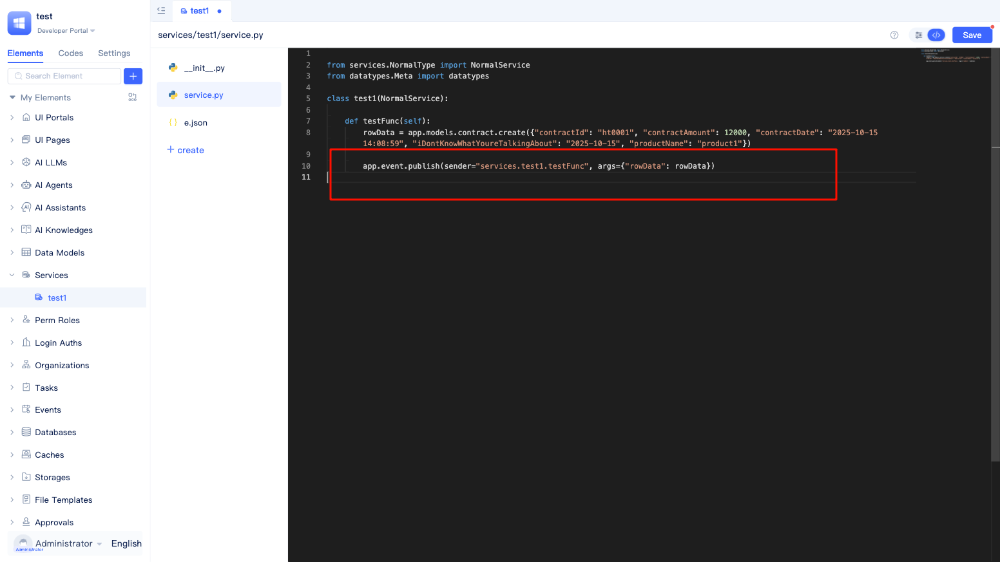
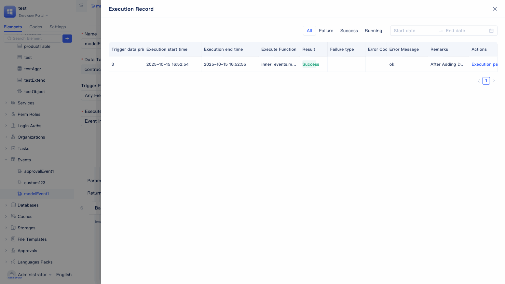
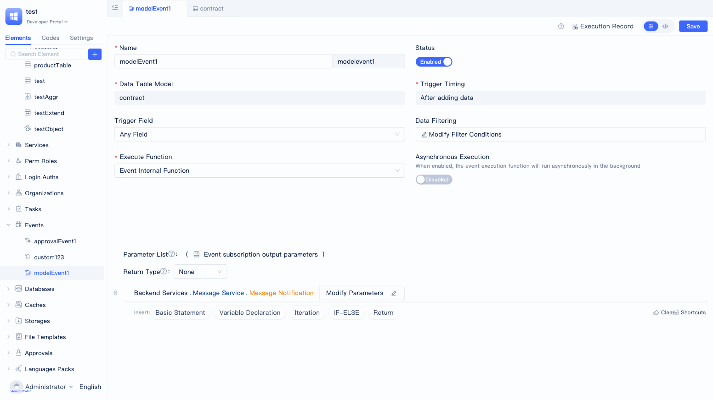

# Event Handling
Event handling is an automation mechanism in JitAi applications. When specific situations occur (such as data changes, approval status changes, etc.), the system automatically executes preset business logic. Simply put, it's a "when...then automatically do..." response mechanism that helps developers build event-driven application systems.

JitAi supports multiple types including `Model Events`, `Approval Events`, `Custom Events`, and `AI-related Events`, which can be triggered during function logic execution, data changes, approval workflows, and ai-assistant/Agent runtime to meet different business scenario automation needs.

## Event Creation {#event-create}
Creating events in the JitAi development environment is very simple. The system provides a visual creation approach to help developers quickly configure various events.

In the development area element tree, click the `+` button next to the search box, select `Event` and choose the specific event type based on business requirements (such as Model Events, Approval Events, Custom Events, or AI-related Events), fill in the basic event information and complete the relevant configuration to create the event.

## Model Events {#model-events}
Model events are the most commonly used event type. When data in a data table changes (create, update, delete), the system automatically executes preset business logic. For example, automatically sending notifications after user information updates, updating inventory after order status changes, etc., allowing data changes to automatically trigger related business processing.

### 7 Trigger Timings {#7-trigger-timings}
JitAi supports 7 model event trigger timings, and developers can choose the most suitable timing based on business requirements.

- **Before Data Creation**: Executed before data is written to the database. Commonly used for data preprocessing, automatic field filling, data validation, etc., ensuring data compliance before entering the database.
- **After Data Creation**: Executed after data is successfully written to the database. Suitable for message notifications, statistics updates, associated data synchronization, etc., implementing automatic responses after data creation.
- **Before Data Update**: Triggered before data update operations are executed. Can be used for change records, data backup, permission verification, etc., ensuring data security and compliance.
- **After Data Update**: Executed after data is successfully updated. Common in scenarios like status notifications, cache refresh, triggering subsequent processes, etc., ensuring timely business processing after data changes.
- **Before Data Deletion**: Triggered before data deletion operations are executed. Suitable for associated data cleanup, deletion permission checks, data backup, etc., preventing accidental deletion and data loss.
- **After Data Deletion**: Executed after data is successfully deleted. Can be used for cache cleanup, notifying related users, statistics data updates, etc., ensuring system consistency after data deletion.
- **After Any Write Operation**: Triggered after any create, delete, or update operation is completed. Suitable for general data change monitoring, audit logs, etc., implementing unified tracking and recording of all data changes.

### Any/Specific Field Triggers {#any-specific-field-triggers}
JitAi provides two trigger field configuration methods, and developers can flexibly choose based on actual business scenarios:

- **All Fields**: The event will be triggered as long as any field in the model changes. Suitable for scenarios that need to respond to all data changes.
- **Specific Fields**: The event will only be triggered when the selected fields change. Suitable for business requirements that only need to focus on specific field changes, effectively reducing irrelevant event triggers and improving system efficiency.

### Trigger When Filter Conditions Are Met {#trigger-when-filter-conditions-are-met}
Supports setting filter conditions for events. Events will only be triggered when the changed data meets the set filter conditions. If no filter conditions are set, all data changes will trigger events by default. Through reasonable configuration of filter conditions, you can precisely control the trigger scope of events and improve system performance and business flexibility.

### Configuration Process Demonstration {#configuration-process-demonstration-model}

In the `New Model Event` dialog, configure parameters such as event name, target data model, trigger timing, trigger fields, filter conditions, execution function, and async settings in sequence. After completing the configuration, you can create the event and enter the visual editor.

Edit the execution function within the event in the visual editor below. For example, when you want to push message notifications after model A adds data, you can refer to the configuration below.

Add a basic statement, click to find `Service`, find `Message Service` in the right list, select `Message Notification` in the secondary list, and set parameters.

## Approval Events {#approval-events}
Approval events are specifically designed for automated processing of approval workflows. When approval status changes (such as submission, approval, rejection, transfer, etc.), the system automatically executes corresponding business logic. For example, automatically granting permissions after approval passes, notifying applicants after approval rejection, etc., making approval workflows more intelligent and efficient.

### 3 Trigger Timings {#3-trigger-timings}
JitAi provides 3 trigger timings for approval events, and developers can choose suitable trigger points based on the business requirements of approval workflows:

- **Approval Status Change**: Triggered when the overall status of an approval record changes (such as from "Pending Approval" to "Approved" or "Rejected"). Suitable for business scenarios that need to track final approval results, such as status synchronization, result notifications, subsequent process initiation, etc.

- **Approval Node Change**: Triggered when the approval workflow flows between different approval nodes (such as from first-level approver to second-level approver). Suitable for scenarios that need to monitor approval progress, such as node arrival reminders, approver change notifications, workflow progress tracking, etc.

- **After Approval Processing**: Triggered immediately after each approval operation is completed (including any approval actions such as approval, rejection, transfer, etc.). Suitable for scenarios that need real-time response to each approval action, such as operation log recording, instant message pushing, data synchronization, etc.

### Configuration Process Demonstration {#configuration-process-demonstration-approval}

In the `New Approval Event` dialog, configure parameters such as event name, target approval workflow, trigger timing, execution function, and async settings in sequence. After completing the configuration, you can create the event and enter the detailed configuration page.

In the visual editor, if you want to set approval status change to trigger message notifications, you can refer to the above configuration.

## Custom Events {#custom-events}
Custom events provide maximum flexibility, allowing developers to declare their own events based on specific business requirements. Unlike model events and approval events that have fixed trigger conditions, custom events can be triggered in any function logic, suitable for complex business scenario orchestration and inter-module communication.

### Event Declaration Configuration {#event-declaration-configuration}
The usage flow for custom events is as follows: first, you need to declare events in service elements, then subscribe and execute through event elements.

Developers need to first create a service element and write related business functions in it (for example, adding a record to table A).
Click the switch icon in the upper right corner to enter the code editing page.

In the service's `e.json` configuration file, add the event declaration list `eventDescs`. Each event needs to include `name` (event name), `title` (title), and `desc` (description) attributes.

### Triggering Events in Function Logic {#triggering-events-in-function-logic}
You need to add statements in function logic to trigger custom events.

In the service's `service.py` function logic, use `app.event.publish` to trigger events, where the parameter `sender` represents the event sender (usually the function path), and `args` is used to pass parameters.

### Subscribing to Events {#subscribing-to-custom-events}
You need to create a custom event element to subscribe to events declared in service functions.

In the `New Custom Event` dialog, select the declared event, configure parameters such as execution function and async settings, and enter the detailed configuration page after creation.

## AI-Assistant Events {#ai-assistant-events}
Various nodes in ai-assistant can trigger some events during runtime. We can subscribe to these events to insert business processing logic at key points during assistant execution.

### Trigger Timings {#ai-assistant-trigger-timings}
- **Before Assistant Run**: Triggered before the assistant starts running, with user input as the parameter.
- **After Assistant Run**: Triggered after the assistant completes running, with no parameters.
- **Node Arrival**: Triggered when AI Agent nodes, function call nodes, conditional branch nodes, and multi-task execution nodes are reached. The prerequisite is that the node needs to enable backend event triggering. For enabling method, see: <a href="../ai-assitant/create-ai-assistant#node-runtime-events" target="_blank">Node Runtime Events</a>. The parameter carried is the `Node Arrival Event Output Parameter` configured on the node.
- **After Node Execution**: Event type is: afterNodeRun; triggered after AI Agent nodes, function call nodes, conditional branch nodes, and multi-task execution nodes complete execution. The prerequisite is that the node needs to enable backend event triggering. The parameter carried is the `After Node Execution Output Parameter` configured on the node.

### Subscribing to Events {#subscribing-to-ai-assistant-events}
You need to create an ai-assistant event element to subscribe.

In the IDE, click `+` -> `Event` -> `ai-assistant Event`, open the event configuration window, and fill in the event configuration information.

## Agent Tool Call Events {#agent-tool-call-events}
When AI Agent calls tools, we can subscribe to this event to insert business processing logic during Agent execution. The prerequisite is that the tool needs to enable <a href="../ai-agent#ai-agent-tool-configuration">trigger events</a>.

### Trigger Timings {#agent-tool-trigger-timings}
- **Before Tool Call**: Triggered before tool call.
- **After Tool Call**: Triggered after tool call.

The parameters carried by the event are of dictionary (JitDict) type with the following attributes:
- **toolName**: Tool name, such as: "services.ASvc.func1". In event processing logic, developers need to perform corresponding processing based on the tool name.
- **args**: Parameters. If it's a before tool call event and `Include data in event message` is enabled, the args value is the input parameters for calling the tool; if it's an after tool call event and `Include data in event message` is enabled, the args value is the return value of the tool.

### Subscribing to Events {#subscribing-to-agent-tool-events}
You need to create an Agent tool event element to subscribe.

In the IDE, click `+` -> `Event` -> `Agent Tool Event`, open the event configuration window, and fill in the event configuration information.

## Service Function Replacing Event Internal Function {#service-function-replace-event-internal-function}
When creating events, the default execution function is the event internal function, with function logic located in the event element's code. JitAi also supports using service functions to encapsulate event execution function logic.

In the event's visual editor, switch the execution function to `Service Function`, and you can select custom service functions, provided that the function's parameter structure meets the parameter specifications below.

## Event Enabling {#event-enable}
Events need to be manually enabled after creation to work properly, and the enable status can be flexibly managed through switch controls.

All events are in a disabled state by default after creation. Developers need to manually turn on the switch button on the event details page for the event to trigger and execute normally. When the event switch is in the off state, the event will not be executed even if trigger conditions are met.

## Event Synchronous/Asynchronous Execution {#event-sync-async-execution}
JitAi supports both synchronous and asynchronous event execution modes, and developers can flexibly choose based on business scenarios and performance requirements.

**Synchronous Execution (Default)**: Event functions execute in the main flow of the triggering operation. If event execution fails, it will affect the main business flow. Suitable for critical business logic that must be ensured to complete.

**Asynchronous Execution**: Event functions execute independently in the background without blocking the main business flow. Even if event execution fails, it will not affect the normal completion of the triggering operation. Suitable for time-consuming or non-critical operations such as message notifications, log recording, statistics updates, etc.

:::tip Performance Optimization Recommendations
For time-consuming event processing (such as sending emails, calling external APIs, large data volume calculations, etc.), it is recommended to enable asynchronous execution mode to avoid affecting user experience and system response speed.
:::

## Event Execution Records {#event-execution-records}
JitAi provides comprehensive event execution monitoring and debugging functions to help developers quickly locate and resolve issues during event execution.

Click the `Execution Records` button in the upper right corner of the event details page to view all historical executions of the event.

The execution records page provides rich filtering functions, supporting filtering records by execution status (success, failure, executing) and time range, making it convenient for developers to quickly locate specific execution situations.

Click the `Execution Path` button for individual records to view detailed execution logs and call chains, including execution status, timing information, and error details for each step, helping developers quickly diagnose and resolve issues.

## Full Code View/Edit {#full-code-view-edit}
Event functions can be viewed and edited in full code mode, with real-time synchronization with visual editing.

In the event's visual editor, click the switch button in the upper right corner to enter the code area for viewing. You can also edit the code, and after completion, click `Save` in the upper right corner to take effect.