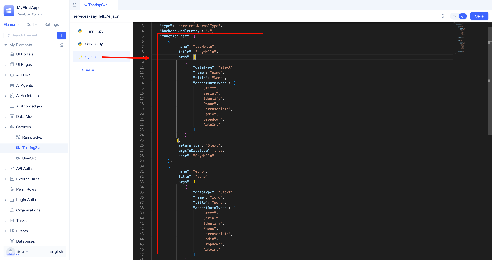

# Service Elements Usage Scenarios

## Where Service Functions Are Used {#where-service-functions-are-used}
Developers can call service functions in all places where function logic can be written, including [page functions](../shell-and-page/component-based-page-development#page-functions), [page events](../shell-and-page/component-based-page-development#page-events), [frontend component event functions](../shell-and-page/component-based-page-development#event-panel), [task functions](./background-tasks#developing-task-execution-functions), [model events](./event-handling#model-events), [approval events](./event-handling#approval-events), [custom events](./event-handling#custom-events), [AI assistant events](./event-handling#ai-assistant-events), [AI Agent tool call events](./event-handling#agent-tool-call-events), and other service functions.

Service functions can also be called by large language models [as AI Agent tools](../ai-agent/agent-tools#agent-calling-service-functions), invoked in [AI assistant function call nodes](../ai-assistant/process-orchestration-node-configuration#function), and exposed to third parties through [API authorization elements](../api-exposure/api-authorization).

## Helping AI Understand Service Functions More Accurately {#help-ai-understand-service-functions}
Each service function has a function declaration in the service element's e.json file, which is a function definition within the functionList. The functionList enables functions to be recognized by the IDE visual editor for visual logic orchestration support, allows functions to be called normally, and enables functions to be understood and used by AI.

Complete and accurate function names, input and output parameter names, and function descriptions enable AI to understand function capabilities and usage more accurately, thereby calling service functions more precisely.

With the help of the visual editor, developers can conveniently fill in function names, define input and output parameters, and function descriptions. The functionList is automatically generated into the service element's e.json file.

:::tip
In the [JAAP specification](../../reference/runtime-platform/JAAP), any element including service elements can define their own functionList.
:::
