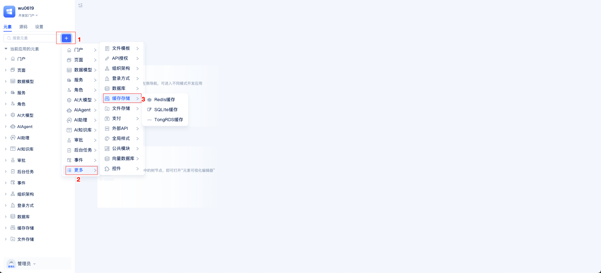
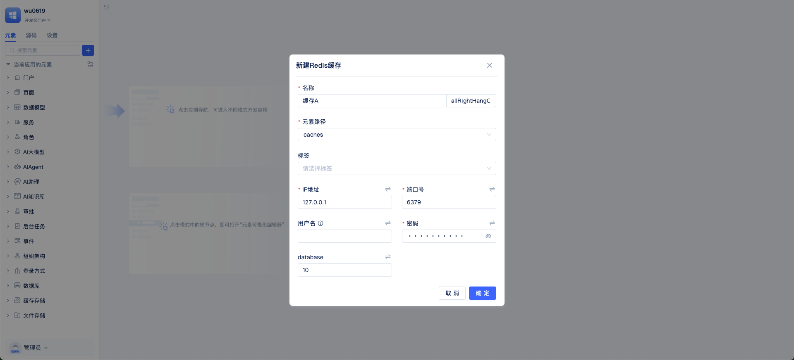
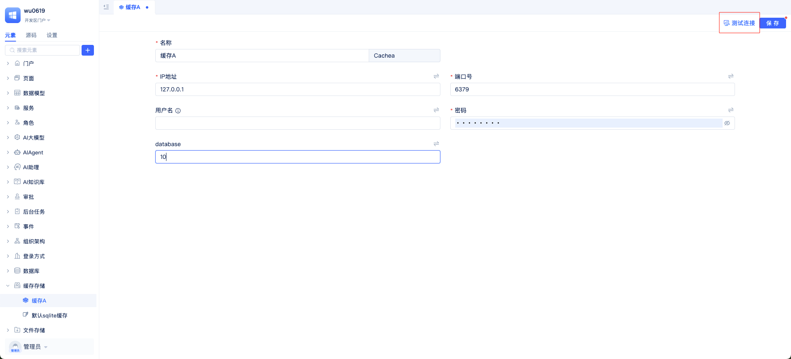
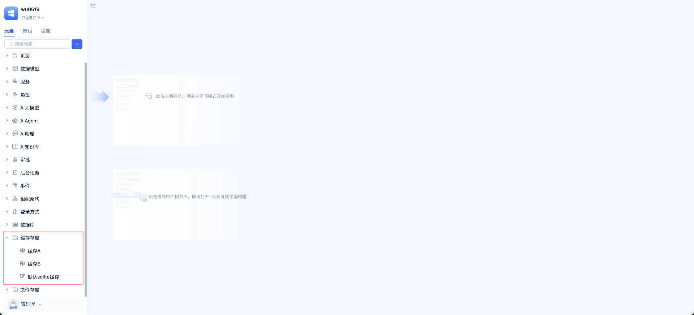

# Cache Configuration and Usage
JitAI supports multiple cache types, including Redis, SQLite, and TongRDS, covering different scenarios from development and testing to production deployment. Caches are suitable for storing frequently accessed data that can tolerate brief inconsistencies, such as user sessions, verification codes, hot configurations, list aggregation results, and rate limiting counters. The system automatically adds key name prefixes for different applications to avoid cross-application conflicts.
Built-in caches are used for "out-of-the-box" development/testing environments: desktop environments default to SQLite, while server environments default to containerized Redis. For production environments, it's recommended to deploy Redis independently and create corresponding cache instances in the application.

## Cache Service Configuration {#cache-service-configuration}
Before configuring caches, first clarify the usage scenario and deployment environment: development/testing can use built-in caches for quick startup, while production environments should use independent Redis.



Open the application's Developer Portal "Element Directory Tree", click `+` -> `More` -> `Cache Storage` in sequence, and select the required cache type (Redis Cache, SQLite Cache, TongRDS Cache).



A parameter configuration panel will appear. Fill in the connection information as prompted and save. For production environments, it's recommended to inject connection parameters through environment variables to avoid writing sensitive information like passwords into the repository. Refer to: [Database Connection Security Configuration](/docs/devguide/data-modeling/manage-database-connections#database-connection-security-configuration).



After creation, you can quickly self-check using the `Test Connection` button in the upper right corner.

## Multi-Cache Service Management {#multi-cache-service-management}
You can create multiple cache instances within the same application, such as `Cache A`, `Cache B`, `Default SQLite Cache`, etc., for different business module needs.



## Cache Programming Interface Usage {#cache-programming-interface-usage}
Getting cache instance:
```python
fullName = "Cache element fullName" # caches.MyRedis / caches.DefaultCache etc.
cache = app.getElement(fullName)  
```

String read/write and expiration:
```python
cache.set("user:1001:name", "John", 3600)   # Write with 1-hour expiration
name = cache.get("user:1001:name")           # Read
cache.expire("user:1001:name", 600)          # Change expiration to 10 minutes
```

Numeric values and counting:
```python
cache.setNumeric("visit_count", 100)
current = cache.getNumeric("visit_count")
next_val = cache.incr("visit_count", 5)
```

Key management:
```python
keys = cache.keys()

exists = cache.exists("user:1001:name")
if exists:
  cache.delete("user:1001:name")
```

Connectivity check:
```python
alive = cache.ping()  # True indicates normal connection
```

For more detailed interface reference:

[Redis Cache](/docs/reference/framework/JitStorage/cache/redis-cache#methods)

[SQLite Cache](/docs/reference/framework/JitStorage/cache/sqlite-cache#methods)

[TongRDS Cache](/docs/reference/framework/JitStorage/cache/tongrds-cache#methods)

