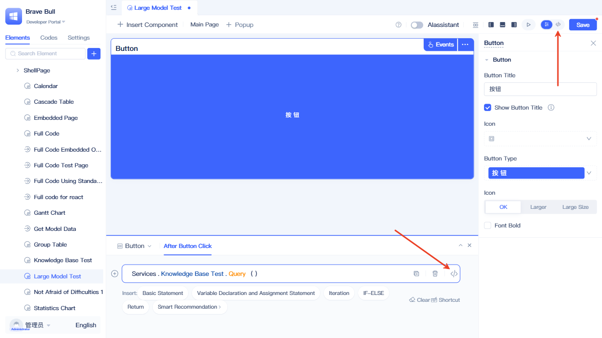

# Calling Service Functions in Pages

Pages can directly invoke backend service functions to perform data queries, business processing, status updates, and other operations. With no need for additional middleware or complex configurations, you can seamlessly handle frontend-backend data interactions using simple syntax, significantly enhancing development efficiency.

## Calling service functions in standard pages {#calling-service-functions-in-standard-pages}


In the visual page editor, select the component where you want to add service functions, then click the `Events` button in the upper-right corner to open the event panel.


In the event panel, add a blank statement and then select `Services` → `Service Function`.



You can view the generated code implementation by clicking the `<>` button in the upper-right corner of the page or the `<>` button next to the current statement.


## Calling service functions in full-code pages {#calling-service-functions-in-full-code-pages}


Calling service functions in full-code pages is more straightforward and direct. Within page class member functions, you can call service functions using the syntax `this.app.services.[ServiceID].[ServiceFunctionName]`. To obtain the service ID, click the dropdown menu next to the corresponding service in the element directory tree, then select `Copy Element ID`.

In addition to calling within page class member functions, you can also call service functions from other contexts. All service function calls are made through the app object: within page class member functions, access the app object via `this.app`; in other contexts, you can obtain it using the following approach:

```typescript
import { getRuntimeApp } from 'jit';
const app = getRuntimeApp();

```
Once you have the app object, you can call service functions.

## Handling complex parameters {#complex-parameter-handling}
For service functions with complex parameters, we recommend first configuring the parameters through the visual interface (such as the event panel), then copying the generated code for use in full-code pages. This approach helps prevent errors that may occur when manually writing complex parameter structures.

Service functions provide pages with powerful backend capability extensions, enabling various custom business scenarios through simple, intuitive syntax. To learn how to create service functions, see [Creating Service Functions](../business-logic-development/creating-service-elements.md).

## Related Documentation

- [Calling Data Model Functions in Pages](./calling-data-model-functions-in-pages) - Learn about data model function calling methods, with syntax completely consistent with service functions
