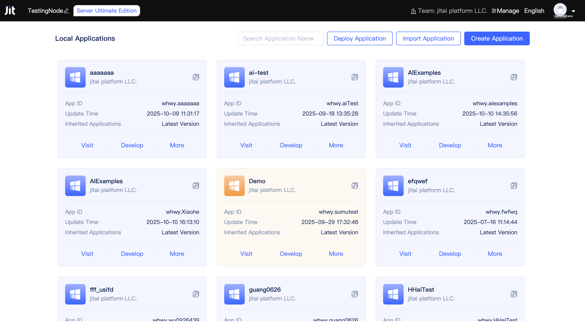
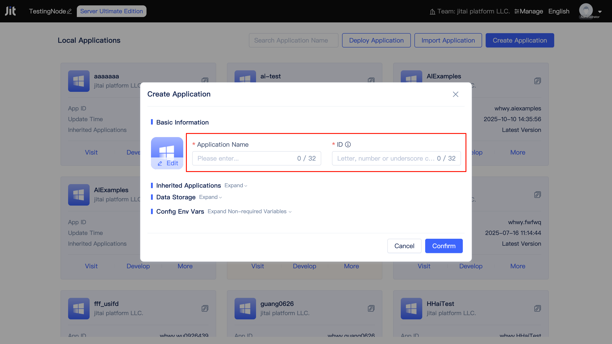
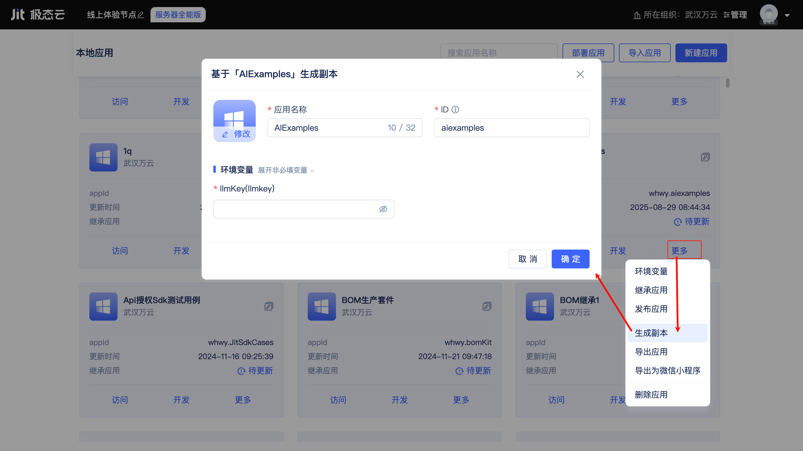
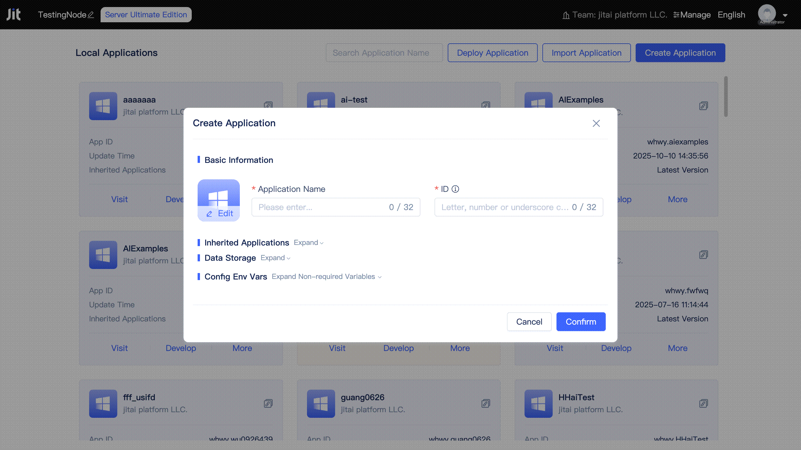

# Creating and Deploying Applications

The [Node Console](../creating-and-publishing-applications/runtime-environment-management#node-local-default-runtime-environment) in the DevOps management tool provides developers with entry points for application creation, import, export, publishing, and deployment, covering the complete lifecycle from project initiation to operations.

## Create First Application {#create-first-application}
Click the `New Application` button in the Node Console to open the new application dialog.

Developers only need to fill in the application name and ID, then click confirm to quickly complete the creation of an application.

## Rapid Development Based on Existing Applications {#based-on-existing-application-quick-development}
To facilitate developers in quickly developing customizations based on existing applications, JitAi provides two approaches: application inheritance and creating copies.
  
### Application Inheritance
Inheritance allows an application to possess the functional modules of the inherited application. Every newly created application inherits two official application templates by default: JIT Development Framework and JIT Development Tools. The former is JitAi's official development framework, providing rich out-of-the-box elements, while the latter provides visual and full-code dual-mode development tools for the application development process. In addition to the default inherited official application templates, developers can continue to add other applications to inherit.

After developers click to expand the `Inherit Applications` collapsible panel and click the `Add Application Template` button on the right, the application template list will open. Developers can view publicly available or organization-internal application templates in the list, and click on cards to add them to the inheritance list. Added application templates can also be removed by clicking the `Remove` button on the right, though the JIT Development Framework does not support removal operations.

:::tip

Developers of inherited applications will continuously release new versions to fix bugs, add new features, etc. Developers can check for new versions and update them in the [Node Console](../creating-and-publishing-applications/runtime-environment-management#node-local-default-runtime-environment) or [Application Settings](../development-tool-and-publish-service/jitai-visual-development-tools#application-settings). For detailed version management, please refer to [Application Publishing and Updates](../creating-and-publishing-applications/publishing-and-updating-applications#application-version-updates).

:::

In JitAi development tools, developers can both develop new elements and view elements inherited from inherited applications, and override individual elements.

Developers can click the `Show Inherited Applications` button to find elements from inherited applications at the bottom of the element directory tree. Clicking on an element will open the element editor on the right. Inherited elements do not support direct editing, but can be overridden by clicking the `Override` button in the upper right corner of the editor.

### Create Copy
The inheritance approach only allows overriding elements of specified parent applications. If you want to modify an application based on source code without damaging the original application, you can create a copy.

The created copy is a completely new application. Developers need to fill in a new application name and ID, and any modifications to the copy will not affect the original application.

## Data Storage and Environment Variable Configuration {#data-storage-and-environment-variable-configuration}
When creating a new application, JitAi uses local disk as the default file storage method for the application. The desktop version uses SQLite as the default database and cache for applications, while the server version uses MySQL as the default database and Redis as the default cache. Developers can modify the default configuration when creating applications to connect to their specified OSS storage, database, and cache services.

Taking MySQL database connection as an example, developers prepare their own MySQL service and fill in the connection information (developers need to ensure the MySQL service is accessible).

The official base framework encapsulates Alibaba Cloud OCR recognition and Amap API, with the required API key information defined as environment variables. PDF conversion and file preview use JitAi official servers by default, but developers can build their own servers and configure service addresses in environment variables.

Developers can also define environment variables when developing their own applications, such as using environment variables to store database connection information, API keys, etc., so that sensitive information will not be leaked when applications are exported/published.

## Application Deployment {#application-deployment}
After application creation is complete, you can directly develop and test in the current runtime environment. When you need to publish an official version, please refer to [Application Publishing and Updates](../creating-and-publishing-applications/publishing-and-updating-applications). After publishing an application version, it can be deployed by other nodes and runtime environments.

### Deploy Application on Specified Node
When a developer organization has only a few nodes and uses only the default runtime environment of nodes, applications can be deployed directly through each node's Node Console.

In the [Node Console](../creating-and-publishing-applications/runtime-environment-management#node-local-default-runtime-environment), click the `Deploy Application` button to open the deploy application dialog. Developers need to select the application, version, and deployment method, then click the `Confirm` button to complete deployment.

### Deploy Application in Specified Runtime Environment
When a developer organization manages multiple JitNodes and multiple runtime environments, applications need to be deployed for multiple nodes under specific runtime environments in the [Organization Management Console](../creating-and-publishing-applications/runtime-environment-management#node-local-default-runtime-environment).

In the [Organization Management Console](../creating-and-publishing-applications/runtime-environment-management#node-local-default-runtime-environment), select the target runtime environment and click the `Deploy Application` button to open the deploy application dialog. Developers need to select the application, version, deployment method, and target nodes, then click the `Confirm` button to complete deployment.

In the deployment dialog, developers can add one or more nodes under the runtime environment and configure different access weights for each node.
