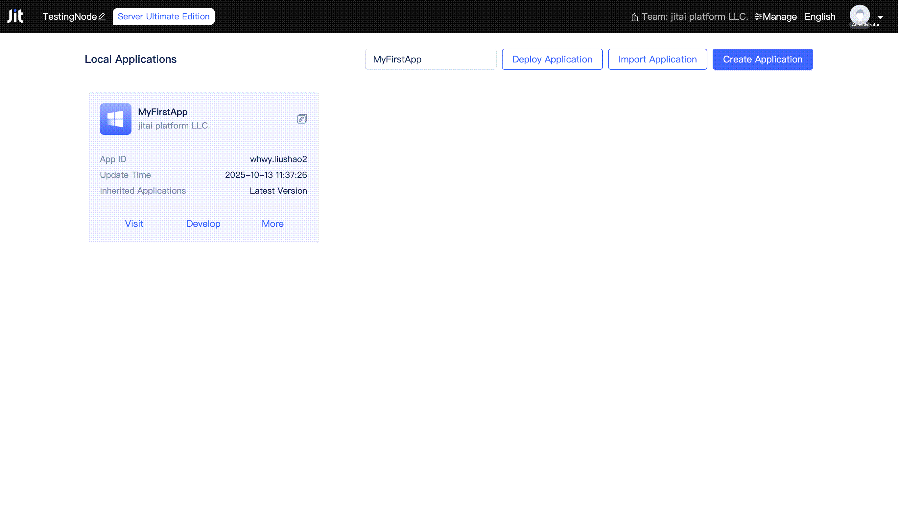

# Creating and Deploying Applications
Applications in JitAi are collectively referred to as `JitAi Apps`, and their structure follows the application specifications defined in [JAAP](/docs/reference/runtime-platform/JAAP). Both `Official Apps` and developer-created `MyApps` are `JitAi Apps`. An application's composition adheres to JAAP specifications and typically contains multiple fundamental elements such as [portals and pages](../shell-and-page/portal-navigation-design), [page components](../using-functional-components-in-pages), [data models](../data-modeling), and [service functions](../business-logic-development/creating-service-elements), with each element serving as an independent functional module.

Application development is the process of adding, modifying, and removing code for various elements within an application. Unlike modules in traditional development paradigms, elements in JitAi Apps have no static dependencies and zero coupling, making it exceptionally easy to reuse, modify, and replace application modules.

## Creating Your First Application {#creating-first-application}

The [Node Console](../creating-and-publishing-applications/runtime-environment-management#node-local-default-runtime-environment) in the DevOps management tool provides developers with comprehensive entry points for application creation, import, export, publishing, and deployment, covering the complete lifecycle from project initiation to operations.

Click the `Create Application` button in the Node Console to open the application creation dialog.

Developers simply need to provide the application name and ID, then click confirm to quickly complete application creation.

## Developing Applications Based on Existing Templates {#developing-applications-based-on-existing-templates}
To facilitate rapid development and customization based on existing applications, JitAi provides two approaches: application inheritance and creating copies.
  
### Inheriting from applications {#inheriting-from-applications}
Inheritance enables an application to acquire the functional modules of the inherited application. Every newly created application inherits two official application templates by default: JIT Development Framework and JIT Development Tools. The former is JitAi's official development framework, providing rich out-of-the-box elements, while the latter provides visual and full-code dual-mode development tools for the application development process. Beyond the default inherited official application templates, developers can add additional applications to inherit.

After expanding the `Inherited Applications` collapsible panel and clicking the `Add Application Template` button, the application template list opens. Developers can browse publicly available or organization-internal application templates in the list, and click on cards to add them to the inheritance list. Added application templates can be removed by clicking the `Remove` button, though the JIT Development Framework does not support removal operations.

:::tip

Developers of inherited applications continuously release new versions to fix bugs, add new features, etc. Developers can check for new versions and update them in the [Node Console](../creating-and-publishing-applications/runtime-environment-management#node-local-default-runtime-environment) or [Application Settings](../development-tool-and-publish-service/visual-development-tool#application-settings). For detailed version management, please refer to [Application Publishing and Updates](../creating-and-publishing-applications/publishing-and-upgrading-applications#application-version-updates).

:::

In JitAi development tools, developers can both develop new elements and view elements inherited from parent applications, and override individual elements as needed.

Developers can click the `Show Inherited Elements` button to locate elements from inherited applications at the bottom of the element directory tree. Clicking on an element opens the element editor on the right. Inherited elements do not support direct editing, but can be overridden by clicking the `Override` button in the upper right corner of the editor.

### Duplicating applications {#duplicating-applications}
The inheritance approach only allows overriding elements of specified parent applications. If you want to modify an application based on source code without affecting the original application, you can duplicate the application.

The duplicated application is a completely new application. Developers need to provide a new application name and ID, and any modifications to the duplicate will not affect the original application.

Developers can sequentially click the `More` and `Duplicate` buttons to open the duplicate application dialog. After providing a new application name and ID, clicking the `Confirm` button completes the duplication process.

## Configuring Data Storage and Environment Variables {#configuring-data-storage-and-environment-variables}
When creating a new application, JitAi uses local disk as the default file storage method. The desktop version uses SQLite as the default database and cache for applications, while the server version uses MySQL as the default database and Redis as the default cache. Developers can modify the default configuration during application creation to connect to their specified OSS storage, database, and cache services.

Using MySQL database connection as an example, developers prepare their own MySQL service and provide the connection information (developers must ensure the MySQL service is accessible).

The official base framework encapsulates Alibaba Cloud OCR recognition and Amap API, with the required API key information defined as environment variables. PDF conversion and file preview use JitAi official servers by default, but developers can deploy their own servers and configure service addresses in environment variables.

Developers can also define environment variables when developing their own applications, such as using environment variables to store database connection information, API keys, etc., ensuring that sensitive information will not be exposed when applications are exported or published.

## Deploying Applications {#deploying-applications}
After application creation is complete, you can directly develop and test in the current runtime environment. When you need to publish an official version, please refer to [Application Publishing and Updates](../creating-and-publishing-applications/publishing-and-upgrading-applications). After publishing an application version, it can be deployed by other nodes and runtime environments.

### Deploying applications on specified nodes {#deploying-applications-on-specified-nodes}
When a developer team has only a few nodes and uses only the default runtime environment of nodes, applications can be deployed directly through each node's Node Console.

In the [Node Console](../creating-and-publishing-applications/runtime-environment-management#node-local-default-runtime-environment), click the `Deploy Application` button to open the deployment dialog. Developers need to select the application, version, and deployment method, then click the `Confirm` button to complete deployment.

### Deploying applications in specified runtime environments {#deploying-applications-in-specified-runtime-environments}
When a developer team manages multiple JitNodes and multiple runtime environments, you can refer to the [Team Management Console](../creating-and-publishing-applications/runtime-environment-management#node-local-default-runtime-environment) to deploy applications for multiple nodes under specific runtime environments.

In the [Team Management Console](../creating-and-publishing-applications/runtime-environment-management#node-local-default-runtime-environment), select the target runtime environment and click the `Deploy Application` button to open the deployment dialog. Developers need to select the application, version, deployment mode, and target nodes, then click the `Confirm` button to complete deployment.

In the deployment dialog, developers can add one or more nodes under the runtime environment and configure different access weights for each node.
