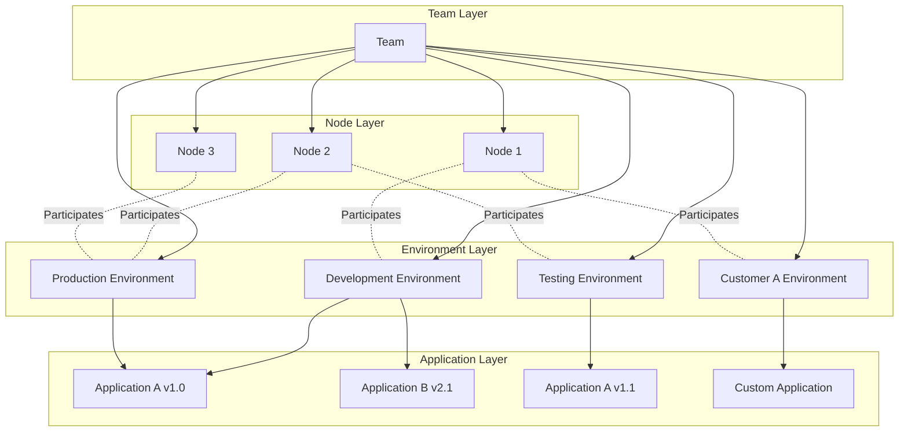
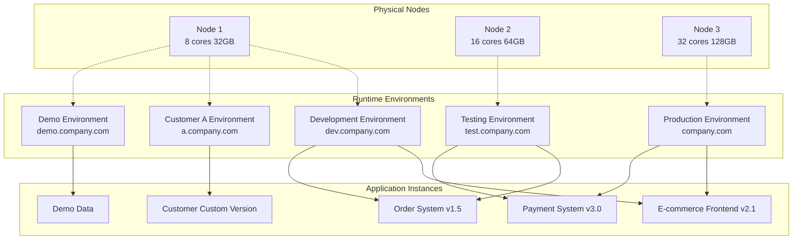

# Distributed Cluster Architecture for Unlimited Horizontal Scaling

JitAi enables seamless scaling from single-node deployments to large-scale enterprise cluster architectures through hierarchical management of teams, nodes, runtime environments, and applications, delivering comprehensive resource scheduling and load balancing capabilities.

## Understanding the four-layer architecture model {#four-layer-architecture}

Teams can encompass multiple nodes, with each node participating in multiple runtime environments. Runtime environments can span multiple nodes and host multiple application deployments.

## Designing enterprise cluster deployment architecture {#enterprise-cluster-deployment}

### Implementing typical deployment topology {#typical-deployment-topology}

### Teamanizing multi-dimensional environment division {#multi-dimensional-environment-division}

Runtime environments support flexible organization across multiple dimensions to accommodate complex enterprise deployment requirements:

| Classification Dimension | Environment Examples | Use Cases |
|----------|----------|----------|
| **By Stage** | Development, Testing, Production | Standard software development process |
| **By Business** | E-commerce, Payment, Logistics | Business module isolation |
| **By Customer** | Customer A, Customer B, Demo | Multi-tenant deployment |
| **By Purpose** | Performance Testing, Security Testing | Specialized testing requirements |

### Configuring entry address strategies {#entry-address-configuration}

**Entry Point Configuration Examples:**

| Runtime Environment | Primary Entry Point | Backup Entry Point | Port |
|----------|------------|-------------|----------|
| Development Environment | dev.company.com | dev2.company.com | :8080 |
| Testing Environment | test.company.com | staging.company.com | :8081 |
| Production Environment | company.com | backup.company.com | :80 |
| Customer A Environment | a.company.com | a1.company.com | :8082 |
| Demo Environment | demo.company.com | - | :8083 |

## Implementing cluster scaling strategies {#cluster-scaling-strategies}

### Deploying horizontal scaling modes {#horizontal-scaling}

**Node-level scaling**
- Add physical or virtual nodes to expand cluster capacity
- Enable automatic load balancing and intelligent request distribution
- Support cross-regional node deployment for geographic redundancy

**Environment-level scaling**
- Create new runtime environments on existing infrastructure
- Enable dynamic environment migration and seamless replication
- Achieve business isolation and optimize resource utilization

**Application-level scaling**
- Deploy identical applications across multiple environments
- Support version parallelism and canary release strategies
- Ensure high availability and comprehensive disaster recovery

### Implementing load balancing and fault tolerance {#load-balancing-fault-tolerance}

**Multi-node load balancing**
- Intelligent request routing and dynamic distribution
- Continuous node health monitoring and automatic failover
- Advanced weight configuration and granular traffic control

**Environment-level fault tolerance**
- Complete fault isolation between runtime environments
- Proactive fault detection and automated recovery systems
- Robust data backup and real-time synchronization mechanisms

## Understanding architecture constraints and best practices {#architecture-constraints-best-practices}

### Managing version constraints {#version-management-constraints}

| Scenario | Rule | Status | Description |
|------|------|------|------|
| Different applications in same environment | Any version combination | ✅ Allowed | E.g.: Development environment deploys Application A v1.0 and Application B v2.1 simultaneously |
| Same application in different environments | Different version deployment | ✅ Allowed | E.g.: Development environment deploys Application A v1.0, production environment deploys Application A v1.1 |
| Same application in same environment | Multiple versions coexist | ❌ Prohibited | Only one version of the same application can exist in the same environment |

### Configuring network access constraints {#network-access-constraints}

| Operation Type | Rule Description | Status | Example |
|----------|----------|------|------|
| Multi-address configuration | Configure multiple entries for one environment | ✅ Allowed | Production environment: `app.com` + `backup.app.com` |
| Dynamic modification | Modify environment entry at runtime | ✅ Allowed | Temporarily switch domain names or add backup entries |
| Address sharing | Multiple environments share the same entry | ❌ Prohibited | Two environments cannot use `test.com` simultaneously |
| Conflict detection | System automatically detects conflicts | 🔍 Automatic | Real-time conflict checking and prompting during configuration |

### Following deployment best practices {#deployment-best-practices}

**Version management**
- Utilize distinct environments for comprehensive application version testing
- Achieve seamless application version upgrades through strategic environment switching
- Establish clear version naming conventions and standardized release specifications

**Network configuration**
- Implement meaningful domain prefixes for clear environment identification
- Configure redundant entry addresses for critical production environments
- Minimize modifications to production environment entry addresses for stability

**Resource planning**
- Strategically allocate node resources based on comprehensive business load analysis
- Conduct regular evaluations and proactive adjustments of environment configurations

