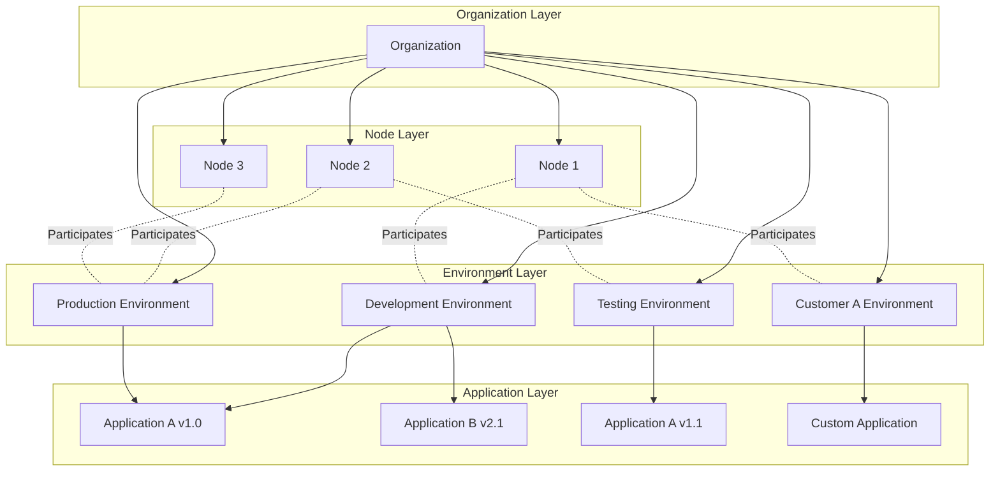
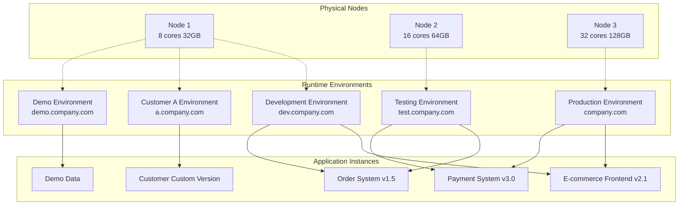

# Distributed Cluster Architecture for Unlimited Horizontal Scaling

JitAi supports scaling from single-node deployment to large-scale enterprise cluster deployment through hierarchical management of organizations, nodes, runtime environments, and applications, achieving resource scheduling and load balancing.

## Four-Layer Architecture Model {#four-layer-architecture}

Each organization can have multiple nodes, each node can participate in multiple runtime environments, and each runtime environment can include multiple nodes and deploy multiple applications.

## Enterprise Cluster Deployment Architecture {#enterprise-cluster-deployment}

### Typical Deployment Topology {#typical-deployment-topology}

### Multi-Dimensional Environment Division {#multi-dimensional-environment-division}

Runtime environments support flexible division by different dimensions to meet complex enterprise deployment requirements:

| Classification Dimension | Environment Examples | Use Cases |
|----------|----------|----------|
| **By Stage** | Development, Testing, Production | Standard software development process |
| **By Business** | E-commerce, Payment, Logistics | Business module isolation |
| **By Customer** | Customer A, Customer B, Demo | Multi-tenant deployment |
| **By Purpose** | Performance Testing, Security Testing | Specialized testing requirements |

### Entry Address Configuration Strategy {#entry-address-configuration}

**Entry Address Configuration Examples:**

| Runtime Environment | Primary Entry Address | Backup Entry Address | Port Entry |
|----------|------------|-------------|----------|
| Development Environment | dev.company.com | dev2.company.com | :8080 |
| Testing Environment | test.company.com | staging.company.com | :8081 |
| Production Environment | company.com | backup.company.com | :80 |
| Customer A Environment | a.company.com | a1.company.com | :8082 |
| Demo Environment | demo.company.com | - | :8083 |

## Cluster Scaling Strategies {#cluster-scaling-strategies}

### Horizontal Scaling Mode {#horizontal-scaling}

**Node-Level Scaling**
- Add physical or virtual nodes to the cluster
- Automatic load balancing and request distribution
- Support cross-regional node deployment

**Environment-Level Scaling**
- Create new runtime environments on existing nodes
- Support dynamic environment migration and replication
- Achieve business isolation and resource optimization

**Application-Level Scaling**
- Deploy the same application in multiple environments
- Support version parallelism and canary releases
- Achieve high availability and disaster recovery backup

### Load Balancing and Fault Tolerance {#load-balancing-fault-tolerance}

**Multi-Node Load Balancing**
- Intelligent request routing and distribution
- Node health checks and automatic failover
- Support weight configuration and traffic control

**Environment-Level Fault Tolerance**
- Fault isolation between environments
- Automatic fault detection and recovery
- Data backup and synchronization mechanisms

## Architecture Constraints and Best Practices {#architecture-constraints-best-practices}

### Version Management Constraints {#version-management-constraints}

| Scenario | Rule | Status | Description |
|------|------|------|------|
| Different applications in same environment | Any version combination | ✅ Allowed | E.g.: Development environment deploys Application A v1.0 and Application B v2.1 simultaneously |
| Same application in different environments | Different version deployment | ✅ Allowed | E.g.: Development environment deploys Application A v1.0, production environment deploys Application A v1.1 |
| Same application in same environment | Multiple versions coexist | ❌ Prohibited | Only one version of the same application can exist in the same environment |

### Network Access Constraints {#network-access-constraints}

| Operation Type | Rule Description | Status | Example |
|----------|----------|------|------|
| Multi-address configuration | Configure multiple entries for one environment | ✅ Allowed | Production environment: `app.com` + `backup.app.com` |
| Dynamic modification | Modify environment entry at runtime | ✅ Allowed | Temporarily switch domain names or add backup entries |
| Address sharing | Multiple environments share the same entry | ❌ Prohibited | Two environments cannot use `test.com` simultaneously |
| Conflict detection | System automatically detects conflicts | 🔍 Automatic | Real-time conflict checking and prompting during configuration |

### Deployment Best Practices {#deployment-best-practices}

**Version Management**
- Use different environments to test different versions of applications
- Achieve smooth application version upgrades through environment switching
- Establish clear version naming and release specifications

**Network Configuration**
- Use meaningful domain prefixes to distinguish environments
- Configure backup entry addresses for important environments
- Avoid frequent modifications to production environment entry addresses

**Resource Planning**
- Allocate node resources reasonably based on business load
- Regularly evaluate and adjust environment configurations

