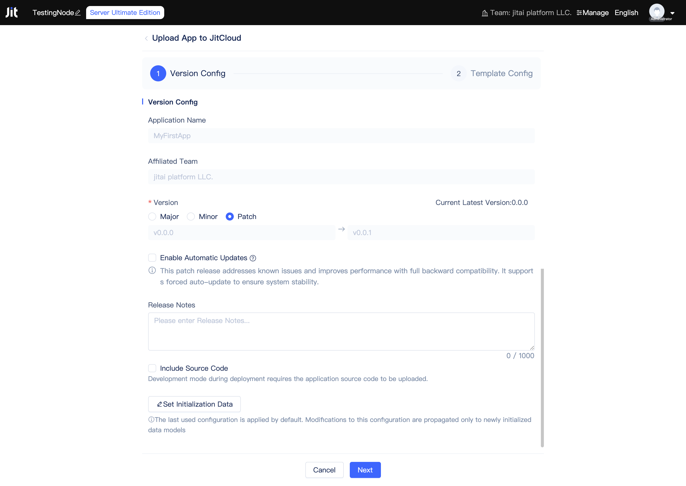

# Publishing and Updating Applications

After application development is complete, developers can publish application versions for deployment in [runtime environments](../creating-and-publishing-applications/runtime-environment-management#deploy-application-in-runtime-environment) on other JitNodes.

## Application Version Management and Publishing {#application-version-management-and-publish}

In the application list of the Node Console, click the `More` button on the application card, then click the `Publish Application` button in the popup menu list to open the publish application dialog. Developers need to confirm and fill in the following information: version number, whether to force automatic updates, update logs, whether to upload source code, and which initialization data to include.

### Semantic Versioning {#semantic-versioning}
By default, the patch version number will be updated. If you need to update the minor or major version number, developers can check the corresponding options.

:::tip Semantic Versioning

It is recommended that developers follow the [Semantic Versioning](https://semver.org) specification, where the major version number represents breaking changes, the minor version number represents feature additions or optimizations, and the patch version number represents bug fixes.

:::

### Force Automatic Updates {#force-auto-update}
If developers choose to force automatic updates, runtime environments deploying this version of the application will automatically update when new versions are available, otherwise manual updates are required.

### Meaningful Update Logs {#meaningful-update-logs}
It is recommended that developers write meaningful update logs so users can understand the application's update content.

### Include Source Code {#include-source-code}
If developers choose to include source code, the application can be deployed in [development mode](../creating-and-publishing-applications/runtime-environment-management#deploy-in-development-mode) during deployment, otherwise it can only be deployed in [production mode](../creating-and-publishing-applications/runtime-environment-management#deploy-in-production-mode).

The platform will encrypt the source code to ensure it will not be leaked.

### Include Initialization Data {#include-initialization-data}
If developers choose to include some initialization data, this data will be automatically written to the database when the application version is deployed. This is very convenient when there is a need to deploy demo versions.

Developers can select which data table models to include initial data for, but the cumulative initialization data is limited to a maximum of 1000 records. Please plan the data volume for each data table in advance and prepare the data.

## Application Version Updates {#application-version-updates}

Developers of inherited applications will continuously release new versions to fix bugs, add new features, etc. Developers can check for new versions and update them in the [Node Console](../creating-and-publishing-applications/runtime-environment-management#node-local-default-runtime-environment) or [Application Settings](../development-tool-and-publish-service/jitai-visual-development-tools#application-settings).

## Application Deployment Strategies {#application-deployment-strategies}

After application publishing, it can be deployed in different runtime environments, supporting both development mode and production mode deployment, as well as flexible weight configuration and automatic update strategies.
