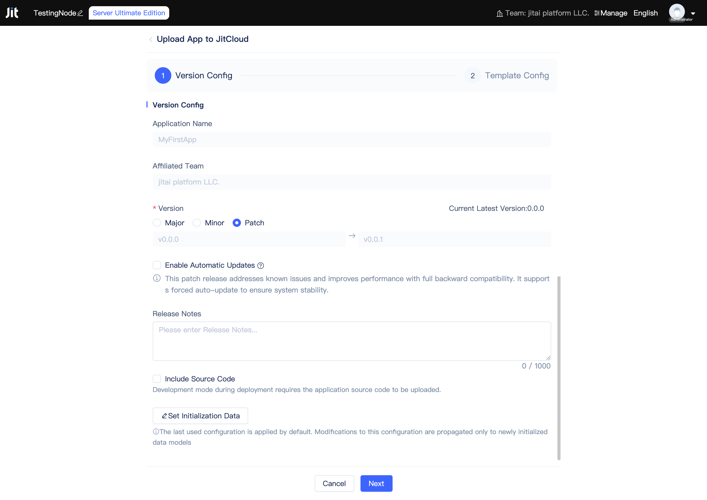
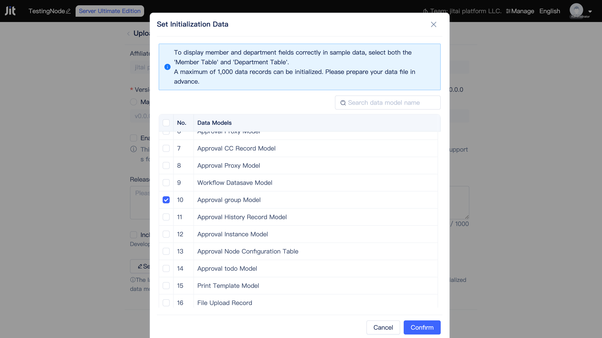

# Publishing and Upgrading Applications

Upon completion of application development, developers can publish application versions for deployment across [runtime environments](../creating-and-publishing-applications/runtime-environment-management#deploy-application-in-runtime-environment) on other JitNodes.

## Managing application version and publishing {#application-version-management-and-publish}

From the application list in the Node Console, click the `More` button on the application card, then select `Publish Application` from the dropdown menu to open the publishing dialog. Developers must confirm and configure the following parameters: version number, automatic update enforcement, update logs, source code inclusion, and initialization data selection.

### Understanding semantic versioning {#semantic-versioning}
By default, the patch version number is incremented. To update minor or major version numbers, developers can select the corresponding options.

:::tip Semantic Versioning

We recommend following the [Semantic Versioning](https://semver.org) specification, where major versions indicate breaking changes, minor versions represent feature additions or enhancements, and patch versions denote bug fixes.

:::

### Setting automatic updates {#force-auto-update}
When developers enable forced automatic updates, runtime environments deploying this application version will automatically update upon new version availability. Otherwise, manual updates are required.

### Writing meaningful update logs {#meaningful-update-logs}
We recommend developers provide comprehensive update logs to help users understand the application's changes and improvements.

### Including source code {#include-source-code}
When developers include source code, applications can be deployed in [Development Mode](../creating-and-publishing-applications/runtime-environment-management#deploy-in-development-mode). Without source code, applications are limited to [Production Mode](../creating-and-publishing-applications/runtime-environment-management#deploy-in-production-mode) deployment.

The platform encrypts source code to ensure complete security and prevent unauthorized access.

### Including initialization data {#include-initialization-data}
When developers include initialization data, this data is automatically populated into the database during application deployment. This feature proves invaluable for deploying demonstration versions.

Developers can specify which data table models should include initial data, with a cumulative limit of 1000 records maximum. Advance planning of data volume per table and data preparation is essential.

## Upgrading application versions {#application-version-updates}

Developers of inherited applications continuously release new versions to address bugs, introduce features, and implement improvements. Version checking and upgrading can be performed through the [Node Console](../creating-and-publishing-applications/runtime-environment-management#node-local-default-runtime-environment).

## Planning application deployment strategies {#application-deployment-strategies}

Following application publication, deployment across various runtime environments becomes possible, supporting both development and production modes alongside flexible weight configuration and automated update strategies.
