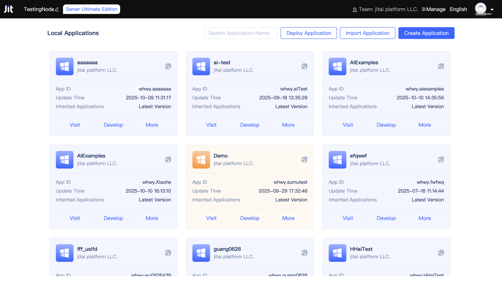
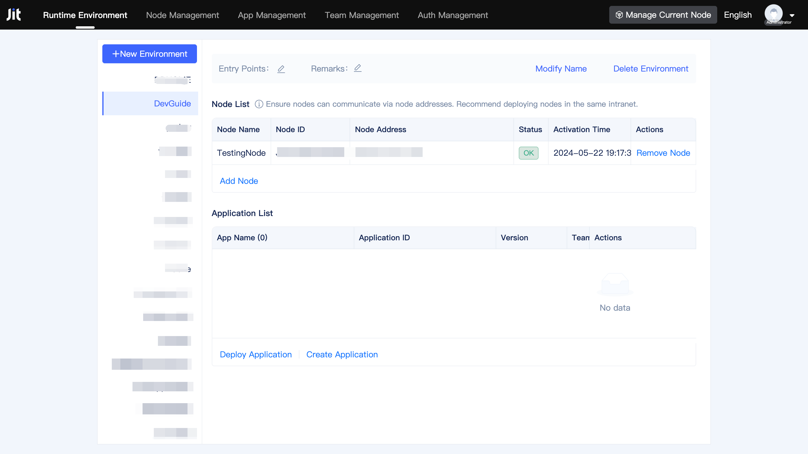
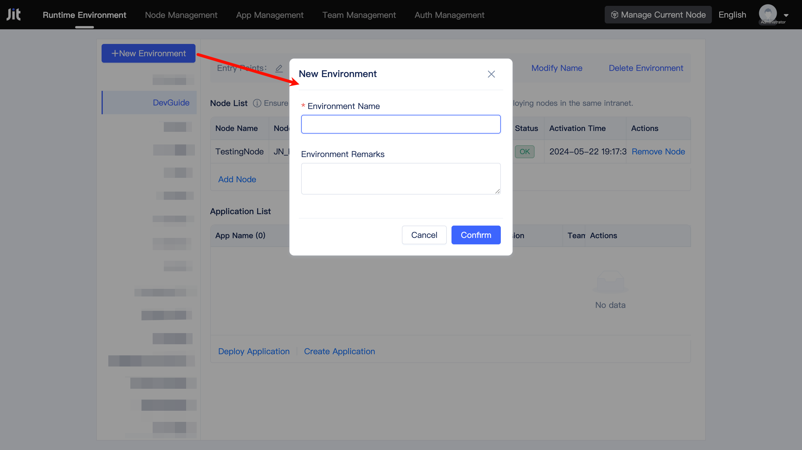
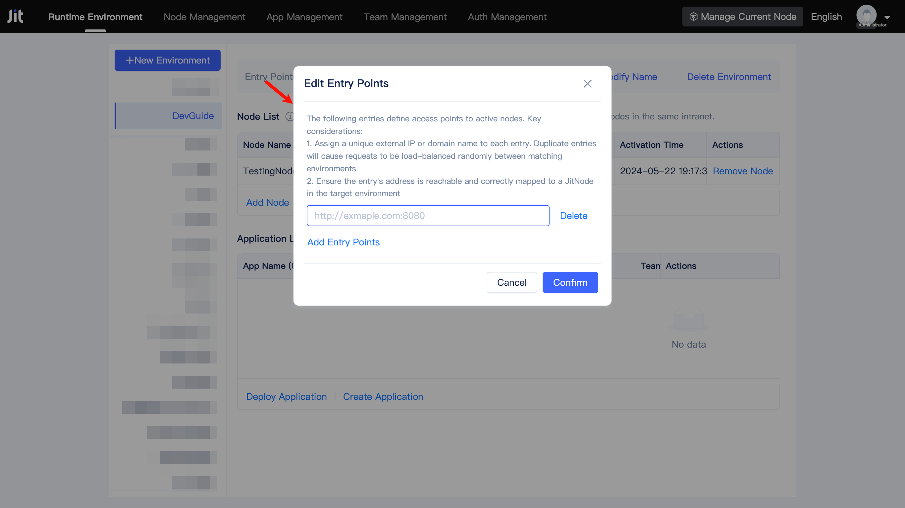
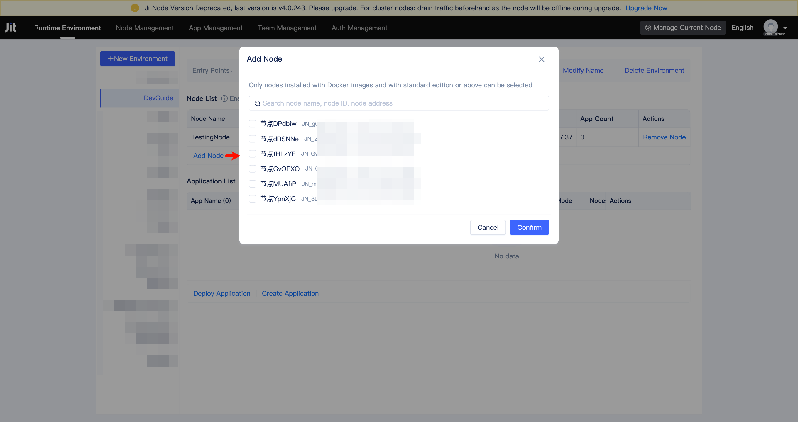
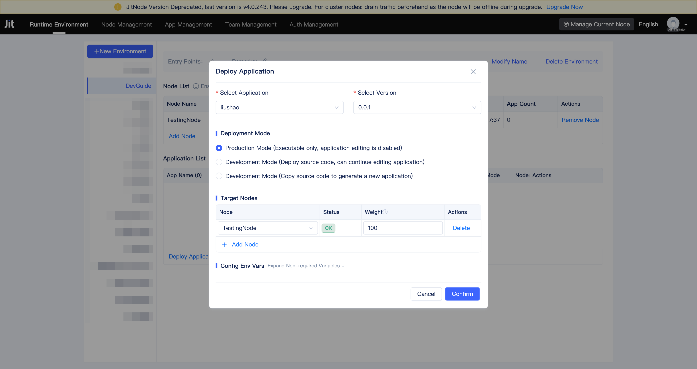

# Runtime Environment Management
## Understanding runtime environments {#what-is-runtime-environment}
Runtime environments provide isolated spaces for application deployment and execution, with complete resource directory separation between different environments.

Developer teams can create multiple runtime environments, each capable of containing one or more JitNodes (excluding the default runtime environment) and hosting multiple applications. Individual nodes can participate in multiple runtime environments simultaneously.

## Managing node local default runtime environment {#node-local-default-runtime-environment}
Upon node activation, a local default runtime environment is automatically created. This environment remains invisible in the runtime environment management interface and serves to run JitAI's built-in DevOps management platform on that node. User access to the node automatically redirects to the node's local default runtime environment management page, known as the Node Console.

The Node Console enables users to modify node names, view node specification authorization details, download current node runtime logs, and upgrade inherited applications.

Additional operations include application creation, importing, exporting, publishing, deployment, deletion, inherited application modification, environment variable configuration, duplication, and development interface access. For comprehensive details on these operations, refer to [Creating and Deploying Applications](../creating-and-publishing-applications/creating-and-deploying-applications).

## Creating new runtime environments {#createnewrunenvironment}
Runtime environment management requires access to the Developer Team Management Console. Users can click the `Manage` button in the Node Console's upper right corner to access the Developer Team Management Console. Conversely, the `Manage Current Node` button in the Developer Team Management Console's upper right corner enables switching back to the current node's Node Console.

Navigate to the runtime environment management page, click `New Environment`, enter the environment name, and click    `Confirm` to create a new runtime environment.

Users can establish multiple runtime environments organized by testing and production criteria, or create distinct environments based on custom dimensions. Each runtime environment supports one or more dedicated visit entry addresses for application access within that environment.

:::tip Note

Runtime environment visit entry addresses accept both IP addresses and domain names. Users must configure domain name resolution correctly to ensure entry addresses can properly access the JitNode startup port of designated nodes within the runtime environment. The designated node manages request forwarding and load balancing throughout the cluster.

The default startup port is 8080. The server Docker version automatically maps to host port 80, though users can modify the startup port configuration as needed.

:::

Users can modify names, update remarks, and delete previously created runtime environments.

## Deploying in development mode {#deploy-in-development-mode}
Development mode deployment provides hot reload functionality and comprehensive debugging capabilities for enhanced development workflows.

## Deploying in production mode {#deploy-in-production-mode}
Production mode deployment optimizes application performance and stability for live environments.

## Managing node clusters with runtime environments {#use-runtime-environment-to-manage-node-clusters}
Adding multiple nodes to a runtime environment creates a multi-node cluster configuration. Clusters provide horizontal scaling capabilities to ensure service availability and optimal performance. Currently, only server version nodes support runtime environment integration.

The node list presents comprehensive information for each node: name, ID, address, status, activation time, and deployed application count. Users can remove nodes from the cluster as needed.

### Managing node addresses {#node-address}
Nodes designated by runtime environment visit entry addresses handle request forwarding and load balancing using other cluster node addresses. Upon activation, nodes automatically adopt the internal network IP as their address, though users can manually modify node addresses.

### Monitoring node status {#node-status}
Node status displays as `Error` when the JitNode process hasn't started or network anomalies cause disconnection from JitAI Cloud. When the JitNode process operates normally, the status shows as `OK`.

## Deploying applications in runtime environments {#deploy-application-in-runtime-environment}
Users can deploy applications across one or multiple nodes within a runtime environment, with support for multiple application deployments within a single environment.

During deployment, users can configure application access weights across different nodes and set environment variable values as required. Deployment records support modification and deletion at any time.

### Deploying in production mode {#deploy-production-mode} 
Production Mode deployments contain only executable programs without source code, preventing online modifications for enhanced security.

### Deploying in development mode {#deploy-development-mode} 
Source code publication activates **Development Deployment Mode**, allowing direct code edits with **live reload** capability.

Development Mode offers two distinct approaches: 
1. `Deploy source code`: Continue editing application.
2. `Copy source code`: Copy source code to generate a new application.
