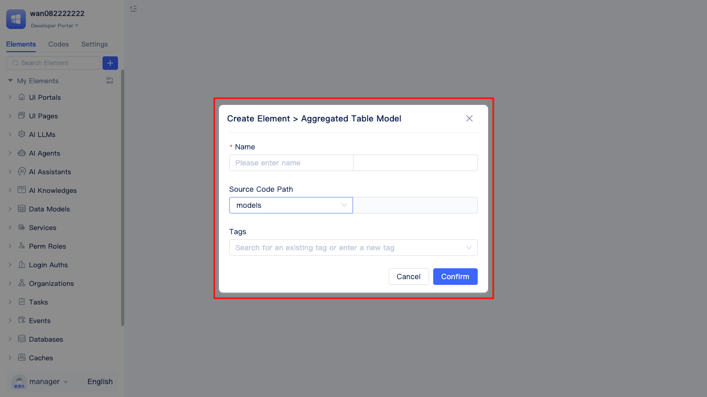
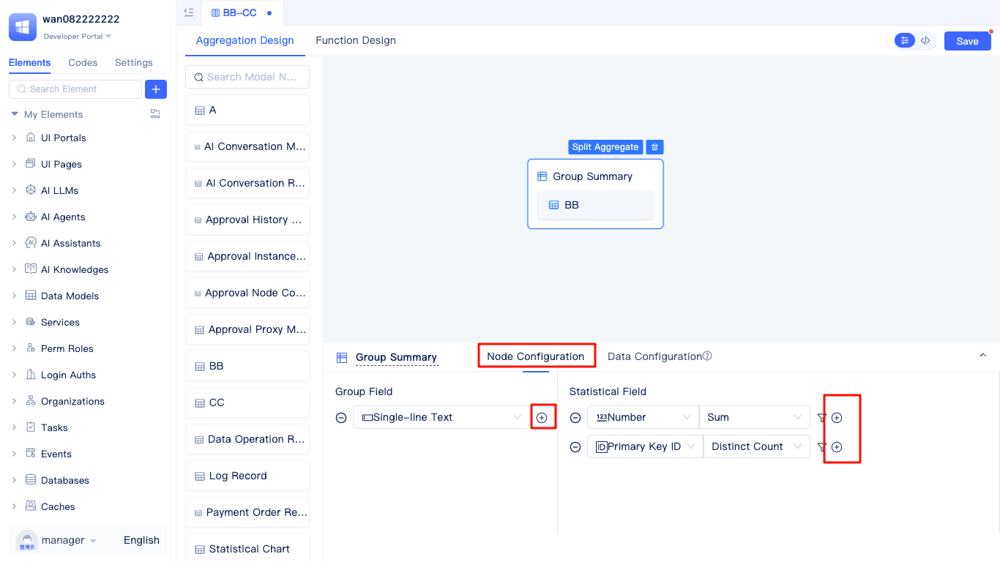
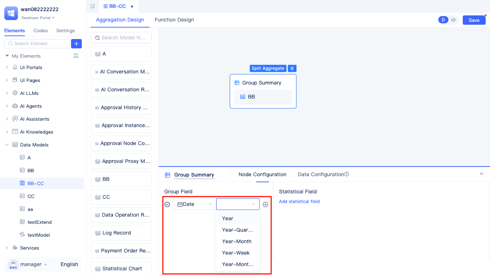
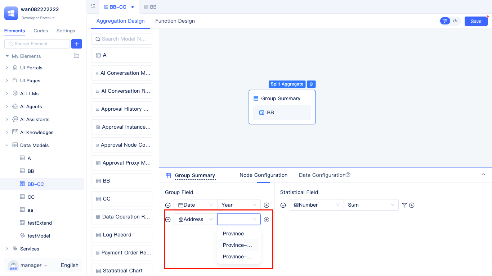
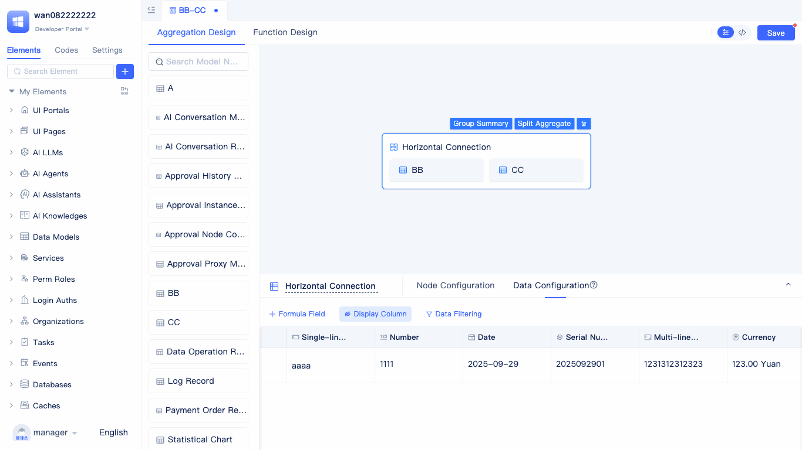

# Aggregate Table Model {#aggregate-table-model}
Aggregate Table Model is an advanced data modeling approach provided by JitAi, specifically designed for handling complex data analysis and statistical scenarios. Unlike [regular data table models](./data-table-model), aggregate table models do not directly correspond to a single table structure in the database. Instead, they flexibly configure, associate, merge, and calculate multiple data table models to ultimately generate virtual data tables that meet specific business requirements.

Developers find `Data Model` in the element tree, click the `+` on the right, and select `Aggregated Table Model`. 

In the `Create Element > Aggregated Table Model` popup page, enter the name (the English name will be automatically generated), and click the `Confirm` button to enter the aggregate table visual editor.

## Multi-Table Data Merge {#multi-table-data-merge}
Append merge combines multiple data tables with similar structures into a unified dataset, similar to the UNION operation in SQL. The system automatically matches the same fields in each table, appends all data together, and optionally provides deduplication processing for duplicate data.

For example, developers can merge sales data from different periods, integrate business data from multiple stores or departments, and merge historical data of the same business type but stored separately.

Developers select the data tables to be merged from the left model list and drag them to the right work panel, then set field mapping relationships in `Node Configuration` to determine which fields should be merged together. The system automatically removes duplicate data by default. If you need to keep duplicate data, you can uncheck the `Deduplicate merged data` option.

After completing the node configuration, click the `Data Configuration` tab to enter data preview, showing only the first 50 records.

## Multi-Table Horizontal Join {#multi-table-horizontal-connection}
Horizontal join connects multiple data tables by specifying associated matching fields, similar to the JOIN operation in SQL. It supports various join types such as left join, right join, and inner join, allowing related information scattered across different tables to be integrated into the same record row.

For example, developers can use multi-table horizontal joins to associate user basic information tables with user order tables to view complete user profiles; connect product information tables with inventory information tables to obtain detailed inventory status of products. Additionally, they can associate employee information tables with department information tables to generate employee reports containing department details, or connect customer tables with their contact record tables to form customer relationship management views.

Developers select the tables that need horizontal joining from the left model list and drag them to the right panel.

In the `Node Configuration` tab page, select the join type and add matching fields. Join types include left join, right join, and inner join, with left join as the default. Multiple matching fields can be selected, but only fields of the same data type can be matched. For example, single-line text can match with multi-line text, option groups, phone numbers, ID numbers, etc., because these are all stored as text types.

After completing the node configuration, click the `Data Configuration` tab to enter data preview, showing only the first 50 records.

## Group Aggregate Statistics {#group-aggregate-statistics}
Group statistics groups data tables by specified fields, then performs aggregate calculations (such as sum, count, average, etc.) on the data within each group, similar to the GROUP BY operation in SQL. It supports multi-level grouping and various aggregate functions to quickly generate various statistical reports.

For example, developers can use group statistics to analyze data from various dimensions, such as grouping and summarizing by region, time, department, product category, customer level and other fields, quickly generating business reports such as sales reports, employee statistics, inventory analysis, and customer value assessment.

Developers select the table that needs group aggregation from the left model list and drag it to the right panel, then click `Group Summary` in the panel to enter the aggregation configuration page.

Add grouping fields and statistical fields in `Node Configuration`.
In addition to regular field grouping, there are some special field groupings: date or datetime fields can be grouped by year, month, day, etc.; address fields can be grouped by province, city, and district.

When selecting date or datetime fields for grouping, the grouping method can be `Year`, `Year-Quarter`, `Year-Month`, `Year-Week`, `Year-Month-Day`, or none.

When selecting address fields for grouping, the grouping method can be `Province`, `Province-City`, `Province-City-District`, or none.

After completing the node configuration, click `Data Configuration` to enter the data preview page, showing only the first 50 records.

## Extending Custom Calculation Fields {#extend-custom-calculation-fields}
Aggregate tables can add formula fields based on existing aggregate fields. The values displayed in formula fields are the values calculated by the formulas.

Taking a horizontal join aggregate table as an example, on the data configuration page, click `+ Formula Field` to enter the formula configuration panel.

In the formula panel, you can select fields, functions, or operators such as `+`, `-`, `*`, `/` from above. Click to add them to the panel.

JitAi provides a rich formula function library covering calculation needs for different data types. **Numeric types** include aggregate functions such as maximum (`MAX`), average (`AVG`), sum (`SUM`) for data statistical analysis; **Date types** include functions such as current time (`NOW`), date addition (`DATEADD`), month start (`MONTHSTART`) for time-related calculations; **Text types** include functions such as text concatenation (`CONCAT`), text replacement (`REPLACE`), text length (`LEN`) for string processing; **Logic types** include functions such as conditional judgment (`IF`), multi-layer judgment (`IFS`), conditional concatenation (`AND`/`OR`) for business logic control.

For example, if developers want to calculate the maximum value of two fields, they can use the formula `MAX(Number, Amount)`. To confirm if the formula is set correctly, you can click the `Preview` button on the right.
In the preview panel, fill in the values of the number field and amount field used in the formula, then click the `Test` button, and the test result will show the correct calculation result.

After successful preview, configure the formula field name, type, and field configuration, then click `Confirm` to see the data calculated by the formula.

## Aggregate Then Filter {#aggregate-then-filter}
This approach first completes the aggregation operations of data tables (merge, join, or group statistics), then filters the aggregated results. It is suitable for scenarios that require conditional judgment based on aggregated results.

Taking the append merge aggregate table as an example, on the data configuration preview page, click the `Data Filter` tab to enter the filter condition configuration page. In the `Set Filter Conditions` popup, click `+` to add filter conditions. If you want to filter data with numbers between 1-300, first select the corresponding number field, then select the comparison operator `In Range`, and finally enter the range values 1 and 300, then click `Confirm`. The data preview will only display row data that meets the condition where the number field is between 1-300.

## Filter First Then Aggregate {#filter-first-then-aggregate}
This approach first sets filter conditions for each data table separately, filters out data that meets the conditions, and then performs aggregation operations. This method can significantly reduce the amount of data participating in aggregation calculations, avoid generating excessive Cartesian products, and greatly improve query performance.

On the aggregate table configuration page, first select data table A to be aggregated, click `Data Filter` on its data configuration page, and set filter conditions (such as numbers between 1-300). Then select data table B to be merged and set corresponding filter conditions similarly. After completing the filter configuration for each table, execute the aggregation operation, and the final data preview will display the aggregated results after pre-filtering.

:::tip Performance Optimization Tips
It is recommended to prioritize the filter-first-then-aggregate approach, which can significantly reduce the number of rows scanned by the database engine and improve query performance. In large data volume scenarios, avoid directly performing unconditional aggregation on large tables to prevent timeouts or system lag. Filter conditions should be as precise as possible to achieve the best performance optimization effects.
:::

