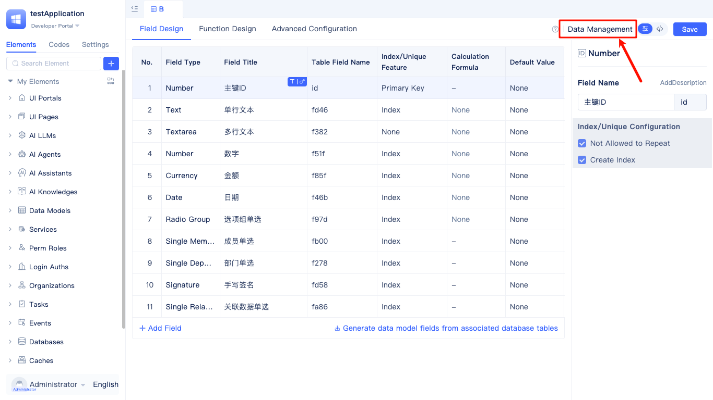
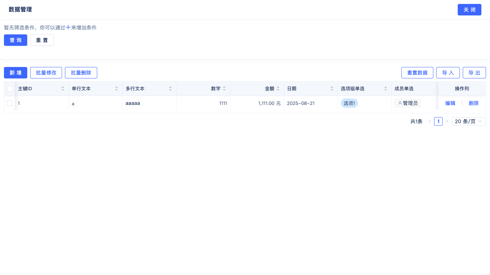

# Built-in Data Management Tools {#built-in-data-management-tools}

JitAi provides data management capabilities for data table models, enabling CRUD operations on data tables without writing code. Data can also be managed directly within the development environment.

Click `Data Management` to access the visual data management interface.

Data management features include data filtering and querying, adding, editing, deleting, batch modification, batch deletion, data clearing and reset, as well as import and export functionality. Users can intuitively manage all records in the data tables.
