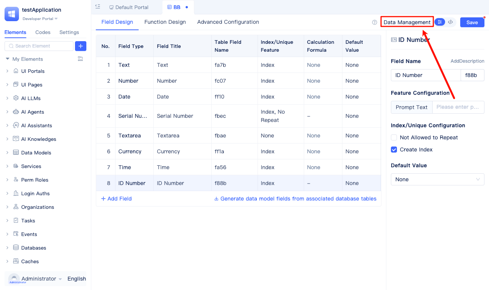
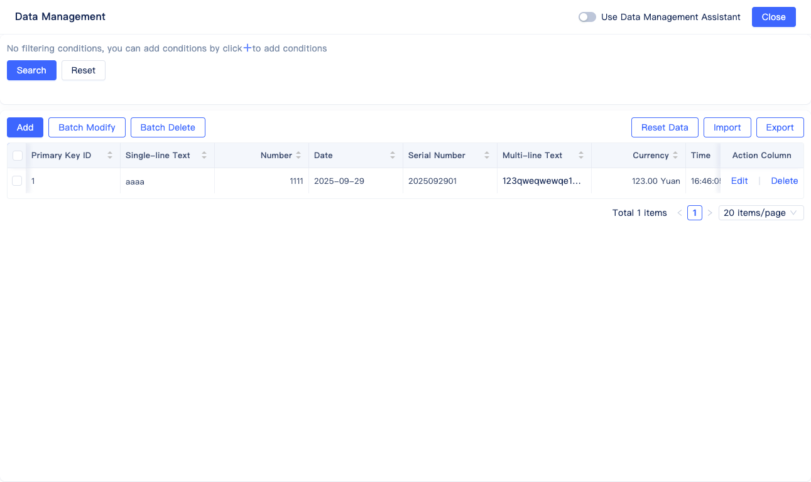

# Built-in Data Management Tools

JitAI provides comprehensive data management capabilities for data table models, enabling CRUD operations on data tables without requiring code development. Data can be managed directly within the development environment through an intuitive visual interface.

Click `Data Management` to access the visual data management interface.

The data management system includes comprehensive features for data filtering and querying, adding, editing, deleting, batch modification, batch deletion, data clearing and reset, as well as import and export functionality. Users can intuitively manage all records in the data tables through this powerful interface.
