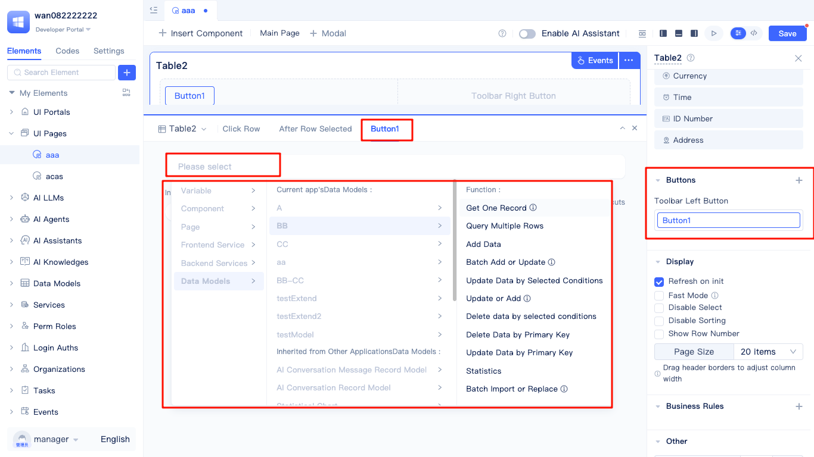
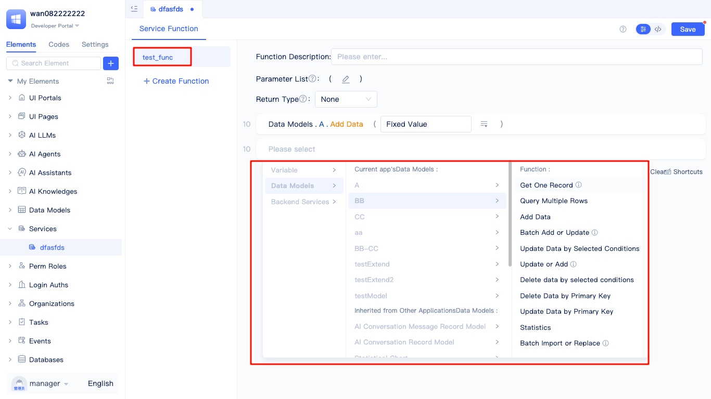

# Using Data Models in Pages and Functions

When developing applications on the JitAI platform, data models serve not only as tools for data storage and management, but can also be flexibly integrated into page displays, form interactions, and custom function logic. By calling data models in pages and functions, developers can achieve dynamic data operations including reading, writing, updating, and deleting, thereby meeting diverse data processing requirements across various business scenarios.

## Built-in model functions {#built-in-model-functions}

The JitAI platform provides a comprehensive suite of built-in data operation functions for each data model, enabling developers to seamlessly integrate them into pages, forms, and custom function logic to implement CRUD operations and statistical analysis. Common built-in model functions include:

- **Get One Record**: Retrieve a single data record based on specified conditions.
- **Query Multiple Rows**: Query multiple data records with support for conditional filtering and pagination.
- **Add Data**: Insert new data records into the data table.
- **Batch Add or Update**: Bulk insert multiple data records or bulk update existing data.
- **Update Data by Selected Condition**: Bulk update data records that meet specified conditions.
- **Update Data**: Update specified data records.
- **Delete Data by Selected Condition**: Bulk delete data records that meet specified conditions.
- **Delete Data by Primary Key**: Precisely delete specified data records by primary key.
- **Update Data by Primary Key**: Precisely update specified data records by primary key.
- **Statistics**: Perform statistical analysis on specific fields of the data model, such as counting, summing, averaging, etc.
- **Batch Import or Replace**: Bulk import external data and perform data conversion processing (data must contain primary key values).

These built-in functions significantly streamline the data operation process. Developers only need to call the appropriate methods in page or function logic and pass the required parameters to complete complex data processing tasks.

For more detailed usage, please refer to: [Calling Data Model Functions in Pages (including full-code pages)](../calling-business-elements-in-pages/calling-data-model-functions-in-pages.md)

## Calling data models in pages {#calling-data-models-in-pages}

In the JitAI platform, pages serve not only as display and interaction interfaces, but can also be directly integrated with data models to achieve dynamic data operations. By calling data model functions in page events, developers can easily implement comprehensive data reading, writing, updating, and deleting functionality.

For example, after adding a button component to an existing page, you can configure click events for that button. In the event configuration interface, select "Data Model" to choose the data model you need to operate and its corresponding methods. By flexibly configuring these methods, you can implement various business scenarios such as list display, detail viewing, form submission, and data editing. When calling data models, you can also set parameters, handle return results, and link with other components on the page to enhance the page's interactivity and data-driven capabilities.

In addition, JitAI also supports binding data model call results with page variables to achieve automatic data refresh and dynamic display, greatly improving development efficiency and user experience.

## Calling data models in functions {#calling-data-models-in-functions}

In the JitAI platform, in addition to directly calling data models in pages, you can also flexibly call data models in Service Functions or Model Functions to implement more complex business logic and data processing.

By calling data models in functions, developers can write custom logic flows according to business requirements. For example, you can batch process data, implement multi-table joint operations, data validation, etc. in service functions. Common calling methods include:

- Call built-in methods of data models in service functions to implement CRUD operations, statistics, etc. on data.
- Implement complex business logic related to the current model in model functions, such as data validation, automatic field value calculation, etc.
- Support chained calls to multiple data models to achieve cross-model data processing and business flow.

When calling data models, you usually need to pass corresponding parameters (such as query conditions, data content, etc.) and can process the return results. The return value of functions can be used as input for page display, subsequent process handling, or other function calls, greatly enhancing the flexibility and scalability of the system.

By calling data models in functions, developers can deeply integrate data operations with business logic to meet development needs in various complex scenarios.