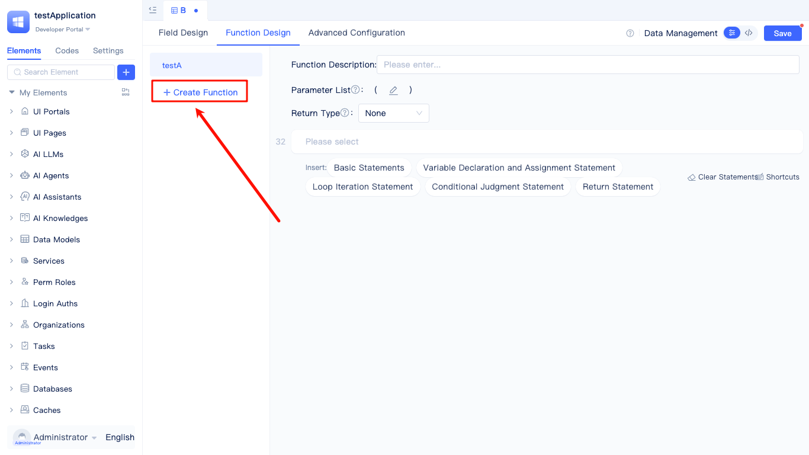
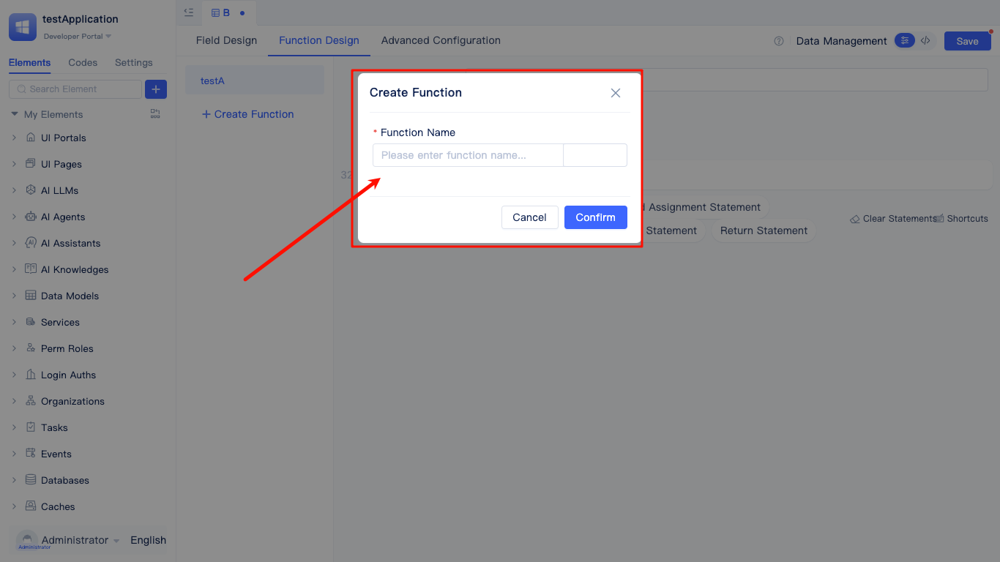
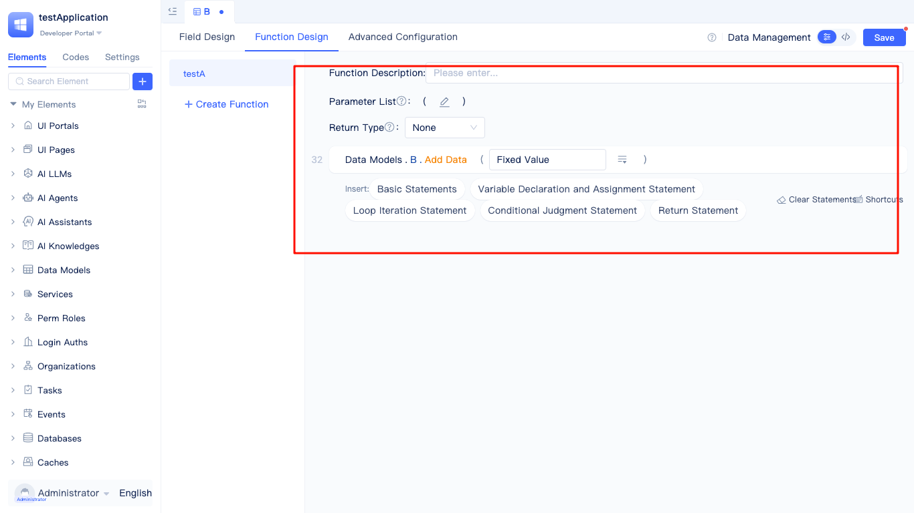

# Creating Data Model Functions

In object-oriented development, functions can be encapsulated within classes to implement specific business logic. JitAi's data models also support custom functions, extending data models with business logic processing capabilities.

Developers can access the function design interface by clicking the `Function Design` tab in the model editor page. Click `New Function` and enter the function name in the dialog box (English names are automatically generated and can be customized by developers).

Click `Confirm` to complete function creation and begin editing the function logic.

Model functions support creation, editing, and deletion. Parameter and return value types are customizable, and the built-in visual code editor facilitates quick insertion of common statements.