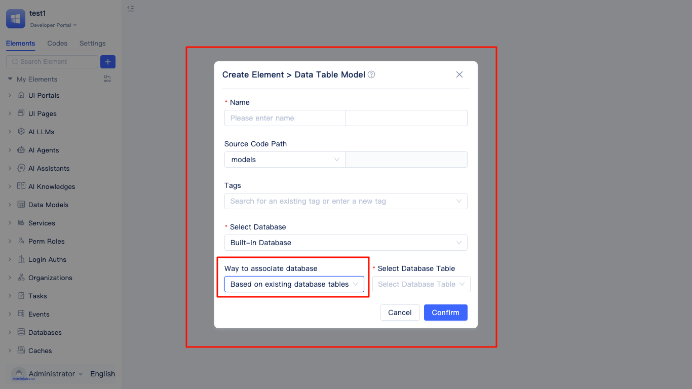
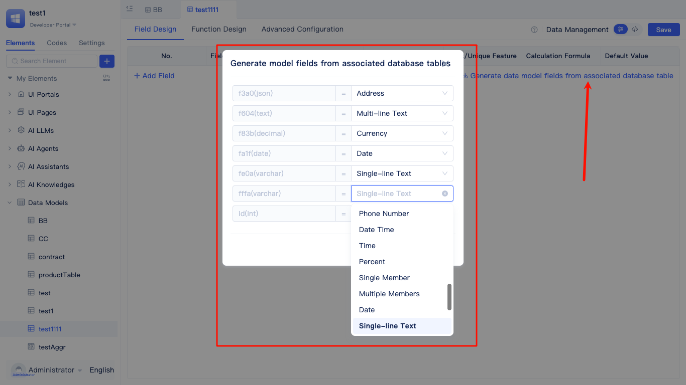

# Creating Data Table Elements from Existing Database Tables {#from-existing-data-table}

This approach is suitable for scenarios where database tables already exist and corresponding models need to be quickly created in JitAi applications.

Developers fill in the model name in the `Create Element > Data Table Model` dialog, select `Based on Existing Database Tables` as the creation method, and choose an existing database. The database defaults to the built-in database.

Click the `Select Database Table` input box to display all tables in the database.

After selecting a database table, click `Confirm` to enter the field configuration page. Click `Generate data model fields from associated database table`, then map the database fields to corresponding data types.
