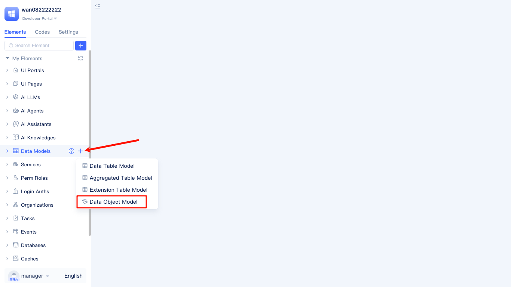
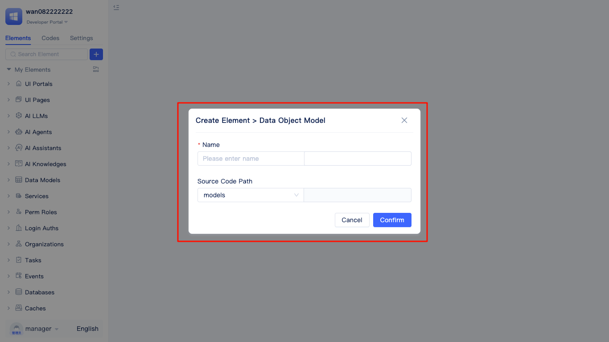
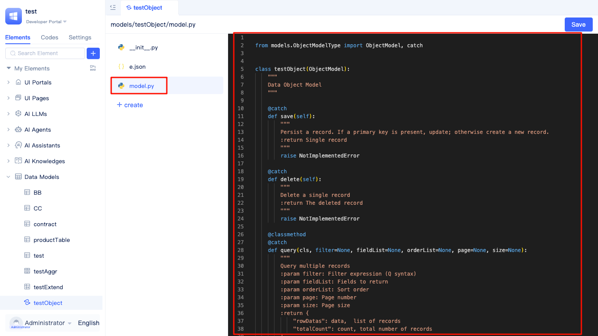
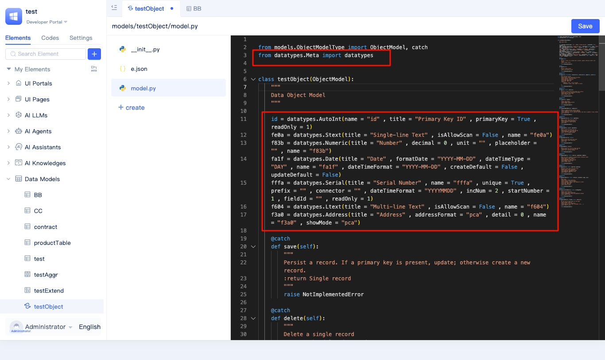
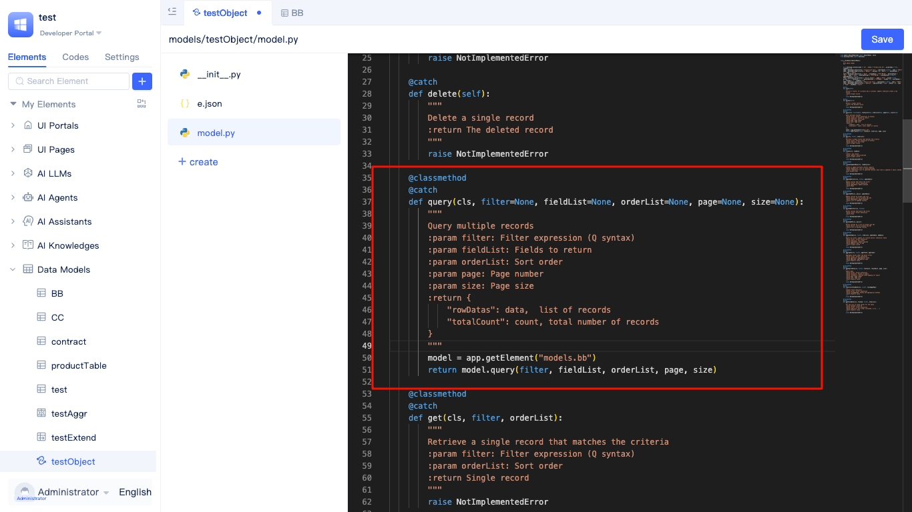
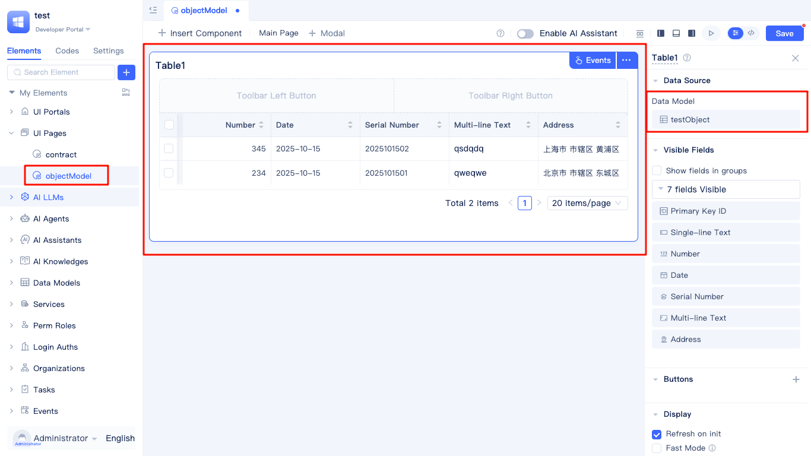
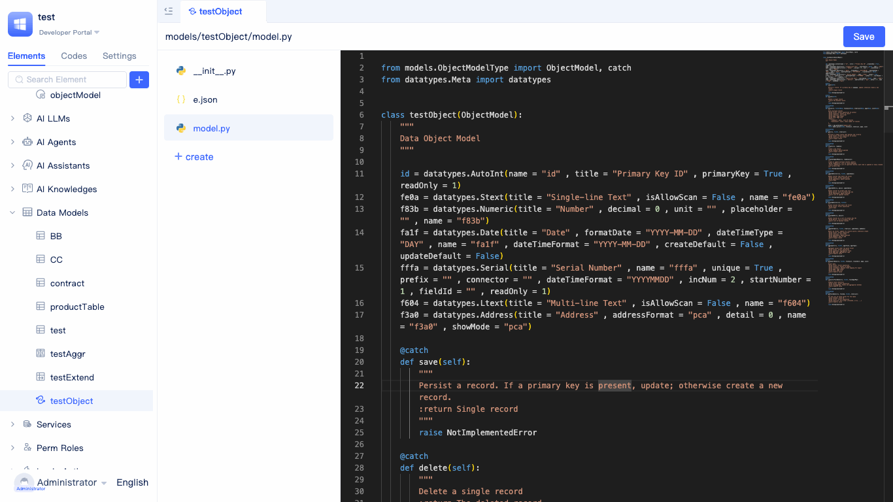

# Data Object Model {#data-object-model}
The Data Object Model is a data structure specifically designed for full-code development mode, similar to DTO (Data Transfer Object), also known as `Table-less Model`. It is customized by developers according to specific business requirements and does not directly map or associate with any database tables. Data object models are mainly used in business logic such as service functions, event handling, and workflow orchestration for structured expression, transmission, and transformation of data. Through data object models, developers can flexibly define multi-layered nested and complex combined data structures, enabling standardized data interaction between different modules, and improving code maintainability, reusability, and business decoupling capabilities. Data object models are very suitable for handling complex business logic, multi-layer data interaction, temporary data encapsulation, and other scenarios.

## Creating Data Object Model {#creating-data-object-model}
JitAi supports visual creation of object models, with fields and functions only supporting full-code editing.

In the element tree of the development area, click the `+` button on the right side of Data Models, select `Data Object Model` from the popup list to open the `Create Element >  Data Object Model` dialog.

In the `Create Element >  Data Object Model` dialog, fill in the model name (the system will automatically generate the English name), click `Confirm` to complete the creation, and automatically enter the full-code editing interface of the data object model.

## Using Data Object Model {#using-data-object-model}
The usage of data object models is very flexible, suitable for business logic such as service functions and event handling, serving as data carriers for input parameters or output results, and enabling standardized data transmission between different modules. In actual development processes, data object models are commonly used to express and transform complex data structures, avoiding direct database table operations, thereby improving code maintainability and reusability. Additionally, data object models support multi-layered nesting and composition, meeting data organization requirements in complex business scenarios.

In the full-code editing interface, developers can conveniently view and edit the specific implementation of data object models by clicking the `model.py` file in the left file list. Data object models need to inherit from the base class provided by the platform and can flexibly define properties (fields) and methods according to business requirements.

The following is a typical usage flow of a data object model:

## Customizing Fields {#customizing-fields}
In the `model.py` file of the object model, developers can customize the required fields according to business needs. The following figure shows the field definition interface of the object model:

After completing field definition, detailed field configuration methods can be referenced in [Data Table Model](./data-table-model#source-code-mode).

:::tip Note
After configuring custom fields, check whether the `datatypes` package is imported.
:::

## Overriding Model Functions {#overriding-model-functions}
To implement custom data query logic, it is usually necessary to override model CRUD methods. Here we take overriding the `query` method as an example. The following figure shows an interface example of object model method override:

After completing method override, the `query` method can provide custom data query capabilities for table components and other elements.

Finally, add a table component to the page and set the data object model as the data source to display the data content returned by the `query` method.

Besides overriding the `query` (data query) method, you can also override methods such as `create` (add data), `updateByPK` (update by primary key), `deleteByPK` (delete by primary key) according to business needs to implement custom data processing logic. For example, you can implement validation and processing of new data in the `create` method, handle business validation and transformation before and after data updates in the `updateByPK` method, and perform permission validation or cascading processing in the `deleteByPK` method. Additionally, you can extend custom methods for complex data transformation, aggregation, or validation business requirements. Through overriding and extending these methods, developers can flexibly control the behavior of data object models to meet diverse business scenarios.

## Defining New Functions {#defining-new-functions}
In the `model.py` file of the data object model, developers can not only customize fields but also flexibly add custom functions according to actual business needs. Custom functions can be used to implement complex data processing, business logic encapsulation, data validation, format conversion, and other operations, significantly improving model extensibility, flexibility, and code reusability.

When adding custom functions, it is recommended to reference the implementation methods of existing methods and write function code in the `model.py` file. To ensure that the platform can correctly identify and call newly defined methods, function declarations need to be made in the `functionList` of the `e.json` file. Only custom functions declared in `functionList` can be properly referenced and called in scenarios such as pages and service functions. Methods inherited from base classes and overridden do not need to be repeatedly declared in each object model. For specific function declaration configuration, please refer to [Element Directory Specification](../../reference/runtime-platform/JAAP#element-directory-specification).