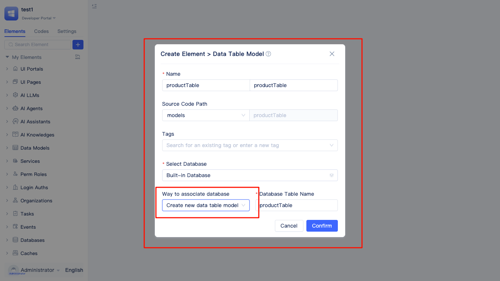
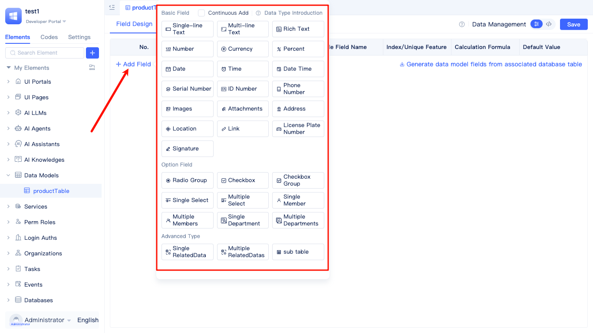
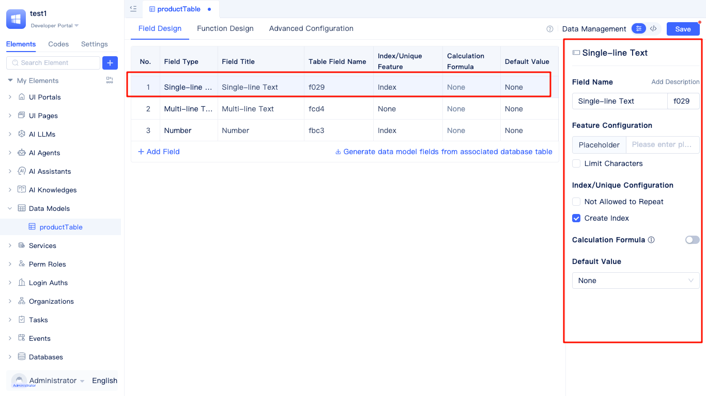
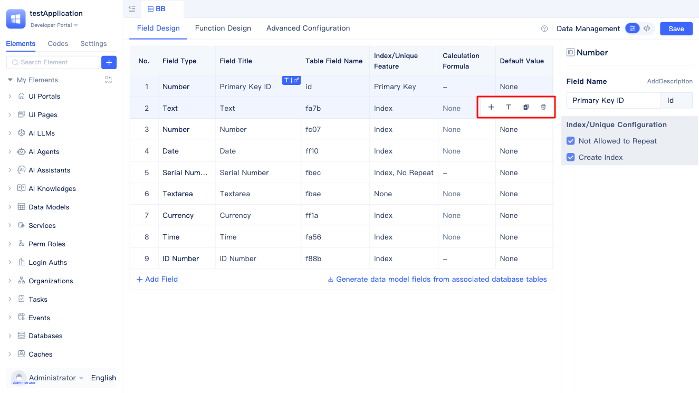
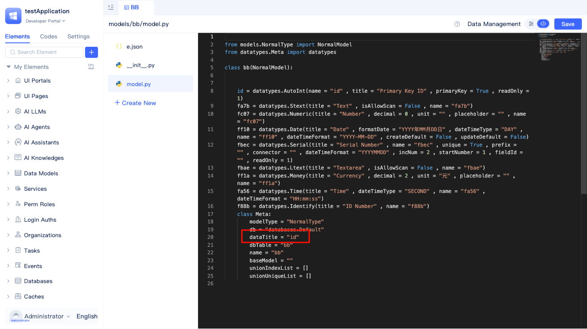
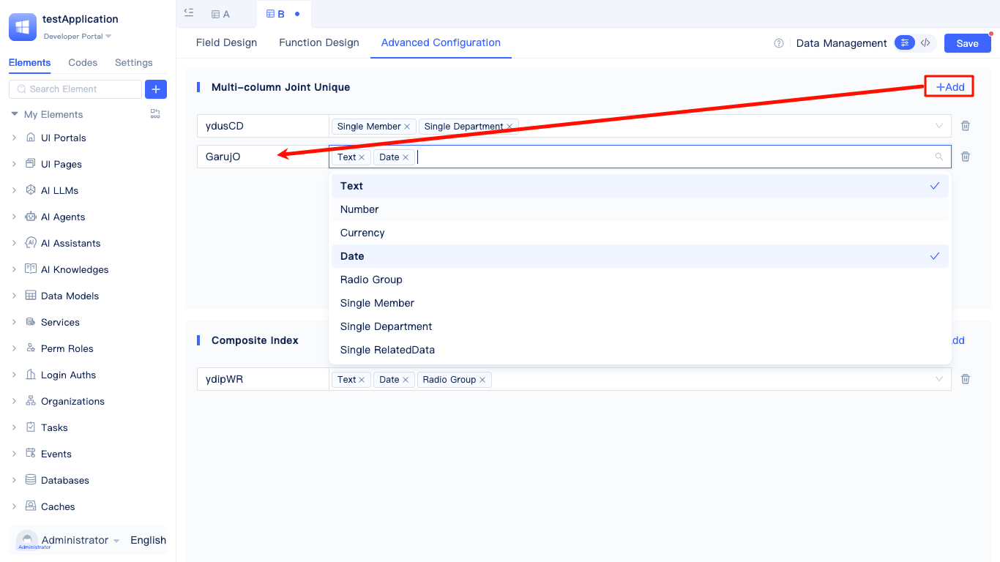
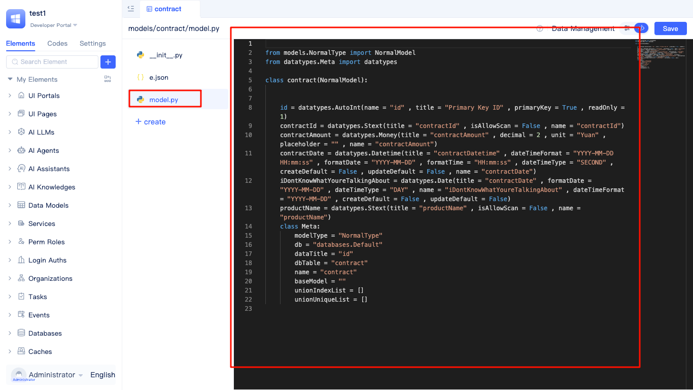

# Creating Data Tables
Data table models constitute the foundational data layer for JitAI applications. Each data table model corresponds directly to a database table, defining the structure, data types, and constraint rules for business data. JitAI offers two distinct approaches for creating data table models: developing new data table models from scratch, which proves ideal for ground-up business data structure design, or generating models from existing database tables, which streamlines the management and extension of legacy data architectures.

## Data table creation entry {#data-table-create-entry}

Navigate to `Data Models` within the development area's element tree, click the `+` button, and select `Data Table Model` to launch the `Create Element > Data Table Model` dialog.

Within the `Create Element > Data Table Model` dialog, specify the model name and select `Create New Data Table Model` as the creation method. The system automatically generates database and table names, although you can select existing database elements and customize the table name according to your requirements.

:::tip 
For creating models from existing tables, see [Creating Data Table Elements from Existing Tables](./create-data-table-from-existing-tables.md)
:::
 

## Designing table fields and data types {#design-table-fields-and-data-types}
JitAI applications provide comprehensive support for various data types including `Single-line Text`, `Multi-line Text`, `Rich Text`, `Number`, `Currency`, and numerous others that function as database table fields.

When architecting data tables, select appropriate field types aligned with your specific business requirements.

Each data type presents distinct configuration options. Consider **Single-line Text** as an exemplar:

The single-line text data type enjoys widespread adoption and represents one of the most fundamental field types in data modeling. Key characteristics encompass: exclusive support for single-line text content without line breaks, automatic field name generation (e.g., `f5f6`) for streamlined database operations, and a default storage capacity of 255 characters. This field type accommodates extensive customization options and constraints, empowering you to configure placeholder text, enforce maximum text length restrictions, ensure field value uniqueness through uniqueness constraints, and establish database indexes for enhanced query performance. Furthermore, single-line text fields support calculation formulas for dynamic computations and default value configurations, addressing diverse requirements across varied business scenarios.

Single-line text fields prove optimal for storing: names, usernames, titles, brief descriptions, and other concise textual information that doesn't necessitate line breaks.

## Field operation buttons {#field-operation-buttons}

Within the data table field configuration interface, hovering over a field row reveals a set of quick-access operation buttons on the right side, enabling developers to efficiently manage fields.

These operation buttons include:

- **Add Field** (`+`) - Quickly inserts a new field below the current field
- **Set as Data Title** (`T`) - Designates the current field as the data title field for this table
- **Duplicate Field** - Creates a copy of the current field, including its type and configuration settings
- **Delete Field** - Removes the current field (system prompts for confirmation to prevent accidental deletion)

:::note Note
Only specific field types can be designated as data titles. See the "Setting data titles" section below for details.
:::

### Setting data titles {#set-data-title}

Designating a field as the data title within a data model enhances the readability and recognizability of data rows in the interface. The data title field value serves as the primary display information for data records, enabling users to quickly identify and distinguish different data rows. The system supports designating the following field types as data titles:

- **Single-line Text** - Ideal for storing names, titles, and other brief textual information
- **Multi-line Text** - Suitable for storing longer descriptive content
- **Serial Number** - System-generated unique identifiers
- **ID Number** - Standard ID number format
- **Phone Number** - Phone number information
- **License Plate Number** - License plate number information
- **Single Choice** - Text content from single-selection options
- **Single Select** - Text content from dropdown selections

Best practice recommends using fields with uniqueness and descriptive qualities as data titles, such as name, title, or ID number fields. These fields possess strong readability and intuitively describe the content of data rows.

When designing data models, you can designate a field as the data title through either visual interface operations or code-based configuration. For full-code adjustments, specify the `dataTitle` attribute within the model definition's Meta section to set the data title field.

:::tip Tip
Each data table model can only designate one field as the data title. If you need to combine multiple fields to represent the data title, consider using computed fields to achieve this.
:::

## Configuring table indexes for query optimization {#configure-table-index-optimization}
Advanced configuration capabilities enable you to incorporate `Multi-column Unique Indexes` and `Composite Indexes` into data tables for optimizing query performance and ensuring data integrity.

### Multi-column composite unique constraints {#multi-column-composite-unique}
Establish composite unique constraints by selecting multiple fields to ensure the combined values maintain uniqueness across the entire table. For example, configuring `Product Name` and `Specification` fields as composite unique prevents duplicate products with identical specifications.

### Composite indexes {#composite-index}
Construct composite indexes by selecting multiple fields. Queries that filter based on these fields simultaneously will experience substantially improved performance.

:::warning Warning
While proper index configuration effectively enhances query speed, excessive indexing can adversely impact data write performance. Maintain an optimal balance based on your specific business scenarios.
:::

## Source code mode {#source-code-mode}
Beyond visual configuration capabilities, the platform provides direct modification of model source code within code mode, delivering enhanced flexibility for advanced developers.

Within source code mode, you can access comprehensive model source code, including model definitions, model functions, and additional components.
