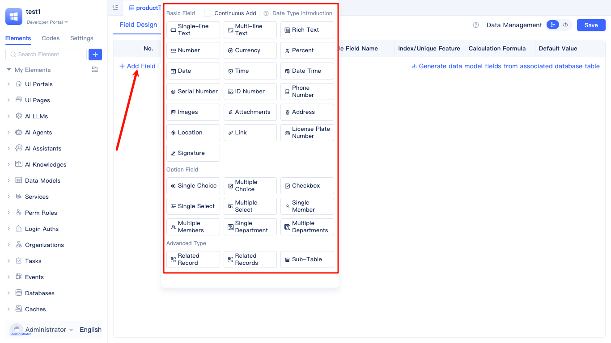

# Creating Data Tables
Data table models constitute the foundational data layer for JitAi applications. Each data table model corresponds directly to a database table, defining the structure, data types, and constraint rules for business data. JitAi offers two distinct approaches for creating data table models: developing new data table models from scratch, which proves ideal for ground-up business data structure design, or generating models from existing database tables, which streamlines the management and extension of legacy data architectures.

## Data table creation entry {#data-table-create-entry}

Navigate to `Data Models` within the development area's element tree, click the `+` button, and select `Data Table Model` to launch the `Create Element > Data Table Model` dialog.

Within the `Create Element > Data Table Model` dialog, specify the model name and select `Create New Data Table Model` as the creation method. The system automatically generates database and table names, although you can select existing database elements and customize the table name according to your requirements.

:::tip 
For creating models from existing tables, see [Creating Data Table Elements from Existing Tables](./create-data-table-from-existing-tables.md)
:::
 

## Designing table fields and data types {#design-table-fields-and-data-types}
JitAi applications provide comprehensive support for various data types including `Single-line Text`, `Multi-line Text`, `Rich Text`, `Number`, `Currency`, and numerous others that function as database table fields.

When architecting data tables, select appropriate field types aligned with your specific business requirements.

Each data type presents distinct configuration options. Consider **Single-line Text** as an exemplar:

The single-line text data type enjoys widespread adoption and represents one of the most fundamental field types in data modeling. Key characteristics encompass: exclusive support for single-line text content without line breaks, automatic field name generation (e.g., `f5f6`) for streamlined database operations, and a default storage capacity of 255 characters. This field type accommodates extensive customization options and constraints, empowering you to configure placeholder text, enforce maximum text length restrictions, ensure field value uniqueness through uniqueness constraints, and establish database indexes for enhanced query performance. Furthermore, single-line text fields support calculation formulas for dynamic computations and default value configurations, addressing diverse requirements across varied business scenarios.

Single-line text fields prove optimal for storing: names, usernames, titles, brief descriptions, and other concise textual information that doesn't necessitate line breaks.

## Configuring table indexes for query optimization {#configure-table-index-optimization}
Advanced configuration capabilities enable you to incorporate `Multi-column Unique Indexes` and `Composite Indexes` into data tables for optimizing query performance and ensuring data integrity.

### Multi-column composite unique constraints {#multi-column-composite-unique}
Establish composite unique constraints by selecting multiple fields to ensure the combined values maintain uniqueness across the entire table. For example, configuring `Product Name` and `Specification` fields as composite unique prevents duplicate products with identical specifications.

### Composite indexes {#composite-index}
Construct composite indexes by selecting multiple fields. Queries that filter based on these fields simultaneously will experience substantially improved performance.

:::warning Warning
While proper index configuration effectively enhances query speed, excessive indexing can adversely impact data write performance. Maintain an optimal balance based on your specific business scenarios.
:::

## Source code mode {#source-code-mode}
Beyond visual configuration capabilities, the platform provides direct modification of model source code within code mode, delivering enhanced flexibility for advanced developers.

Within source code mode, you can access comprehensive model source code, including model definitions, model functions, and additional components.
