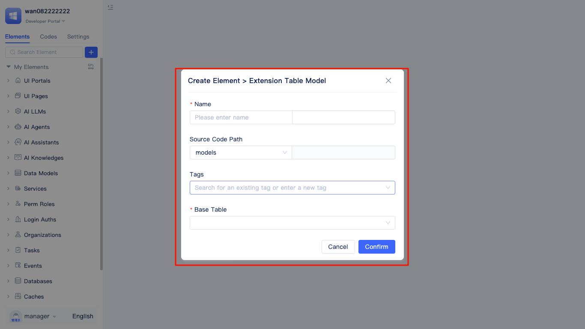
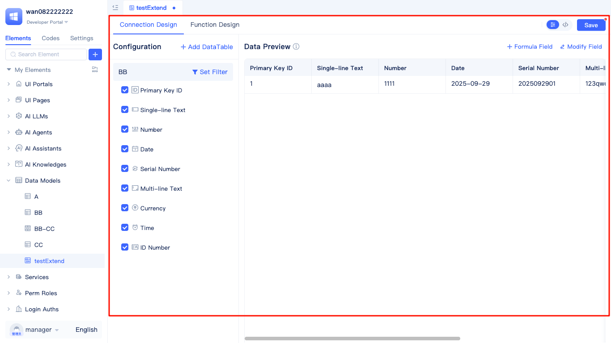
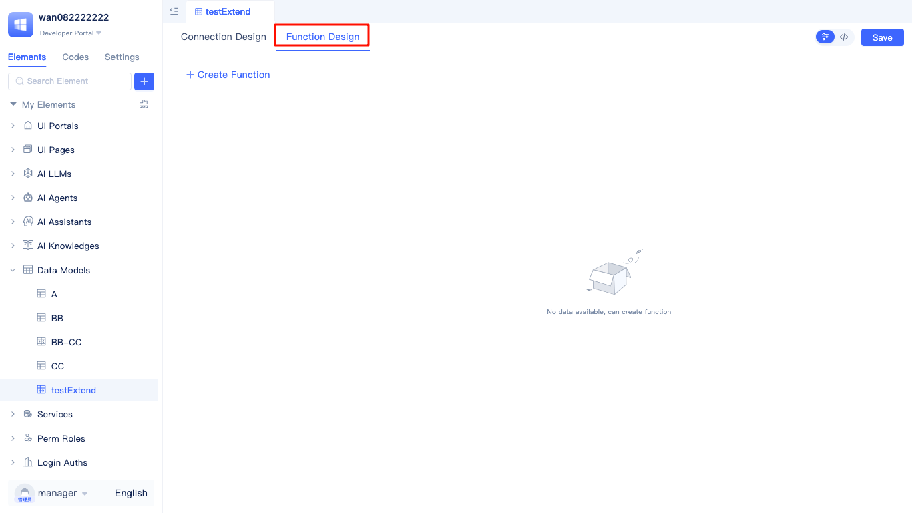

# Extension Table Model
The extension table model is a modeling approach that achieves business field extension and multi-table data integration through flexible association with other data tables without changing the original basic data table structure.

Taking the `Employee Information Table` as an example, it was originally only used to store basic employee information. As business develops, you may need to count dimensional data such as annual sales and number of projects participated by each employee in the `Employee Information Table`, but this information is not directly contained in the `Employee Information Table`. At this time, you can use the extension table model to flexibly associate the `Employee Information Table` with related data tables such as `Sales Records Table` and `Project Participation Table`, dynamically extending statistical fields like `Annual Sales` and `Project Count`. Through this approach, you can centrally display and analyze employees' multi-dimensional business data in the extension table without changing the original table structure, meeting complex data integration and analysis requirements.

The system provides developers with a convenient extension table creation entry in the development area, supporting one-stop creation, configuration, and real-time editing of extension tables. Through visual operations, developers can quickly complete the creation of extension tables, field settings, and association relationship configuration, greatly improving modeling efficiency and flexibility. All configuration changes can be previewed in real-time.

In the element tree of the development area, locate `Data Models`, click the `+` button on the right side, select `extension table Model` from the popup list to open the `Create Element > Extension Table Model` dialog.

In the `Create Element > Extension Table Model` dialog, fill in the extension table name (the system will automatically generate the English name), select a baseline table, and click `Confirm` to complete the creation of the extension table and automatically enter the visual editing interface of the extension table.

In the extension table visual editor, developers can not only flexibly configure the structure and fields of the extension table, but also preview data effects in real-time, facilitating quick validation and design adjustments.

## Connection Design {#connection-design}
On the visual editing page of the extension table, switch to the `Connection Design` tab to flexibly configure the association relationships between the extension table and the baseline table as well as other data tables. You can directly select the baseline table and set filter conditions to limit the data range; you can also add other associated tables and configure matching conditions, data filtering, and sorting rules. All established table connections support adjustment or deletion at any time. After properly designing connection relationships, the extension table can efficiently integrate multi-table data to meet multi-dimensional analysis and modeling requirements. Each change in connection configuration will be reflected in real-time in the data preview window on the right, helping you intuitively verify configuration results.

### Setting Baseline Table Filter Conditions {#set-baseline-table-filter-conditions}
In actual business scenarios, it is often necessary to filter the baseline table data associated with the extension table, such as focusing only on data of a certain status, records within a specific time period, or data from specific departments. By setting baseline table filter conditions, the extension table can focus only on the data subset required by the business, improving the targeting and efficiency of data analysis.

In the `Connection Design` tab of the extension table, developers can click the `Set Filter` button on the right side of the baseline table to enter the filter condition configuration interface. Here, you can flexibly add multiple filter conditions according to actual business needs, such as filtering by status, time interval, department, and other fields. After configuration is complete, click save to take effect, and the extension table will only display data that meets the conditions. After setup is complete, the button name will change to `Modify Filter`. If you need to adjust filtering rules later, you can click to modify at any time, and all changes will be reflected in real-time in the data preview, making it easy for developers to intuitively verify filtering effects

### Adding DataTable {#add-data-table}
In extension table models, it is often necessary to associate multiple related data tables to achieve data integration and statistics. For example, multi-table associations between main tables and sub-tables, or main tables and statistical tables, are suitable for scenarios that require cross-table aggregation, analysis, or supplementing business information. After data tables are added, they will appear in the connection configuration, forming statistical tables.

In the connection configuration interface of the extension table, click the `Add DataTable` button on the right side and select the target data table to be associated. After setting up `Match Conditions`, `Data Filtering` and `Data Sorting`, click `OK` to complete the association and achieve flexible integration of multi-table data.
After successful association, the added data table will appear below the connection configuration list. You can flexibly select the fields that need to be counted and choose appropriate statistical methods for them. The right side will preview the first 50 data records in real-time, helping you intuitively verify the configuration effects.

:::tip Note
extension tables only support adding statistical fields from data tables. If you need to display original field values, please use [Aggregate Tables](./aggregate-table-model#multi-table-horizontal-connection).
:::

### Real-time Editing of Statistics Table Configuration {#real-time-edit-statistics-table-configuration}
After successfully adding data tables, the system supports real-time editing and deletion operations on the added statistics tables. You can flexibly adjust the configuration of statistics tables according to business needs, ensuring the accuracy and flexibility of data integration. The following figure shows how to edit and delete statistics tables in extension tables.

When developers move the mouse to the row where the statistics table name that needs to be edited is located, a `More Actions` button (three dots icon) will automatically appear on the right side. After clicking this button, `Edit` and `Delete` options will pop up. Selecting `Edit` allows you to enter the detailed configuration page of the statistics table, modify matching conditions, filtering rules, and other content, which takes effect immediately after saving. Selecting `Delete` removes the statistics table from the connection configuration of the extension table. Please confirm before operating.

### Field Statistics {#field-statistics}
In the field statistics function of extension tables, developers can flexibly perform statistics and aggregation on different types of fields according to business needs, helping to quickly obtain key data indicators.

When using this feature, first select the associated statistics table in the connection configuration interface of the extension table. Then in the field list, check the fields that need to participate in statistics and select appropriate statistical methods for each field. Different types of fields support different statistical methods: numeric fields can choose sum, average, maximum, minimum and other statistical methods; text fields can perform count or distinct count; date fields support operations such as maximum date and minimum date. After configuration is complete, the right side will display a real-time preview of statistical results, making it convenient for developers to intuitively verify the effects of statistical configuration.

### Adding Formula Fields {#add-formula-field}
In extension tables, developers can add formula fields to achieve flexible calculation and data processing of existing fields, meeting diverse needs such as statistics, conversion, and conditional judgment in business scenarios. Formula fields support various built-in functions and expressions, enabling dynamic generation of new data columns and greatly enhancing the flexibility of data analysis.

In the visual editing interface of the extension table, click `Add Field` and select `Formula Field`. Fill in the formula name in the popup, enter the required calculation expression, and after saving, you can add this formula field to the table structure and preview its calculation results in real-time.

### Modifying Field Aliases {#modify-field-alias}
In extension tables, developers can customize and modify the display names (aliases) of fields according to actual business needs, making the data table structure more aligned with business context and improving readability and usability.

In the visual editing interface of the extension table, click the `Modify Field` button in the upper right corner. After the `Modify Field` panel pops up, you can directly edit and save the display aliases of fields. You can also quickly find target fields through the search box for convenient positioning and modification. After saving, the new field aliases will be immediately updated and displayed in the table, improving the readability and business alignment of the data table.

## Function Design {#function-design}
extension tables support flexible function design, helping developers implement complex data processing, business logic calculation, and custom data output. By writing functions for extension tables, you can perform batch processing, conditional judgment, data transformation, aggregation statistics, and other operations on data within the table, greatly enhancing data modeling capabilities and automation levels.

In the visual editor of the extension table, developers can switch to the `Function Design` tab to enter the function design panel.

### Creating Functions {#create-function}
In the function design panel of extension tables, developers can conveniently create custom functions for implementing complex data processing and business logic.

After clicking the `Create Function` button on the left side of the function design panel, the system will pop up a `Create Function` window. At this time, you only need to enter the function name (the English name will be automatically generated), click `OK` to complete the function creation, and automatically jump to the function design page. The function example here mainly demonstrates the save operation on current model row data, and developers can further improve the function logic according to actual needs.

### Source Code Viewing and Editing {#source-code-view-edit}
extension tables support source code mode, allowing developers to directly view and edit the underlying configuration source code of extension tables, meeting the needs for advanced customization and batch modifications.

In the upper right corner of the function design panel of the extension table, click the `</>` button to enter source code editing mode. At this time, you can directly view and edit all configuration source code of the extension table, and modifications will take effect immediately after saving.
