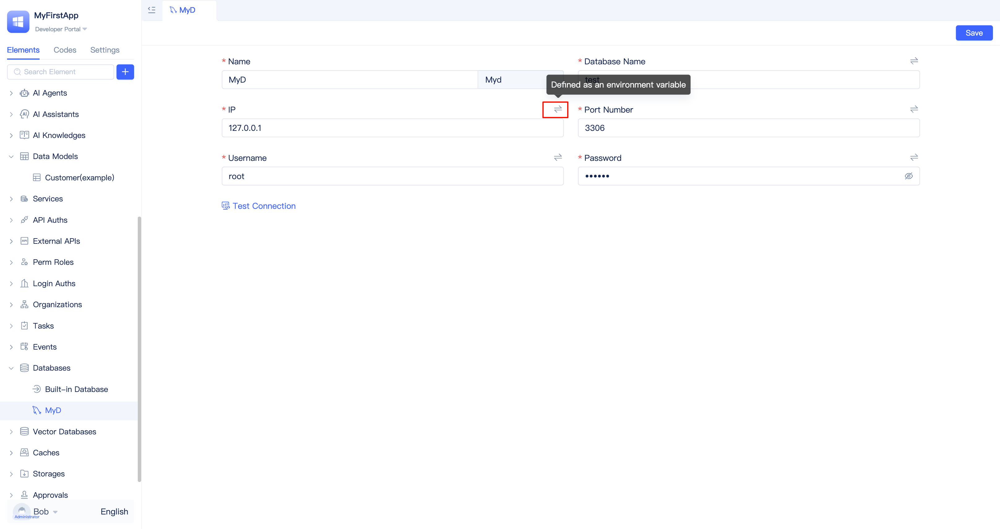
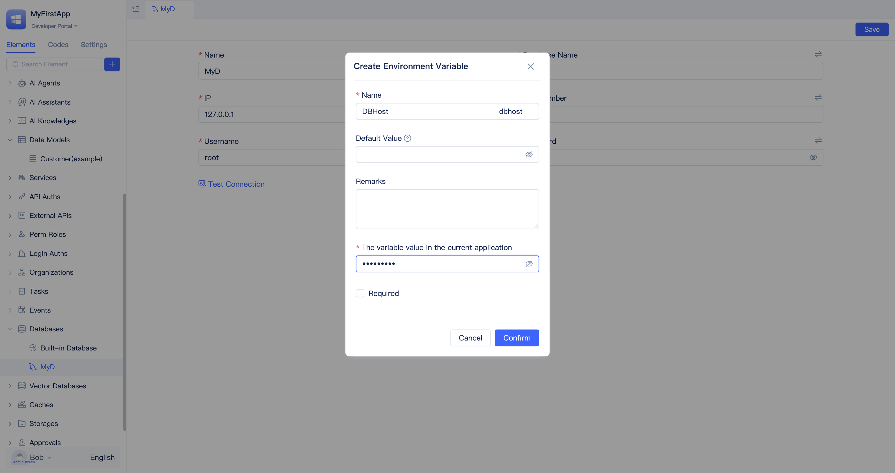

# Managing Database Connections
JitAI provides unified database connection management through database elements. You can create multiple database instances within the same application and configure, switch, and use them separately to meet different scenarios such as development, testing, production, or multi-system integration.

## Creating database connections {#create-database-connection}
Navigate to the application's `Developer Portal` and select the `Databases` element in the element directory tree. Choose the database type you want to connect to (such as MySQL, PostgreSQL, Oracle, SQL Server, DM8, SQLite, etc.). The system will display a connection configuration window where you simply fill in the host, port, database name, username, password, and other information as prompted. For production environments, it's recommended to store sensitive information such as usernames and passwords in environment variables and configure actual values during deployment. This approach is both secure and convenient for cross-environment migration. See [Database connection security configuration](#database-connection-security-configuration) for details.

Below is a demonstration of the steps for creating a MySQL database connection:

## Multi-database connection management {#multi-database-connection-management}
An application supports connecting to multiple database instances simultaneously, which is common in scenarios involving archive databases, log databases, reporting databases, or integration with external systems. After creating different database elements, you can specify which database instance to use in your data model configuration.

In the `Select Database` form field when creating a new data table model, choose the target database element.

## Database connection security configuration {#database-connection-security-configuration}
Connection information should never be written directly into the source code repository, especially usernames and passwords. The recommended approach is to maintain environment variables in the runtime environment and configure actual values during deployment.

Click the toggle icon button in the upper right corner of the connection parameters to switch to environment variables, which will open the environment variable configuration panel. In the configuration panel:

- `Name` is the display name
- `Default Value` is used when no value is set
- `Remarks` describes the current variable
- `The variable value in the current application` is the initial value to ensure normal database connection during development
- When `Required` is checked, the environment variable value must be set before application deployment; otherwise, access will be unavailable

On the database side, also follow the principle of least privilege, granting only the necessary database, table, and operation permissions. Strictly separate production and testing environments, and prioritize using internal networks or VPC dedicated lines for access to avoid exposing service ports to the public internet.

## Connection testing and troubleshooting {#connection-test-and-troubleshooting}
After creating a database element, ensure the connection is available.

On the database element configuration page, click the `Test Connection` button. If the connection fails, troubleshoot by checking whether the host and port are correct, whether firewalls and whitelists allow access, whether the username and password match, and whether the target database exists. Occasional timeouts or unstable connections are usually related to network quality or database load, and you can adjust connection pool parameters accordingly to observe the results.

