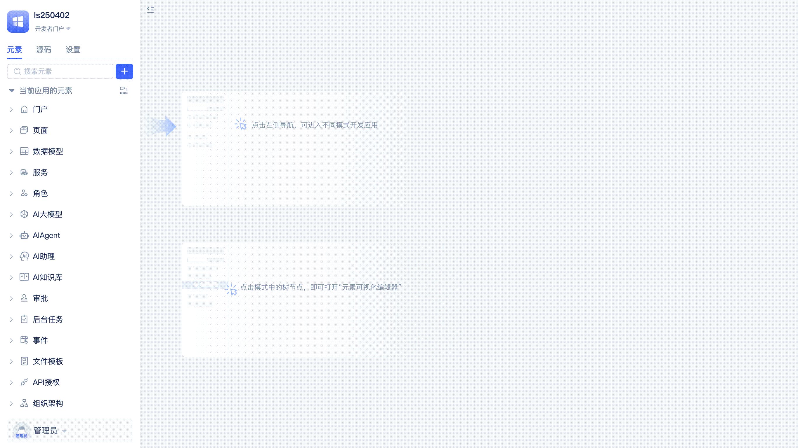
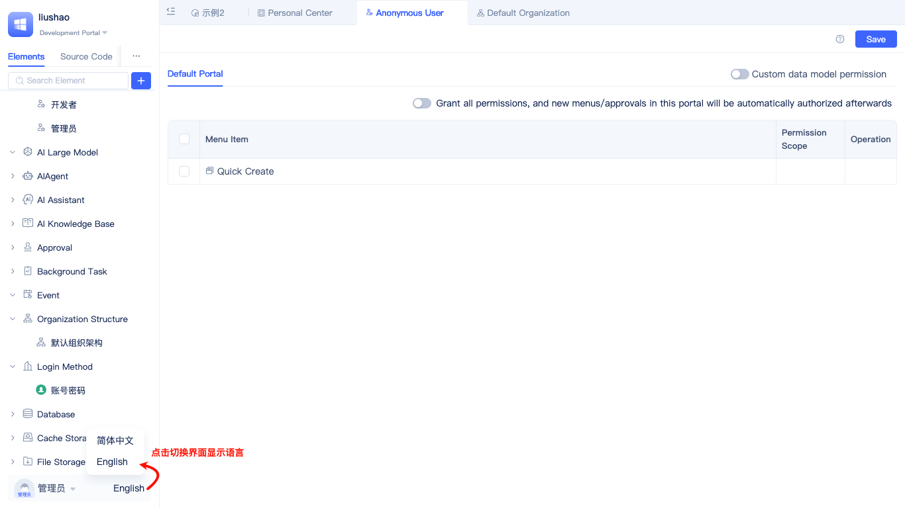

# JitAi Visual Development Tools

JitAi provides developers with dual-mode application development tools that support both visual and full-code development, combining programming and orchestration capabilities (hereinafter referred to as IDE). Developers can access the application development interface by clicking the `Develop` button in the [Node Console](../creating-and-publishing-applications/runtime-environment-management#node-local-default-runtime-environment) of the DevOps management tool or by switching to the `Developer Portal` within the application. The IDE automatically loads the source code of all application modules, allowing developers to perform both visual editing and source code editing simultaneously.

## Element Directory Tree {#element-directory-tree}
After entering the IDE, the left-side element directory tree displays commonly used element types. When expanded, you can see the elements that have been added to the current application.

In the directory tree, developers can search for elements, modify element titles, copy element IDs, export element source code, delete elements, create copies, group using tags, and show/hide inherited application elements.

## Adding Elements {#add-element}

When developers click the `+` button to add elements, they need to select the element's Meta and Type in sequence. Meta is the top-level application module classification, such as portals, pages, data models, etc. Type is the subcategory under Meta, such as regular pages, ai-data-management-page, full-code pages, etc. under the page Meta.

After selecting the element Type, fill in the basic element information (such as name) in the popup, click confirm, and the element will be automatically added to the directory tree and open the visual editor.

## Visual Editor {#visual-editor}
After adding an element or clicking on an element in the element directory tree, you can open the visual editor on the right side of the IDE. As shown in the following example, developers add various standard components in the page editor, configure business functions, and can preview effects in real-time.

The visual editor is provided by the element's Type. Element Type developers design and develop visual editors based on business configuration needs. All official element editors support developers clicking the toggle button in the upper right corner to switch between visual editing and source code editing modes at any time.

## Source Code Editor {#source-code-editor}
When the visual editor cannot meet highly customized editing needs, developers can switch to the source code editor for editing.

The source code editor supports common functions such as syntax highlighting, automatic formatting, side preview, and file creation/deletion/renaming/content editing/saving.

## Source Code File Tree {#source-code-file-tree}
Click the "Source Code" tab in the left area of the IDE to open the source code file tree.

In the source code file tree, developers can perform file search, content find and replace, create new files, create new folders, import folders, folder renaming/copying/moving/exporting/deleting, file renaming/deleting, export application source code, and other operations.

Under the source code file tree view, developers can very conveniently import element source code directories exported from other applications into the current application for reuse.

## Application Settings {#application-settings}
Click the "Settings" tab in the left area of the IDE to open application settings.

In application basic information, developers can set the application's title, logo, inherited applications and versions, and check for inherited application version updates.

In application default elements, developers can set the application's default elements (portal, global styles, database, cache, file storage, login page).

Developers can create new default elements while setting them, for example: creating a new file storage element and setting it as the default file storage to use.

In application environment variables, developers can set the application's environment variable values, which take effect in the current runtime environment after setting.

## Portal Switching {#portal-switching}
Applications provide different functional entries and navigation interfaces by assigning different portals to different user roles. The IDE supports developers switching to different portals at any time during development to verify whether the portal configuration meets expectations.

Click the down triangle icon in the upper left corner of the IDE to select and switch portals.

## Personal Center {#personal-center}
Developers can modify their personal nickname, account, and password in the personal center.

Click the down triangle icon in the lower left corner of the IDE, then click `Basic Information` to open the personal center.

## Language Switch {#language-switch}
Click the language text in the lower left corner of the IDE (English, Simplified Chinese, etc.) to switch the interface language.

Multi-language is one of the elements provided by the JitAi development framework, used not only for IDE internationalization but also for internationalization of any other applications.

## Navigation Tabs {#navigation-tabs}
All interfaces opened in the IDEApp are displayed as navigation tabs.

Developers can quickly switch tabs and perform operations such as close left, close right, close others, close all, and refresh on specified tabs.
