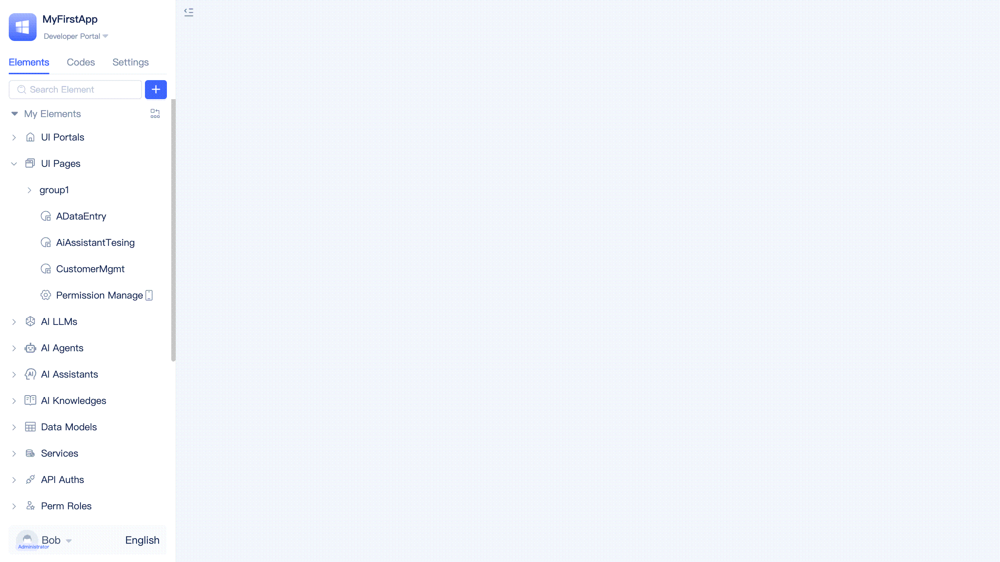

# Visual Development Tool

JitAI provides developers with a comprehensive dual-mode application development environment that seamlessly integrates visual design and full-code development capabilities, combining programming and orchestration workflows (referred to as the IDE). Developers can access the application development interface by clicking the `Develop` button in the [Node Console](../creating-and-publishing-applications/runtime-environment-management#node-local-default-runtime-environment) within the DevOps management tool, or by navigating to the `Developer Portal` within the application. The IDE automatically loads the source code for all application modules, enabling developers to perform both visual editing and source code editing simultaneously.

## Element directory tree {#element-directory-tree}
Upon entering the IDE, the left-side element directory tree displays commonly used element types. When expanded, it reveals all elements that have been added to the current application.

Within the directory tree, developers can search for elements, modify element titles, copy element IDs, export element source code, delete elements, create duplicates, organize using tags, and toggle visibility of inherited application elements.

## Adding elements {#adding-elements}

When developers click the `+` button to add elements, they must sequentially select the element's Meta and Type. Meta represents the top-level application module classification, including portals, pages, data models, and others. Type represents the subcategory within each Meta, such as generic pages, AI data management pages, or full-code pages under the page Meta.

After selecting the element Type, developers fill in the basic element information (such as the name) in the popup dialog, click confirm, and the element is automatically added to the directory tree while opening the visual editor.

## Visual editor {#visual-editor}
After adding an element or clicking on an element in the element directory tree, the visual editor opens on the right side of the IDE. As demonstrated in the following example, developers can add various standard components within the page editor, configure business functionality, and preview effects in real-time.

The visual editor is provided by the element's Type. Element Type developers design and develop visual editors based on specific business configuration requirements. All official element editors support developers in clicking the toggle button in the upper right corner to seamlessly switch between visual editing and source code editing modes at any time.

## Source code editor {#source-code-editor}
When the visual editor cannot accommodate highly customized editing requirements, developers can switch to the source code editor for advanced editing capabilities.

The source code editor provides essential features including syntax highlighting, automatic formatting, side preview, and comprehensive file operations such as creation, deletion, renaming, content editing, and saving.

## Source code file tree {#source-code-file-tree}
Clicking the `Codes` tab in the left panel of the IDE opens the source code file tree.

Within the source code file tree, developers can perform file searches, content find and replace operations, create new files and folders, import folders, and execute folder operations including renaming, copying, moving, exporting, and deleting. Additionally, developers can rename and delete files, as well as export complete application source code.

Under the source code file tree view, developers can conveniently import element source code directories exported from other applications into the current application for efficient code reuse.

## Application settings {#application-settings}
Clicking the `Settings` tab in the left panel of the IDE opens the application settings.

### Basic information {#basic-information}

In the application basic information section, developers can configure the application's title, logo, inherited applications and their versions, and check for inherited application version updates.

### Default elements {#default-elements}

In the application default elements section, developers can configure the application's default elements including portal, global styles, database, cache, file storage, and login page.

Developers can create new default elements during configuration, for example: creating a new file storage element and setting it as the default file storage service.

### Environment variables {#environment-variables}

In the application environment variables section, developers can set environment variable values, which take effect immediately in the current runtime environment upon configuration.

## Portal switching {#portal-switching}
Applications provide different functional entry points and navigation interfaces by assigning distinct portals to various user roles. The IDE enables developers to switch between different portals at any time during development to verify that portal configurations meet expectations.

Click the dropdown arrow icon in the upper left corner of the IDE to select and switch between portals.

## Profile {#profile}
Developers can modify their personal nickname, account credentials, and password within the personal center.

Click the dropdown arrow icon in the lower left corner of the IDE, then select `Profile` to access the personal center.

## Language switching {#language-switching}
Click the language indicator in the lower left corner of the IDE (English, Simplified Chinese, etc.) to switch the interface language.

Multi-language support is one of the core elements provided by the JitAI development framework, utilized not only for IDE internationalization but also for internationalizing any other applications built on the platform.

## Navigation tabs {#navigation-tabs}
All interfaces opened within the IDE are displayed as navigation tabs for efficient workflow management.

Developers can quickly switch between tabs and perform operations such as close left, close right, close others, close all, and refresh on specific tabs.
