# Configuring Your Own File Storage Service {#configuring-your-own-file-storage-service}
File upload and usage is a core functionality of web applications, widely used in scenarios such as attachment uploads, avatar management, and image previews. JitAi provides developers with a complete file storage solution, supporting 7 storage methods: alioss, EOS, MinIO, Qiniu Cloud, AWS S3, Cloudflare R2, and disk storage.

## Local Storage Configuration {#local-storage-configuration}
Local disk storage saves file resources in the server's local disk. The system automatically generates 30×30 pixel and 300×300 pixel thumbnails for uploaded images while preserving the original size images. JitAi intelligently selects appropriate image sizes based on different usage scenarios, effectively saving network bandwidth and improving page loading speed.

### Adding Local Storage {#add-local-storage}
JitAi supports adding storage services in the following two locations:

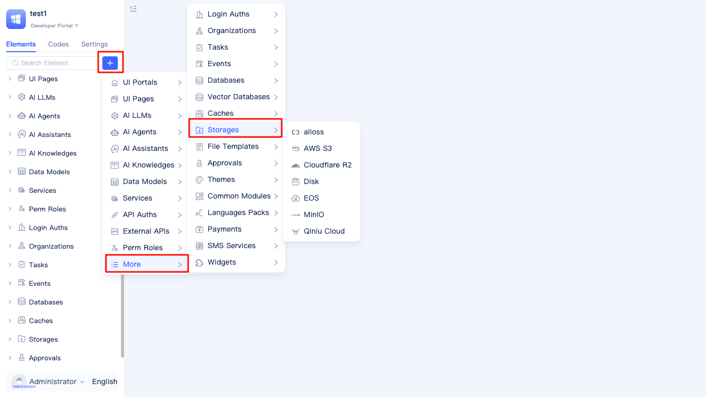

Hover the mouse over the `+` button to the right of "Search Elements", select `Storages` from the `More` menu, then select `Storages` type.

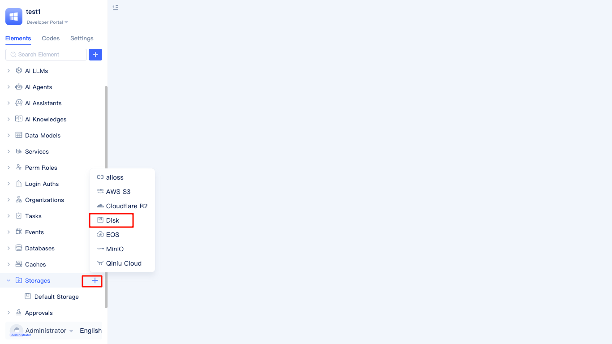

Place the mouse over the `+` button to the right of the `Storages` menu in the menu bar, and directly select `disk` type in the popup panel.

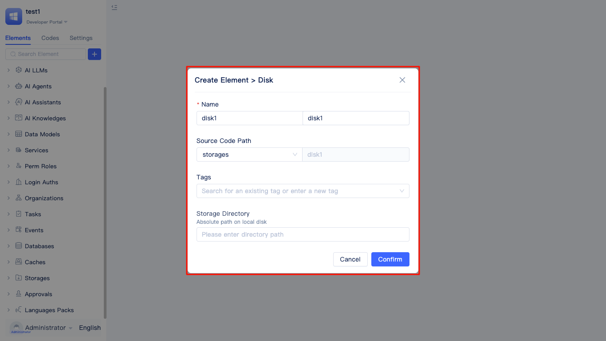

In the popup New Disk Storage panel, fill in the name. JitAi will automatically translate it, and users can also specify the English name themselves. The default element path can be used.
:::tip
The element path is the location where the storage service configuration file is stored, while the storage directory is the location where images, attachments, and other files are actually stored.
:::

### Specifying Disk Storage Directory {#specify-disk-storage-directory}
The storage directory is by default under the appData/storages/storage_directory_english_name directory:

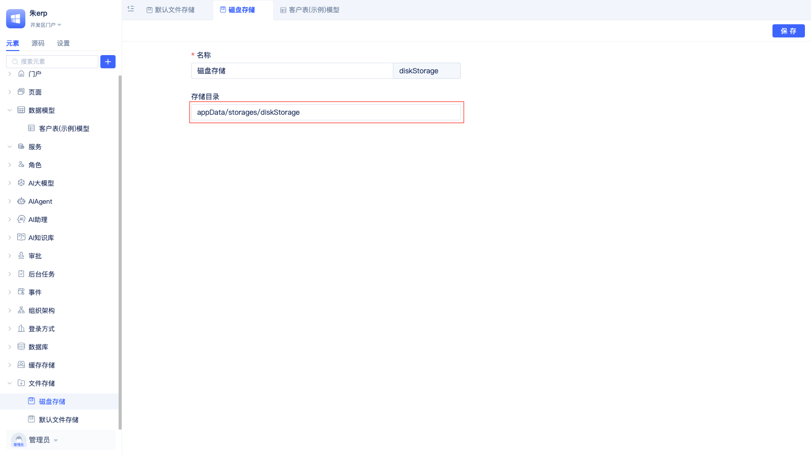

Developers can also specify their own file storage directory in the storage directory.

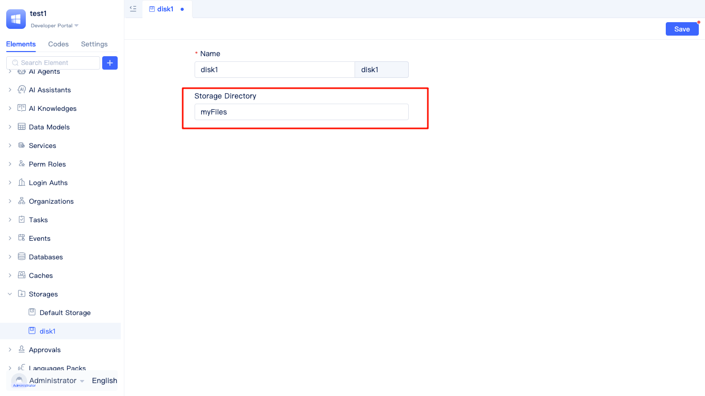

The file storage path is on disk, located under the root directory of the current application.


## Cloud Storage Service Configuration {#cloud-storage-service-configuration}
Compared to local storage, cloud storage has advantages such as not occupying server disk space and convenient file sharing. It is particularly suitable for business scenarios that require high concurrent access and large capacity storage, such as e-commerce platform product image display, online education video courses, and enterprise document management systems.

### Alibaba Cloud OSS {#aliyun-oss} 
Prerequisites for using Alibaba Cloud OSS:
1. Activate Alibaba Cloud OSS service
2. Create accessKeyId and accessKeySecret
3. Configure public read permissions for the bucket in the Alibaba Cloud OSS console


Place the mouse on the `Storages` menu, then place the mouse on the `+` button on the right side, and select `alioss`.

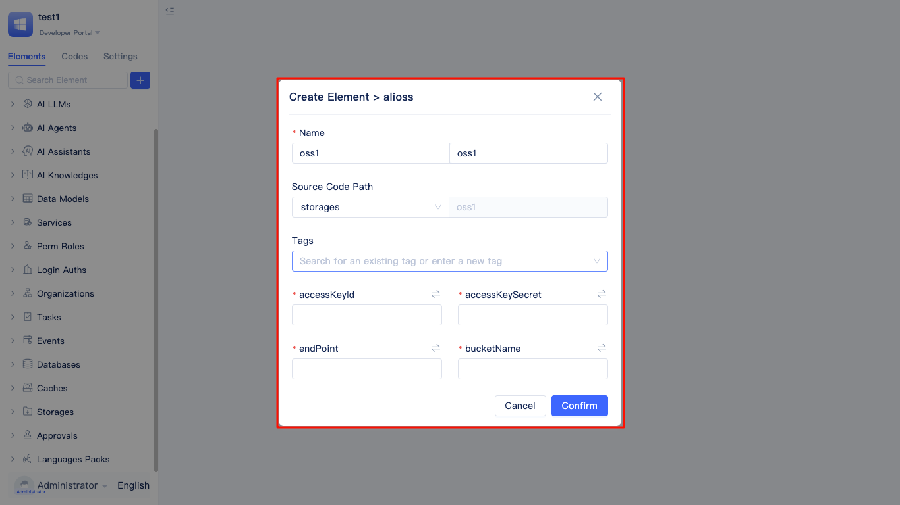

In the Alibaba Cloud OSS configuration panel, configure parameters such as filename, element path, accessKeyId, accessKeySecret, endPoint, and bucketName.

### EOS {#china-mobile-cloud-eos}
The method to trigger the EOS configuration panel is the same as Alibaba Cloud OSS, and the configuration parameters are also the same.

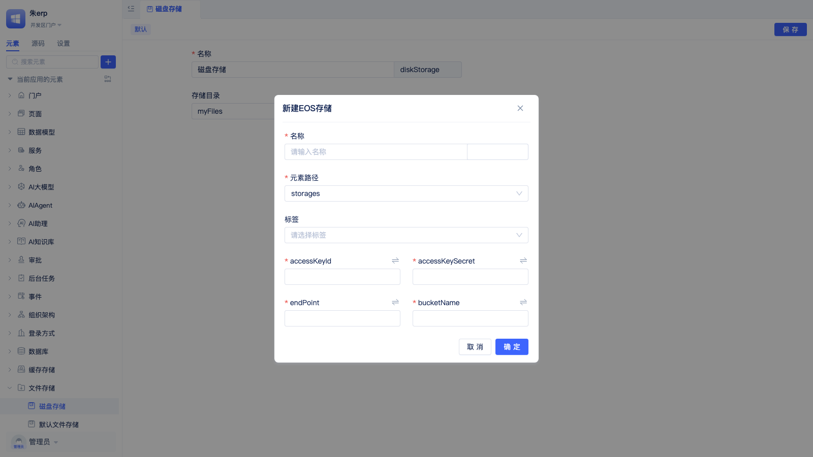

### MinIO {#minio}
The method to trigger the MinIO configuration panel is the same as Alibaba Cloud OSS, and the configuration parameters are basically the same, except for an additional scheme parameter.


### Qiniu Cloud {#qiniu-cloud}
The method to trigger the Qiniu Cloud configuration panel is the same as Alibaba Cloud OSS, and the configuration parameters are basically the same, except for an additional scheme parameter. 

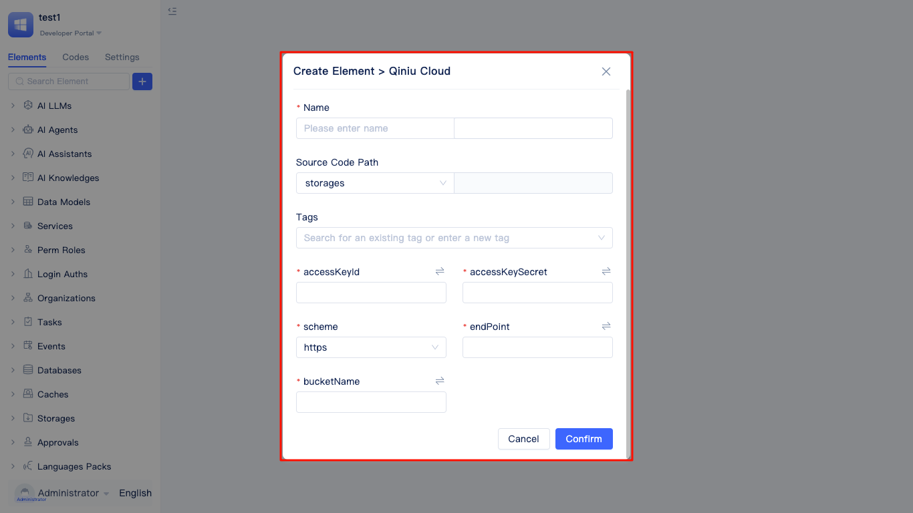

### AWS S3 {#aws-s3}

The method to trigger the AWS S3 configuration panel is similar to Alibaba Cloud OSS. Configuration parameters include accessKeyId, accessKeySecret, endPoint, bucketName, region, etc. Please fill in the relevant parameters according to the actual AWS S3 console information.

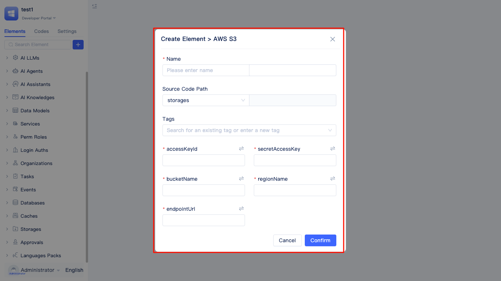

### Cloudflare R2 {#cloudflare-r2}

The configuration method for Cloudflare R2 is basically the same as AWS S3. You need to fill in parameters such as accessKeyId, accessKeySecret, endPoint, bucketName, region, etc. It is recommended to refer to the official Cloudflare R2 documentation for detailed configuration information.

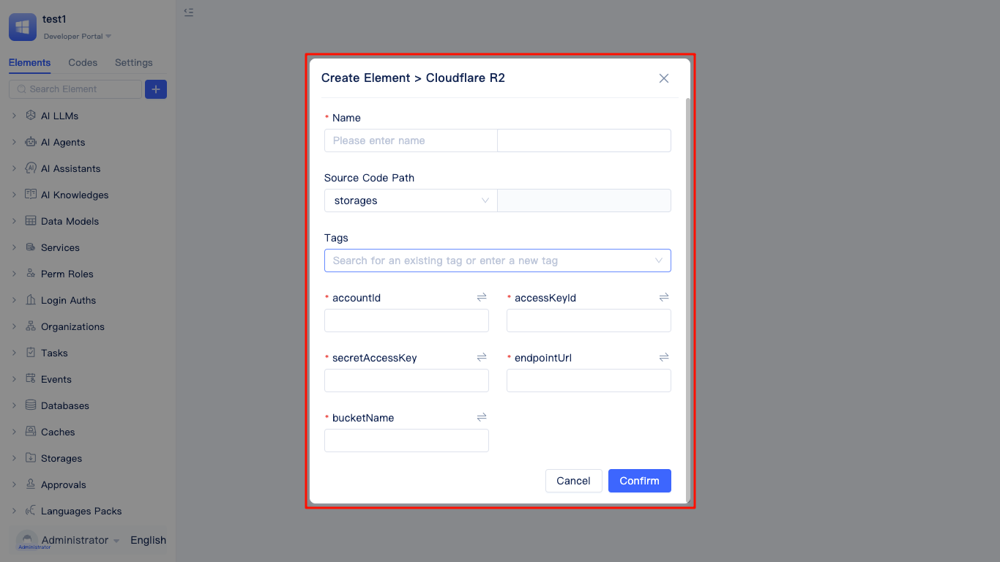

### Using Environment Variables to Prevent Configuration Information Leakage {#prevent-config-info-leak-with-env-variables}
To improve security, it is recommended to convert cloud service configuration parameters (such as accessKeyId, accessKeySecret, etc.) into environment variables to avoid exposing sensitive information in the code. JitAi supports one-click conversion of cloud service parameters to environment variables.

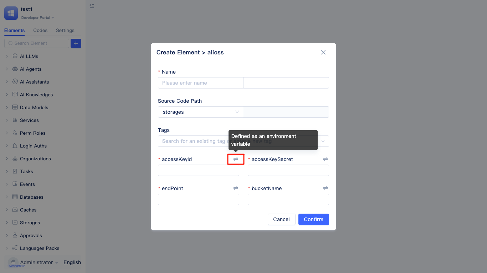

Click the conversion button to the right of the parameter to bring up the create environment variable panel.

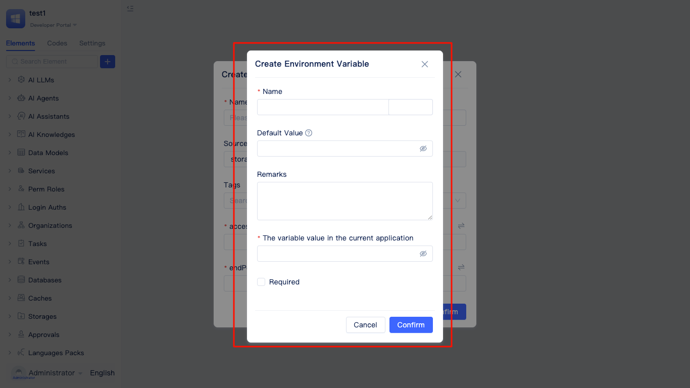

After setting the name and variable value, click the `Confirm` button.

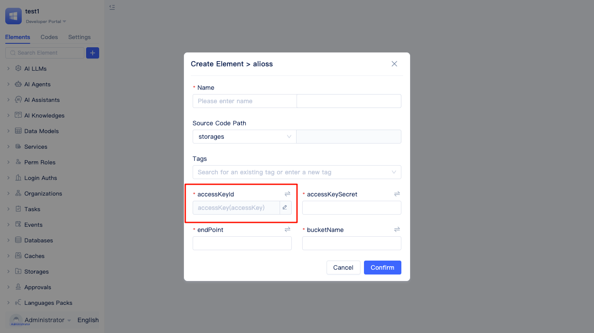

The variable displayed on the page will change to the environment variable name just created.

## Setting the Application's Default Storage Service {#set-application-default-storage-service}
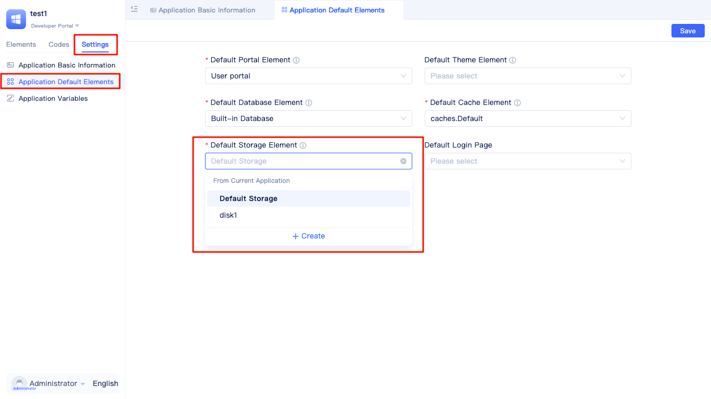

In the development area, click the "Settings" tab, click the application's "Default Elements", and switch the default file storage service in the dropdown box under "Default File Storage". JitAi's built-in image and attachment data types will store files to the default storage service.

:::warning Note
Changing the default file storage will result in data loss for previously stored images, attachments, and other field data. You should first backup or migrate previously stored images, attachments, and other files before switching the default storage service.
:::

## Calling File Upload in Frontend Code {#call-file-upload-in-frontend-code}
Under normal circumstances, users can directly use the file storage service after configuring it.
In full-code pages, you can obtain file URL addresses through data query interfaces for file viewing or downloading.
If you need to upload files in full-code pages, please refer to the following example:

```javascript
import { message } from 'antd';
import { getRuntimeApp } from 'jit';

export default async (file: Record<string, any>, ...args: Array<any>) => {
    const app = getRuntimeApp();
    const el = await app.getElement(app.settings.defaultElement.defaultStorage);
    if (!el) {
        return message.error('Please set the default file storage in "Application Default Elements"');
    }
    return await el?.uploadFile(file, ...args);
};
```

Note: await app.getElement() can use the storage service's fullName as a parameter to get non-default storage services. The storage service's fullName can be found in the response value of the getAppInfo interface by searching for the storage service name.

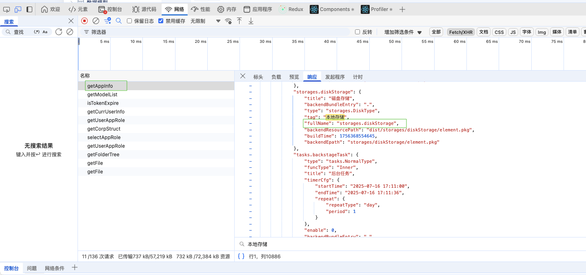

