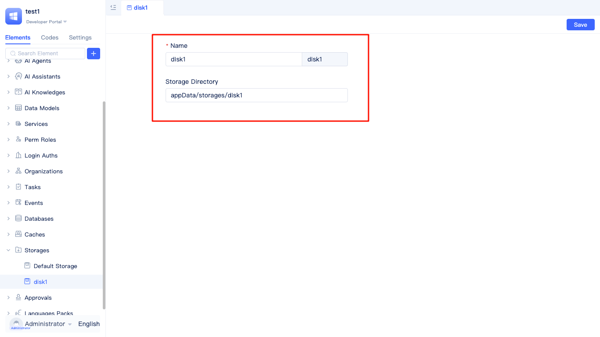
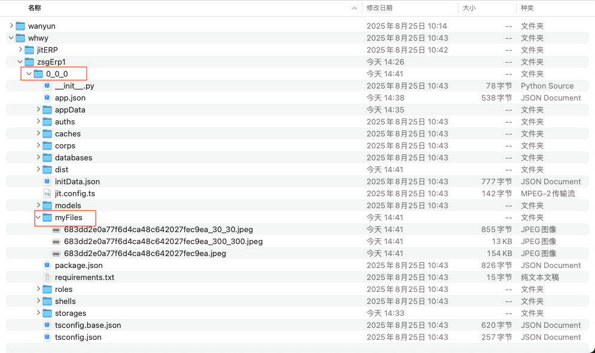
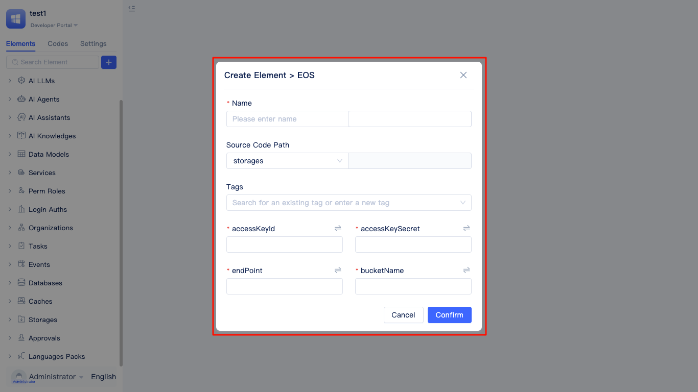

# 配置自己的文件存储服务
文件上传与使用是Web应用的核心功能，广泛应用于附件上传、头像管理、图片预览等场景。JitAi为开发者提供了完整的文件存储解决方案，支持阿里云OSS、移动云EOS、MinIO、七牛云存储以及本地磁盘存储共5种存储方式。

## 本地存储配置 {#local-storage-configuration}
本地磁盘存储将文件资源保存在服务器本地磁盘中。系统会自动为上传的图片生成30×30像素、300×300像素的缩略图以及保留原始尺寸图片。JitAi会根据不同使用场景智能选择合适的图片尺寸，有效节约网络带宽并提升页面加载速度。

### 添加本地存储 {#add-local-storage}
JitAi支持在以下两个地方添加存储服务：


鼠标悬停在"搜索元素"右边的 `+`按钮上，在"更多"菜单中选择"文件存储"，然后选择磁盘存储类型。


鼠标放在菜单栏中的"文件存储"菜单右边的 `+`按钮上，在弹出的面板中直接选择磁盘存储类型。


在弹出的新建磁盘存储面板中，填写名称，JitAi会自动翻译，用户也可以自己指定英文名，元素路径使用默认路径即可。
:::tip
元素路径是存储服务配置文件的存放位置，而存储目录是实际存放图片、附件等文件的位置。
:::

### 指定磁盘存储目录 {#specify-disk-storage-directory}
存储目录默认在 appData/storages/存储目录英文名 目录下：



开发者也可以在存储目录中自己指定文件的存储目录。


文件存储路径在磁盘中，位于当前应用的根目录下。



## 云存储服务配置 {#cloud-storage-service-configuration}
相比于本地存储，云存储具有不占用服务器磁盘空间、方便文件共享等优点。特别适用于电商平台商品图片展示、在线教育视频课程、企业文档管理系统等需要高并发访问和大容量存储的业务场景。

### 阿里云OSS {#aliyun-oss} 
使用阿里云OSS的前置条件：
1. 开通阿里云OSS服务
2. 创建accessKeyId和accessKeySecret
3. 在阿里云OSS控制台中为bucket配置公共读取权限


鼠标放到"文件存储"菜单上，然后鼠标放到右侧的 `+` 按钮上，选择alioss存储。


在阿里云OSS配置面板中，配置文件名、元素路径、accessKeyId、accessKeySecret、endPoint、bucketName等参数。

### 移动云EOS {#china-mobile-cloud-eos}
触发移动云EOS配置面板的方式和阿里云OSS一样，配置参数也一样，可参考 [阿里云OSS](#aliyun-oss)



### MinIO
触发MinIO配置面板的方式和阿里云OSS一样，配置参数基本一样，只是多了scheme参数，可参考 [阿里云OSS](#aliyun-oss)


### 七牛云 {#qiniu-cloud}
触发七牛云配置面板的方式和阿里云OSS一样，配置参数基本一样，只是多了scheme参数，可参考 [阿里云OSS](#aliyun-oss)


### 用环境变量防止配置信息泄露 {#prevent-config-info-leak-with-env-variables}
为了提高安全性，建议将云服务配置参数（如accessKeyId、accessKeySecret等）转换为环境变量，避免在代码中暴露敏感信息。JitAi支持一键转换云服务参数为环境变量。


点击参数右边的转换按钮，弹出创建环境变量面板。


设置完名称和变量值后，点击`确定`按钮。


页面上展示的变量，就会变成刚才创建的环境变量名称。

## 设置应用默认的存储服务 {#set-application-default-storage-service}


在开发区，点击"设置"页签，点击应用"默认元素"，在"默认文件存储"栏下拉框中切换默认文件存储服务。JitAi自带的图片和附件数据类型，会把文件存储到默认的存储服务中。

:::warning 注意
更改默认文件存储会导致之前的图片附件等字段存储的数据丢失，应先备份或迁移好之前存储的图片、附件等文件再切换默认存储服务。
:::

## 在前端代码中调用文件上传 {#call-file-upload-in-frontend-code}
一般情况下，用户配置好文件存储服务后即可直接使用。
在全代码页面中，可以通过数据查询接口获取文件的URL地址，用于文件查看或下载。
如果需要在全代码页面中上传文件，可参考以下示例：

```javascript
import { message } from 'antd';
import { getRuntimeApp } from 'jit';

export default async (file: Record<string, any>, ...args: Array<any>) => {
    const app = getRuntimeApp();
    const el = await app.getElement(app.settings.defaultElement.defaultStorage);
    if (!el) {
        return message.error('请在「应用默认元素」中设置默认文件存储');
    }
    return await el?.uploadFile(file, ...args);
};
```

注意：await app.getElement() 可以使用存储服务的fullName作为参数, 获取非默认的存储服务。存储服务的fullName可以在getAppInfo接口的响应值中根据存储服务名搜索到。


