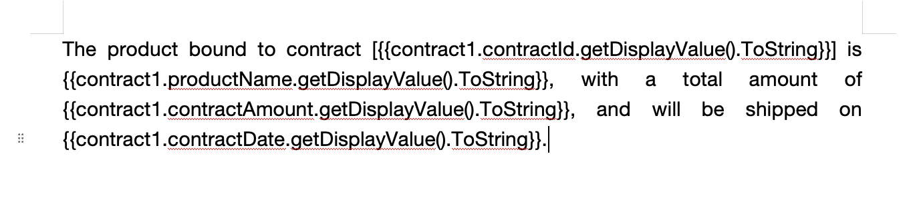
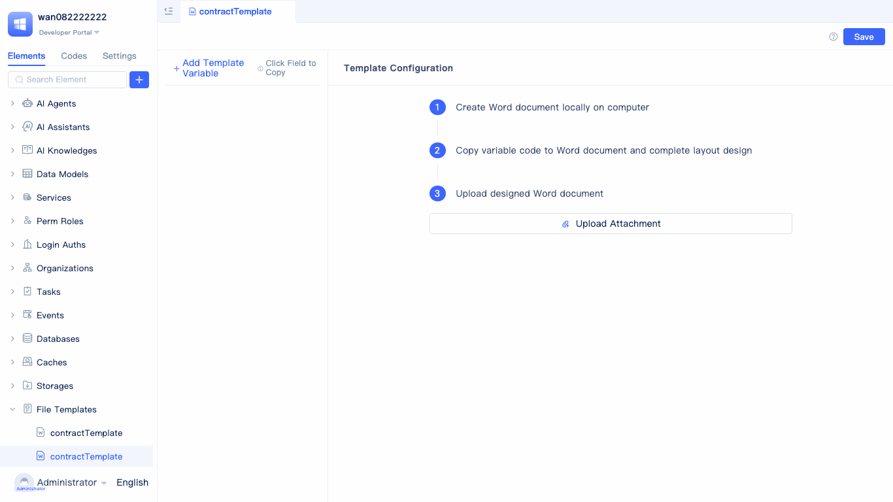
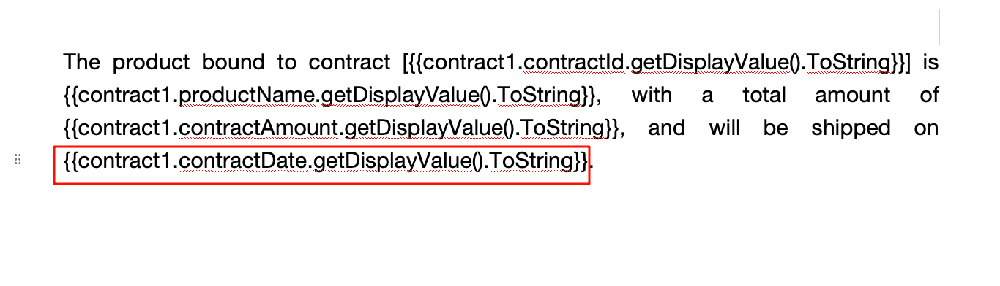
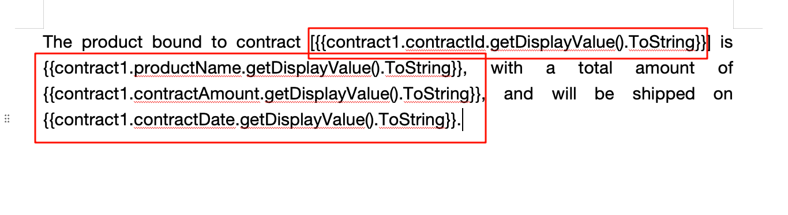
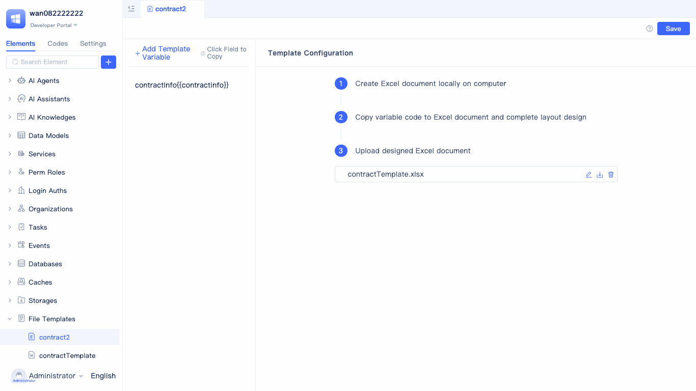
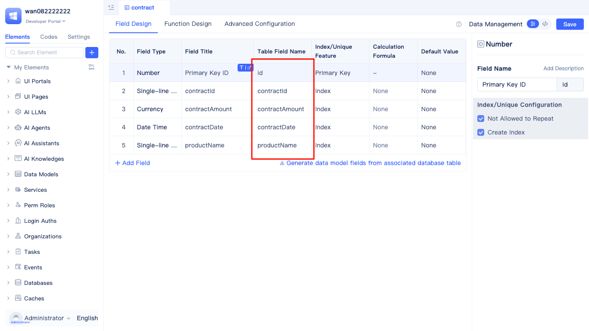

# Creating File Templates {#file-template}
File templates are document generation tools that achieve dynamic content filling through preset variables, and can be used to dynamically generate sales contracts, production work orders, and invoice documents.
JitAi supports Word templates and Excel templates.

## Word Template {#word-template}
When procurement and sales staff prepare contracts for different customers, the contract format is fixed but customer information and order content vary. Through Word templates, you can set variables such as customer names, product names, quantities, and amounts to quickly generate personalized contract documents.

 
A created Word template consists of the following 2 components:
1. Template variables, where variable names, [data types](../../reference/framework/JitORM/data-types), and [data table models](../data-modeling/data-table-model) are set in the variables.
2. Word document, where template variables are used in the Word document, and data replacement is performed according to the template variable names in the Word document when calling the print service.

Original data used in this document:

Word document configured with template variables:

Print effect display:

### Creating Word Template {#create-word-template}

Place the mouse over the `+` button, select Word template in the "More" option, "File Templates" sub-option.

Fill in the template name in the New Word Template dialog box, then click `Confirm`.

### Creating Word Template Variables {#create-word-template-variables}

Click the `+ Add Template Variable` button, and fill in the variable name and [data types](../../reference/framework/JitORM/data-types) in the popup dialog.

:::tip
Advanced data types, such as single-row data and multi-row data, require configuring the target data model.
:::

The configured template variables are as follows:

### Using Template Variables in Word Documents {#use-template-variables-in-word}
Using template variables in Word documents requires the following three steps:

Create a Word document on your local computer (currently JitAi only supports .docx format files), copy variable codes to the Word document and complete layout design, then upload the designed Word document to the platform.

#### Copying Template Variables from JitAi Platform {#copy-template-variables-in-word}

Place the mouse over the variable name, click copy to copy the variable code, and select "Display Single-line Text" in the "Value" option of the dropdown panel.

:::tip
"Display Single-line Text" is a commonly used display style for template variables, where the variable's value is displayed as single-line text in the document.

JitAi supports **30+ template variable styles**, including text processing, numerical calculations, date formatting, list operations, etc., helping you achieve various complex data display requirements. For detailed usage, please refer to: [Template Variable Style Description](#template-variable-style-description).
:::

#### Using Variables in Word Documents: {#use-variables-in-word}

Copy and paste other variables:

Final Word document content:

#### Upload the Configured Word Document. {#upload-configured-word-document}

:::info Generating and Printing Files
After template creation is complete, for detailed instructions on how to generate and print files, please refer to: [Generating and Printing Files Using File Templates](./generating-and-printing-files-using-file-templates)
:::

## Excel Template {#excel-template}
When the finance department creates monthly sales reports, the report format is fixed but data needs to be dynamically filled. Through Excel templates, you can set variables such as sales personnel, product categories, sales quantities, and amounts to quickly generate standardized sales analysis reports.

Original data used in this document:

Excel document configured with template variables:

:::info Generating and Printing Files
After template creation is complete, for detailed instructions on how to generate and print files, please refer to: [Generating and Printing Files Using File Templates](./generating-and-printing-files-using-file-templates)
:::

### Creating Excel Template {#create-excel-template}
Creating Excel templates is the same as creating Word templates.

Place the mouse over the `+` button, select Excel template in the "More" option, "File Templates" sub-option.

A created Excel template consists of the following 2 components:
1. Template variables, where variable names, [data types](../../reference/framework/JitORM/data-types), and [data table models](../data-modeling/data-table-model) are set in the variables.
2. Excel document, where template variables are used in the Excel document, and data replacement is performed according to the template variable names in the Excel document when calling the print service.

### Creating Excel Template Variables {#create-excel-template-variables}

Click the `+ Add Template Variable` button, and fill in the variable name and [data types](../../reference/framework/JitORM/data-types) in the popup dialog.

The configured variables are shown below:

### Using Template Variables in Excel Documents {#use-template-variables-in-excel}
Using template variables in Excel documents requires the following three steps:
Create an Excel document on your local computer (currently JitAi only supports .xlsx format files), copy variable codes to the Excel document and complete layout design, then upload the designed Excel document to the platform.

#### Copying Template Variables from JitAi Platform {#copy-template-variables-in-excel}

Place the mouse over the variable name, click copy to copy the variable code, and select "Display Multi-row Data" in the "Value" option of the dropdown panel.

:::tip
"Display Multi-row Data" displays values in the document through loop statements to show multiple rows and columns.

JitAi supports **30+ template variable styles**, including text processing, numerical calculations, date formatting, list operations, etc., helping you achieve various complex data display requirements. For detailed usage, please refer to: [Template Variable Style Description](#template-variable-style-description).
:::

 
#### Pasting Variables in Excel Documents {#paste-variables-in-excel}

Paste the variables just copied in the Excel file, and adjust the variable order in the second row to correspond with the table headers. The variable names in the second row correspond to the table field names in the target table model.

:::tip
1. If landscape printing is needed, adjust the paper orientation directly in the Excel file. After setting variables, you can first use the print preview function to preview the final print effect.
2. For specific styles such as displaying images/hyperlinks/multi-row data, pay attention to checking whether the corresponding variable output can meet the data requirements.
3. When performing template code layout design, reserve sufficient cell size for expected output data such as multi-line text/images.
:::

Target table model variable names:

#### Upload the Adjusted Excel Document {#upload-configured-excel-document}

## Template Variable Style Description {#template-variable-style-description}
### Text Styles {#text-style}
| Type | Title | Function Name | Notes | Template Code |
|------|-------|--------------|--------|--------------|
| Text | Display Single-line Text | ToString | Display corresponding input as single-line text | `{{a.value.ToString}}` |
| Text | Display Multi-line Text | ToLine | Convert to multi-line text display based on line breaks in input | `{{a.value.ToLine}}` |
| Text | Display Image | ToPicture | Convert corresponding input to image display | `{{a.value.ToPicture}}` |
| Text | Display Hyperlink | ToLink | Convert corresponding input to hyperlink display | `{{a.value.ToLink}}` |
| Text | Display Dropdown Value | ToSelect | Convert corresponding input to dropdown display | `{{a.value.ToSelect}}` |
| Text | Equal Width Line Break | ToEquallyLine(int) | Line break corresponding input according to specified length, no line break by default | `{{a.value.ToEquallyLine(int)}}` |
| Text | Left Truncate Specified Length | ToTrimLeft(int) | Truncate corresponding input to specified length for display, no truncation by default | `{{a.value.ToTrimLeft(int)}}` |
| Text | Right Truncate Specified Length | ToTrimRight(int) | Truncate corresponding input to specified length for display, no truncation by default | `{{a.value.ToTrimRight(int)}}` |
| Text | Generate QR Code | genQrCode() | Generate QR code based on text content | `{{a.value.genQrCode()}}` |
| Text | Generate Barcode | genBarcode() | Generate barcode based on text content, requires barcode type (codeType) | `{{a.value.genBarcode(codeType="EAN13")}}` |

### Numeric Styles {#numeric-style}
| Type | Title | Function Name | Notes | Template Code |
|------|-------|--------------|--------|--------------|
| Numeric | Display Number | ToNum | Display input number directly | `{{a.value.ToNum}}` |
| Numeric | Keep Specified Decimal Places | ToRound(int) | Keep specified digits of input number (round), default no retention means keep all | `{{a.value.ToRound(int)}}` |
| Numeric | Truncate Specified Digits | ToTruncate(int) | Keep specified digits of input number (truncate), default no retention means no truncation | `{{a.value.ToTruncate(int)}}` |
| Numeric | Take Absolute Value | ToAbs | Take absolute value of input number | `{{a.value.ToAbs}}` |

### Date-Time Styles {#date-time-style}
| Type | Title | Function Name | Notes | Template Code |
|------|-------|--------------|--------|--------------|
| Date-Time | Display Date-Time Format | ToDatetime | Display in year-month-day hour-minute-second YYYMMDDthhmmss format | `{{a.value.ToDatetime}}` |
| Date-Time | Display Date Format | ToDate | Display in year-month-day YYYYMMDD format | `{{a.value.ToDate}}` |
| Date-Time | Display Time Format | ToTime | Display in hour-minute-second thhmmss format | `{{a.value.ToTime}}` |

### Multi-Value Styles (Complex Types) {#multi-value-complex-types}
| Type | Title | Function Name | Notes | Template Code |
|------|-------|--------------|--------|--------------|
| List | Display Multi-row Data | ToDataSet | Display corresponding input as data set (multi-row template, dictionary regardless of horizontal/vertical, multi-row multi-column display) | ` {{each.name}} {{each.age}} ` |
| List | Display List Horizontally | ToList | Display data set horizontally (multi-cell adaptation) (default text value display) | ` {{each}} ` |
| List | Display List Vertically | ToList | Display data set vertically (multi-cell adaptation) (default text value display) | ` {{each}} ` |
| List | Display Image List Horizontally | ToListPicture | Display image data set horizontally | `{{a.value.ToListPicture}}` |
| List | Display Image List Vertically | ToListColumnPicture | Display image data set vertically | `{{a.value.ToListColumnPicture}}` |
| List | Display First Data of List | ToFirst | Display the first object in corresponding input collection (default text value display) | `{{a.value.ToFirst}}` |
| List | Display First Image of List | ToFirstPicture | Display the first object in corresponding input collection (using image rendering) | `{{a.value.ToFirstPicture}}` |
| List | Display List Maximum Value | ToMax | Get maximum value of corresponding input collection | `{{a.value.ToMax}}` |
| List | Display List Minimum Value | ToMin | Get minimum value of corresponding input collection | `{{a.value.ToMin}}` |
| List | Display List Average Value | ToAvg | Get average value of corresponding input collection | `{{a.value.ToAvg}}` |
| List | Display List Sum | ToSum | Get sum of corresponding input collection | `{{a.value.ToSum}}` |
| List | Display List Count | ToCount | Get count of corresponding input collection | `{{a.value.ToCount}}` |
| Dictionary | Display Dictionary Horizontally | ToDictionary | Display dictionary data horizontally | `{{a.value.ToDictionary.key}}` |
| Dictionary | Display Dictionary Vertically | ToDictionary | Display dictionary data vertically | `{{a.value.ToDictionary.key}}` |
