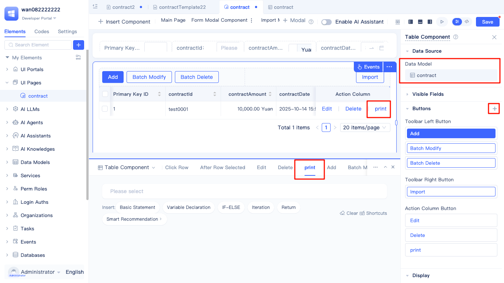
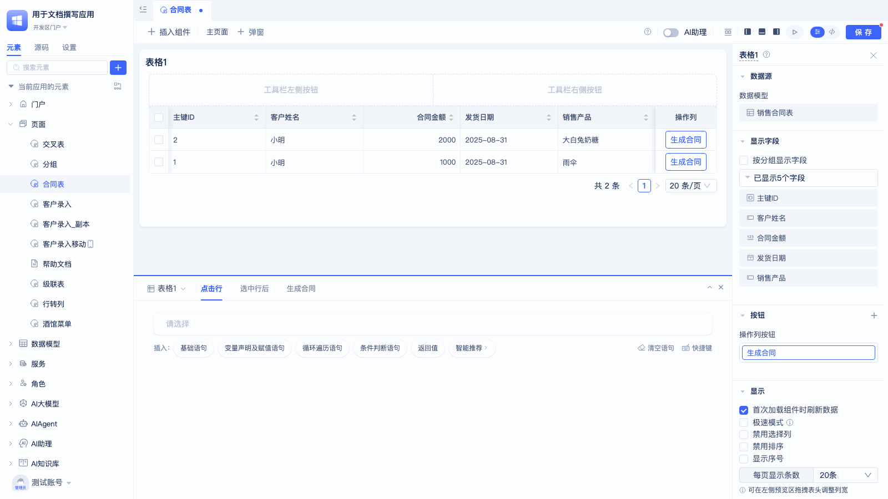
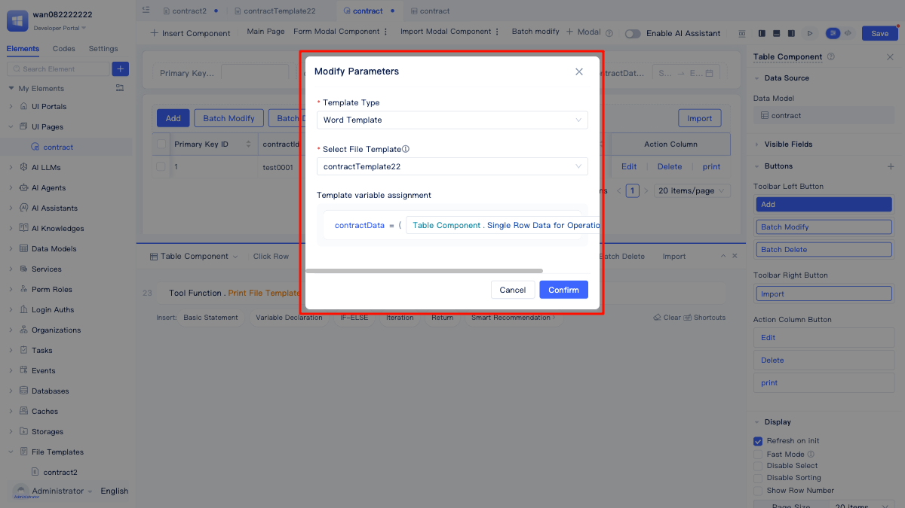
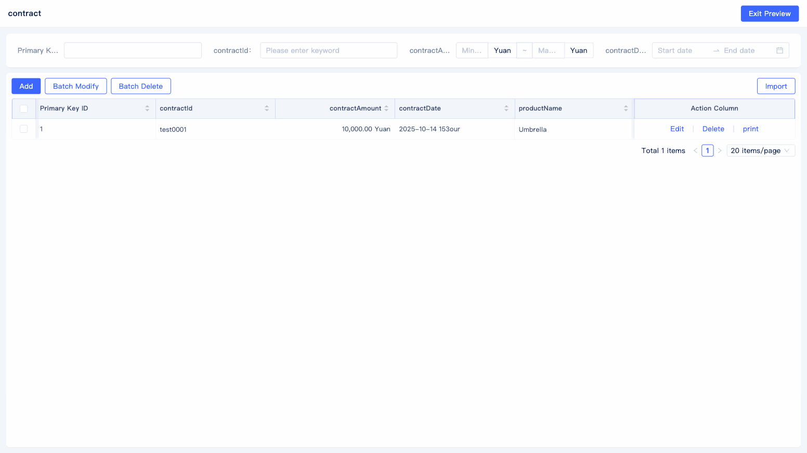
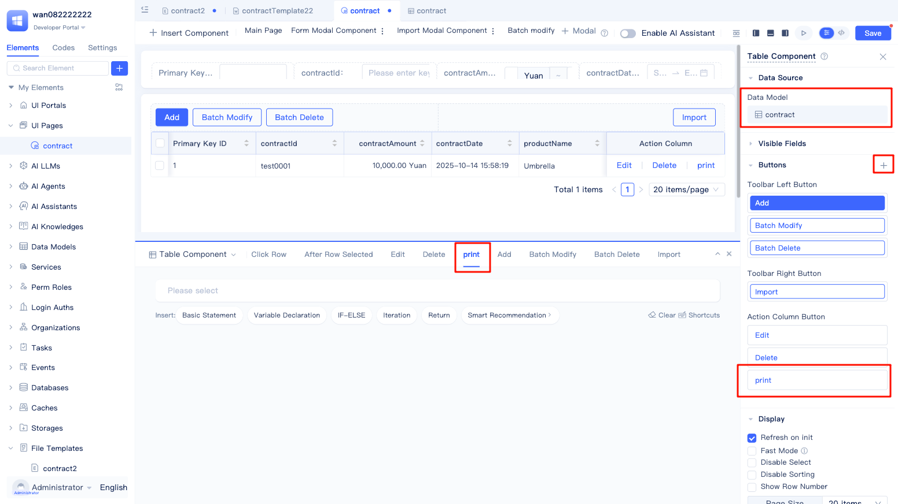
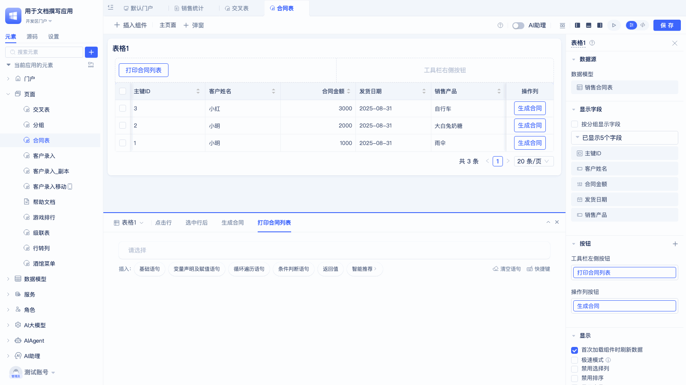
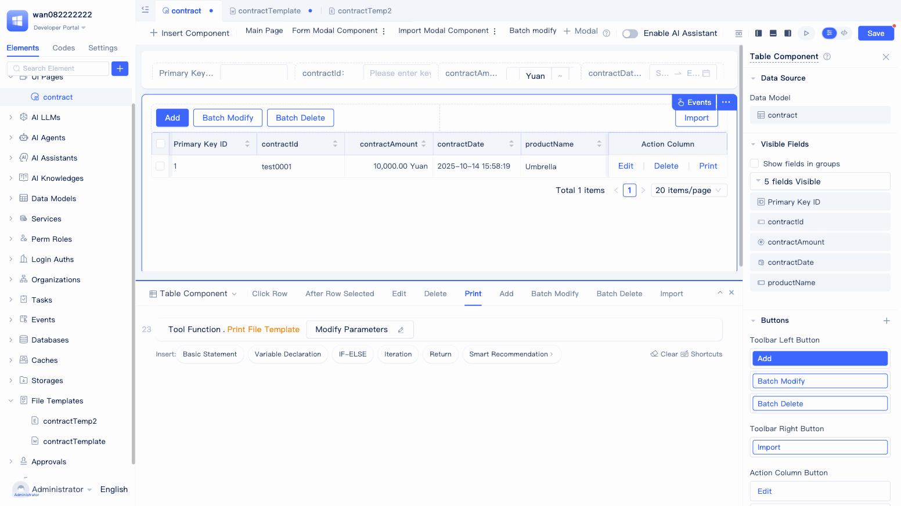

# Generating and Printing Files Using File Templates {#generating-and-printing-files-using-file-templates}

After file templates are created, you can generate and print files by calling the print service. This document describes how to use created file templates to generate and print Word documents and Excel documents.

## Printing Word templates {#print-word-template}

The **data model** used by the print service function must be consistent with the **target data table** of the template variables.

Print services are generally called in **button** events:

1. In the event editing area, click "Please select" in the statement, select the "Print File Template" option under "Utility Functions" in the popup window, which will generate Utility Functions.Print File Template.
2. Click the `Set Parameters` button of Utility Functions.Print File Template, and set the template type, file template, and assign values to template variables in the popup dialog.

The configured parameters are shown below:

The usage effect is shown below:

## Printing Excel templates {#print-excel-template}

Create a button in the component that needs to call template printing.

Configure button events:

1. In the event editing area, click "Please select" in the statement, select the "Print File Template" option under "Utility Functions" in the popup window, which will generate Utility Functions.Print File Template.
2. Click the `Set Parameters` button of Utility Functions.Print File Template, and set the template type, file template, and assign values to template variables in the popup dialog.

Finally, verify the template printing effect:

