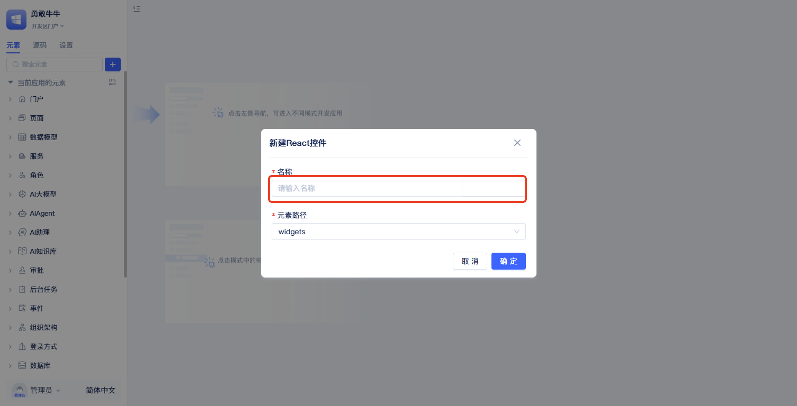

import Tabs from '@theme/Tabs';
import TabItem from '@theme/TabItem';

# Custom Controls
The system provides default rendering methods for various data types, but for specific customization requirements that cannot be met, users need to use custom controls. For example, rendering numbers as icons, rendering text in specific styles, etc.

The custom controls feature allows developers to create dedicated renderers for data types, implementing complex display logic and interactive effects using React syntax. These custom renderers can be applied to table component cells or form component fields, enabling developers to flexibly control data display methods and achieve various display requirements from simple style beautification to complex data visualization.

## Creating Custom Control Element {#create-custom-control-element}


In the element directory tree, click the `+` button to the right of the search box, select `More` - `Controls` - `React Control`, then a popup for creating a control element will appear.



In the creation popup, you only need to fill in the `Name`, then click `OK` to complete the creation.

## Modifying Custom Control {#modify-custom-control}
After creation, it will appear in the left element tree. Next, we'll demonstrate how to modify a custom control through an example.


Click on the created custom control element in the element tree to enter the editor. The editor contains two files: `index.tsx` and `e.json`. `e.json` is the element definition, and `index.tsx` is the control renderer implementation. Now let's modify the `index.tsx` file.


<Tabs>
  <TabItem value="index" label="index.tsx" default>

```tsx
import type { Jit } from 'jit';
import type { FC } from 'react';
import { getRuntimeApp} from 'jit';
import { Rate } from 'antd';
import { useState, useEffect, useMemo } from 'react';

export const Render: FC<{
    props: {
        data: InstanceType<typeof Jit.BaseDataType>;
        onChange: (v: string) => void;
    };
}> = ({ props: p }) => {
    // Pass field values from form/table components to the control
    const [value, setValue] = useState(p.data.value);

    // If the passed parameter doesn't have onChange, it's a renderer, so Rate component won't allow modification
    const isEdit = useMemo(() => p.onChange, [p.onChange]);

    // Triggered immediately when form/table values change
    useEffect(() => {
        const app = getRuntimeApp();
        const handleId = p.data.onValueChange(() => {
            setValue(p.data.value);
        });

        return () => app.off(handleId);
    }, [p.data.value]);

    // Callback to table/form when control value changes
    const handleChangeRate = (val: number) => {
        setValue(val);
        p.onChange && p.onChange(val);
    };

    return <Rate count={10} value={value} disabled={!isEdit} onChange={handleChangeRate} />;
};
```

  </TabItem>
</Tabs>

Save the modified `index.tsx` file and use this custom control to replace the renderer or editor for fields in form/table components.

:::tip Note
The implementation principle of custom controls is to create renderers or editors for data types using React syntax, rendering data into specific styles and interactive effects.

When developing custom controls, you need to use full-code development. For how to use full-code development, please refer to [Creating Full-Code Pages](../shell-and-page/full-code-page-development#creating-react-full-code-pages).
:::

### Using Custom Control in Forms {#use-custom-control-in-form}


In form components, open the [field properties panel](../using-functional-components-in-pages/form-components#basic-configuration-and-item-management), and select the created custom control element in the field renderer or field editor.

### Using Custom Control in Tables {#use-custom-control-in-table}


In table components, open the [field properties popup](../using-functional-components-in-pages/table-components#configure-field-attributes), and select the created custom control element in the field renderer or field editor.

After applying the custom control to form/table component fields through the above operations, the final display effect:


## Custom Control Parameters {#custom-control-parameters}
When using custom controls in form/table components, parameters are passed to the `props` in the `index.tsx` file of the custom control. The props parameters include the following fields:
- `data`: Field value in form/table components
- `rowData`: For table components, represents current row data. For form components, represents current form data.
- `fieldConfig`: Configuration items for the current field in table/form components, as well as information about this field in the data table.
- `onChange`: When the current field value changes, call this method with the new value as a parameter to pass it to table/form components.

:::tip Note
When custom controls are used as renderers, the passed parameters don't include the `onChange` field. Therefore, we can use `onChange` to determine whether it's used as a component renderer or editor, enabling different logic implementations.
:::
