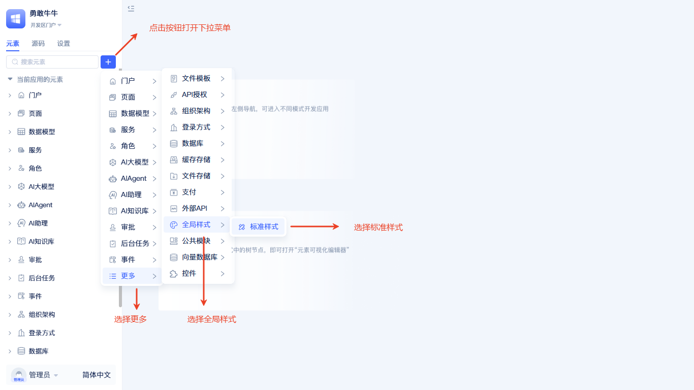
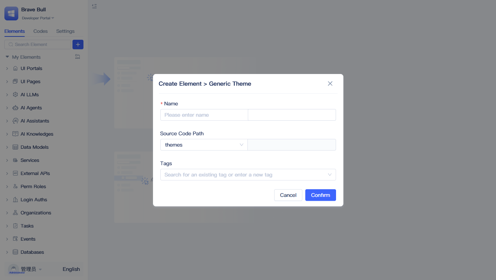
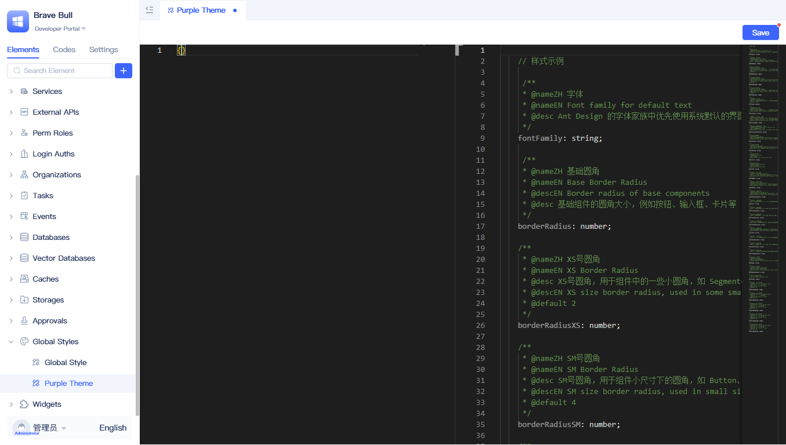
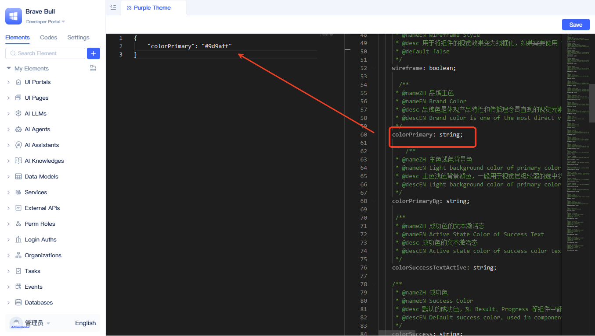
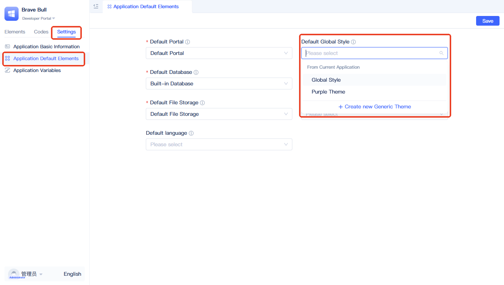
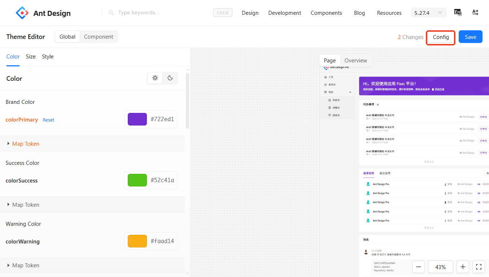
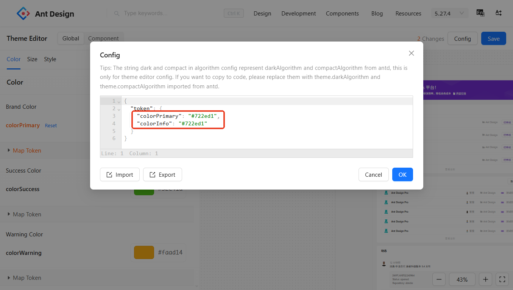

# Global Styles
In traditional application development, styles for different pages and components are often defined independently, leading to inconsistent styling within the same application. When adjustments to brand colors or overall styling are needed, developers must modify style code in multiple locations, resulting in extremely high maintenance costs. The `Global Styles` feature provides a centralized style configuration center. Through a unified configuration panel, developers can define the overall visual style of their application. These configurations are applied to all Ant Design-based UI components, ensuring visual consistency throughout the entire application.

## Creating Global Style Element {#create-global-style-element}

In the element directory tree, click the `+` button to the right of the search box, select `More` - `Global Styles` - `Standard Styles`, then a popup for creating a global style element will appear.

In the creation popup, you only need to fill in the `Name`, then click `OK` to complete the creation.

## Modifying Global Style {#modify-global-style}
After creation, it will appear in the left element tree.

The editor is divided into a left editing area and a right reference area. The left editing format is `JSON`, and the right side contains common style variable descriptions. Developers can copy styles from the reference area and paste them into the left editing area for modification. Taking theme color modification as an example, as shown in the figure:

Copy the theme color variable `colorPrimary` from the right side to the left editing area, modify the color value, and finally click the `Save` button to save. At this point, the theme color cannot be applied yet and needs to be set as shown below:

Click the `Settings` tab, then click `Application Default Elements` to enter the default element editor. Click the `Default Global Style` dropdown, select the newly created `Global Style Element`, click the `Save` button, and refresh the page to see that the theme color has been applied.

## More Style Variables {#more-style-variables}
For style variables, please refer to [Style Variables](https://ant.design/docs/react/customize-theme#seedtoken).

## Debugging Theme {#debug-theme}
Developers can use the official Ant Design [Theme Editor](https://ant.design/theme-editor) to generate custom themes.

After adjusting the styles in the theme editor, click `Theme Configuration`.

Copy the configuration from the theme configuration popup.

Paste the configuration into the global style editing area.
