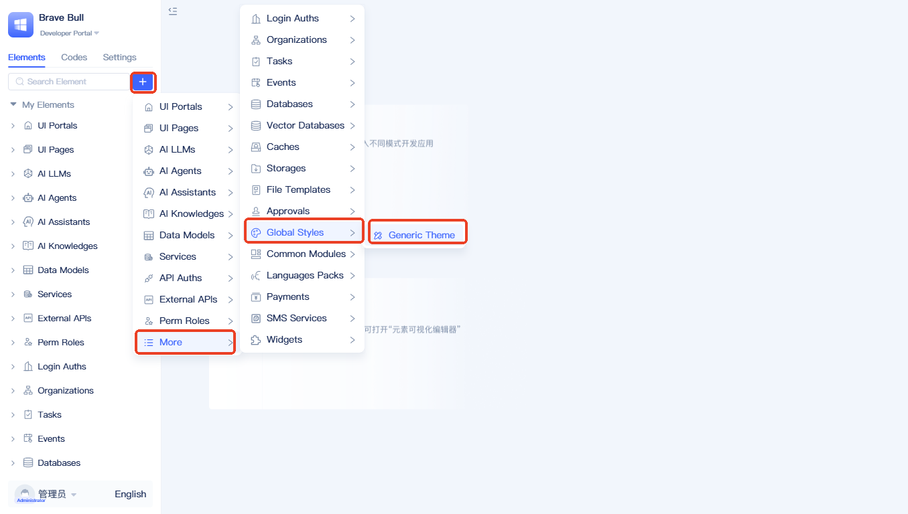

# Global Styles
In traditional application development, page- and component-level styles are often defined independently, which easily leads to inconsistency within the same application. When brand colors or global styles need to change, developers must update styles in many places, driving up maintenance costs. The `Global Styles` feature provides a centralized configuration center. Through a unified panel, you can define the application's overall visual theme. These settings apply to all Ant Design–based UI components, ensuring visual consistency across the entire application.

## Creating a global style element {#create-global-style-element}

In the element tree, click the `+` button to the right of the search box, choose `More` → `Global Styles` → `Standard Styles`. A dialog for creating a global style element will appear.

In the creation dialog, enter a `Name` and click `OK` to create.

## Modifying the global style {#modify-global-style}
After creation, the element appears in the left-side tree.

The editor consists of a left editing pane and a right reference pane. The left pane uses `JSON`; the right pane lists common style variables. You can copy variables from the reference pane, paste them into the left pane, and modify them. For example, to change the theme color:

Copy the theme color variable `colorPrimary` from the right pane to the left editor, change its value, and click `Save`. The theme color is not applied yet; set it as shown below:

Open the `Settings` tab and click `Application Default Elements` to enter the default element editor. From `Default Global Style`, select the newly created global style element, click `Save`, and refresh the page to apply the theme color.

## More style variables {#more-style-variables}
For available variables, see [Style variables](https://ant.design/docs/react/customize-theme#seedtoken).

## Debugging the theme {#debug-theme}
Use the official Ant Design [Theme Editor](https://ant.design/theme-editor) to generate custom themes.

After adjusting styles in the theme editor, click `Theme Configuration`.

Copy the configuration from the theme configuration dialog.

Paste the configuration into the global style editor.
