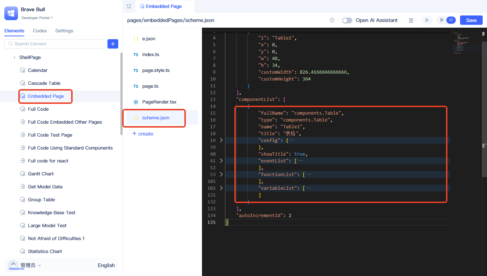
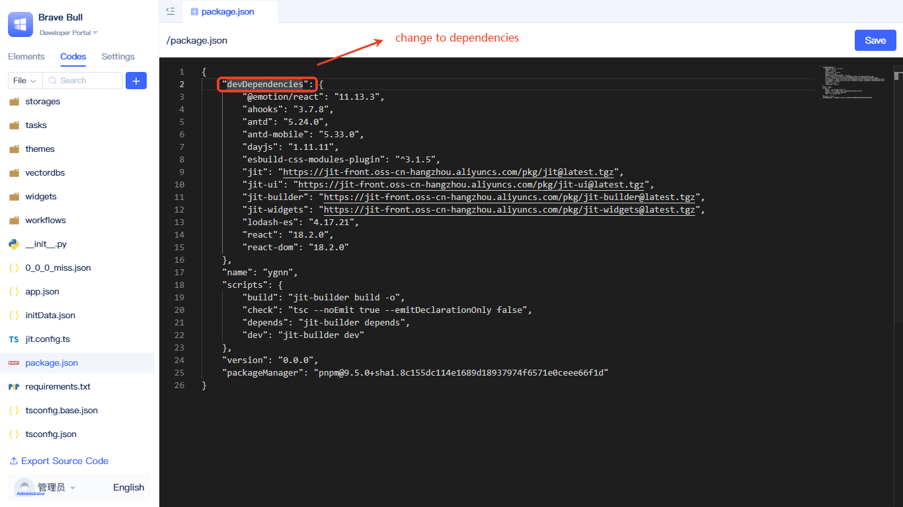

import Tabs from '@theme/Tabs';
import TabItem from '@theme/TabItem';

# Page Customization

:::info Prerequisites
If you haven't created a full-code page yet, please refer to [Creating Full-code Pages](../shell-and-page/full-code-page-development) first to learn how to create React and Vue full-code pages.
:::

This document covers specific development technologies and usage patterns for full-code pages, including style processing, component usage, resource management, and data operations.

## Creating a React full-code page {#create-react-full-code-page}

### Using styles {#use-style}
In full-code pages, you can choose from various styling solutions: inline styles, CSS-in-JS, or plain CSS—all of which work out of the box without additional build configuration. However, native LESS or SCSS requires enabling the corresponding build configuration in your project.


LESS and SCSS style files require configuring parsing plugins. Refer to [Introducing build plugins](#introducing-build-plugins) for details.

<Tabs>
  <TabItem value="inline" label="Inline Styles" default>

```jsx
// Inline style example - define styles directly in JSX
<div style={{color: "red"}}>hello world - inline styles</div>
```

  </TabItem>
  <TabItem value="css-in-js" label="CSS-in-JS">

**styles.ts file:**
```typescript
import type { GlobalToken } from 'antd';
import { css } from '@emotion/react';

export const cssInJs = (token: GlobalToken) => css`
    color: ${token.colorPrimary};
`;
```

**Usage in index.tsx:**
```jsx
import {cssInJs} from './styles';
import { theme } from 'antd';

const { token } = theme.useToken();

// CSS-in-JS example - using @emotion/react
<div css={cssInJs(token)}>hello css in js - CSS-in-JS</div>
```

  </TabItem>
  <TabItem value="css" label="CSS">

**styles.css file:**
```css
.css-styled {
  color: #1890ff;
  font-weight: bold;
}
```

**Usage in index.tsx:**
```jsx
// CSS import method
import './styles.css';

// CSS style example
<div className="css-styled">hello world - CSS</div>
```

  </TabItem>
  <TabItem value="less" label="Less">

**styles.less file:**
```less
.less-styled {
  color: #52c41a;
  font-style: italic;
}
```

**Usage in index.tsx:**
```jsx
// Less import method
import './styles.less';

// Less style example
<div className="less-styled">hello world - Less</div>
```

  </TabItem>
  <TabItem value="scss" label="Scss">

**styles.scss file:**
```scss
.scss-styled {
  color: #722ed1;
  text-decoration: underline;
}
```

**Usage in index.tsx:**
```jsx
// scss import method
import './styles.scss';

// scss style example
<div className="scss-styled">hello world - Scss</div>
```

  </TabItem>
</Tabs>

:::tip
When using CSS-in-JS, you can directly consume Ant Design's theme tokens to naturally align with the platform's default styles. You can also access and reuse custom variables defined in the platform's "Global Styles," enabling centralized management of brand colors, border radius, shadows, and more. See [Global Styles](./global-styles) for details.
:::

### Using local resources {#use-local-resources}
The platform provides built-in parsing capabilities for common resources. In full-code pages, you can directly use `import` statements to import resources. Here's an image example:

```typescript
import logo from './logo.png';

export const Render = () =>{
 return 
}
```

For additional resource parsing capabilities, see [Default loader mapping](#default-loader-mapping). You can also extend loader mappings via [Using build configuration](#use-build-configuration).

### Using Ant Design components {#use-ant-design-components}
The platform is built on the React framework with the Ant Design UI component library pre-installed, allowing you to directly use all Ant Design components. For mobile applications, the Ant Design Mobile component library is also available.

```typescript
import { Button } from 'antd';

export const Render = () =>{
 return <Button>Button</Button />
}
```

For a complete list of built-in packages, see [System built-in package overview](#system-built-in-package-overview).

### Embedding existing standard pages {#embed-existing-standard-page}
Reusing existing standard pages within full-code pages reduces duplicate development and improves code reusability. The following demonstrates interaction between full-code pages and embedded standard pages.


This example demonstrates cross-page component interaction: buttons in the full-code page control data refresh of the embedded page's table, while listening to table row click events to retrieve and display the current row's ID.

Implementation:

```typescript
import { useRef } from "react";
import { Button, message } from "antd";
import { Jit } from "jit";
import { ElementRender } from "jit-widgets";

// Full-code implementation includes: renderer and logic processing class
// Render is the page renderer, UI part is implemented here, it's a React component
const Render = (props) => {
  const embeddedPageRef = useRef(null);

  // Refresh embedded page table
  const handleRefreshTable = () => {
    if (embeddedPageRef.current?.Table1) {
      embeddedPageRef.current.Table1.call();
    }
  };

  // Bind embedded page instance and events
  const handlePageInit = (pageInstance) => {
    embeddedPageRef.current = pageInstance;

    // Bind table row click event
    pageInstance.Table1?.subscribeEvent("clickRow", () => {
      const activeRowId = pageInstance.Table1.activeRow?.id?.value;
      message.info(`Table row clicked, ID: ${activeRowId}`);
    });
  };

  return (
    <div>
      <Button type="primary" onClick={handleRefreshTable}>
        Refresh Table
      </Button>
      <h3>Below is the embedded page; click the button above to interact with the table, click the table to trigger bound events.</h3>
      <ElementRender
        elementPath="pages.embeddedPages"
        onInitAfter={handlePageInit}
      />
    </div>
  );
};
// This is the full-code page logic processing class, logic part is implemented here, it's a JavaScript class
class PageCls extends Jit.BasePage {
  // You can add page-specific methods here
}

export { Render, PageCls };
```

The `ElementRender` component can render both standard page elements and other full-code pages—simply configure the element's `fullName` to the `elementPath` property. To interact with the embedded page, configure the `onInitAfter` property. Upon initialization, the embedded page's instance will be passed as a parameter. Here's an example of an embedded page instance:

```typescript
import type { ComponentPageScheme } from "jit";
import { Jit } from "jit";
import schemeJson from "./scheme.json";
type BaseComponent = InstanceType<typeof Jit.BaseComponent>;

class PageCls extends Jit.GridPage {
    Table1!: BaseComponent;
    scheme: ComponentPageScheme = schemeJson;
    bindEvent() {}
}

export default PageCls;
```

The embedded page contains a table instance named `Table1`, which the full-code page can interact with via the page instance.

### Using standard components {#use-standard-component}
Reusing existing standard components within full-code pages reduces duplicate development and improves code reusability. The following demonstrates interaction between full-code pages and standard components.


This example demonstrates cross-page component interaction: buttons in the full-code page control table component data refresh, while listening to table row click events to retrieve and display the current row's ID.

All standard components are configuration-driven—the component renderer accepts a component instance constructed from configuration. Due to the complexity of component configuration, when using standard components in full-code pages, we recommend first creating a generic page, adding and configuring standard components there, then copying the component configuration to your full-code page.



Navigate to the standard page containing the component to copy, switch to source code mode, open `scheme.json`, locate the `componentList` configuration item, and copy the desired component configuration to your full-code page.

Example code:

<Tabs>
  <TabItem value="index" label="index.tsx" default>

```typescript
import { Button, message } from 'antd';
import { Jit } from 'jit';

import ComponentRender from './ComponentRender';
import tableConfig from './tableConfig.json';

// Full-code implementation includes: renderer and logic processing class
// Render is the page renderer, UI part is implemented here, it's a React component
const Render = (props) => {
    // Page renderer receives a page parameter, page is an instance object of the page logic processing class
    const page = props.page;

    // Refresh embedded page table
    const handleRefreshTable = () => {
        if (page[tableConfig.name]) {
            page[tableConfig.name].call();
        }
    };

    const handleComponentReady = (compIns: any) => {
        compIns.subscribeEvent('clickRow', () => {
            const activeRowId = compIns.activeRow?.id?.value;
            message.info(`Table row clicked, ID: ${activeRowId}`);
        });
    };

    return (
        <div>
            <Button type="primary" onClick={handleRefreshTable}>
                Refresh Table
            </Button>
            <h3>Below is the standard component, click the button above to interact with the table</h3>
            <ComponentRender config={tableConfig} page={page} onReady={handleComponentReady} />
        </div>
    );
};

// This is the full-code page logic processing class, logic part is implemented here, it's a JavaScript class
class PageCls extends Jit.BasePage {}

export { Render, PageCls };
```

  </TabItem>
  <TabItem value="componentRender" label="ComponentRender.tsx">

```typescript
import { useState, useEffect } from 'react';
import { Jit, getRuntimeApp } from 'jit';
import { ElementRender } from 'jit-widgets';

const ComponentRender = (props: {
    config: Record<string, any>;
    page: InstanceType<typeof Jit.BasePage>;
    onReady: (compIns: any) => void;
}) => {
    const app = getRuntimeApp();
    const { config, page } = props;

    const [loading, setLoading] = useState(true);
    const [compIns, setCompIns] = useState(null);

    useEffect(() => {
        setLoading(true);

        app.getElement(config.type).then(({ ComponentCls }) => {
            let compIns = new ComponentCls({
                ...config,
            });

            page[config.name] = compIns;

            setCompIns(compIns);
            setLoading(false);
            props.onReady(compIns);
        });
    }, []);

    if (loading) {
        return <div>Loading...</div>;
    }

    return <ElementRender elementPath={config.type} compIns={compIns} />;
};

export default ComponentRender;
```
  </TabItem>
  <TabItem value="tableConfig" label="tableConfig.json">

```json
{
    "fullName": "components.Table",
    "type": "components.Table",
    "name": "Table1",
    "title": "Table",
    "config": {
        "requireElements": [
            {
                "title": "Table Data Model",
                "type": "models.Meta",
                "name": "models.cascadeTableData",
                "filter": "",
                "orderBy": ""
            }
        ],
        "fieldIdList": [
            "id",
            "pname",
            "sublevel",
            "type",
            "shk",
            "shiFouYou"
        ],
        "defaultRender": true,
        "level": 2
    },
    "showTitle": true,
    "eventList": [
        {
            "title": "Click Row",
            "name": "clickRow",
            "data": "activeRow"
        },
        {
            "title": "After Row Selection",
            "name": "selectedChange",
            "data": "selectedRowList"
        }
    ],
    "functionList": [
        {
            "async": true,
            "name": "prevPage",
            "title": "Go to Previous Page"
        },
        {
            "async": true,
            "name": "nextPage",
            "title": "Go to Next Page"
        },
        {
            "args": [
                {
                    "dataType": "Numeric",
                    "name": "pageNumber",
                    "title": "Page Number",
                    "acceptDataTypes": [
                        "Numeric",
                        "Money",
                        "Percent",
                        "AutoInt"
                    ]
                }
            ],
            "async": true,
            "name": "goPage",
            "title": "Go to Specified Page"
        },
        {
            "title": "Refresh",
            "name": "call",
            "async": true,
            "args": [
                {
                    "name": "qFilter",
                    "title": "Filter Condition",
                    "dataType": "QFilter",
                    "generic": "models.cascadeTableData"
                }
            ]
        },
        {
            "title": "Refresh Current Page",
            "name": "refresh",
            "async": true,
            "args": []
        }
    ],
    "variableList": [
        {
            "name": "displayRowList",
            "title": "Current Page Data",
            "dataType": "RowList",
            "readonly": true,
            "generic": "models.cascadeTableData"
        },
        {
            "name": "selectedRowList",
            "title": "Selected Multi-row Data",
            "dataType": "RowList",
            "readonly": true,
            "generic": "models.cascadeTableData"
        },
        {
            "name": "activeRow",
            "title": "Operating Single Row Data",
            "dataType": "RowData",
            "readonly": true,
            "generic": "models.cascadeTableData"
        },
        {
            "name": "filter",
            "title": "Filter Condition",
            "dataType": "QFilter",
            "generic": "models.cascadeTableData",
            "readonly": true
        }
    ]
}
```
  </TabItem>
  <TabItem value="ejson" label="e.json">

```json
{
  "title": "Full-code Using Standard Components",
  "type": "pages.NormalType",
  "frontBundleEntry": "./index.tsx",
  "outputName": "index",
  "tag": ""
}
```

  </TabItem>
</Tabs>

**index.tsx** - Main page component implementing UI rendering and event interaction logic.

**ComponentRender.tsx** - Reusable standard component renderer responsible for dynamically loading and instantiating standard components.

**tableConfig.json** - Table component configuration example containing data model reference `models.cascadeTableData`. Replace with your project's actual data model in practice.

**e.json** - Page element definition file with type `"pages.NormalType"`, specifying a React full-code page type. The `frontBundleEntry` points to the entry file.

### Calling data model functions {#call-data-model-function}
Full-code pages provide convenient access to data model functions. We recommend using visual pages to configure function parameters first, then copying the generated function code to your full-code page. For specific instructions, refer to [CRUD operations for data models](#crud-operations-for-data-models).

For detailed data model function calling methods and syntax, see: [Calling Data Model Functions in Pages](../calling-business-elements-in-pages/calling-data-model-functions-in-pages)

Here's an example of retrieving a single record from a data model:


Clicking the button calls the model's get-one-record function and displays the result in a message. Example code:

```typescript
import { Button, message } from 'antd';
import { Jit } from 'jit';

const Render = ({ page }) => {
    const handleClick = async () => {
        message.success(await page.getData());
    };

    return (
        <div>
            <Button type="primary" onClick={handleClick}>
                Click Me!
            </Button>
        </div>
    );
};

class PageCls extends Jit.BasePage {
    /**
     * Get data, page method
     */
    async getData() {
        return JSON.stringify(
            await this.app.models.cascadeTableData.get(
                Q(Q('id', '=', 1)),
                null,
                2
            )
        );
    }
}

export { Render, PageCls };

```

The syntax for calling model functions is: `this.app.models.[model name].[method name]([param1], [param2], ...)`

### Calling service functions {#call-service-function}
Service functions follow the same calling pattern as [data model functions](#call-data-model-function), using the syntax: `this.app.services.[service name].[method name]([param1], [param2], ...)`.

For detailed service function calling methods and examples, see: [Calling Service Functions in Pages](../calling-business-elements-in-pages/calling-service-functions-in-pages)

## Creating a Vue full-code page {#vue-full-code-page}

### Basic structure {#basic-structure}
Vue full-code pages consist of four core files:

<Tabs>
  <TabItem value="app" label="App.vue" default>

```html
<script setup>
import { ref } from 'vue'

const message = ref('Hello JIT!');
const dialogVisible = ref(false);
const props = defineProps({
  page: Object
});

const callPageMethod = () => {
  alert(props.page.getData());
}
</script>

<template>
  <div class="demo">
    <h1>{{ message }}</h1>
    <h2>Current page name is: {{props.page.title}}</h2>
    <el-button plain @click="dialogVisible = true">
        element-plus component usage
    </el-button>
    <hr/>
    <el-button type="info" @click="callPageMethod">
        Call current page instance method
    </el-button>
    <hr/>
    <el-button type="danger" @click="props.page.closePage">
        Close current page
    </el-button>
  </div>

  <el-dialog
    v-model="dialogVisible"
    title="Tips"
    width="500"
  >
    <span>hello World!</span>
    <template #footer>
      <div class="dialog-footer">
        <el-button @click="dialogVisible = false">Close</el-button>
        <el-button type="primary" @click="dialogVisible = false">
          Confirm
        </el-button>
      </div>
    </template>
  </el-dialog>
</template>

<style scoped>
.demo{
    display: flex;
    align-items: center;
    flex-direction: column;
}
</style>
```

  </TabItem>
  <TabItem value="index" label="index.ts">

```typescript
import type { Jit } from 'jit';
import { createApp } from "vue";
import ElementPlus from "element-plus";
import {PageCls} from './page';
import App from "./App.vue";

const Render = (dom: HTMLDivElement, page: InstanceType<typeof Jit.BasePage>) => {
    createApp(App, { page }).use(ElementPlus).mount(dom)
};

export { Render, PageCls };
```

  </TabItem>
  <TabItem value="page" label="page.ts">

```typescript
import { Jit } from 'jit';
// This is the full-code page logic processing class, logic part is implemented here, it's a JavaScript class
class PageCls extends Jit.BasePage {
    /**
     * Get data, page method
     */
    getData() {
        // You can do more things here, like requesting backend interfaces
        return 'so cool !!!';
    }

    closePage = () => {
        const shell = Jit.BaseShell.getRuntimeShell();
        const menuName = Jit.BaseShell.getRuntimeMenuName();
        shell.publishEvent('REMOVE_PAGE', {
            pageUrl: `/${menuName}`,
        });
    }
}

export { PageCls };
```

  </TabItem>
  <TabItem value="ejson" label="e.json">

```json
{
  "title": "Vue Full-code",
  "type": "pages.VueType",
  "frontBundleEntry": "./index.ts",
  "outputName": "index"
}
```

  </TabItem>
</Tabs>

**App.vue** - Vue component using Composition API syntax that receives the page instance via props.

**index.ts** - Render entry that creates the Vue application, registers Element Plus, and passes the page instance as props to the App component.

**page.ts** - Page logic processing class that inherits from `Jit.BasePage`. Add custom methods here for Vue component calls.

**e.json** - Element definition file with type `"pages.VueType"`, specifying a Vue page type.

### Using Element Plus components {#using-element-plus-components}
Vue full-code pages have the Element Plus UI component library pre-installed, allowing you to directly use all Element Plus components:

```html
<template>
  <el-button type="primary">Primary Button</el-button>
  <el-dialog v-model="visible">Dialog Content</el-dialog>
  <el-table :data="tableData">Table Component</el-table>
</template>
```

### Interacting with the page instance {#interacting-with-page-instance}
Vue components receive the page instance via props and can call methods and access properties:

```typescript
<script setup>
const props = defineProps({
  page: Object
});

// Call page methods
const handleClick = () => {
  props.page.getData();
  props.page.closePage();
};

// Access page properties
const pageTitle = props.page.title;
</script>
```

:::tip
Vue full-code pages deliver a native Vue development experience with full support for [data model functions](#call-data-model-function), [service functions](#call-service-function), [local resource](#use-local-resources) references, and other core capabilities, allowing you to leverage the Vue ecosystem while benefiting from platform features.
:::

# Related Materials

## CRUD operations for data models {#crud-operations-for-data-models}
Backend data models provide comprehensive CRUD functionality. See the [API Documentation](/docs/reference/framework/JitORM/data-models#basic-data-operations) for details.

However, backend functions can only be called in backend runtime contexts (service functions, scheduled task functions, event functions). To address this, the platform also provides data model operation interfaces for the frontend environment:


In the event panel of standard pages, click the `Please Select` text on blank statements in the function panel. Select `Data Model` → `[Model Name]` to view multiple model operation functions. For example, select `Get One Data` for query operations.

### Using model functions in full-code {#full-code-using-model-functions}
Model functions often have multiple parameters. To simplify this complexity, you can visually configure parameters and quickly locate the generated code to copy directly into your full-code page.


Click `Parameter Settings` and configure the function parameters. At the end of the generated function statement, click the `</>` button to jump to the source code area with the function statement highlighted. Copy the function statement (e.g., `await this.app.models.CalendarTestModel.get(Q(Q("id", "=", 1)), null, 2);`) into your full-code page.

:::warning
Note: Data model functions in pages always start with `this.app`. If you're in a context without `this.app`, import and use the runtime app:
```typescript
import { getRuntimeApp } from 'jit';
const app = getRuntimeApp();
// app.models.xxx;
```
:::

## Using service functions {#using-service-functions}
See [CRUD operations for data models](#crud-operations-for-data-models) for usage patterns.

### Calling service functions in full-code {#full-code-calling-service-functions}
See [Using model functions in full-code](#full-code-using-model-functions) for the same approach.

## Using third-party packages {#use-third-party-packages}
In full-code page development, you can flexibly integrate third-party npm packages to extend functionality. In the editor's source code mode, modify the `package.json` file by adding the required dependencies to the `dependencies` field, then click "Save." The system will automatically run `pnpm install` on the backend to install the new packages, after which you can import and use them normally in your code.

For example, to add rxjs, modify `package.json`:


Add the `rxjs` dependency to the `dependencies` field in `package.json`, then click "Save" to install.

### Using network resources {#using-network-resources}
The system's bundler supports importing packages from the network, but requires them to be in ES Module format or errors will occur. We recommend using `https://esm.sh`. For rxjs, you can directly import it in your page:


After importing `import { Observable } from 'https://esm.sh/rxjs?bundle'` in your frontend files, you can use the third-party package directly.

:::tip
esm.sh provides optimization parameters like `?bundle`, which compresses multiple ES Modules into a single file, reducing request count and improving performance. Since esm.sh is open source, we recommend self-hosting in production environments for better availability and security.
:::

## Using build configuration {#use-build-configuration}
The platform's frontend bundler is built on esbuild, with configuration options matching esbuild's API. In the `jit.config.ts` file at your application root, you can customize build parameters to meet specific requirements.


The `esBuildOptions` configuration aligns with esbuild. For details, refer to the [esbuild documentation](https://esbuild.github.io).

:::tip Source map debugging
In development, you can enable the `sourcemap` option in `jit.config.ts`. For production, set it to `false` to significantly reduce bundle size.
:::

### Introducing build plugins {#introducing-build-plugins}
For example, to add Less and SCSS parsing plugins—both already integrated in the platform's bundler `jit-builder`—you can include `jit-builder` in package.json following the method in [Using third-party packages](#use-third-party-packages).



Since the default package.json already includes `jit-builder`, simply change it from `devDependencies` to `dependencies`, then save. Next, modify the build configuration file `jit.config.ts`.


Import `styleInJsPlugin` and `scssInJsPlugin` in `jit.config.ts`, then add them to the `plugins` array.

:::tip
This method applies to all esbuild plugins. To find plugins, refer to the [esbuild plugins directory](https://esbuild.github.io/plugins/).
:::

## System built-in package overview {#system-built-in-package-overview}
The platform pre-includes commonly used third-party libraries that can be imported and used directly in code without declaring them in package.json:

| Package Name | Version | Global Variable Name | Description |
|------|------|-----------|------|
| **React Ecosystem** | | | |
| `react` | 18.2.0 | `React` | React core library |
| `react-dom` | 18.2.0 | `ReactDom` | React DOM library |
| `react-dom/client` | 18.2.0 | `ReactDomClient` | React 18 client API |
| `react-dom/server` | 18.2.0 | `ReactDomServer` | React server rendering API |
| `react-router` | 6.18.0 | `ReactRouter` | React Router core |
| `react-router-dom` | 6.18.0 | `ReactRouterDom` | React Router DOM bindings |
| `react-dnd` | 16.0.1 | `ReactDnd` | React drag-and-drop library |
| `react-dnd-html5-backend` | 16.0.1 | `ReactDndHtml5Backend` | HTML5 drag-and-drop backend |
| **Vue Ecosystem** | | | |
| `vue` | 3.5.13 | `Vue` | Vue.js framework |
| `element-plus` | 2.8.8 | `ElementPlus` | Vue 3 UI component library |
| **UI Component Libraries** | | | |
| `antd` | 5.24.0 | `JitAntd` | Ant Design component library |
| `antd-mobile` | 5.33.0 | `antdMobile` | Ant Design Mobile components |
| `@ant-design/cssinjs` | 1.17.5 | `antCssInJs` | Ant Design CSS-in-JS |
| **Style Processing** | | | |
| `@emotion/react` | 11.13.3 | `EmotionReact` | CSS-in-JS library |
| `@emotion/styled` | 11.13.0 | `EmotionStyled` | Emotion styled components |
| `@emotion/cache` | 11.13.1 | `EmotionCache` | Emotion cache |
| **Utility Libraries** | | | |
| `lodash` | 4.17.21 | `lodash` | JavaScript utility library |
| `lodash-es` | 4.17.21 | `lodash` | Lodash ES module version |
| `dayjs` | 1.11.11 | `dayjs` | Lightweight date library |
| `axios` | 1.6.1 | `axios` | HTTP client |
| `ahooks` | 3.7.8 | `ahooks` | React Hooks library |
| `localforage` | 1.10.0 | `localforage` | Local storage library |
| `recast` | 0.23.4 | `recast` | JavaScript AST tool |
| **Platform-Specific** | | | |
| `jit` | - | `JitCore` | JitAi core library |
| `jit-utils` | - | `JitUtils` | JitAi utilities |
| `jit-ui` | - | `JitUi` | JitAi UI components |
| `jit-widgets` | - | `JitWidgets` | JitAi widgets |

:::tip
These libraries can be imported and used directly without installation, e.g., `import { useState } from 'react'` or `import { Button } from 'antd'`.
:::

## Default loader mapping {#default-loader-mapping}
The platform is built on esbuild. The following shows the default file type processor configuration:

| File Type | Loader | Description |
|---------|--------|------|
| `.png` | `dataurl` | PNG images, converted to base64 data URLs |
| `.jpe` | `dataurl` | JPE images, converted to base64 data URLs |
| `.jpeg` | `dataurl` | JPEG images, converted to base64 data URLs |
| `.gif` | `dataurl` | GIF images, converted to base64 data URLs |
| `.svg` | `dataurl` | SVG vector graphics, converted to base64 data URLs |
| `.css` | `dataurl` | CSS stylesheets, converted to base64 data URLs |
| `.py` | `text` | Python scripts, processed as text |
| `.webp` | `dataurl` | WebP images, converted to base64 data URLs |

:::tip
To customize processing for other file types, configure them in `esBuildOptions.loader` within `jit.config.ts`.
:::

## Related reading {#related-reading}

### Creating full-code pages {#creating-full-code-pages}
Learn how to create React and Vue full-code pages: [Creating Full-code Pages](../shell-and-page/full-code-page-development)

### Full-code components {#full-code-components}
Learn about developing with full-code components in pages: [Full-Code Component Interface Specifications](../fullcode-ui-components-in-pages/ui-component-interface-specifications)
