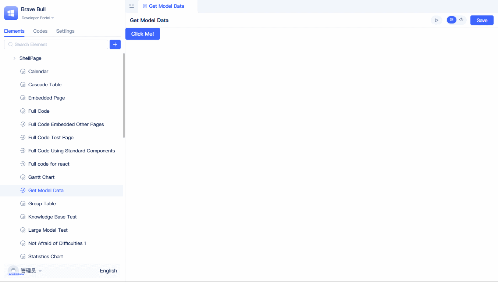
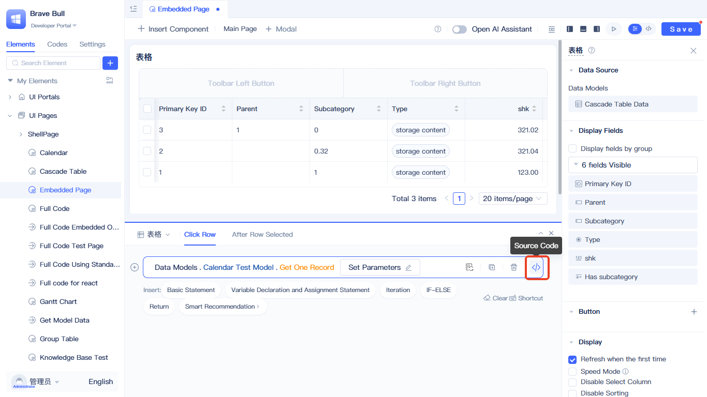
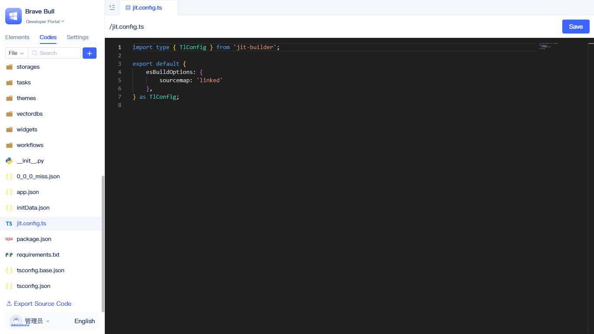

import Tabs from '@theme/Tabs';
import TabItem from '@theme/TabItem';

# Page Customization

:::info Prerequisites
If you haven't created a full-code page yet, please first refer to [Creating Full-code Pages](../shell-and-page/full-code-page-development) to learn how to create React and Vue full-code pages.
:::

This document introduces the specific development technologies and usage methods for full-code pages, including style processing, component usage, resource management, data operations, etc.

## Creating React Full-code Page {#create-react-full-code-page}

### Using Styles {#use-style}
In full-code pages, you can choose style solutions as needed: inline styles (CSS inline), CSS-in-JS, CSS work out of the box without additional packaging configuration; while using native LESS or SCSS requires enabling corresponding packaging configuration in the project to take effect.


LESS and SCSS style files require configuration of parsing plugins, refer to [Introducing Packaging Plugins](#introducing-packaging-plugins)

<Tabs>
  <TabItem value="inline" label="Inline Styles" default>

```jsx
// Inline style example - define styles directly in JSX
<div style={{color: "red"}}>hello world - inline styles</div>
```

  </TabItem>
  <TabItem value="css-in-js" label="CSS-in-JS">

**styles.ts file:**
```typescript
import type { GlobalToken } from 'antd';
import { css } from '@emotion/react';

export const cssInJs = (token: GlobalToken) => css`
    color: ${token.colorPrimary};
`;
```

**Usage in index.tsx:**
```jsx
import {cssInJs} from './styles';
import { theme } from 'antd';

const { token } = theme.useToken();

// CSS-in-JS example - using @emotion/react
<div css={cssInJs(token)}>hello css in js - CSS-in-JS</div>
```

  </TabItem>
  <TabItem value="css" label="CSS">

**styles.css file:**
```css
.css-styled {
  color: #1890ff;
  font-weight: bold;
}
```

**Usage in index.tsx:**
```jsx
// CSS import method
import './styles.css';

// CSS style example
<div className="css-styled">hello world - CSS</div>
```

  </TabItem>
  <TabItem value="less" label="Less">

**styles.less file:**
```less
.less-styled {
  color: #52c41a;
  font-style: italic;
}
```

**Usage in index.tsx:**
```jsx
// Less import method
import './styles.less';

// Less style example
<div className="less-styled">hello world - Less</div>
```

  </TabItem>
  <TabItem value="scss" label="Scss">

**styles.scss file:**
```scss
.scss-styled {
  color: #722ed1;
  text-decoration: underline;
}
```

**Usage in index.tsx:**
```jsx
// scss import method
import './styles.scss';

// scss style example
<div className="scss-styled">hello world - Scss</div>
```

  </TabItem>
</Tabs>

:::tip
When using CSS-in-JS, you can directly consume antd's theme tokens, naturally aligning with platform default styles; you can also read and reuse custom variables defined in the platform's "Global Styles", achieving unified management of brand colors, border radius, shadows, etc. with one-place configuration. Refer to [Global Styles](./global-styles).
:::

### Using Local Resources {#use-local-resources}
The platform provides parsing capabilities for common resources. In full-code, you can directly use `import` statements to import resources, using images as an example.

```typescript
import logo from './logo.png';

export const Render = () =>{
 return 
}
```

For more resource parsing capabilities, see [Default Loader Mapping](#default-loader-mapping). You can also extend loader mapping through [Using Packaging Configuration](#use-packaging-configuration).

### Using Ant Design Components {#use-ant-design-components}
The platform is based on the React framework and has built-in Ant Design UI component library, allowing direct use of all Ant Design components; for mobile, you can use the Ant Design Mobile component library.

```typescript
import { Button } from 'antd';

export const Render = () =>{
 return <Button>Button</Button />
}
```

For more built-in packages, see [System Built-in Package Overview](#system-built-in-package-overview).

### Embedding Existing Generic Pages {#embed-existing-generic-page}
Reusing existing generic pages in full-code pages can reduce duplicate development and improve code reusability. The following figure shows an interaction example between full-code pages and embedded generic pages.


The example demonstrates cross-page component interaction: buttons in the full-code page control data refresh of the embedded page table, while listening to table row click events to get and display the current row's ID information.

Implementation as follows:

```typescript
import { useRef } from "react";
import { Button, message } from "antd";
import { Jit } from "jit";
import { ElementRender } from "jit-widgets";

// Full-code implementation includes: renderer and logic processing class
// Render is the page renderer, UI part is implemented here, it's a React component
const Render = (props) => {
  const embeddedPageRef = useRef(null);

  // Refresh embedded page table
  const handleRefreshTable = () => {
    if (embeddedPageRef.current?.Table1) {
      embeddedPageRef.current.Table1.call();
    }
  };

  // Bind embedded page instance and events
  const handlePageInit = (pageInstance) => {
    embeddedPageRef.current = pageInstance;

    // Bind table row click event
    pageInstance.Table1?.subscribeEvent("clickRow", () => {
      const activeRowId = pageInstance.Table1.activeRow?.id?.value;
      message.info(`Table row clicked, ID: ${activeRowId}`);
    });
  };

  return (
    <div>
      <Button type="primary" onClick={handleRefreshTable}>
        Refresh Table
      </Button>
      <h3>Below is the embedded page; click the button above to interact with the table, click the table to trigger bound events.</h3>
      <ElementRender
        elementPath="pages.embeddedPages"
        onInitAfter={handlePageInit}
      />
    </div>
  );
};
// This is the full-code page logic processing class, logic part is implemented here, it's a JavaScript class
class PageCls extends Jit.BasePage {
  // You can add page-specific methods here
}

export { Render, PageCls };
```

ElementRender can render not only generic page elements but also other full-code pages, just configure the corresponding element's `fullName` to the `elementPath` property. If you need to interact with the embedded page, you can configure the `onInitAfter` property; after initialization is complete, the embedded page's page instance will be passed as a parameter. Example of embedded page's page instance:

```typescript
import type { ComponentPageScheme } from "jit";
import { Jit } from "jit";
import schemeJson from "./scheme.json";
type BaseComponent = InstanceType<typeof Jit.BaseComponent>;

class PageCls extends Jit.GridPage {
    Table1!: BaseComponent;
    scheme: ComponentPageScheme = schemeJson;
    bindEvent() {}
}

export default PageCls;
```

The embedded page contains a table instance named Table1, and the full-code page can operate on it through the page's instance.

### Using Standard Components {#use-standard-component}
Reusing existing standard components in full-code pages can reduce duplicate development and improve code reusability. The following figure shows an interaction example between full-code pages and standard components.


The example demonstrates cross-page component interaction: buttons in the full-code page control table component data refresh, while listening to table row click events to get and display the current row's ID information.

All standard components are rendered by configuration, and the component renderer accepts a component instance that is constructed through configuration. Because component configuration is complex, when using standard components in full-code, it's recommended that developers first create a generic page, add standard components to the generic page, configure the components, and then copy the component configuration to the full-code page.


Click on the page with the component to copy, switch to source code mode, open `scheme.json` to find the componentList configuration item, and copy the component configuration you want to use to the full-code page.

Example code as follows:

<Tabs>
  <TabItem value="index" label="index.tsx" default>

```typescript
import { Button, message } from 'antd';
import { Jit } from 'jit';

import ComponentRender from './ComponentRender';
import tableConfig from './tableConfig.json';

// Full-code implementation includes: renderer and logic processing class
// Render is the page renderer, UI part is implemented here, it's a React component
const Render = (props) => {
    // Page renderer receives a page parameter, page is an instance object of the page logic processing class
    const page = props.page;

    // Refresh embedded page table
    const handleRefreshTable = () => {
        if (page[tableConfig.name]) {
            page[tableConfig.name].call();
        }
    };

    const handleComponentReady = (compIns: any) => {
        compIns.subscribeEvent('clickRow', () => {
            const activeRowId = compIns.activeRow?.id?.value;
            message.info(`Table row clicked, ID: ${activeRowId}`);
        });
    };

    return (
        <div>
            <Button type="primary" onClick={handleRefreshTable}>
                Refresh Table
            </Button>
            <h3>Below is the standard component, click the button above to interact with the table</h3>
            <ComponentRender config={tableConfig} page={page} onReady={handleComponentReady} />
        </div>
    );
};

// This is the full-code page logic processing class, logic part is implemented here, it's a JavaScript class
class PageCls extends Jit.BasePage {}

export { Render, PageCls };
```

  </TabItem>
  <TabItem value="componentRender" label="ComponentRender.tsx">

```typescript
import { useState, useEffect } from 'react';
import { Jit, getRuntimeApp } from 'jit';
import { ElementRender } from 'jit-widgets';

const ComponentRender = (props: {
    config: Record<string, any>;
    page: InstanceType<typeof Jit.BasePage>;
    onReady: (compIns: any) => void;
}) => {
    const app = getRuntimeApp();
    const { config, page } = props;

    const [loading, setLoading] = useState(true);
    const [compIns, setCompIns] = useState(null);

    useEffect(() => {
        setLoading(true);

        app.getElement(config.type).then(({ ComponentCls }) => {
            let compIns = new ComponentCls({
                ...config,
            });

            page[config.name] = compIns;

            setCompIns(compIns);
            setLoading(false);
            props.onReady(compIns);
        });
    }, []);

    if (loading) {
        return <div>Loading...</div>;
    }

    return <ElementRender elementPath={config.type} compIns={compIns} />;
};

export default ComponentRender;
```
  </TabItem>
  <TabItem value="tableConfig" label="tableConfig.json">

```json
{
    "fullName": "components.Table",
    "type": "components.Table",
    "name": "Table1",
    "title": "Table",
    "config": {
        "requireElements": [
            {
                "title": "Table Data Model",
                "type": "models.Meta",
                "name": "models.cascadeTableData",
                "filter": "",
                "orderBy": ""
            }
        ],
        "fieldIdList": [
            "id",
            "pname",
            "sublevel",
            "type",
            "shk",
            "shiFouYou"
        ],
        "defaultRender": true,
        "level": 2
    },
    "showTitle": true,
    "eventList": [
        {
            "title": "Click Row",
            "name": "clickRow",
            "data": "activeRow"
        },
        {
            "title": "After Row Selection",
            "name": "selectedChange",
            "data": "selectedRowList"
        }
    ],
    "functionList": [
        {
            "async": true,
            "name": "prevPage",
            "title": "Go to Previous Page"
        },
        {
            "async": true,
            "name": "nextPage",
            "title": "Go to Next Page"
        },
        {
            "args": [
                {
                    "dataType": "Numeric",
                    "name": "pageNumber",
                    "title": "Page Number",
                    "acceptDataTypes": [
                        "Numeric",
                        "Money",
                        "Percent",
                        "AutoInt"
                    ]
                }
            ],
            "async": true,
            "name": "goPage",
            "title": "Go to Specified Page"
        },
        {
            "title": "Refresh",
            "name": "call",
            "async": true,
            "args": [
                {
                    "name": "qFilter",
                    "title": "Filter Condition",
                    "dataType": "QFilter",
                    "generic": "models.cascadeTableData"
                }
            ]
        },
        {
            "title": "Refresh Current Page",
            "name": "refresh",
            "async": true,
            "args": []
        }
    ],
    "variableList": [
        {
            "name": "displayRowList",
            "title": "Current Page Data",
            "dataType": "RowList",
            "readonly": true,
            "generic": "models.cascadeTableData"
        },
        {
            "name": "selectedRowList",
            "title": "Selected Multi-row Data",
            "dataType": "RowList",
            "readonly": true,
            "generic": "models.cascadeTableData"
        },
        {
            "name": "activeRow",
            "title": "Operating Single Row Data",
            "dataType": "RowData",
            "readonly": true,
            "generic": "models.cascadeTableData"
        },
        {
            "name": "filter",
            "title": "Filter Condition",
            "dataType": "QFilter",
            "generic": "models.cascadeTableData",
            "readonly": true
        }
    ]
}
```
  </TabItem>
  <TabItem value="ejson" label="e.json">

```json
{
  "title": "Full-code Using Standard Components",
  "type": "pages.NormalType",
  "frontBundleEntry": "./index.tsx",
  "outputName": "index",
  "tag": ""
}
```

  </TabItem>
</Tabs>

**index.tsx** - Main page component, implements UI rendering and event interaction logic.

**ComponentRender.tsx** - Reusable standard component renderer, responsible for dynamically loading and instantiating standard components.

**tableConfig.json** - Table component configuration example, contains data model reference `models.cascadeTableData`, actual usage needs to be replaced with real data model in the project.

**e.json** - Page element definition file, type is "pages.NormalType", specifies React full-code page type; frontBundleEntry points to the entry file.

### Calling Data Model Functions {#call-data-model-function}
In full-code pages, you can very conveniently call data model functions. It's recommended to use visual pages to configure function parameters first, then directly copy the function code to the full-code page. For specific instructions on how to get function code, please refer to [CRUD Operations for Data Models](#crud-operations-for-data-models).

For detailed data model function calling methods and syntax descriptions, please refer to: [Calling Data Model Functions in Pages](../calling-business-elements-in-pages/calling-data-model-functions-in-pages)

Taking getting one piece of data from the model as an example:



Click the button to call the model's get one data function and display it in a popup. Example code as follows:

```typescript
import { Button, message } from 'antd';
import { Jit } from 'jit';

const Render = ({ page }) => {
    const handleClick = async () => {
        message.success(await page.getData());
    };

    return (
        <div>
            <Button type="primary" onClick={handleClick}>
                Click Me!
            </Button>
        </div>
    );
};

class PageCls extends Jit.BasePage {
    /**
     * Get data, page method
     */
    async getData() {
        return JSON.stringify(
            await this.app.models.cascadeTableData.get(
                Q(Q('id', '=', 1)),
                null,
                2
            )
        );
    }
}

export { Render, PageCls };

```
The method to call model functions is similar: this.app.models.[model name].[method name]([parameter1], [parameter2], ...)

### Calling Service Functions {#call-service-function}
The calling method for service functions is exactly the same as [data model functions](#call-data-model-function), with the calling syntax: `this.app.services.[service name].[method name]([parameter1], [parameter2], ...)`.

For detailed service function calling methods and examples, please refer to: [Calling Service Functions in Pages](../calling-business-elements-in-pages/calling-service-functions-in-pages)

## Creating Vue Full-code Page {#vue-full-code-page}

### Basic Structure
Vue full-code pages consist of four core files:

<Tabs>
  <TabItem value="app" label="App.vue" default>

```html
<script setup>
import { ref } from 'vue'

const message = ref('Hello JIT!');
const dialogVisible = ref(false);
const props = defineProps({
  page: Object
});

const callPageMethod = () => {
  alert(props.page.getData());
}
</script>

<template>
  <div class="demo">
    <h1>{{ message }}</h1>
    <h2>Current page name is: {{props.page.title}}</h2>
    <el-button plain @click="dialogVisible = true">
        element-plus component usage
    </el-button>
    <hr/>
    <el-button type="info" @click="callPageMethod">
        Call current page instance method
    </el-button>
    <hr/>
    <el-button type="danger" @click="props.page.closePage">
        Close current page
    </el-button>
  </div>

  <el-dialog
    v-model="dialogVisible"
    title="Tips"
    width="500"
  >
    <span>hello World!</span>
    <template #footer>
      <div class="dialog-footer">
        <el-button @click="dialogVisible = false">Close</el-button>
        <el-button type="primary" @click="dialogVisible = false">
          Confirm
        </el-button>
      </div>
    </template>
  </el-dialog>
</template>

<style scoped>
.demo{
    display: flex;
    align-items: center;
    flex-direction: column;
}
</style>
```

  </TabItem>
  <TabItem value="index" label="index.ts">

```typescript
import type { Jit } from 'jit';
import { createApp } from "vue";
import ElementPlus from "element-plus";
import {PageCls} from './page';
import App from "./App.vue";

const Render = (dom: HTMLDivElement, page: InstanceType<typeof Jit.BasePage>) => {
    createApp(App, { page }).use(ElementPlus).mount(dom)
};

export { Render, PageCls };
```

  </TabItem>
  <TabItem value="page" label="page.ts">

```typescript
import { Jit } from 'jit';
// This is the full-code page logic processing class, logic part is implemented here, it's a JavaScript class
class PageCls extends Jit.BasePage {
    /**
     * Get data, page method
     */
    getData() {
        // You can do more things here, like requesting backend interfaces
        return 'so cool !!!';
    }

    closePage = () => {
        const shell = Jit.BaseShell.getRuntimeShell();
        const menuName = Jit.BaseShell.getRuntimeMenuName();
        shell.publishEvent('REMOVE_PAGE', {
            pageUrl: `/${menuName}`,
        });
    }
}

export { PageCls };
```

  </TabItem>
  <TabItem value="ejson" label="e.json">

```json
{
  "title": "Vue Full-code",
  "type": "pages.VueType",
  "frontBundleEntry": "./index.ts",
  "outputName": "index"
}
```

  </TabItem>
</Tabs>

**App.vue** - Vue component, uses Composition API syntax, receives page instance through props.

**index.ts** - Render entry, creates Vue application and uses Element Plus, passes page instance as props to App component.

**page.ts** - Page logic processing class, inherits from Jit.BasePage, can add custom methods for Vue component calls.

**e.json** - Element definition file, type is "pages.VueType", specifies Vue page type.

### Using Element Plus Components
Vue full-code pages have built-in Element Plus UI component library, allowing direct use of all Element Plus components:

```html
<template>
  <el-button type="primary">Primary Button</el-button>
  <el-dialog v-model="visible">Dialog Content</el-dialog>
  <el-table :data="tableData">Table Component</el-table>
</template>
```

### Interacting with page Instance
Vue components receive the page instance through props and can call methods and access properties on the page:

```typescript
<script setup>
const props = defineProps({
  page: Object
});

// Call page methods
const handleClick = () => {
  props.page.getData();
  props.page.closePage();
};

// Access page properties
const pageTitle = props.page.title;
</script>
```

:::tip
Vue full-code pages focus on native Vue development experience, fully supporting [data model functions](#call-data-model-function), [service functions](#call-service-function) calls, and [local resource](#use-local-resources) references and other core functions, allowing you to fully leverage Vue ecosystem advantages while enjoying platform-provided capabilities.
:::

# Related Materials
## CRUD Operations for Data Models {#crud-operations-for-data-models}
Backend data models provide complete CRUD functionality, [API Documentation](/docs/reference/framework/JitORM/data-models#basic-data-operations).

However, backend functions can only be called in backend runtime (service functions, scheduled task functions, event functions). Considering this, the frontend environment platform also provides data model operation interfaces, as shown below:


In the event panel of generic pages, click the `Please Select` text on blank statements in the function panel, select `Data Model` - `[Model Name]` in the panel to see multiple model operation functions. Taking query interface as an example, select `Get One Data`.

### Full-code Using Model Functions {#full-code-using-model-functions}
Model functions have many parameters. Considering parameter complexity, developers can visually configure parameters in the following way and quickly locate function code, then directly copy it to the full-code page.



Click `Parameter Settings`, configure function parameters, at the end of the generated function statement, click the `</>` button, it will jump to the source code area and locate the current function statement, copy the function statement `await this.app.models.CalendarTestModel.get(Q(Q("id", "=", 1)), null, 2);` to the full-code.

:::warning
Note: Data model functions in pages all start with `this.app`. If there's no `this.app` where you're using it, please add it yourself.
```typescript
import { getRuntimeApp } from 'jit';
const app = getRuntimeApp();
// app.models.xxx;
```
:::

## Using Service Functions
Refer to [CRUD Operations for Data Models](#crud-operations-for-data-models)

### Full-code Calling Service Functions
Refer to [Full-code Using Model Functions](#full-code-using-model-functions)

## Using Third-party Packages {#use-third-party-packages}
In full-code-page-development, you can flexibly introduce third-party npm packages to extend functionality. In the editor's source code mode, modify the `package.json` file, add required dependency packages to the `dependencies` field, then click the "Save" button. The system will automatically run `pnpm install` on the backend to install newly added dependency packages. After installation is complete, you can normally import and use them in code.

Taking rxjs as an example, add dependency package in `package.json`:


Add the `rxjs` dependency package to the `dependencies` field in `package.json`, click the "Save" button to install dependencies.

### Using Network Resources
The system's bundler integrates the ability to import packages from the network, but requires network packages to be in ES Module format, otherwise it will report errors. It's recommended to use `https://esm.sh`. If you also want to use rxjs, you can directly import `import { Observable } from 'https://esm.sh/rxjs'` in the page;


After importing `import { Observable } from 'https://esm.sh/rxjs?bundle'` in frontend files, you can directly use third-party packages.

:::tip
esm.sh also provides some optimization parameters. For example, using `?bundle` can compress multiple ES Modules into one file, thereby reducing request times and improving performance. esm.sh is an open source project. If used in production environment, it's recommended to deploy it yourself to improve availability and security.
:::

## Using Packaging Configuration {#use-packaging-configuration}
The platform's frontend bundler is based on esbuild encapsulation, and configuration items are consistent with esbuild. In the `jit.config.ts` file in the application root directory, you can customize packaging parameters to meet specific build requirements.



The esBuildOptions configuration is consistent with esbuild. For details, refer to [esbuild documentation](https://esbuild.github.io).

:::tip Using Source Code Debugging
Development environment can enable the `sourcemap` option in `jit.config.ts`; production environment is recommended to set to `false` to significantly reduce bundle size.
:::

### Introducing Packaging Plugins
Taking the introduction of Less and SCSS parsing plugins as an example, these two plugins are already integrated in the platform's bundler `jit-builder`. You can introduce `jit-builder` in package.json following the method in [Using Third-party Packages](#use-third-party-packages).


Because the system default package.json already includes `jit-builder`, you only need to change devDependencies to dependencies, then save. Next, modify the packaging configuration file `jit.config.ts`.


Import `styleInJsPlugin` and `scssInJsPlugin` in `jit.config.ts`, then add them to `plugins`.

:::tip More Plugins
The above method applies to all esbuild plugins. For how to find corresponding plugins, refer to [esbuild plugins](https://esbuild.github.io/plugins/)
:::

## System Built-in Package Overview
The platform pre-includes commonly used third-party libraries that can be directly imported and used in code without declaration in package.json:

| Package Name | Version | Global Variable Name | Description |
|------|------|-----------|------|
| **React Ecosystem** | | | |
| `react` | 18.2.0 | `React` | React core library |
| `react-dom` | 18.2.0 | `ReactDom` | React DOM manipulation library |
| `react-dom/client` | 18.2.0 | `ReactDomClient` | React 18 client API |
| `react-dom/server` | 18.2.0 | `ReactDomServer` | React server-side rendering API |
| `react-router` | 6.18.0 | `ReactRouter` | React router core |
| `react-router-dom` | 6.18.0 | `ReactRouterDom` | React router DOM binding |
| `react-dnd` | 16.0.1 | `ReactDnd` | React drag and drop library |
| `react-dnd-html5-backend` | 16.0.1 | `ReactDndHtml5Backend` | HTML5 drag and drop backend |
| **Vue Ecosystem** | | | |
| `vue` | 3.5.13 | `Vue` | Vue.js framework |
| `element-plus` | 2.8.8 | `ElementPlus` | Vue3 UI component library |
| **UI Component Libraries** | | | |
| `antd` | 5.24.0 | `JitAntd` | Ant Design component library |
| `antd-mobile` | 5.33.0 | `antdMobile` | Ant Design mobile components |
| `@ant-design/cssinjs` | 1.17.5 | `antCssInJs` | Ant Design CSS-in-JS |
| **Style Processing** | | | |
| `@emotion/react` | 11.13.3 | `EmotionReact` | CSS-in-JS library |
| `@emotion/styled` | 11.13.0 | `EmotionStyled` | Emotion styled components |
| `@emotion/cache` | 11.13.1 | `EmotionCache` | Emotion cache |
| **Utility Libraries** | | | |
| `lodash` | 4.17.21 | `lodash` | JavaScript utility library |
| `lodash-es` | 4.17.21 | `lodash` | Lodash ES module version |
| `dayjs` | 1.11.11 | `dayjs` | Lightweight date library |
| `axios` | 1.6.1 | `axios` | HTTP client |
| `ahooks` | 3.7.8 | `ahooks` | React Hooks library |
| `localforage` | 1.10.0 | `localforage` | Local storage library |
| `recast` | 0.23.4 | `recast` | JavaScript AST tool |
| **Platform Specific** | | | |
| `jit` | - | `JitCore` | JitAi core library |
| `jit-utils` | - | `JitUtils` | JitAi utility library |
| `jit-ui` | - | `JitUi` | JitAi UI component library |
| `jit-widgets` | - | `JitWidgets` | JitAi widget library |

:::tip Direct Usage
These libraries can be directly imported and used without installation, for example: `import { useState } from 'react'`, `import { Button } from 'antd'`, etc.
:::

## Default Loader Mapping
The platform is built based on esbuild. The following is the system default file type processor configuration:

| File Type | Loader | Description |
|---------|--------|------|
| `.png` | `dataurl` | PNG image files, converted to base64 embedded |
| `.jpe` | `dataurl` | JPEG image files, converted to base64 embedded |
| `.jpeg` | `dataurl` | JPEG image files, converted to base64 embedded |
| `.gif` | `dataurl` | GIF animation files, converted to base64 embedded |
| `.svg` | `dataurl` | SVG vector image files, converted to base64 embedded |
| `.css` | `dataurl` | CSS style files, converted to base64 embedded |
| `.py` | `text` | Python script files, processed as text |
| `.webp` | `dataurl` | WebP image files, converted to base64 embedded |

:::tip Custom Loader
If you need to customize processing methods for other file types, you can configure them in `esBuildOptions.loader` in `jit.config.ts`.
:::

## Related Reading
### Creating Full-code Pages
Learn how to create React and Vue full-code pages, refer to: [Creating Full-code Pages](../shell-and-page/full-code-page-development)

### Full-code Components
Learn about using full-code components for development in pages, refer to: [Full-code Components](../fullcode-ui-components-in-pages/ui-component-interface-specifications)